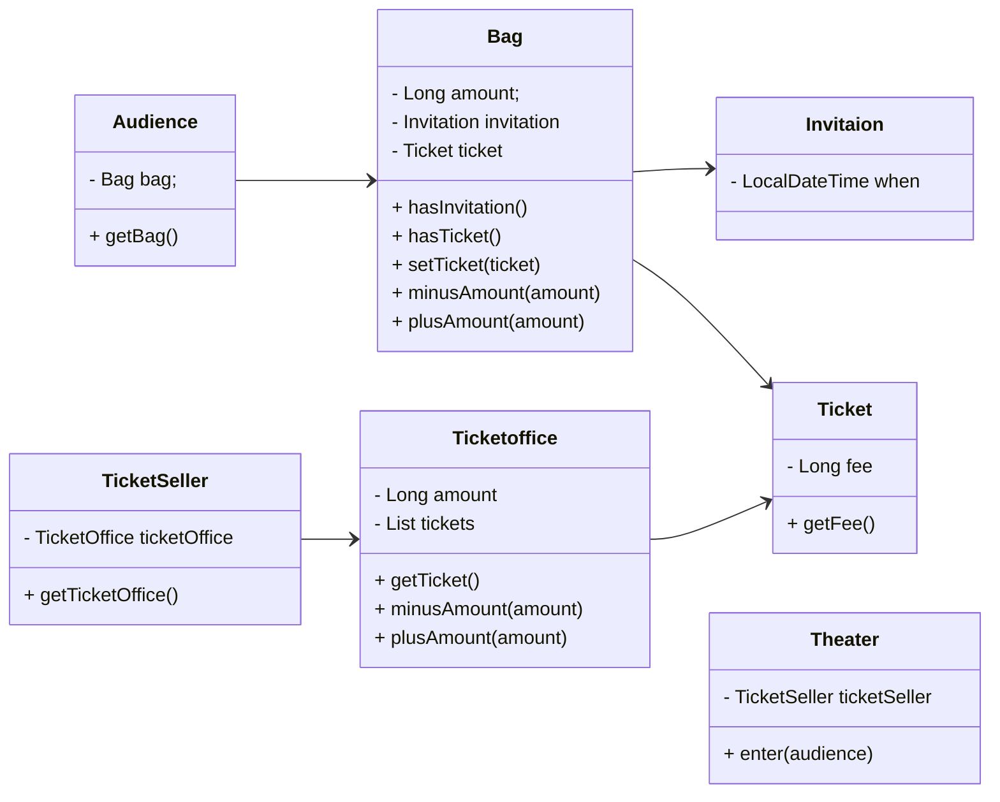
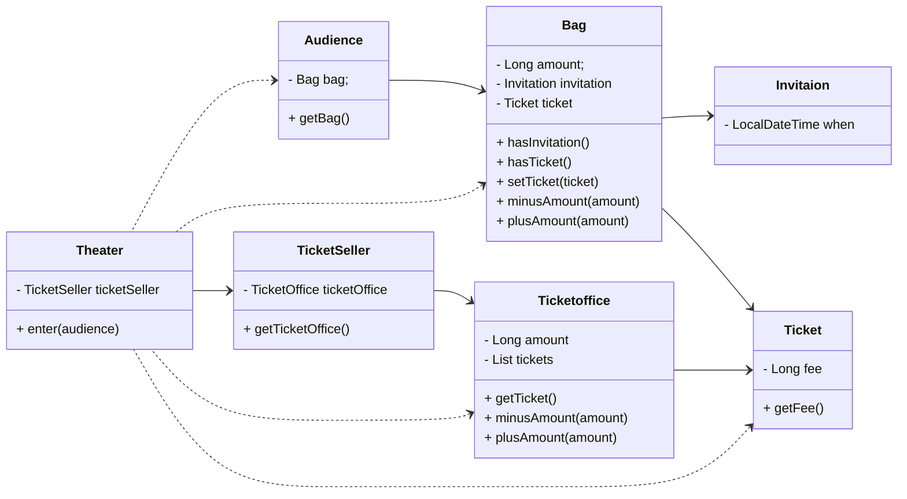
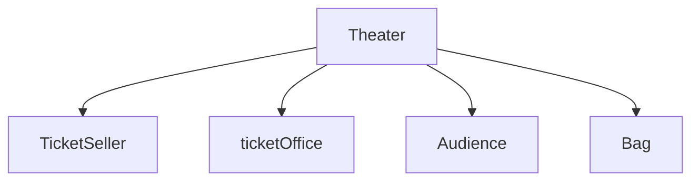
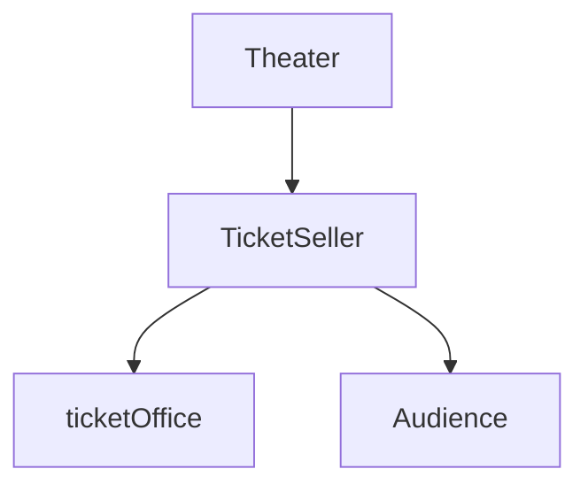

# 객체, 설계

**이론이 먼저일까, 실무가 먼저일까?**

대부분은 이론이 먼저, 실무가 그 뒤라고 생각한다.  

하지만 글래스는 이론을 정립할 수 없는 초기에는 실무가 먼저 급속한 발전을 이룬다고 주장한다.

- 새로운 분야는 초기에 이론 없이 실무가 먼저 급속히 발전.
- 그 이후에야 이론이 천천히 정립됨.
- 성숙한 단계가 되어서야 이론이 실무를 앞서기 시작함.

건축 등 다른 공학 분야보다 역사가 짧은 소프트웨어 분야는 아직 미성숙하다.

아직은 이론보다 실무가 앞서는 단계이고 그래서 지금은 실무 중심의 접근이 더 중요하다.

**예시**

1. **소프트웨어 설계**
    - 수많은 소프트웨어 설계가 축적되어  다양한 기법과 도구들이 발전되었다.
    - 하지만 이론은 1970년대 이후에야 등장했고 대부분의 설계 원칙도 실무에서 검증된 것을 이론화됐다.
2. **소프트웨어 유지보수**
    - 실무에서는 다양한 소프트웨어를 유지보수 중
    - 그러나 유지보수와 관련된 이론은 거의 없다

이 책은 객체지향 설계와 유지보수에 필요한 실무 원칙과 기법을 설명한다.

## 티켓 판매 애플리케이션 구현하기

**설정**

- 여러분은 작은 소극장의 운영자
- 관람객을 위한 이벤트를 진행해 당첨자에게 초대장을 보냄.
- 공연 당일, 관람객은 두 종류
    - 초대장을 소지한 이벤트 당첨자
    - 일반 티켓 구매자
    

**입장 방식**

- 이벤트 당첨자는 초대장을 티켓으로 교환 후 입장
- 일반 관람객은 현금으로 티켓 구매 후 입장

**도메인**

| 클래스 | 책임 |
| --- | --- |
| `Invitation` | 초대 일자를 저장 (초대장) |
| `Ticket` | 가격 정보를 보유 |
| `Bag` | 관람객 소지품 (현금, 티켓, 초대장) 관리 |
| `Audience` | `Bag`을 소지한 관람객 |
| `TicketOffice` | 티켓 재고 및 판매 금액 보유 |
| `TicketSeller` | `TicketOffice`를 통해 티켓을 판매하거나 교환 |
| `Theater` | 관람객 입장 처리 |



**입장 로직**

```java
public class Theater {
	private TicketSeller ticketSeller;
	
	public Theater(TicketSeller ticketSeller) {
			this.ticketSeller = ticketSeller;
	}
	
	public void enter(Audience audience) {
	// 관람객의 가방에 초대장이 있는지 확인.
	if (audience.getBag().hasInvitation()) {
			// TicketOffice에서 티켓을 받아 가방에 넣어줌.
			Ticket ticket = ticketSeller.getTicket0ffice().getTicket();
			audience.getBag().setTicket(ticket);
			
	} else {
			// Ticket을 구매 → 가방에서 현금을 차감, 매표소 금액 증가.
			Ticket ticket = ticketSeller.getTicketOffice().getTicket();
			audience.getBag().minusAmount(ticket.getFee());
			ticketSeller.getTicketOffice().plusAmount(ticket.getFee());
			
			// 티켓을 가방에 넣어줌.
			audience.getBag().setTicket(ticket);
	}
}
```

## 무엇이 문제인가

**모듈의 세 가지 목적 (로버트 마틴)**

모든 소프트웨어 모듈은 다음 세 가지 목적을 만족해야 한다:

1. 제대로 실행돼야 한다.
2. 변경이 쉬워야 한다.
3. 이해하기 쉬워야 한다.
    
    → `Theater.enter`는 1번만 충족한다. 
    

### 예상을 빗나가는 코드

Theater 클래스의 enter 메서드가 수행하는 일을 말로 풀어보면

소극장은 관람객의 가방을 열어 그 안에 초대장이 들어 있는지 살펴본다. 가방 안에 초대장이 들어 있으면 판매원은 매표소에 보관돼 있는 티켓을 관람객의 가방 안으로 옮긴다. 

가방 안에 초대장이 들어 있지 않다면 관람객의 가방에서 티켓 금액 만큼의 현금을 꺼내 매표소에 적립한 후에 매표소에 보관돼 있는 티켓을 관람객의 가방 안으로 옮긴다.

**문제 1**

- 현재 구현에서는 소극장(Theater)이 관람객의 가방(Bag)을 직접 열어 초대장과 현금을 확인
- 소극장이 티켓 판매원(TicketSeller)의 허락 없이 티켓과 현금에 접근

 💥 주체가 되어야 할 객체들이 동작하지 않고, Theater가 모든 걸 대신 처리한다.

티켓을 꺼내고 관람객의 가방에 집어넣고 가방에서 꺼낸 돈을 매표소에 적립하는 일을 소극장이 한다.

이해 가능한 코드란 ****그 동작이 우리의 예상에서 크게 벗어나지 않는 코드다.
현재 코드는 우리의 상식과는 다르게 동작하기 때문에 코드를 읽는 사람과 제대로 의사소통하지 못한다.

**문제 2**

`Theater.enter()`를 이해하려면 세부적인 내용들을 기억하고 있어야 한다.

- Audience가 Bag을 가지고 잇다.
- Bag 안에 Invitation과 Ticket, Money가 있다.
- TicketSeller는 TicketOffice를 가지고 있다.
- TicketOffice에 티켓과 금액이 있다.

하나의 클래스나 메서드에서 너무 많은 세부사항을 다루기 때문에 코드를 작성하는 사람뿐만 아니라 코드를 읽고 이해해야 하는 사람 모두에게 큰 부담을 준다.

그리고 Audience와 TicketSeller를 변경할 경우 Theater도 함께 변경해야 한다.

### 변경에 취약한 코드

더 큰 문제는 강한 결합도

- 현재 코드 구체적인 가정에 의존하고 있어 결합도가 높다.
    - 관람객은 반드시 가방을 가지고 있다.
    - 가방엔 반드시 현금이 들어 있다.
    - 판매원은 반드시 매표소를 통해 티켓을 판매한다.

💥 만약 관람객이 신용카드 결제를 하면?

 → Bag, Audience, Theater까지 모두 수정 필요

**결합도(Coupling)**

높은 결합도 = 객체 간 의존성이 과도함 → 변경에 매우 취약

낮은 결합도 = 유연한 협력 관계 → 변경에 강한 구조

객체 사이의 결합도를 낮춰 변경이 용이한 설계를 만들어야 한다.



## 설계 개선하기

**기존 설계의**

- `Theater.enter()`에서 관객의 `Bag`을 뒤져 초대장이 있는지 확인
- 없으면 `TicketSeller.getTicketOffice().getTicket()`으로 티켓 꺼냄
- 다시 `Audience.getBag().minusAmount()`로 돈을 빼고
- 티켓을 `Bag`에 넣음

➡ 이 모든 걸 `Theater`가 직접 함.

`Theater`가 `Audience`, `TicketSeller`, `TicketOffice`, `Bag` 내부까지 알고 동작하기 때문에 각 객체는 데이터만 들고 있는 수동적인 존재가 된다.

**해결 방법: 객체의 자율성과 책임을 되찾자**

- `Theater`는 관객을 들여보내라는 명령만 내림
- 실제 티켓 판매는 `TicketSeller`가 처리
- 판매 과정 중 금전 거래와 티켓 보관 여부 판단은 `Audience`가 처리
- `Bag`은 티켓/초대장 유무 판단과 금전 처리만 책임

### 자율성을 높이자

**캡슐화**

1. **Theater의 enter 메서드에서 TicketOffice에 접근하는 모든 코드를 TicketSeller 내부로 숨긴다.**
    
    ```java
    public class Theater {
    	private TicketSeller ticketSeller;
    	
    	public Theater(TicketSeller ticketSeller) {
    			this.ticketSeller = ticketSeller;
    	}
    	public void enter(Audience audience) {
    			ticketSeller.sellTo(audience);
    	}
    }
    
    public class TicketSeller {
    	private TicketOffice ticketOffice;
    	
    	public TicketSeller(TicketOffice ticketOffice) {
    			this.ticketOffice = ticketOffice;
    	}
    	
    	// sellTo 메서드 추가
    	public void sellTo(Audience audience) {
    			// Theater에 있던 로직 이동
    			if (audience.getBag().hasInvitation()) {
    				Ticket ticket = ticket0ffice.getTicket();
    				audience.getBag().setTicket(ticket);
    			} else {
    				Ticket ticket = ticketOffice.getTicket();
    				audience.getBag().minusAmount(ticket.getFee());
    				ticketOffice.plusAmount(ticket.getFee());
    				audience.getBag().setTicket(ticket);
    			}
    	}
    }
    ```
    
    🔨 getTicketOffice 메서드가 제거
    
    - 더이상 외부에서는 ticketOffice에 직접 접근할 수 없다.
    - ticketoffice에 대한 접근은 TicketSeller 안에서만 가능하다.
    - TicketSeller는 티켓을 판매하는 일을 스스로 수행할 수 있다.
        - Theater는 ticketOffice가 TicketSeller 내부에 존재한다는 사실을 알지 못한다.
    
    캡슐화를 통해 객체 내부로의 접근을 제한하면 결합도를 낮출 수 있다.
    
    ```mermaid
    classDiagram
    direction RL
        class Invitaion {
    	    - LocalDateTime when
        }
        class Ticket {
    	    - Long fee
    	    + getFee()
        }
        class Bag {
    	    - Long amount;
    	    - Invitation invitation
    	    - Ticket ticket
    	    + hasInvitation()
    	    + hasTicket()
    	    + setTicket(ticket)
    	    + minusAmount(amount)
    	    + plusAmount(amount)
        }
        class Ticketoffice {
    	    - Long amount
    	    - List tickets
    	    + getTicket()
    	    + minusAmount(amount)
    	    + plusAmount(amount)
        }
        class TicketSeller {
    	    - TicketOffice ticketOffice
    	    + sellTo()
        }
        class Audience {
    	    - Bag bag;
    	    + getBag()
        }
        class Theater {
    	    - TicketSeller ticketSeller
    	    + enter(audience)
        }
        Invitaion <-- Bag
        Bag <-- Audience
        Ticket <-- Bag
        Ticketoffice <-- TicketSeller
        Ticket <-- Ticketoffice
        TicketSeller <-- Theater 
        Ticketoffice <.. Theater
        Audience  <.. Theater
        Audience  <.. TicketSeller 
        Bag <.. TicketSeller 
        Ticket <.. TicketSeller 
    
    ```
    
    TicketSeller 내부 구현 캡슐화로 Theater에서 Ticketoffice로의 의존성이 제거되었다.
    

1. **Audience의 캡슐화**
    
    ```java
    public class TicketSeller {
    	private TicketOffice ticketOffice;
    	
    	public TicketSeller(TicketOffice ticketOffice) {
    			this.ticketOffice = ticketOffice;
    	}
    	
    	public void sellTo(Audience audience) {
    			ticketOffice.plusAmount(audience.buy(ticketOffice.getTicket()));
    	}
    }
    
    public class Audience {
    	private Bag bag;
    	
    	public Audience(Bag bag) {
    			this.bag = bag;
    	}
    	
    	// buy 메서드를 추가
    	public Long buy(Ticket ticket) {
    			// TicketSeller의 sellTo 메서드에서 getBag 메서드에 접근하는 부분 이동
    			if (bag.hasInvitation()) {
    					bag.setTicket(ticket);
    					return eL:
    			} else {
    					bag.setTicket(ticket);
    					bag.minusAmount(ticket.getFee());
    					return ticket.getFee();
    			}
    	}
    }
    ```
    
    🔨 getBag 메서드 제거
    
    - Aucdience는 자신의 가방 안에 초대장이 들어있는지를 스스로 확인
    - 외부에서는 더이상 Audience가 Bag을 소유하고 있다는 사실을 알 필요가 없음
    
    ```mermaid
    classDiagram
    direction RL
        class Invitaion {
    	    - LocalDateTime when
        }
        class Ticket {
    	    - Long fee
    	    + getFee()
        }
        class Bag {
    	    - Long amount;
    	    - Invitation invitation
    	    - Ticket ticket
    	    + hasInvitation()
    	    + hasTicket()
    	    + setTicket(ticket)
    	    + minusAmount(amount)
    	    + plusAmount(amount)
        }
        class Ticketoffice {
    	    - Long amount
    	    - List tickets
    	    + getTicket()
    	    + minusAmount(amount)
    	    + plusAmount(amount)
        }
        class TicketSeller {
    	    - TicketOffice ticketOffice
    	    + sellTo()
        }
        class Audience {
    	    - Bag bag;
    	    + getBag()
        }
        class Theater {
    	    - TicketSeller ticketSeller
    	    + enter(audience)
        }
        Invitaion <-- Bag
        Bag <-- Audience
        Ticket <-- Bag
        Ticketoffice <-- TicketSeller
        Ticket <-- Ticketoffice
        TicketSeller <-- Theater 
        Audience  <.. TicketSeller 
        Audience  <.. Theater
        Ticket <.. TicketSeller 
    
    ```
    
    TicketSeller가 Audience의 인터페이스에만 의존하고 두 객체 사이의 결합도가 낮아졌다.
    
    Audience의 구현을 수정하더라도 TicketSeller에는 영향이 없다.
    

### 무엇이 개선됐는가

1. **기능적 요구 충족**
    - 리팩터링 후에도 여전히 관람객 입장은 **오류 없이 잘 동작함**.
    - 👉 **로버트 마틴의 목적 1(***올바로 동작하는 코드) 만족*
    
2.  **의사소통 능력 개선**
    - `Audience`, `TicketSeller`가 **스스로 자신의 상태(소지품)를 관리**
    - 객체의 책임을 **직관적으로 이해**할 수 있음.

1. **OCP, 캡슐화**
- `Theater`는 이제 `Audience`와 `TicketSeller`의 **내부 구조를 전혀 모름**.
    - `Audience`가 가방 대신 지갑을 들도록 바꾸고 싶다 → **Audience만 수정**
    - `TicketSeller`가 매표소 대신 은행을 쓰도록 바꾸고 싶다 → **TicketSeller만 수정**

### 어떻게 한 것인가

자기 자신의 문제를 스스로 해결하도록 코드를 변경한 것.

그 결과 코드는 변경이 용이하고 이해 가능해졌다.

객체의 자율성을 높이는 방향으로 설계하면 이해하기 쉽고 유연한 설계를 할 수 있다.

### 캡슐화와 응집도

객체 내부의 상태를 캡슐화하고 객체 간에 오직 메시지를 통해서만 상호작용하도록 한다.

- Theater는 TicketSeller의 내부에 대해서 전혀 모르지만 TicketSeller가 sellTo 메시지
를 이해하고 응답할 수 있다는 것을 알고 있다.
- TicketSeller 역시 Audience의 내부에 대해서 전혀 모르지만 Audience가 buy 메시지에 응답할 수 있다는 것을 알고 있다.

객체는 자신의 데이터를 스스로 처리하는 자율적인 존재여야 한다. 이런 객체를 만들면 결합도를 낮추고 응집도를 높일 수 있다.

### 절차지향과 객체지향

1. 초기 구조 : 절차 지향
    - `Theater.enter()`는 모든 입장 절차를 직접 수행
        - Audience, TicketSeller, TicketOffice, Bag 전부를 직접 다룬다.
    - 이 구조에서의 책임 분리:
        - `Theater`: 모든 행위 (Process)
        - 나머지 객체들: 단순 데이터 보관 (Data)
    - 프로세스는 하나의 모듈에, 데이터는 다른 모듈에
    
    **문제점**
    
    - 직관에 위배
        - 관람객과 판매원이 자기 일을 알아서 처리하길 기대하지만  절차지향에서는 이 객체들이 수동적인 존재일 뿐이다.
        - 절차적 프로그래밍은 예상을 쉽게 벗어나기 때문에 코드를 읽는 사람과 원활하게 의사소통하지 못한다.
    
    - 변경에 취약하다
        - `Audience`나 `TicketSeller`가 바뀌면 `Theater`도 함께 바꿔야 함
        - **모든 변경이 전이**되므로 유지보수 힘듬
        
2. 해결: 객체지향 설계
    - 데이터 + 프로세스를 하나의 객체 내부로 묶어서 자기 역할을 스스로 처리하도록 한다.

### 책임의 이동

두 방식의 근본적인 차이는 책임의 이동에 있다. 

**절차적 프로그래밍:** `Theater`가 모든 로직을 주도,  데이터는 수동적



- Theater가 필요한 모든 객체에 의존

**객체지향 프로그래밍:** 각 객체가 자신의 책임을 갖고 자율적으로 행동



- 적절히 책임이 분배
- 변경에 탄력적으로 대응
- 이해하기 쉬운 코드

설계를 어렵게 만드는 것은 의존성이다.

불필요한 세부사항을 캡슐화해서 최소한의 의존성만을 남기는 것이 훌륭한 객체지향 설계다.

### 더 개선할 수 있다

**문제: `Audience`는 자율적이지만 `Bag`은 수동이다.**

```java
public class Audience {
	public Long buy(Ticket ticket) {
		if (bag.hasInvitation()) {
			bag.setTicket(ticket);
			return eL:
		} else {
			bag.setTicket(ticket);
			bag.minusAmount(ticket.getFee());
			return ticket.getFee();
		}
	}
}
```

Bag은 Audience에 의해 끌려다니는 수동적인 존재다. 

**개선**

```java
public class Bag {
	private Long amount;
	private Ticket ticket;
	private Invitation invitation;
	
	// Bag.hold(Ticket) 메서드 도입해 내부 상태 관리 캡슐화
	public Long hold(Ticket ticket) {
		if (hasInvitation()) {
			setTicket(ticket);
			return OL:
		} else {
			setTicket(ticket);
			minusAmount(ticket.getFee());
			return ticket.getFee();
		}
	}

	// 내부 메서드는 private 처리.
	private void setTicket(Ticket ticket) {
		this.ticket = ticket;
	}
	
	private boolean hasInvitation() {
		return invitation |= null;
	}
	
	private void minusAmount(Long amount) {
		this.amount -= amount;
	}
}

public class Audience {
	public Long buy(Ticket ticket) {
		// Audience는 인터페이스에만 의존.
		return bag.hold(ticket);
	}
}

public class TicketSeller {
	public void sellTo(Audience audience) {
		ticketOffice.plusAmount(audience.buy(ticketOffice.getTicket()));
	}
}
```

**문제: `TicketSeller` 역시 `Ticketoffice`의 자율권을 침해한다.**

```java

public class TicketSeller {
	public void sellTo(Audience audience) {
		ticketOffice.plusAmount(audience.buy(ticketOffice.getTicket()));
	}
}

```

**개선**

```java
public class TicketSeller {
	public void sellTo(Audience audience) {
		ticketOffice.sellTicketTo(audience);
	}
}

public class TicketOffice {
	// sellTicketTo 메서드를 추가
	public void sellTicketTo(Audience audience) {
		// TicketSeller의 sellTo 메서드의 내부 코드 이동
		plusAmount(audience.buy(getTicket()));
	}
	
	// private으로 변경
	private Ticket getTicket() {
		return tickets.remove(e);
	}
	
	private void plusAmount(Long amount) {
		this.amount += amount;
	}
}
```

TicketSeller가 Ticketoffice의 구현이 아닌 인터페이스에만 의존

**새로운 문제: `TicketOffice`가 이전엔 몰랐던`Audience`에 의존하게 된다.**

- `TicketOffice` 자율성 vs. `Audience`에 대한 결합도

결국 어떤 기능을 설계하는 방법은 한가지 이상일 수 있고 동일한 기능을 한 가지 이상의 방법으로 설계할 수 있기 때문에 트레이드 오프가 발생한다. 그래서 설계 과정에서 균형을 찾아야 한다. 

### 그래, 거짓말이다!

현실에서는 수동적인 Bag, TicketOffice도 OOP 세계에서는 행동하는 주체가 된다.

- Bag은 가방일 뿐, 돈을 꺼내지 않는다.
- TicketOffice도 자판기처럼 알아서 티켓을 주진 않는다.
- 그런데 우리는 스스로 생각하고 행동하는 객체로 만들었다.

훌륭한 객체지향 설계란, 소프트웨어를 구성하는 모든 객체들이 자율적으로 행동하는 설계다.

현실에서는 수동적인 존재라도, 객체지향의 세계에 들어온 순간 능동적이고 책임 있는 에이전트

가 되어야 한다.

## 객체지향 설계

### 설계가 왜 필요한가

**설계란 코드를 배치하는 것이다[Metz12].**

설계는 고상한 창조행위가 아니다. 코드를 짜는 순간마다 코드를 어떻게 배치할 것인지 결정하는 과정에서 나온다.  즉, 설계와 구현은 뗄 수 없다.

**예제로 본 설계**

- **변경 전 코드**: 데이터와 프로세스를 **분리**해, 서로 다른 클래스에 배치함
- **변경 후 코드**: 데이터를 보유한 클래스 내부에 **행동(로직)을 함께 배치**함

실행 결과는 같지만 설계는 다르다. 즉, “코드를 어떻게 배치했는가”가 설계를 결정한다.

**좋은 설계란?**

오늘의 요구를 만족시키면서, 내일의 변경을 쉽게 수용할 수 있는 설계.[Metz12]

- 오늘: 원하는 기능을 잘 수행해야 하고
- 내일: **변경 요구사항**이 와도 유연하게 수용할 수 있어야 한다.

**왜 변경을 수용할 수 있어야 할까?**

1. **요구사항은 반드시 바뀐다**
    - 모든 요구를 사전에 정의하는 건 **불가능하다.**
    - 개발 중에도 **새로운 요구**가 계속 등장한다.
2. **변경은 버그의 가능성을 높인다**
    - 코드를 건드릴수록 버그 확률은 올라간다
    - 버그에 대한 **두려움**이 변경을 회피하게 만든다

### 객체지향 설계

좋은 객체지향 설계란 객체 간 의존성을 적절히 관리하여, 변경에 유연한 시스템을 만드는 것이다.

단순히 데이터와 프로세스를 객체에 담았다고 해서 유연한 설계가 되는 건 아니다. 핵심은 객체 간 협력 관계를 설계하는 것이다.