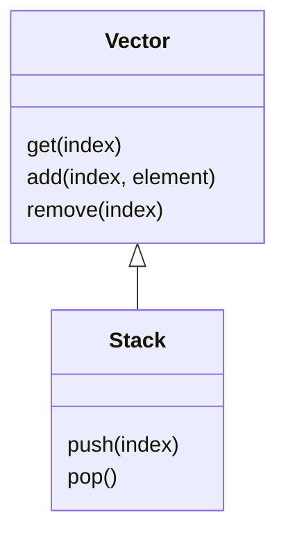
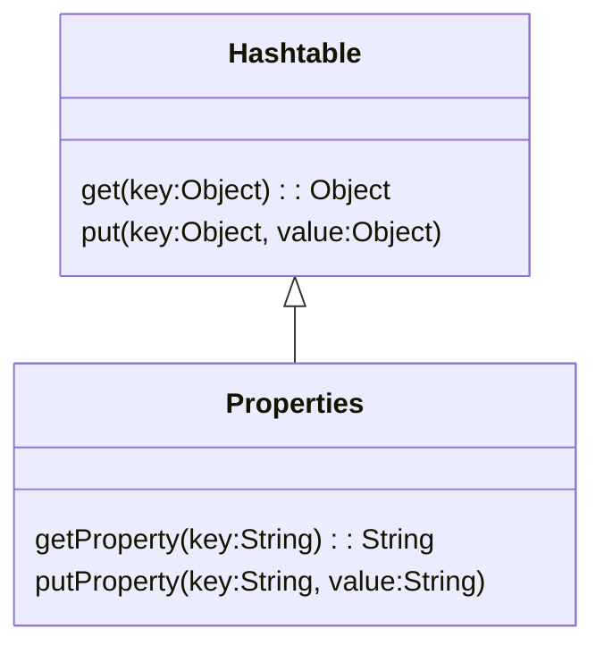
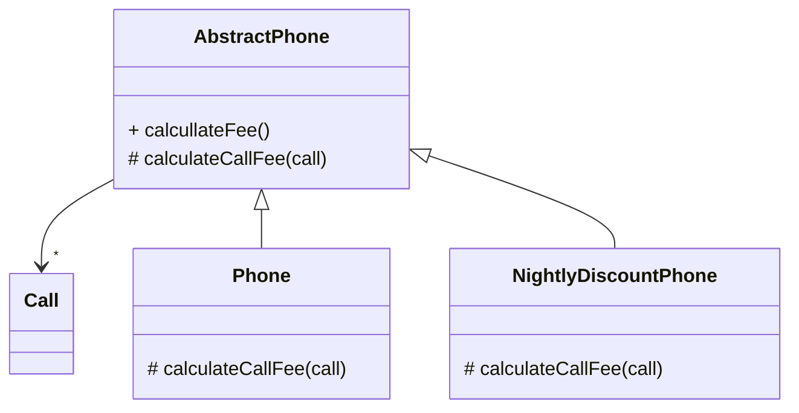
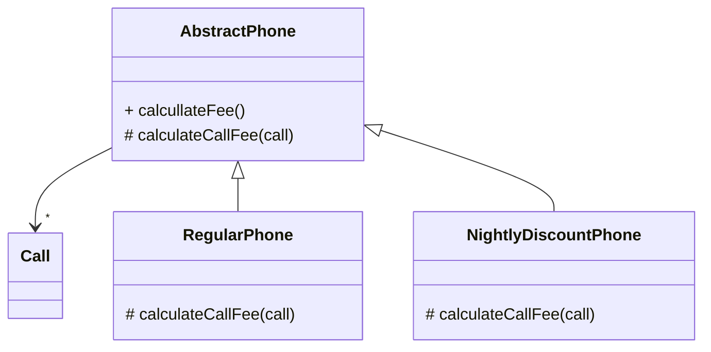
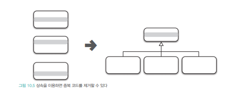

# 상속과 코드 재사용

객체지향 프로그래밍의 장점 중 하나는 코드를 재사용하기가 용이하다는 것이다. 

#### 전통적인 패러다임: 코드를 복사한 후 수정

#### 객체지향

- 코드를 재사용하기 위해 '새로운' 코드를 추가한다.
- 클래스 안에 코드가 작성됨
- 새로운 클래스를 추가하는 방식

#### 코드 재사용의 두 가지 기법

1. 상속: 클래스 안에 정의된 인스턴스 변수와 메서드를 자동으로 새로운 클래스에 추가
2. 합성: 새로운 클래스의 인스턴스 안에 기존 클래스의 인스턴스를 포함
3. 

## 상속과 중복 코드

중복 코드는 의심과 불신을 발생시킨다. 

- 두 코드가 정말 동일한 것인가?
- 유사한 코드가 있는데 새로운 코드를 만든 이유는?
- 의도적인가, 실수인가?
- 두 코드가 중복인가?
- 중복을 없애도 문제없을까?
- 한쪽 코드만 수정하는 게 더 안전하지 않을까?

⇒ 우리를 주저하게 만듦

⇒ 동료들을 의심하게 만듦

### DRY (Don't Repeat Yourself) 원칙

#### 중복 코드를 제거해야 하는 이유

- 중복 코드는 변경을 방해한다
    
    프로그램의 본질:  비즈니스와 관련된 지식을 코드로 변환하는 것
    
    - 이 지식은 항상 변한다.
    - 지식을 표현하는 코드도 변경해야 한다.
    
    ⇒ 새로운 코드를 추가하면 언젠가는 변경될 것이라고 가정하는게 현명하다.
    
- 수정 비용의 증가
    
    중복 코드는 코드를 수정하는 데 필요한 노력을 몇 배로 증가시킨다.
    
    **수정 과정의 어려움**
    
    1. 어떤 코드가 중복인지 찾아야 함
    2. 찾아낸 모든 코드를 일관되게 수정해야 함
    3. 모든 중복 코드를 개별적으로 테스트해야 함
    4. 동일한 결과를 내놓는지 확인해야 함

---

#### 중복 여부를 판단하는 기준 : 변경

중복⭕ 요구사항이 변경됐을 때 두 코드를 함께 수정해야 한다면 중복이다.

중복❌ 함께 수정할 필요가 없다면 중복이 아니다.

- 모양이 유사하다 = 중복의 징후일 뿐
- 결정 기준: 코드가 변경에 반응하는 방식

---

**신뢰할 수 있고 수정하기 쉬운 소프트웨어를 만드는 효과적인 방법은 중복을 제거하는 것**

**DRY 원칙**

- 프로그래머들은 반드시 따라야 함
- 동일한 지식을 중복하지 말 것
- 시스템 내에서 단일하고 명확한 표현 유지

> **DRY 원칙**
> 
> 
> 모든 자식은 시스템 내에서 단일하고, 애매하지 않고, 정말로 믿을 만한 표현 양식을 가져야 한다.[Hunt99].
> 

---

### 중복과 변경

### 중복 코드 살펴보기

요구사항: 한 달에 한 번씩 가입자별로 전화 요금을 계산하는 애플리케이션

계산 규칙

- 통화 시간을 단위 시간당 요금으로 나눔
- 예: 10초당 5원, 100초 통화 → 100 / 10 * 5 = 50원

---

#### 초기 구현

`Call` 개별 통화 기간 저장

```java
public class Call {
  private LocalDateTime from;  // 통화 시작 시간
  private LocalDateTime to;    // 통화 종료 시간
	
	public Call(LocalDateTime from, LocalDateTime to) {
		this.from = from;
		this.to = to;
	}
	
	public Duration getDuration() {
		return Duration.between(from, to);
	}
	
	public LocalDateTime getFrom() {
		return from;
	}
}
```

`Phone` 통화 요금 계산

```java
public class Phone {
  private Money amount;        // 단위요금
  private Duration seconds;    // 단위시간
	private List<Call> calls = new ArrayList<>();
	
	public Phone(Money amount, Duration seconds) {
		this.amount = amount;
		this.seconds = seconds;
	}
	
	public void call(Call call) {
		calls.add(call);
	}
	
	public List<Call> getCalls() {
		return calls;
	}
	public Money getAmount() {
		return amount;
	}
	
	public Duration getSeconds() {
		return seconds;
	}
	
	// 전체 통화 요금 계산
	public Money calculateFee() {
		Money result = Money.ZERO;
		
		for(Call call : calls) {
			result =result.plus(amount.times(call.getDuration().getSeconds() / seconds.getSeconds()));
		}
		return result;
	}
}
```

INFORMATION EXPERT 패턴

- 통화 목록을 관리하는 정보 전문가 = Phone
- 요금 계산 책임을 Phone에 할당

```java
// '10초당 5원'씩 부과되는 요금제에 가입한 사용자
Phone phone = new Phone(Money.wons(5), Duration.ofSeconds(10));

// 1분 동안 두 번 통화
phone.call(new Call(LocalDateTime.of(2018, 1, 1, 12, 10, 0),
							LocalDateTime.of(2018, 1, 1, 12, 11, 0)));
							
phone.call(new Call(LocalDateTime.of(2018, 1, 2, 12, 10, 0),
							LocalDateTime.of(2018, 1, 2, 12, 11, 0)));
							
phone.calculateFee(); //=> Money.wons(60)
```

---

#### 새로운 요구사항

- 심야 할인 요금제
- 밤 10시 이후의 통화에 대해 요금 할인

빠른 해결 방법

- Phone 코드를 복사해서 NightlyDiscountPhone 생성
- 수정하여 새로운 기능 추가

`NightlyDiscountPhone` 심야 할인 요금제

```java
public class NightlyDiscountPhone {
	private static final int LATE_NIGHT_HOUR = 22;
	
	private Money nightlyAmount;   // 10시 이후 요금
  private Money regularAmount;   // 10시 이전 요금
	private Duration seconds;
	private List<Call> calls = new ArrayList<>();

	public NightlyDiscountPhone(Money nightlyAmount, Money regularAmount, Duration seconds) {
		this.nightlyAmount = nightlyAmount;
		this.regularAmount = regularAmount;
		this.seconds = seconds;
	}
	
	public Money calculateFee() {
		Money result = Money.ZERO;
		
		for(Call call : calls) {
			if (call.getFrom().getHour() > LATE_NIGHT_HOUR) {
				result = result.plus(
					nightlyAmount.times(call.getDuration().getSeconds() / seconds.getSeconds()));
			} else {
				result = result.plus(
					regularAmount.times(call.getDuration().getSeconds() / seconds.getSeconds()));
			}
		}
	
		return result;
	}
}
```

- 구현 시간은 절약
- Phone과 중복 코드 존재

---

#### 중복 코드 수정하기

새로운 요구사항: 세금 계산

- 통화 요금에 세금 부과
- 세율은 가입자의 핸드폰마다 다름

문제

- 통화 요금 계산 로직이 Phone과 NightlyDiscountPhone 양쪽에 존재
- 두 클래스를 함께 수정해야 함

```java
public class Phone {
	...
	private double taxRate; // 세율
	
	public Phone(Money amount, Duration seconds, double taxRate) {
		this.taxRate = taxRate;
	}
	
	public Money calculateFee() {
		Money result = Money.ZERO;
		
		for(Call call : calls) {
			result = result.plus(amount.times(call.getDuration().getSeconds() / seconds.getSeconds()));
		}
		
		// 세금 부과
		return result.plus(result.times(taxRate));
	}
}
```

```java
public class NightlyDiscountPhone {
	...
	private double taxRate; // 세율

	public NightlyDiscountPhone(Money nightlyAmount, Money regularAmount,
			Duration seconds, double taxRate) {
		...
		this.taxRate = taxRate;
	}
	
	public Money calculateFee() {
		Money result = Money.ZERO;
	
		for(Call call : calls) {
			if (call.getFrom().getHour() > LATE_NIGHT_HOUR) {
				result = result.plus(
					nightlyAmount.times(call.getDuration().getSeconds() / seconds.getSeconds()));
			} else {
				result = result.plus(
					regularAmount.times(call.getDuration().getSeconds() / seconds.getSeconds()));
			}
		}
		
		// 세금 부과
		return result.minus(result.times(taxRate));
	}
}
```

#### 중복 코드의 문제점

1. 많은 코드 더미 속에서 어떤 코드가 중복인지 파악하기 어렵다.
2. 중복 코드는 항상 함께 수정되어야 한다.
    - 하나라도 빠트리면 버그 발생
    - 예: Phone은 수정했지만 NightlyDiscountPhone은 수정하지 않으면 장애 발생
3. 중복 코드는 서로 다르게 수정하기가 쉽다.
    - Phone: `result.plus(result.times(taxRate))` (세금 추가)
    - NightlyDiscountPhone: `result.minus(result.times(taxRate))` (버그!)
    - 코드의 일관성이 무너질 위험
4. **중복 코드는 새로운 중복 코드를 부른다.**
    - 중복 코드를 제거하지 않은 상태에서 코드를 수정할 수 있는 유일한 방법은 새로운 중복 코드를 추가하는 것 뿐
    - 중복 코드가 늘어날수록:
        - 애플리케이션은 변경에 취약
        - 버그 발생 가능성 증가
        - 코드 변경 속도 감소
        

---

#### 타입 코드 사용하기

중복 제거: 클래스 합치기

- 요금제를 구분하는 타입 코드 추가
- 타입 코드의 값에 따라 로직 분기
- Phone과 NightlyDiscountPhone을 하나로 합침

```java
public class Phone {
	private static final int LATE_NIGHT_HOUR = 22;
	enum PhoneType { REGULAR, NIGHTLY }
	
	private PhoneType type;

	private Money amount;
	private Money regularAmount;
	private Money nightlyAmount;
	private Duration seconds;
	private List<Call> calls = new ArrayList<>();
	
	// 일반 요금제 생성자
	public Phone(Money amount, Duration seconds) {
		this(PhoneType.REGULAR, amount, Money.ZERO, Money.ZERO, seconds);
	}
	
	// 심야 할인 요금제 생성자
	public Phone(Money nightlyAmount, Money regularAmount, Duration seconds) {
		this(PhoneType.NIGHTLY, Money.ZERO, nightlyAmount, regularAmount, seconds);
	}
	
	public Phone(PhoneType type, Money amount, Money nightlyAmount,
			Money regularAmount, Duration seconds) {
		this.type = type;
		this.amount = amount;
		this.regularAmount = regularAmount;
		this.nightlyAmount = nightlyAmount;
		this.seconds = seconds;
	}
	
	public Money calculateFee() {
		Money result = Money.ZERO;
		for(Call call : calls) {
			if (type == PhoneType.REGULAR) {
				result = result.plus(
					amount.times(call.getDuration().getSeconds() / seconds.getSeconds()));
			} else {
				if (call.getFrom().getHour() > LATE_NIGHT_HOUR) {
					result = result.plus(
						nightlyAmount.times(call.getDuration().getSeconds() / seconds.getSeconds()));
				} else {
					result = result.plus(
						regularAmount.times(call.getDuration().getSeconds() / seconds.getSeconds()));
				}
			}
		}
		
		return result;
	}
}
```

**타입 코드의 문제점: 낮은 응집도와 높은 결합도**

### 상속을 이용해서 중복 코드 제거하기

**상속의 기본 아이디어**

: 이미 존재하는 클래스와 유사한 클래스가 필요하다면 코드를 복사하지 말고 상속을 이용해 코드를 재사용하라

- `NightlyDiscountPhone`의 코드 대부분이 `Phone`과 유사
- `NightlyDiscountPhone`이 `Phone`을 상속받으면 코드 중복 없이 Phone의 코드 대부분을 재사용 가능

```java
public class NightlyDiscountPhone extends Phone {
	private static final int LATE_NIGHT_HOUR = 22;
	
	private Money nightlyAmount;
	
	public NightlyDiscountPhone(Money nightlyAmount, Money regularAmount, Duration seconds) {
		// 부모 클래스 생성자 호출
		// 10시 이전 요금 계산에 필요한 regularAmount와 seconds
		super(regularAmount, seconds);
		this.nightlyAmount = nightlyAmount;
	}
	
	@Override
	public Money calculateFee() {
		// 부모 클래스의 calculateFee 호출
		Money result = super.calculateFee();
		
		Money nightlyFee = Money.ZERO;
		for(Call call : getCalls()) {
			if (call.getFrom().getHour() > LATE_NIGHT_HOUR) {
				nightlyFee = nightlyFee.plus(
					getAmount().minus(nightlyAmount).times(
						call.getDuration().getSeconds() / getSeconds().getSeconds()));
			}
		}
		
		return result.minus(nightlyFee);
	}
}
```

- 10시 이전: Phone에 구현된 일반 요금제와 동일 → Phone 로직 재사용
- 10시 이후: NightlyDiscountPhone에서만 구현

**요금 계산**

1. 부모 클래스의 `calculateFee()` 호출
2. 모든 통화에 대해 10시 이전 요금 규칙으로 계산
3. 10시 이후 통화 요금을 전체 요금에서 차감

---

#### 계산 예시

- 밤 10시 이전: 10초당 5원 (regularAmount = 5원, seconds = 10초)
- 밤 10시 이후: 10초당 2원 (nightlyAmount = 2원, seconds = 10초)

통화 시간: 40초와 50초

모두 10시 이전

```
(40초/10초 × 5원) + (50초/10초 × 5원) = 45원
```

모두 10시 이후

```
(40초/10초 × 2원) + (50초/10초 × 2원) = 18원
```

40초는 10시 이전, 50초는 10시 이후

```
(40초/10초 × 5원) + (50초/10초 × 2원) = 30원
```

구현에서 사용한 계산 방법

```
(40초/10초 × 5원) + (50초/10초 × 5원) - (50초/10초 × (5원-2원)) = 30원

// 모든 통화를 10시 이전 기준으로 계산
// 10시 이후 통화에 대해 차액을 차감
```

---

#### 상속의 문제점

1. 개발자의 가정을 이해하기 전에는 코드를 이해하기 어렵다.
    - 기대: 10시 이전 요금 + 10시 이후 요금
    - 실제: 10시 이전 요금 - 10시 이후 차액
    - 요구사항과 구현 사이의 차이가 큼
    - 상속이 초래하는 문제
        - 상속을 염두에 두고 설계되지 않은 클래스를 상속으로 재사용하기 어렵다.
        - 재사용을 위해 상속 계층 사이에 무수히 많은 가정
        - 가정은 코드를 이해하기 어렵게 만들고 직관에 어긋남
        - 잘못 사용된 상속은 이 차이를 더 크게 벌림
2. 깊은 상속 계층의 복잡성
    - 여기서는 두 클래스 사이의 상속 관계만 살펴봤지만 실제 프로젝트의 상속 계층은 매우 깊다.
    - 계단을 하나 내려올 때마다 이해하기 어려운 가정과 마주침
3. 높은 결합도
    
    **결합도:** 하나의 모듈이 다른 모듈에 대해 얼마나 많은 지식을 갖고 있는지를 나타내는 정도
    
    **상속과 결합도**
    
    - 상속으로 코드 재사용하려면 부모 클래스 개발자가 세웠던 가정과 추론 과정을 정확히 이해해야 한다.
    - 자식 클래스 작성자가 부모 클래스의 구현 방법에 대한 정확한 지식을 가져야 한다.
    - **따라서 상속은 결합도를 높인다.**

### 강하게 결합된 Phone과 NightlyDiscountPhone

**세금 부과 요구사항 추가**

```java
public class Phone {
	...
	private double taxRate;
	
	public Phone(Money amount, Duration seconds, double taxRate) {
		...
		this.taxRate = taxRate;
	}
	
	public Money calculateFee() {
		return result.plus(result.times(taxRate));
	}
	
	public double getTaxRate() {
		return taxRate;
	}
}
```

```java
public class NightlyDiscountPhone extends Phone {
	public NightlyDiscountPhone(Money nightlyAmount, Money regularAmount,
			Duration seconds, double taxRate) {
		super(regularAmount, seconds, taxRate);
	}
	
	@Override
	public Money calculateFee(){
		...
		return result.minus(nightlyFee.plus(nightlyFee.times(getTaxRate())));
	}
}
```

NightlyDiscountPhone은

- taxRate를 부모 클래스인 Phone의 생성자로 전달해야 한다.
- Phone과 동일하게 값을 반환할 때 taxRate를 이용해 세금을 부과해야 한다.

#### 문제

1. **중복 코드 제거 실패**
    - Phone의 코드를 재사용하고 중복 코드를 제거하기 위해 상속 사용
    - 하지만 세금 부과 로직 추가 시 NightlyDiscountPhone에도 유사한 코드 추가 필요
    - 중복 코드를 제거하기 위해 상속을 사용했는데 새로운 중복 코드 발생
2. **강한 결합**
    - NightlyDiscountPhone이 Phone의 구현에 너무 강하게 결합
    - Phone 변경 시 NightlyDiscountPhone도 영향받음

> **상속을 위한 경고 1**

자식 클래스의 메서드 안에서 super 참조를 이용해 부모 클래스의 메서드를 직접 호출할 경우 두 클래스는 강하게 결합된다. super 호출을 제거할 수 있는 방법을 찾아 결합도를 제거하라.
> 

자식 클래스가 부모 클래스의 구현에 강하게 결합될 경우 부모 클래스의 변경에 의해 자식 클래스가 영향을 받는다. 상속을 사용하면 적은 노력으로도 새로운 기능을 쉽고, 빠르게 추가할 수 있지만 자식 클래스가 부모 클래스의 변경에 취약해질 수 있다. 

⇒ 취약한 기반 클래스 문제

## 취약한 기반 클래스 문제

> 부모 클래스의 변경에 의해 자식 클래스가 영향을 받는 현상을 **취약한 기반 클래스 문제 (Fragile Base Class Problem,Brittle Base Class Problem)** 라고 부른다. [Holub04]
이 문제는 상속을 사용한다면 피할 수 없는 객체지향 프로그래밍의 근본적인 취약성이다.
> 

#### 취약한 기반 클래스 문제: 상속이라는 문맥 안에서 결합도가 초래하는 문제점을 가리키는 용어

상속은

자식 클래스를 점진적으로 추가해서 기능을 확장하는 데는 용이하다.

하지만 높은 결합도로 인해 부모 클래스를 점진적으로 개선하는 것은 어렵게 만든다. 

최악의 경우에는 모든 자식 클래스를 동시에 수정하고 테스트해야할 수도 있다.

---

#### 상속의 문제

1. 강한 결합도
    - 상속은 자식 클래스와 부모 클래스의 결합도를 높인다.
    - 자식 클래스는 부모 클래스의 불필요한 세부사항에 엮인다.
2. 캡슐화의 약화
    - 상속은 자식 클래스가 부모 클래스의 구현 세부사항에 의존하도록 만든다.
    - 부모 클래스의 퍼블릭 인터페이스가 아닌 구현을 변경해도 자식 클래스가 영향받는다.
3. 변경의 어려움
    
    > 겉으로 보기에는 안전한 방식으로 기반 클래스를 수정한 것처럼 보이더라도 이 새로운 행동이 파생 클래스에게 상속될 경우 파생 클래스의 잘못된 동작을 초래할 수 있기 때문에 기반 클래스는 "취약하다".
    > 
4. 전체 프로그램을 불안정한 상태로 만들어버릴 수도 있다.
    - 핵심적인 기반 클래스에 대한 단순한 변경이 전체 프로그램을 불안정한 상태로 만들 수 있다.
    - 모든 파생 클래스들을 살펴보고 테스트해야 한다.
    - 기반 클래스와 파생 클래스를 사용하는 모든 코드를 점검해야 한다.

---

#### 객체를 사용하는 이유: 구현과 관련된 세부사항을 퍼블릭 인터페이스 뒤로 캡슐화할 수 있기 때문

- 캡슐화는 변경에 의한 파급효과를 제어할 수 있기 때문에 가치가 있다.
    - 객체는 변경될지 모르는 불안정한 요소를 캡슐화함으로써 파급효과를 걱정하지 않고도 자유롭게 내부를 변경할 수 있다.
- 상속을 사용하면
    - 상속은 코드 재사용을 위해 캡슐화의 장점을 희석시킨다.
    - 구현에 대한 결합도를 높인다.

### 불필요한 인터페이스 상속 문제

공통점: 부모 클래스에서 상속받은 메서드를 사용할 경우 자식 클래스의 규칙이 위반될 수 있다는 것

#### 사례 1: Stack과 Vector

**Stack**: 가장 나중에 추가된 요소가 가장 먼저 추출되는(Last In First Out, LIFO) 자료 구조인

**Vector**: 임의의 위치에서 요소를 추출하고 삽입할 수 있는 리스트 자료 구조의 구현체. java.util.List의 초기 버전



개발자들은 요소의 추가, 삭제 오퍼레이션을 제공하는 Vector를 재사용하기 위해 Stack을 Vector의 자식 클래스로 구현했다.

**Vector**

- 임의의 위치에서 요소를 조회하고, 추가하고, 삭제할 수 있다.
- List 자료 구조의 초기 버전

**Stack의 특성**

- LIFO (Last In First Out) 자료 구조
- 맨 마지막 위치에서만 요소 추가하거나 제거할 수 있다.

**문제**

```java
Stack<String> stack = new StackO();
stack.push("1st");
stack.push("2nd");
stack.push("3rd");

stack.add(0, "4th");
assertEquals("4th", stack.pop()); // 반환값은 "3rd"
```

- Stack이 Vector를 상속받아 Vector의 퍼블릭 인터페이스가 합쳐진다.
- Stack에게 상속된 Vector의 퍼블릭 인터페이스를 이용하면 임의의 위치에서 요소를 추가하거나 삭제할 수 있다.
    
    ⇒ Stack의 규칙 쉽게 위반
    

Stack을 사용하는 개발자들이 Vector에서 상속받은 add 메서드를 사용하지 않으면 된다고 생각할 수도 있다. 

**하지만 인터페이스 설계는 제대로 쓰기엔 쉽게, 엉터리로 쓰기엔 어렵게 만들어야 한다[Meyers05].** 

Stack 개발자 한 사람의 일시적인 편의를 위해 인터페이스를 사용해야 하는 무수한 사람들이 가슴을 졸여야 하는 상황을 초래하는 것은 어떤 경우에도 정당화하기 어렵다.
java.util.Properties 클래스는 잘못된 유산을 물려받는 또 다른 클래스다. Properties 클래스는 키와
값의 쌍을 보관한다는 점에서는 Map과 유사하지만 다양한 타입을 저장할 수 있는 Map과 달리 키와 값의
타입으로 오직 String만 가질 수 있다.

#### 사례 2: Properties와 Hashtable

**Properties**: 키와 값의 쌍을 보관하는 자료 구조. (키와 값의 타입은 오직 String만 가능)



**문제**

```java
Properties properties = new Properties();
properties.setProperty("Bjarne Stroustrup", "C++");
properties.setProperty("James Gosling", "Java");
properties.put("Dennis Ritchie", 67);
assertEquals("C", properties.getProperty("Dennis Ritchie")); // null
```

- Properties는 제네릭 도입 이전에 만들어져 컴파일러가 키와 값의 타입 체크 불가능
- Hashtable의 put 메서드로 String 이외의 타입도 저장 가능
- getProperty는 값이 String이 아니면 null 반환

---

> **상속을 위한 경고 2**
상속받은 부모 클래스의 메서드가 자식 클래스의 내부 구조에 대한 규칙을 깨트릴 수 있다.
> 

객체지향의 핵심은 객체들의 협력이다. 

단순히 코드를 재사용하기 위해 불필요한 오퍼레이션이 인터페이스에 스며들도록 방치해서는 안 된다.

---

### 메서드 오버라이딩의 오작용 문제

**InstrumentedHashSet**:  HashSet의 내부에 저장된 요소의 수를 셀 수 있는 기능을 추가한 클래스. (HashSet의 자식 클래스)

```java
public class InstrumentedHashSet<E> extends HashSet<E>{
	private int addCount = 0; //  요소를 추가한 횟수를 기록
	
	@Override
	public boolean add(E e) {
		addCount++; // 요소가 추가될 때 요소 개수 증가
		return super.add(e);
	}
	
	@Override
	public boolean addAll(Collection <? extends E> c) {
		// 다수의 요소들을 한 번에 추가
		addCount + c.size();
		return super.addAll(c);
	}
	
	// addCount 증가 후 super 참조를 이용해 부모 클래스의 메서드를 호출해서 요소 추가
}
```

---

#### 문제

```java
InstrumentedHashSet<String> languages = new InstrumentedHashSet<();
languages.addAll(Arrays.asList("Java", "Ruby", "Scala"));
// 예상: addCount = 3
// 실제: addCount = 6
```

1. `InstrumentedHashSet`의 `addAll`호출 → addCount += 3
2. `super.addAll()` 호출
3. `HashSet`의 `addAll`이 내부적으로 `add`메서드 호출
4. `InstrumentedHashSet`의 `add`가 세 번 호출 → addCount += 3
    
    ⇒ 6
    

---

#### 해결 시도

1. **InstrumentedHashSet의 addAll 메서드를 제거**
    - HashSet의 addAll 호출 → InstrumentedHashSet의 add 호출
    - 문제점
        - HashSet의 addAll이 나중에 add를 호출하지 않도록 수정된다면 addAll로 추가된 요소들의 카운트 누락
2. **addAll을 직접 구현**
    - InstrumentedHashSet의 addAll 메서드를 오버라이딩하고 추가되는 각 요소에 대해 한 번씩 add 메시지를 호출
        
        ```java
        public class InstrumentedHashSet<E> extends HashSet<E> {
        	@Override
        	public boolean add(E e) {
        		addCount++;
        		return super.add(e);
        	}
        	
        	@Override
        	public boolean addAll(Collection <? extends E> c) {
        		boolean modified = false;
        		for (E e : c)
        			if (add(e))
        				modified = true;
        		return modified;
        	}
        }
        ```
        
        - 미래에 HashSet의 addAll 메서드가 수정되어도 InstrumentedHashSet의 행동에는 아무런 영향도 없을 것
    - 문제점
        - HashSet의 addAll 구현과 동일 → 코드 중복
        - 부모 클래스 코드를 그대로 가져오는 방법이 항상 가능한 것도 아니다.
            - 소스코드 접근 권한이 없을 수 있음
            - 부모 클래스의 메서드에서 private 변수나 메서드를 사용할 수 있음

---

> **상속을 위한 경고 3**
자식 클래스가 부모 클래스의 메서드를 오버라이딩할 경우 부모 클래스가 자신의 메서드를 사용하는 방법에 자식클래스가 결합될 수 있다.
> 

#### 조슈아 블로치는

클래스가 상속되기를 원한다면 상속을 위해 클래스를 설계하고 문서화해야 하며, 그렇지 않은 경우에는 상속을 금지시켜야 한다고 주장한다. 

> 우선, 그런 클래스에서는 메서드 오버라이딩으로 인한 파급 효과를 분명하게 문서화해야 한다. 
달리 말해, 오버라이딩 가능한 메서드들의 자체 사용(self-use), 즉, 그 메서드들이 같은 클래스의 다른 메서드를 호출하는지에 대해 반드시 문서화해야 한다.
이와는 반대로, 각각의 public이나 protected 메서드 및 생성자가 어떤 오버라이딩 가능한 메서드를 호출하는지, 어떤 순서로 하는지, 호출한 결과가 다음 처리에 어떤 영향을 주는지에 대해서도 반드시 문서화해야 한다. 
더 일반적으로 말하면 오버라이딩 가능한 메서드를 호출할 수 있는 어떤 상황에 대해서도 문서화해야 한다는 것이다[Bloch08].
> 

❓객체지향의 핵심이 구현을 캡슐화하는 것인데 내부 구현을 공개하고 문서화하는 것이 옳은가 ❓

> 그러나 잘된 API 문서는 메서드가 무슨 일(what)을 하는지를 기술해야 하고, 어떻게 하는지(how)를 설명해서는 안 된다는 통념을 어기는 것은 아닐까? 그렇다, 어기는 것이다! 이것은 결국 상속이 캡슐화를 위반함으로써 초래된 불행인 것이다. 서브클래스가 안전할 수 있게끔 클래스를 문서화하려면 클래스의 상세 구현 내역을 기술해야 한다[Bloch08].
> 

설계는 트레이드오프 활동이다.

상속은 코드 재사용을 위해 캡슐화를 희생한다. 

완벽한 캡슐화를 원한다면 코드 재사용을 포기하거나 상속 이외의 다른 방법을 사용해야 한다.

### 부모 클래스와 자식 클래스의 동시 수정 문제

음악 목록을 추가할 수 있는 플레이리스트를 구현한다.

필요한 것

- 음악 정보를 저장할 Song 클래스
- 음악 목록을 저장할 Playlist 클래스

---

```java
public class Song {
	private String singer;
	private String title;
	
	public Song(String singer, String title) {
		this.singer = singer;
		this.title = title;
	}
	
	public String getSinger() {
		return singer;
	}

	public String getTitle() {
		return title;
	}
}
```

```java
public class Playlist {
	private List<Song> tracks = new ArrayList<>();
	
	// 트랙에 노래를 추가
	public void append(Song song) {
		getTracks().add(song);
	}
	
	public List<Song> getTracks() {
			return tracks;
	}
}
```

**PersonalPlaylist**: 플레이리스트에서 노래를 삭제할 수 있는 기능 추가

가장 빠른 방법은 상속을 통해 Playlist의 코드를 재사용하는 것

```java
public class PersonalPlaylist extends Playlist {
	public void remove(Song song) {
		getTracks().remove(song);
	}
}
```

---

#### 요구사항 변경: 가수별 노래 제목 관리

```java
public class Playlist {
	private List<Song> tracks = new ArrayList<>();
	private Map<String, String> singers = new HashMap<>(); // 추가
	
	public void append(Song song) {
		tracks.add(song);
		singers.put(song.getSinger(), song.getTitle()); // 추가
	}
	
	public List<Song> getTracks() {
		return tracks;
	}
	
	public Map(String, String> getSingers() {
		return singers;
	}
}
```

PersonalPlaylist도 함께 수정 필요

```java
public class PersonalPlaylist extends Playlist {
	public void remove(Song song) {
		getTracks().remove(song);
		getSingers().remove(song.getSinger()); // 추가
	}
}
```

수정하지 않으면

- tracks에서는 노래가 제거되지만 singers에는 남아있음
- 데이터 불일치 발생

---

**오버라이딩이나 불필요한 인터페이스 상속이 없어도 부모 클래스를 수정할 때 자식 클래스를 함께 수정해야 할 수도 있다**

- 상속은 자식 클래스가 부모 클래스의 구현에 강하게 결합되도록 만든다.
    - 결합도 = 다른 대상에 대해 알고 있는 지식의 양
- 상속은 자식 클래스가 부모 클래스의 내부를 속속들이 알도록 강요한다.
    - 부모와 자식을 강하게 결합시켜 함께 수정해야 하는 상황이 빈번하게 발생한다.

> 서브클래스는 올바른 기능을 위해 슈퍼클래스의 세부적인 구현에 의존한다. 
슈퍼클래스의 구현은 릴리스를 거치면서 변경될 수 있고, 그에 따라 서브클래스의 코드를 변경하지 않더라도 깨질 수 있다. 
결과적으로, 슈퍼클래스의 작성자가 확장될 목적으로 특별히 그 클래스를 설계하지 않았다면 서브클래스는 슈퍼클래스와 보조를 맞춰서 진화해야 한다[Bloch08].
> 

---

> **상속을 위한 경고 4**
클래스를 상속하면 결합도로 인해 자식 클래스와 부모 클래스의 구현을 영원히 변경하지 않거나. 자식 클래스와 부모 클래스를 동시에 변경하거나 둘 중 하나를 선택할 수밖에 없다.
> 

## Phone 다시 살펴보기

취약한 기반 클래스 문제를 완전히 없앨 수는 없지만 어느 정도까지 위험을 완화시키는 것은 가능하다.
⇒ 추상화다.

---

### 추상화에 의존하자

#### 문제점

- NightlyDiscountPhone이 Phone에 강하게 결합
- Phone 변경 시 NightlyDiscountPhone도 함께 변경될 가능성 높음

#### 해결책

- 자식 클래스가 부모 클래스의 구현이 아닌 추상화에 의존하도록 만들기
- 부모 클래스와 자식 클래스 모두 추상화에 의존하도록 수정

#### 상속 도입 시 따라야 할 두 가지 원칙

**1. 두 메서드가 유사하게 보인다면 차이점을 메서드로 추출하라.** 메서드 추출을 통해 두 메서드를 동일한 형태로 만들 수 있다.

**2. 부모 클래스의 코드를 하위로 내리지 말고 자식 클래스의 코드를 상위로 올려라.** 부모 클래스의 구체적인 메서드를 자식 클래스로 내리는 것보다 자식 클래스의 추상적인 메서드를 부모 클래스로 올리는 것이 재사용성과 응집도 측면에서 더 뛰어난 결과를 얻을 수 있다.

### 차이를 메서드로 추출하라

#### 변경 전

```java
public class Phone {
	private Money amount;
	private Duration seconds;
	private List<Call> calls = new ArrayList<>();

public Phone(Money amount, Duration seconds) {
	this.amount = amount;
	this.seconds = seconds;
}

public Money calculateFee() {
	Money result = Money.ZERO;
	
	for(Call call : calls) {
		result = result.plus(amount.times(call.getDuration().getSeconds() / seconds.getSeconds()));
	}
	
	return result;
	}
}
```

```java
public class NightlyDiscountPhone {
	private static final int LATE_NIGHT_HOUR = 22;
	private Money nightlyAmount;
	private Money regularAmount;
	private Duration seconds;
	private List<Call> calls= new ArrayList<>();
	
public NightlyDiscountPhone(Money nightlyAmount, Money regularAmount, Duration seconds) {
	this.nightlyAmount = nightlyAmount;
	this.regularAmount = regularAmount;
	this.seconds = seconds;
}

// Phone과 유사하지만 calculateFee 메서드의 구현 일부와 인스턴스 변수의 목록이 조금 다르다.
public Money calculateFee() {
	Money result = Money.ZERO;
	
	for(Call call : calls) {
		if (call.getFrom().getHour() > LATE_NIGHT_HOUR) {
			result = result.plus(
			nightlyAmount.times(call.getDuration().getSeconds() / seconds.getSeconds()));
		} else {
			result = result.plus(
			regularAmount.times(call.getDuration().getSeconds() / seconds.getSeconds()));
		}
	}
	return result;
	}
}
```

---

먼저 할 일은 두 클래스의 메서드에서 다른 부분을 별도의 메서드로 추출하는 것이다. 

→ calculateFee의 for 문 안에 구현된 요금 계산 로직

→ 각각 calculateCallFee()로 추출

```java
public class Phone {
	...
	public Money calculateFee() {
		Money result = Money.ZERO;
		
		for(Call call : calls) {
			result = result.plus(calculateCallFee(call));
		}
		
		return result;
	}

	private Money calculateCallFee(Call call) {
		return amount.times(call.getDuration().getSeconds() / seconds.getSeconds());
	}
}
```

```java
public class NightlyDiscountPhone {
	...
	public Money calculateFee() {
		Money result = Money.ZERO;
		
		for(Call call : calls) {
			result = result.plus(calculateCallFee(call));
		}
		return result;
	}
	
	private Money calculateCallFee(Call call) {
		if (call.getFrom().getHour() >= LATE_NIGHT_HOUR) {
			return nightlyAmount.times(call.getDuration().getSeconds() / seconds.getSeconds());
		} else {
			return regularAmount.times(call.getDuration().getSeconds() / seconds.getSeconds());
		}
	}
}
```

- calculateFee 메서드는 완전히 동일
- calculateCallFee 메서드 안에 서로 다른 부분을 격리

---

### 중복 코드를 부모 클래스로 올려라

1. 부모 클래스 추가
    
    ```java
    public abstract class AbstractPhone {
    public class Phone extends AbstractPhone { ... }
    public class NightlyDiscountPhone extends AbstractPhone { ... }
    ```
    
2. 공통 메서드 이동
    
    공통 코드를 옮길 때 인스턴스 변수보다 메서드를 먼저 이동시키는 게 편하다.
    
    - 메서드를 옮기고 나면 그 메서드에 필요한 메서드나 인스턴스 변수가 무엇인지를 컴파일 에러를 통해 자동으로 알 수 있기 때문
    - 불필요한 부분은 자식 클래스에 둔 채로 부모 클래스에 꼭 필요한 코드만 이동시킬 수 있다.
    - 두 클래스 사이에서 완전히 동일한 코드는 calculateFee 메서드이므로 calculateFee 메서드를 AbstractPhone으로 이동시킨다.
        
        ```java
        public abstract class AbstractPhone {
        	public Money calculateFee() {
        		Money result = Money.ZERO;
        		
        		for(Call call : calls) { // 에러: calls가 없음
        			result = result.plus(calculateCallFee(call));
        		}
        		return result:
        	}
        }
        ```
        
3. 인스턴스 변수 이동
    
    ```java
    public abstract class AbstractPhone {
    	private List(Call> calls = new ArrayList<>();
    	
    	public Money calculateFee() {
    		Money result = Money.ZERO;
    		
    		for(Call call : calls) {
    			result = result.plus(calculateCallFee(call)); // 에러: 메서드 없음
    		}
    		return result;
    	}
    }
    ```
    
4. 추상 메서드 선언
    
    calculateCallFee()의 시그니처는 동일하지만 내부 구현이 서로 다르다.
    
    - 메서드의 구현은 그대로 두고 시그니처만 부모 클래스로 이동시킨다.
    - 시그니처만 이동시키는 것이므로 calculateCallFee()를 추상 메서드로 선언하고 자식 클래스에서 오버라이딩할 수 있도록 protected로 선언한다.
    
    ```java
    public abstract class AbstractPhone {
    	private List(Call> calls = new ArrayList<>();
    	
    	public Money calculateFee() {
    		Money result = Money.ZERO;
    		for(Call call : calls) {
    			result = result.plus(calculateCallFee(call));
    		}
    		
    		return result
    	}
    	
    	abstract protected Money calculateCallFee(Call call);
    }
    ```
    
5. 완성
    
    Phone에는 일반 요금제를 처리하는 데 필요한 인스턴스 변수와 메서드만 존재
    
    ```java
    public class Phone extends AbstractPhone {
    	private Money amount;
    	private Duration seconds;
    	
    	public Phone(Money amount, Duration seconds) {
    		this.amount = amount:
    		this.seconds = seconds;
    	}
    	
    	@0verride
    	protected Money calculateCallFee(Call call) {
    		return amount.times(call.getDuration().getSeconds() / seconds.getSeconds());
    	}
    }
    ```
    
    NightlyDiscountPhone에는 심야 할인 요금제와 관련된 인스턴스 변수와 메서드만 존재
    
    ```java
    public class NightlyDiscountPhone extends AbstractPhone {
    	private static final int LATE_NIGHT_HOUR = 22;
    	
    	private Money nightlyAmount;
    	private Money regularAmount;
    	private Duration seconds;
    
    	public NightlyDiscountPhone(Money nightlyAmount, Money regularAmount, Duration seconds) {
    		this.nightlyAmount = nightlyAmount:
    		this.regularAmount = regularAmount;
    		this.seconds = seconds;
    	}
    
    	@0verride
    	protected Money calculateCallFee(Call call) {
    		if (call.getFrom().getHour() > LATE_NIGHT_HOUR) {
    			return nightlyAmount.times(call.getDuration().getSeconds() / seconds.getSeconds());
    		}
    		
    		return regularAmount.times(call.getDuration().getSeconds() / seconds.getSeconds());
    	}
    }
    ```
    

---



지금까지 살펴본 것처럼 자식 클래스들 사이의 공통점을 부모 클래스로 옮김으로써 실제 코드를 기반으로 상속 계층을 구성할 수 있다. 

이제 우리의 설계는 추상화에 의존하게 된다. 

> '위로 올리기' 전략은 실패했더라도 수정하기 쉬운 문제를 발생시킨다. 문제는 쉽게 찾을 수 있고 쉽게 고칠 수 있다. 추상화하지 말고 빼먹은 코드가 있더라도 하위 클래스가 해당 행동을 필요로 할 때가 오면 이 문제는 바로 눈에 띈다 [Metz12].
> 

---

### 추상화가 핵심이다

#### 단일 책임 원칙

- AbstractPhone: 전체 통화 목록을 계산하는 방법이 바뀔 경우
- Phone: 일반 요금제의 통화 한 건을 계산하는 방식이 바뀔 경우
- NightlyDiscountPhone: 심야 할인 요금제의 통화 한 건을 계산하는 방식이 바뀔 경우

⇒ 각 클래스는 하나의 변경 이유만 가지고 응집도가 높다.

---

#### 낮은 결합도

**변경 전**

- NightlyDiscountPhone이 Phone의 구현에 강하게 결합
- Phone 구현 변경 시 NightlyDiscountPhone도 영향받음

**변경 후**

- Phone과 NightlyDiscountPhone은 AbstractPhone의 구체적인 구현에 의존하지 않음
- 오직 추상화(추상 메서드 calculateCallFee)에만 의존
- calculateCallFee의 시그니처가 변경되지 않는 한 내부 구현 변경에 영향받지 않음

---

#### 의존성 역전 원칙

- AbstractPhone: 요금 계산과 관련된 상위 수준 정책 구현
- Phone, NightlyDiscountPhone: 세부적인 요금 계산 로직 구현

**의존성 방향:** Phone /  NightlyDiscountPhone → AbstractPhone에 의존

---

#### 개방-폐쇄 원칙

**새로운 요금제 추가**

- AbstractPhone을 상속받는 새로운 클래스 추가
- calculateCallFee 메서드만 오버라이딩
- 다른 클래스 수정 불필요

⇒ 확장에는 열려 있고 수정에는 닫혀 있다

---

상속 계층이 코드를 진화시키는 데 걸림돌이 된다면 추상화를 찾아내고 상속 계층 안의 클래스들이 그 추상화에 의존하도록 코드를 리팩터링하라. 

차이점을 메서드로 추출하고 공통적인 부분은 부모 클래스로 이동하라.

### 의도를 드러내는 이름 선택하기

- NightlyDiscountPhone: 의도가 명확함
- Phone: 일반 요금제라는 사실을 명시적으로 전달하지 못함
- AbstractPhone: 전화기를 포괄한다는 의미를 명확하게 전달하지 못함

```java
public abstract class Phone { ... }
public class RegularPhone extends Phone { ... }
public class NightlyDiscountPhone extends Phone { ... }
```



### 세금 추가하기

세금은 모든 요금제에 공통으로 적용돼야 하는 요구사항이다. 

따라서 공통 코드를 담고 있는 추상 클래스인 Phone을 수정하면 모든 자식 클래스 간에 수정 사항을 공유할 수 있을 것이다.

```java
public abstract class Phone {
	private double taxRate; // 추가
	private List(Call> calls = new ArrayList<>();

	public Phone(double taxRate) {
		this.taxRate = taxRate:
	}
	
	public Money calculateFee() {
		Money result = Money.ZERO;
		
		for(Call call : calls) {
			result = result.plus(calculateCallFee(call));
		}
		return result.plus(result.times(taxRate)); // 수정
	}
	
	protected abstract Money calculateCallFee(Call call);
}
```

Phone의 자식클래스인 RegularPhone과 NightlyDiscountPhone의 생성자 역시 taxRate를 초기화하기 위해 수정해야 한다.

```java
public class RegularPhone extends Phone {
	...
	public RegularPhone(Money amount, Duration seconds, double taxRate) {
		super(taxRate); // 수정
		this.amount = amount:
		this.seconds = seconds;
	}
	...
}
```

```java
public class NightlyDiscountPhone extends Phone {
	...
	public NightlyDiscountPhone(Money nightlyAmount, Money regularAmount, Duration seconds, double taxRate) {
		super(taxRate); // 수정
		this.nightlyAmount = nightlyAmount;
		this.regularAmount = regularAmount;
		this.seconds = seconds;
	}
	...
}
```

#### 인스턴스 변수와 결합도

클래스는 메서드뿐만 아니라 인스턴스 변수도 포함한다. 상속은 자식 클래스가 부모 클래스의 인스턴스 변수에도 결합되게 만든다.

**인스턴스 변수 추가되면**

- 자식 클래스는 자신의 인스턴스 생성 시 부모 클래스의 인스턴스 변수도 초기화해야 한다.
- 부모 클래스에 추가된 인스턴스 변수는 자식 클래스의 초기화 로직에 영향을 미친다.
- 책임을 잘 분리해도 인스턴스 변수 추가는 상속 계층 전반에 걸친 변경 유발한다.

---

#### **중복 코드 vs 초기화 로직 변경**

인스턴스 초기화 로직 변경이 두 클래스에 동일한 세금 계산 코드를 중복시키는 것보다 현명하다.

객체 생성 로직의 변경에 유연하게 대응할 수 있는 다양한 방법이 존재한다. (8장 참고)

객체 생성 로직에 대한 변경을 막기보다는 핵심 로직의 중복을 막는게 중요하다.

- 핵심 로직은 한 곳에 모아 놓고 조심스럽게 캡슐화
- 공통적인 핵심 로직은 최대한 추상화

---

상속으로 인한 클래스 사이의 결합을 완전히 피할 수는 없다.

상속은 어떤 방식으로든 부모 클래스와 자식 클래스를 결합시킨다.

- 메서드 구현에 대한 결합: 추상 메서드를 추가하여 어느 정도 완화 가능
- 인스턴스 변수에 대한 잠재적인 결합: 제거할 방법 없음

목표는 행동을 변경하기 위해 인스턴스 변수를 추가해도 상속 계층 전체에 걸쳐 부작용이 퍼지지 않게 막는 것이다.

## 차이에 의한 프로그래밍 **(Programming by Difference)**

기존 코드와 다른 부분만을 추가함으로써 애플리케이션의 기능을 확장하는 방법

- 상속을 이용하면 이미 존재하는 클래스의 코드를 쉽게 재사용할 수 있다.
- 애플리케이션의 점진적인 정의(incremental definition) 가능하.

---

#### 목표: 중복 코드 제거와 코드 재사용

**중복 코드 제거와 코드 재사용은 동일한 행동이다.**

- 중복을 제거하려면 코드를 재사용 가능한 단위로 분해하고 재구성해야 한다.
- 코드를 재사용하려면 중복 코드를 제거해서 하나의 모듈로 모아야 한다.

❗❗ **중복 코드는 악의 근원이다** ❗❗

❗❗ 최대한 코드를 재사용해야 한다 ****❗❗

---

#### **코드 재사용은 단순히 타이핑 수고를 덜어주는 것이 아니다.**

**재사용 가능한 코드란**

- 심각한 버그가 존재하지 않는 코드
- 코드의 품질은 유지하면서도
- 코드를 작성하는 노력과 테스트는 줄일 수 있음

---

#### 객체지향 세계에서 중복 코드를 제거하고 코드를 재사용할 수 있는 가장 유명한 방법은 상속이다.

**기본 아이디어**

1. 여러 클래스에 공통적으로 포함된 중복 코드를 하나의 클래스로 모은다.
2. 원래 클래스들에서 중복 코드를 제거한다.
3. 중복 코드가 옮겨진 클래스를 상속 관계로 연결한다.
4. 컴파일 시 무대 뒤에서 상속 관계로 연결된 코드들이 하나로 합쳐짐

⇒ 여러 클래스 사이에서 재사용 가능한 코드를 하나의 클래스 안으로 모을 수 있다.



#### 상속은 새로운 기능 추가 시 직접 구현해야 하는 코드의 양을 최소화할 수 있는 강력한 도구다.

#### 상속은 위험한 도구다.

- 강력한 만큼 잘못 사용할 경우 피해도 크다.
- 오용과 남용은 애플리케이션을 이해하고 확장하기 어렵게 만든다.

---

정말로 필요한 경우에만 상속을 사용하라.

상속은 코드 재사용과 관련된 대부분의 경우에 우아한 해결 방법이 아니다.

능숙한 개발자들은 상속의 단점을 피하면서도 코드를 재사용할 수 있는 더 좋은 방법을 알고 있다.

⇒ 합성

상속은 코드 재사용과 관련된 대부분의 경우에 우아한 해결 방법이 아니다. 객체지향에 능숙한 개발자
들은 상속의 단점을 피하면서도 코드를 재사용할 수 있는 더 좋은 방법이 있다는 사실을 알고 있다. 바
로 합성이다.