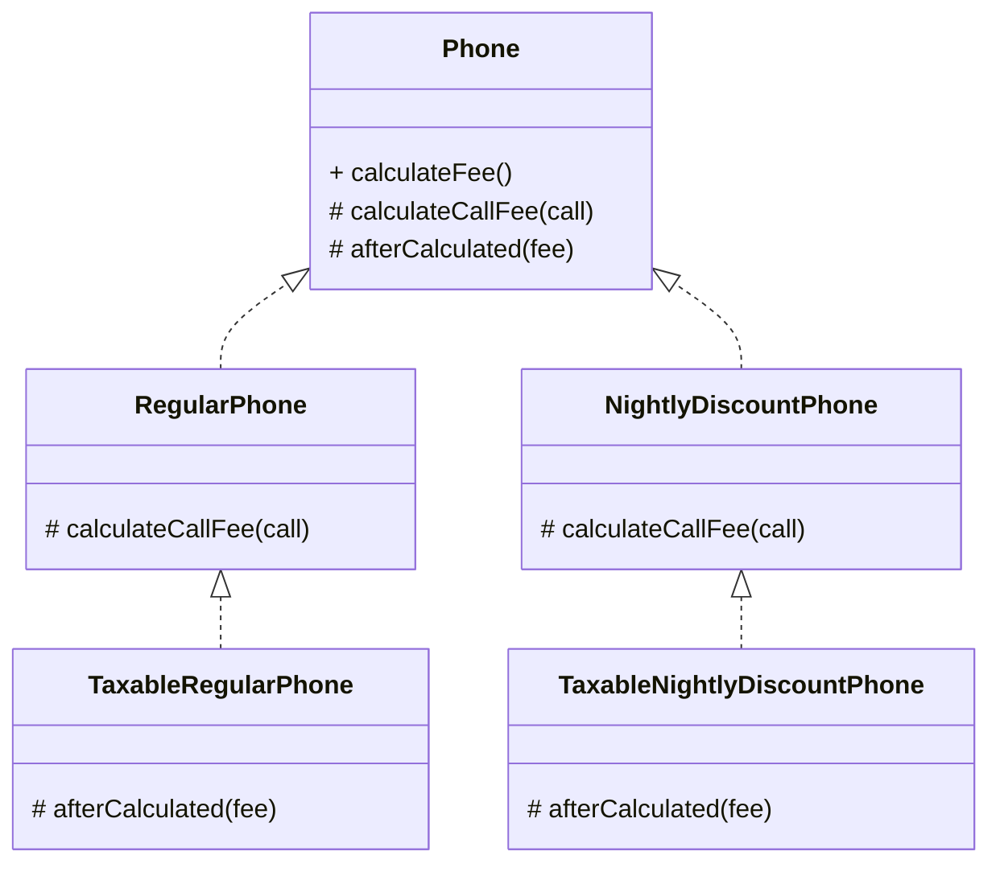
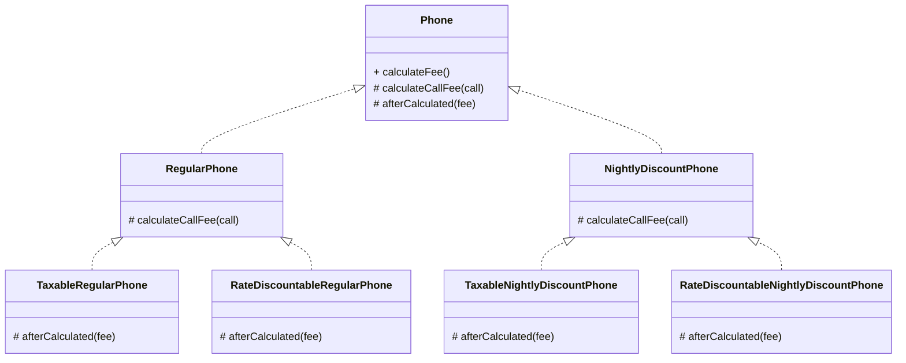
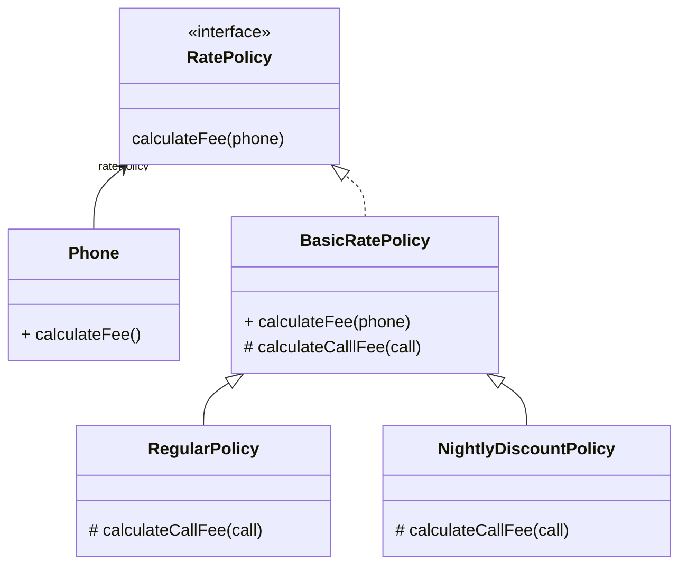
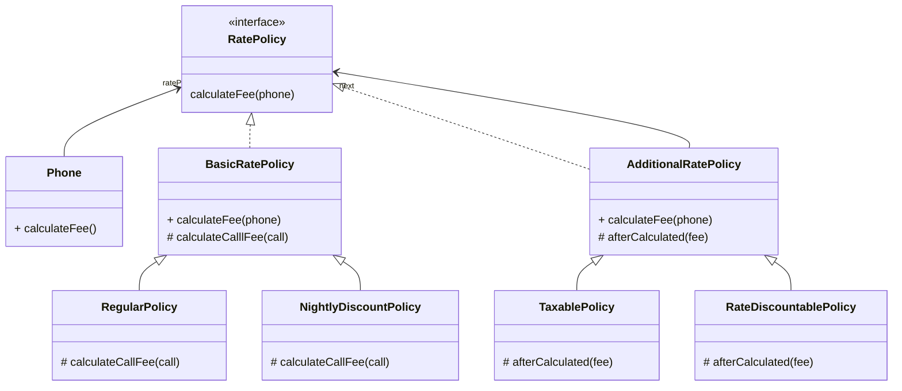
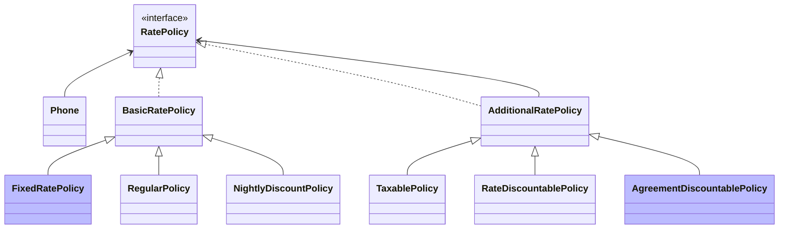

# 합성과 유연한 설계

#### 코드 재사용 기법

- 상속(is-a 관계), 화이트박스 재사용 (white-box reuse)
    - 부모 클래스와 자식 클래스를 연결해서 **부모 클래스의 코드를 재사용**
    - 부모와 자식 사이의 의존성은 컴파일타임에 해결 (정적인 관계)
    - 결합도
        - 부모 클래스의 내부 구현에 대해 상세하게 알아야 한다.
        - 자식 클래스와 부모 클래스 사이의 결합도가 높다.
- 합성(has-a 관계), 블랙박스 재사용 (black-box reuse)
    - 전체를 표현하는 객체가 부분을 표현하는 객체를 포함해서 부분 객체의 코드를 재사용
    - **객체의 퍼블릭 인터페이스를 재사용**
    - 두 객체 사이의 의존성은 런타임에 해결 (동적인 관계)
    - 결합도
        - 구현에 의존하지 않는다.
        - 포함되는 객체의 퍼블릭 인터페이스에 의존하기 때문에 포함된 객체의 내부 구현이 변경되어도 영향 최소화된다. → 변경에 더 안정적인 코드
    - 단점: 구현 관점에서 좀 더 번거롭고 복잡하다.

> **[코드 재사용을 위해서는] 객체 합성이 클래스 상속보다 더 좀은 방법이다[GOF94].**
> 

하지만 설계는 변경과 관련된 것!

변경에 유연하게 대처할 수 있는 설계가 대부분의경우에 정답일 가능성이 높다.

## 상속을 합성으로 변경하기

#### 코드 재사용을 위해 상속을 남용했을 때 직면할 수 있는 세 가지 문제점

1. 불필요한 인터페이스 상속 문제
    
    자식 클라스에게는 부적합한 부모 클래스의 오머레이션이 상속되기 때문에 자식 클래스 인스턴스의 상태가 불한정해지는 문제. (예: Properties, Stack)
    
2. 메서드 오버라이딩의 오작용 문제
    
    자식 클라스가 부모 클래스의 메서드를 오버라이딩할 때 자식 클래스가 부모 클래스의 메서드 호출 방법에 영향을 받는 문제. (예: HasSet, InstrumentedHashSet)
    
3. 부모 클래스와 자식 클래스의 동시 수정 문제
    
    부모 클래스와 자식 클래스 사이의 개념적인 결합으로 인해 부모 클래스를 변경할 때 자식 클래스도 함에 변경해야 하는 문제. (예: Playlist를 상속받은 PersonalPlaylist)
    

#### 상속을 합성으로 바꾸는 간단한 방법

1. 자식 클래스에 선언된 상속 관계 제거
2. 부모 클래스의 인스턴스를 자식 클래스의 인스턴스 변수로 선언

### 불필요한 인터페이스 상속 문제: Properties 와 Stack

#### Properties 변경

**변경 전 (상속)**

```java
public class Properties extends Hashtable<Object, Object> {
    // Hashtable의 모든 오퍼레이션 상속
}
```

**변경 후 (합성)**

```java
public class Properties {
		// Properties 클래스에서 상속 관계를 제거 
		// Hashtable을 Properties의 인스턴스 변수로 포함
    private Hashtable<String, String> properties = new Hashtable<>();

    public String setProperty(String key, String value) {
        return properties.put(key, value);
    }
    
    public String getProperty(String key) {
        return properties.get(key);
    }
}
```

- 불필요한 Hashtable 오퍼레이션들이 퍼블릭 인터페이스를 오염시키지 않음
- 클라이언트는 오직 Properties에서 정의한 오퍼레이션만 사용 가능
- String 타입의 키와 값만 허용하는 규칙을 어길 위험 사라짐
- Hashtable의 내부 구현에 관해 알지 못함
- get과 set 오퍼레이션이 포함된 퍼블릭 인터페이스를 통해서만 협력

---

#### Stack 변경

**변경 전 (상속)**

```java
public class Stack<E> extends Vector<E> {
    // Vector의 모든 오퍼레이션 상속
}
```

**변경 후 (합성)**

```java
public class Stack<E> {
    private Vector<E> elements = new Vector<>();
    
    public E push(E item) {
        elements.addElement(item);
        return item;
    }

    public E pop() {
        if (elements.isEmpty()) {
            throw new EmptyStackException();
        }
        return elements.remove(elements.size() - 1);
    }
}
```

- 불필요한 Vector 오퍼레이션들이 포함되지 않음
- 임의의 위치에 요소를 추가하거나 삭제할 수 없음
- 마지막 위치에서만 요소를 추가/삭제한다는 Stack의 규칙을 어길 수 없음
- 클라이언트가 Stack을 잘못 사용할 가능성 제거

### 메서드 오버라이딩의 오작용 문제: InstrumentedHashSet

```java
public class InstrumentedHashSet<E> {
	private int addCount = 0;
	private Set<E> set;
	
	// HashSet 인스턴스를 내부에 포함한 후 
	// HashSet의 퍼블릭 인터페이스에서 제공하는 오퍼레이션들을 이용해 필요한 기능을 구현
	public InstrumentedHashSet(Set<E> set) {
	    this.set = set;
	}
	
	public boolean add(E e) {
	    addCount++;
	    return set.add(e);
	}
	
	public boolean addAll(Collection<? extends E> c) {
	    addCount += c.size();
	    return set.addAll(c);
	}
	
	public int getAddCount() {
	    return addCount;
	}
}
```

**문제**

- Properties와 Stack은 불필요한 오퍼레이션을 제거하는 것이 목적
- InstrumentedHashSet은 HashSet의 퍼블릭 인터페이스를 그대로 제공해야 한다.

**해결**

- HashSet은 Set 인터페이스를 실체화하는 구현체 중 하나
- InstrumentedHashSet이 제공해야 하는 모든 오퍼레이션은 Set 인터페이스에 정의돼 있다.
- Set 인터페이스를 실체화하면서 내부에 HashSet 인스턴스를 합성

```java
public class InstrumentedHashSet<E> implements Set<E> {
	private int addCount = 0;
	private Set<E> set;
	
	public InstrumentedHashSet(Set<E> set) {
	    this.set = set;
	}
	
	@Override
	public boolean add(E e) {
	    addCount++;
	    return set.add(e);
	}
	
	@Override
	public boolean addAll(Collection<? extends E> c) {
	    addCount += c.size();
	    return set.addAll(c);
	}
	
	public int getAddCount() {
	    return addCount;
	}
	
	// 나머지 Set 인터페이스 메서드들
	@Override public boolean remove(Object o) { return set.remove(o); }
	@Override public void clear() { set.clear(); }
	@Override public boolean equals(Object o) { return set.equals(o); }
	@Override public int hashCode() { return set.hashCode(); }
	@Override public int size() { return set.size(); }
	@Override public boolean isEmpty() { return set.isEmpty(); }
	@Override public boolean contains(Object o) { return set.contains(o); }
	@Override public Iterator<E> iterator() { return set.iterator(); }
	...
}
```

⇒ 결합도는 제거하면서 퍼블릭 인터페이스는 그대로 유지

---

#### 포워딩 (Forwarding)

Set의 오퍼레이션을 오버라이딩한 인스턴스 메서드에서 내부의 HashSet 인스턴스에게 동일한 메서드 호출을 그대로 전달하는 것.

기존 클래스의 인터페이스를 그대로 외부에 제공하면서 구현에 대한 결합 없이 일부 작동 방식을 변경하고 싶은 경우에 사용할 수 있는 기법

- 포워딩 메서드 (Forwarding Method): 동일한 메서드를 호출하기 위해 추가된 메서드

### 부모 클래스와 자식 클래스의 동시 수정 문제: PersonalPlaylist

합성으로 변경

```java
public class PersonalPlaylist {
    private Playlist playlist = new Playlist();

    public void append(Song song) {
        playlist.append(song);
    }
    
    public void remove(Song song) {
        playlist.getTracks().remove(song);
        playlist.getSingers().remove(song.getSinger());
    }
}
```

여전히 남는 문제

- 가수별 노래 목록을 유지하기 위해 Playlist와 PersonalPlaylist를 함께 수정해야 함

그래도 합성이 더 나은 이유

- 향후 Playlist의 내부 구현을 변경하더라도 파급효과를 최대한 PersonalPlaylist 내부로 캡슐화 할 수 있기 때문
- 대부분의 경우 구현에 대한 결합보다는 인터페이스에 대한 결합이 더 좋다.

## 상속으로 인한 조합의 폭발적인 증가

작은 기능들을 조합해서 더 큰 기능을 수행하는 객체를 만들어야 하는 경우, 상속으로 인해 결합도가 높아지면 코드를 수정하는 데 필요한 작업의 양이 과도하게 늘어나는 경향이 있다.

**문제점**

1. 하나의 기능을 추가하거나 수정하기 위해 불필요하게 많은 수의 클래스를 추가하거나 수정해야 한다
2. 단일 상속만 지원하는 언어에서는 상속으로 인해 오히려 중복 코드의 양이 늘어날 수 있다

합성을 사용하면 상속으로 인해 발생하는 클래스의 증가와 중복 코드 문제를 간단하게 해결할 수 있다. 

### 기본 정책과 부가 정책 조합하기

#### 기본 정책 (가입자의 한달 통화량을 기준으로 부과)

- 일반 요금제
- 심야 할인 요금제


#### 부가 정책 (기본 정책에 선택적으로 추가할 수 있는 요금 방식)

- 세금 정책
- 기본 요금 할인 정책


- 부가 정책의 특성
    
    1. 기본 정책의 계산 결과에 적용된다
    
    - 세금 정책은 RegularPhone이나 NightlyDiscountPhone의 계산이 끝난 결과에 세금을 부과한다.
    
    2. 선택적으로 적용할 수 있다
    
    - 기본 정책의 계산 결과에 세금 정책을 적용할 수도, 적용하지 않을 수도 있다.
    
    3. 조합 가능하다
    
    - 세금 정책만 적용 가능
    - 기본 요금 할인 정책만 적용 가능
    - 세금 정책과 기본 요금 할인 정책을 함께 적용 가능
    
    4. 부가 정책은 임의의 순서로 적용 가능하다
    
    - 세금 정책 → 기본 요금 할인 정책
    - 기본 요금 할인 정책 → 세금 정책
- 기본 정책과 부가 정책을 조합해서 만들 수 있는 모든 요금 정책의 종류
    
    ```
    01. 일반 요금제
    02. 심야 할인 요금제
    03. 일반 요금제 + 세금 정책
    04. 심야 할인 요금제 + 세금 정책
    05. 일반 요금제 + 기본 요금 할인 정책
    06. 심야 할인 요금제 + 기본 요금 할인 정책
    07. 일반 요금제 + 기본 요금 할인 정책 + 세금 정책
    08. 심야 할인 요금제 + 기본 요금 할인 정책 + 세금 정책
    09. 일반 요금제 + 세금 정책 + 기본 요금 할인 정책
    10. 심야 할인 요금제 + 세금 정책 + 기본 요금 할인 정책
    ```
    
    - 기본 정책과 부가 정책의 조합 가능한 수가 매우 많기 때문에 설계는 다양한 조합을 수용할 수 있도록 유연해야 한다.

### 상속을 이용해서 기본 정책 구현하기

10장에서 구현한 Phone 상속 계층을 그대로 옮겨온 것

```java
public abstract class Phone {
    private List<Call> calls = new ArrayList<>();
    
    public Money calculateFee() {
        Money result = Money.ZERO;
        
        for(Call call : calls) {
            result = result.plus(calculateCallFee(call));
        }
        return result;
    }

    abstract protected Money calculateCallFee(Call call);
}
```

```java
public class RegularPhone extends Phone {
    private Money amount;
    private Duration seconds;
    
    public RegularPhone(Money amount, Duration seconds) {
        this.amount = amount;
        this.seconds = seconds;
    }
    
    @Override
    protected Money calculateCallFee(Call call) {
        return amount.times(call.getDuration().getSeconds() / seconds.getSeconds());
    }
}
```

```java
public class NightlyDiscountPhone extends Phone {
    private static final int LATE_NIGHT_HOUR = 22;
    
    private Money nightlyAmount;
    private Money regularAmount;
    private Duration seconds;
    
    public NightlyDiscountPhone(Money nightlyAmount, Money regularAmount, 
                                Duration seconds) {
        this.nightlyAmount = nightlyAmount;
        this.regularAmount = regularAmount;
        this.seconds = seconds;
    }
    
    @Override
    protected Money calculateCallFee(Call call) {
        if (call.getFrom().getHour() >= LATE_NIGHT_HOUR) {
            return nightlyAmount.times(
                call.getDuration().getSeconds() / seconds.getSeconds()
            );
        }
        return regularAmount.times(
            call.getDuration().getSeconds() / seconds.getSeconds()
        );
    }
}
```

RegularPhone과 NightlyDiscountPhone의 인스턴스만 단독으로 생성한다는 것은 부가 정책은 적용하지
않고 오직 기본 정책만으로 요금을 계산한다는 것을 의미한다.

### 기본 정책에 세금 정책 조합하기

#### 첫 번째 시도: super 호출 사용

가장 간단한 방법

- RegularPhone 클래스를 상속받은 TaxableRegularPhone 클래스를 추가
- TaxableRegularPhone 클래스는 부모 클래스의 calculateFee 메서드를 오버라이딩
- super 호출을 통해 부모 클래스에게 calculateFee 메시지를 전송

```java
public class TaxableRegularPhone extends RegularPhone {
    private double taxRate;
    
    public TaxableRegularPhone(Money amount, Duration seconds, double taxRate) {
        super(amount, seconds);
        this.taxRate = taxRate;
    }

    @Override
    public Money calculateFee() {
		    // RegularPhone.calculateFee(): 일반 요금제 규칙에 따라 계산된 요금 반환
        Money fee = super.calculateFee();
        
        // 계산된 요금에 세금 부과
        return fee.plus(fee.times(taxRate));
    }
}
```

**문제점:** super 호출 사용 → 자식 클래스와 부모 클래스 사이의 결합도 높아짐

---

#### 개선: 추상 메서드를 통한 결합도 낮추기

자식 클래스가 부모 클래스의 메서드를 호출하지 않도록 부모 클래스에 추상 메서드를 추가한다.

```java
public abstract class Phone {
    private List<Call> calls = new ArrayList<>();
    
    public Money calculateFee() {
        Money result = Money.ZERO;
        
        for(Call call : calls) {
            result = result.plus(calculateCallFee(call));
        }
        return afterCalculated(result);  // 추가
    }
    
    protected abstract Money calculateCallFee(Call call);
    protected abstract Money afterCalculated(Money fee);  // 추상 메서드 추가
}
```

```java
public class RegularPhone extends Phone {
    @Override
    protected Money calculateCallFee(Call call) {
        return amount.times(call.getDuration().getSeconds() / seconds.getSeconds());
    }
    
    // 추상 메서드 구현
    @Override
    protected Money afterCalculated(Money fee) {
        return fee;
    }
}
```

```java
public class NightlyDiscountPhone extends Phone {
	...
	
	// 추상 메서드 구현
	@Override
	protected Money afterCalculated(Money fee) {
		return fee:
	}
}
```

**문제점**

- 모든 자식 클래스가 추상 메서드를 오버라이딩해야 함
- 자식 클래스 수가 많으면 번거로움
- 모든 구현이 동일함 (중복 코드)

---

#### 최종 개선: 훅 메서드 사용

유연성은 유지하면서도 중복 코드를 제거할 수 있는 방법 

```java
public abstract class Phone {
    ...
    
    // 기본 구현 제공
    protected Money afterCalculated(Money fee) {
        return fee;
    }

    protected abstract Money calculateCallFee(Call call);
}
```

**훅 메서드 (Hook Method)**

- 추상 메서드와 동일하게 자식 클래스에서 오버라이딩할 의도로 추가
- 편의를 위해 기본 구현을 제공
- 자식 클래스는 필요할 때만 오버라이딩

---

#### 세금 정책 적용

```java
// RegularPhone이 계산한 요금에 세금 부과
public class TaxableRegularPhone extends RegularPhone {
    private double taxRate;
    
    public TaxableRegularPhone(Money amount, Duration seconds, double taxRate) {
        super(amount, seconds);
        this.taxRate = taxRate;
    }

		// afterCalculated 메서드를 오버라이딩한 후 fee에 세금을 더해서 반환
    @Override
    protected Money afterCalculated(Money fee) {
        return fee.plus(fee.times(taxRate));
    }
}
```

```java
public class TaxableNightlyDiscountPhone extends NightlyDiscountPhone {
    private double taxRate;
    
    public TaxableNightlyDiscountPhone(Money nightlyAmount, Money regularAmount,
                                       Duration seconds, double taxRate) {
        super(nightlyAmount, regularAmount, seconds);
        this.taxRate = taxRate;
    }

    @Override
    protected Money afterCalculated(Money fee) {
        return fee.plus(fee.times(taxRate));
    }
}
```



**문제점**

- TaxableRegularPhone과 TaxableNightlyDiscountPhone 사이에 코드 중복
- 부모 클래스 이름 제외하면 거의 동일한 코드
- 단일 상속만 지원하는 언어에서는 중복 코드 문제 해결이 쉽지 않음

### 기본 정책에 기본 요금 할인 정책 조합하기

기본 요금 할인 정책: 매달 청구되는 요금에서 고정된 요금을 차감하는 부가 정책

```java
// 일반 요금제와 기본 요금 할인 정책을 조합
public class RateDiscountableRegularPhone extends RegularPhone {
    private Money discountAmount;
    
    public RateDiscountableRegularPhone(Money amount, Duration seconds, 
                                        Money discountAmount) {
        super(amount, seconds);
        this.discountAmount = discountAmount;
    }
    
    @Override
    protected Money afterCalculated(Money fee) {
        return fee.minus(discountAmount);
    }
}
```

```java
// 심야 할인 요금제와 기본 요금 할인 정책을 조합
public class RateDiscountableNightlyDiscountPhone extends NightlyDiscountPhone {
    private Money discountAmount;
    
    public RateDiscountableNightlyDiscountPhone(Money nightlyAmount, Money regularAmount,
                                                Duration seconds, Money discountAmount) {
        super(nightlyAmount, regularAmount, seconds);
        this.discountAmount = discountAmount;
    }
    
    @Override
    protected Money afterCalculated(Money fee) {
        return fee.minus(discountAmount);
    }
}
```



어떤 클래스를 선택하느냐에 따라 적용하는 요금제의 조합이 결정된다.

**문제점**

- RateDiscountableRegularPhone과 RateDiscountableNightlyDiscountPhone 사이에 코드 중복

### 중복 코드의 덫에 걸리다

#### 요구사항

- 세금 정책과 기본 요금 할인 정책을 함께 적용
- 적용 순서도 임의로 결정 가능

상속을 이용해서 해결하려면 모든 가능한 조합별로 자식 클래스를 하나씩 추가해야 한다.

#### 세금 정책 → 기본 요금 할인 정책

```java
public class TaxableAndRateDiscountableRegularPhone extends TaxableRegularPhone {
    private Money discountAmount;

    public TaxableAndRateDiscountableRegularPhone(Money amount, Duration seconds,
                                                   double taxRate, Money discountAmount) {
        super(amount, seconds, taxRate);
        this.discountAmount = discountAmount;
    }
    
    @Override
    protected Money afterCalculated(Money fee) {
        return super.afterCalculated(fee).minus(discountAmount);
    }
}
```

#### 기본 요금 할인 정책 → 세금 정책

```java
public class RateDiscountableAndTaxableRegularPhone 
    extends RateDiscountableRegularPhone {
    private double taxRate;

    public RateDiscountableAndTaxableRegularPhone(Money amount, Duration seconds,
                                                   Money discountAmount, double taxRate) {
        super(amount, seconds, discountAmount);
        this.taxRate = taxRate;
    }
    
    @Override
    protected Money afterCalculated(Money fee) {
        return super.afterCalculated(fee).plus(fee.times(taxRate));
    }
}
```

#### 심야 할인 요금제에도 동일하게 적용

```java
public class TaxableAndDiscountableNightlyDiscountPhone 
    extends TaxableNightlyDiscountPhone {
    private Money discountAmount;
    
    public TaxableAndDiscountableNightlyDiscountPhone(Money nightlyAmount,
            Money regularAmount, Duration seconds, double taxRate, Money discountAmount) {
        super(nightlyAmount, regularAmount, seconds, taxRate);
        this.discountAmount = discountAmount;
    }

    @Override
    protected Money afterCalculated(Money fee) {
        return super.afterCalculated(fee).minus(discountAmount);
    }
}
```

```java
public class RateDiscountableAndTaxableNightlyDiscountPhone
    extends RateDiscountableNightlyDiscountPhone {
    private double taxRate;
    
    public RateDiscountableAndTaxableNightlyDiscountPhone(Money nightlyAmount, 
            Money regularAmount, Duration seconds, Money discountAmount, double taxRate) {
        super(nightlyAmount, regularAmount, seconds, discountAmount);
        this.taxRate = taxRate;
    }
    
    @Override
    protected Money afterCalculated(Money fee) {
        return super.afterCalculated(fee).plus(fee.times(taxRate));
    }
}

```

```java
Phone
├── RegularPhone
│   ├── TaxableRegularPhone
│   │   └── TaxableAndRateDiscountableRegularPhone
│   └── RateDiscountableRegularPhone
│       └── RateDiscountableAndTaxableRegularPhone
└── NightlyDiscountPhone
    ├── TaxableNightlyDiscountPhone
    │   └── TaxableAndRateDiscountableNightlyDiscountPhone
    └── RateDiscountableNightlyDiscountPhone
        └── RateDiscountableAndTaxableNightlyDiscountPhone
```

문제점: 새로운 정책을 추가하기가 어렵다.
새로운 정책을 추가하기 위해서는 불필요하게 많은 수의 클래스를 상속 계층 안에 추가해야 한다.

---

#### 새로운 기본 정책 추가: FixedRatePhone

“모든 부가 정책은 기본 정책에 적용 가능해야 하며 조합 순서 역시 자유로워야 한다.”

추가해야 할 클래스

1. FixedRatePhone
2. TaxableFixedRatePhone
3. RateDiscountableFixedRatePhone
4. TaxableAndRateDiscountableFixedRatePhone
5. RateDiscountableAndTaxableFixedRatePhone

하나의 기본 정책을 추가하기 위해 5개의 새로운 클래스 필요!

---

#### 새로운 부가 정책 추가

약정 할인 정책: 개통 후 일정 기간 동안 요금 일부를 할인

고려해야 할 조합

- 각 기본 정책(3개)에 대해
    - 약정 할인 정책 단독
    - 약정 할인 + 세금
    - 약정 할인 + 기본 요금 할인
    - 약정 할인 + 세금 + 기본 요금 할인
    - ...

> **클래스 폭발(class explosion)**
상속의 남용으로 하나의 기능을 추가하기 위해 필요 이상으로 많은 수의 클래스를 추가
해야 하는 경우를 가리켜 클래스 폭발(class explosion)[Shalloway01] 문제 또는 조합의 폭발
(combinational explosion) 문제라고 부른다.
클래스 폭발 문제는 자식 클래스가 부모 클래스의 구현에 강하계 결합되도록 강요하는 상속의 근본적인 한계 때문에 발생하는 문제다.
> 

컴파일타임에 결정된 자식 클래스와 부모 클래스 사이의 관계는 변경될 수 없기 때문에 자식 클래스와 부모 클래스의 다양한 조합이 필요한 상황에서 유일한 해결 방법은 조합의 수만큼 새로운 클래스를 추가하는 것뿐이다.

클래스 폭발 문제는 새로운 기능을 추가할 때뿐만 아니라 기능을 수정할 때도 문제가 된다. 

만약 세금 정책을 변경해야 한다면? 

⇒ 세금 정책과 관련된 코드가 여러 클래스 안에 중복돼 있기 때문에 세금 정책과 관련된 모든 클래스를 찾아 동일한 방식으로 수정해야 한다.

## 합성 관계로 변경하기

합성은 컴파일타임 관계를 런타임 관계로 변경함으로써 상속의 문제를 해결한다. 

- 상속: 조합의 결과를 개별 클래스 안으로 밀어 넣는 방법
- 합성: 조합을 구성하는 요소들을 개별 클래스로 구현 후 실행 시점에 인스턴스를 조립
    - 장점
        - 구현이 아닌 퍼블릭 인터페이스에만 의존 → 런타임에 객체의 관계를 변경 가능
            - 컴파일타임 의존성과 런타임 의존성의 거리가 멀수록 설계가 유연해진다.
            - 클래스 폭발 문제를 해결하기 위해 합성을 사용하는 이유는 런타임에 객체 사이의 의존성을 자유롭게 변경 가능하기 때문
    - 단점
        - 복잡성의 증가
            - 컴파일타임 의존성과 런타임 의존성의 거리가 멀수록 설계 복잡도 상승
            - 코드 이해가 어려워질 수 있음

#### 설계는 변경과 유지보수를 위해 존재, 설계는 트레이드오프의 산물

대부분의 경우 단순한 설계가 정답이지만 변경에 따르는 고통이 복잡성으로 인한 혼란을 넘어선다면 유연성의 손을 들어주는 것이 현명하다. 

### 기본 정책 합성하기

핸드폰이라는 개념으로부터 요금 계산 방법이라는 개념을 분리

---

#### RatePolicy 인터페이스 추가

```java
public interface RatePolicy {
    Money calculateFee(Phone phone);
}
```

- 기본 정책과 부가 정책을 포괄
- Phone을 인자로 받아 계산된 요금을 반환

---

#### BasicRatePolicy 추상 클래스

```java
public abstract class BasicRatePolicy implements RatePolicy {

    @Override
    public Money calculateFee(Phone phone) {
        Money result = Money.ZERO;
        
        for(Call call : phone.getCalls()) {
            result.plus(calculateCallFee(call));
        }
        return result;
    }
    
    protected abstract Money calculateCallFee(Call call);
}
```

- 일반 요금제와 심야 할인 요금제의 공통 로직 포함
- 자식 클래스는 calculateCallFee를 오버라이딩해서 자신만의 방식으로 Call의 요금을 계산

---

#### 요금제 추가

```java
public class RegularPolicy extends BasicRatePolicy {
    private Money amount;
    private Duration seconds;
    
    public RegularPolicy(Money amount, Duration seconds) {
        this.amount = amount;
        this.seconds = seconds;
    }
    
    @Override
    protected Money calculateCallFee(Call call) {
        return amount.times(call.getDuration().getSeconds() / seconds.getSeconds());
    }
}
```

```java
public class NightlyDiscountPolicy extends BasicRatePolicy {
    private static final int LATE_NIGHT_HOUR = 22;
    
    private Money nightlyAmount;
    private Money regularAmount;
    private Duration seconds;
    
    public NightlyDiscountPolicy(Money nightlyAmount, Money regularAmount, 
                                 Duration seconds) {
        this.nightlyAmount = nightlyAmount;
        this.regularAmount = regularAmount;
        this.seconds = seconds;
    }
    
    @Override
    protected Money calculateCallFee(Call call) {
        if (call.getFrom().getHour() >= LATE_NIGHT_HOUR) {
            return nightlyAmount.times(
                call.getDuration().getSeconds() / seconds.getSeconds()
            );
        }
        return regularAmount.times(
            call.getDuration().getSeconds() / seconds.getSeconds()
        );
    }
}
```

---

#### Phone 수정: 합성 사용

```java
public class Phone {
    private RatePolicy ratePolicy;
    private List<Call> calls = new ArrayList<>();
    
    public Phone(RatePolicy ratePolicy) {
        this.ratePolicy = ratePolicy;
    }
    
    public List<Call> getCalls() {
        return Collections.unmodifiableList(calls);
    }
    
    public Money calculateFee() {
        return ratePolicy.calculateFee(this);
    }
}
```

- 합성: Phone 내부에 RatePolicy에 대한 참조자 포함
    - 인터페이스 타입: 다양한 요금 정책과 협력 가능
- 일반적으로 다양한 종류의 객체와 협력하기 위해 합성 관계 사용 시, 합성하는 객체의 타입을 인터페이스나 추상 클래스로 선언하고 의존성 주입을 사용해 런타임에 필요한 객체 설정한다.

---

#### 사용 예시

```java
// 일반 요금제
Phone phone = new Phone(new RegularPolicy(Money.wons(10), Duration.ofSeconds(10)));
```

```java
// 심야 할인 요금제
Phone phone = new Phone(new NightlyDiscountPolicy(Money.wons(5),
									Money.wons(10), Duration.ofSeconds(19)));
```

---



### 부가 정책 적용하기

- 부가 정책은 기본 정책에 대한 계산이 끝난 후에 적용된다.
    - 일반 요금제에 세금 정책이 추가된다면?
        
        ```mermaid
        flowchart LR
        	A["phone:Phone"] --calculateFee(phone)--> B[":TaxablePolicy"] 
        	B --calculateFee(phone)--> C[":RegularPolicy"]
        
        	
        	    
          
        
        ```
        
    - 일반 요금제에 기본 요금 할인 정책을 적용한 후에 세금 정책을 적용해야 한다면?
        
        ```mermaid
        flowchart LR
        	A["phone:Phone"] --calculateFee(phone)--> B[":TaxablePolicy"] 
        	B --calculateFee(phone)--> C["'RateDiscountablePolicy"]
        	C --calculateFee(phone)--> D[":RegularPolicy"]
        
        	
        	    
          
        
        ```
        

#### 부가 정책의 두 가지 제약

- 부가 정책은 기본 정책이나 다른 부가 정책의 인스턴스를 참조할 수 있어야 한다.
    - 부가 정책의 인스턴스는 어떤 종류의 정책과도 합성될 수 있어야 한다.
- Phone의 입장에서는 자신이 기본 정책의 인스턴스에게 메시지를 전송하고 있는지, 부가 정책의 인스턴스에게 메시지를 전송하고 있는지 몰라야 한다.
    - 기본 정책과 부가 정책은 협력 안에서 동일한 '역할'을 수행해야 한다.
        
        ⇒ 부가 정책이 기본 정책과 동일한 RatePolicy 인터페이스를 구현해야 한다.
        

부가 정책은 RatePolicy 인터페이스를 구현해야 하며, 내부에 또 다른 RatePolicy 인스턴스를 합성할 수 있어야 한다.

---

#### AdditionalRatePolicy 추상 클래스

```java
public abstract class AdditionalRatePolicy implements RatePolicy {
    private RatePolicy next;
    
    public AdditionalRatePolicy(RatePolicy next) {
        this.next = next;
    }

    @Override
    public Money calculateFee(Phone phone) {
		    // 1. next가 참조하는 인스턴스에게 calculateFee 메시지 전송
        Money fee = next.calculateFee(phone);
        
        // 2. 반환된 요금에 부가 정책 적용
        return afterCalculated(fee);
    }

    abstract protected Money afterCalculated(Money fee);
}
```

- RatePolicy 인터페이스 구현: Phone 입장에서 RatePolicy 역할 수행
- RatePolicy 타입의 next 변수: 다른 요금 정책과 조합 가능
- 훅 메서드: `afterCalculated()`를 자식 클래스에서 오버라이딩하여 부가 정책 구현

---

#### TaxablePolicy: 세금 정책

```java
public class TaxablePolicy extends AdditionalRatePolicy {
    private double taxRatio;
    
    public TaxablePolicy(double taxRatio, RatePolicy next) {
        super(next);
        this.taxRatio = taxRatio;
    }
    
    @Override
    protected Money afterCalculated(Money fee) {
        return fee.plus(fee.times(taxRatio));
    }
}
```

---

#### 기본 요금 할인 정책

```java
public class RateDiscountablePolicy extends AdditionalRatePolicy {
    private Money discountAmount;

    public RateDiscountablePolicy(Money discountAmount, RatePolicy next) {
        super(next);
        this.discountAmount = discountAmount;
    }
    
    @Override
    protected Money afterCalculated(Money fee) {
        return fee.minus(discountAmount);
    }
}
```

---



### 기본 정책과 부가 정책 합성하기

#### 일반 요금제 + 세금 정책

```java
Phone phone = new Phone(
    new TaxablePolicy(0.05,
        new RegularPolicy(...)
    )
);
```

#### 일반 요금제 + 기본 요금 할인 +세금 정책

```java
Phone phone = new Phone(
    new TaxablePolicy(0.05,
        new RateDiscountablePolicy(Money.wons(1000),
            new RegularPolicy(...)
        )
    )
);
```

#### 일반 요금제 + 세금 정책 +  기본 요금 할인

```java
Phone phone = new Phone(
    new RateDiscountablePolicy(Money.wons(1000),
        new TaxablePolicy(0.05,
            new RegularPolicy(...)
        )
    )
);
```

#### 심야 할인 요금제 + 세금 정책 +  기본 요금 할인

```java
Phone phone = new Phone(
    new RateDiscountablePolicy(Money.wons(1000),
        new TaxablePolicy(0.05,
            new NightlyDiscountPolicy(...)
        )
    )
);
```

---

처음에는 상속보다 복잡해 보인다.

- 정해진 규칙에 따라 객체를 생성하고 조합해야 함
- 코드 이해가 어려울 수 있음

익숙해지면

- 객체 조합과 사용 방식이 더 예측 가능
- 일관성이 있음
- 상속보다 훨씬 유연함

### 새로운 정책 추가하기

#### 요구 사항 

1. 고정 요금제 추가
2. 약정 할인 정책 추가



오직 하나의 클래스만 추가하고 런타임에 필요한 정책들을 조합해서 원하는 기능을 사용할 수 있다. 

요구사항 변경 되어도 오직 하나의 클래스만 수정하면 된다. → 단일 책임 원칙

### 객체 합성이 클래스 상속보다 더 좋은 방법이다

#### 상속의 문제점

- 부모 클래스의 세부적인 구현에 자식 클래스를 강하게 결합
- 코드의 진화를 방해
- 구현을 재사용

---

#### 합성의 장점

- **건전한 결합도 유지**
- 코드 재사용 가능
- 객체의 인터페이스를 재사용

---

#### 그렇다면 상속을 사용해야 하는 경우는 언제인가? 

상속의 두 가지 종류

1. 구현 상속: 이번 장에서 다룬 모든 단점이 해당
2. 인터페이스 상속: 다른 특성을 가짐 (13장)

## 믹스인**(mixin)**

- 객체를 생성할 때 코드 일부를 클래스 안에 섞어 넣어 재사용하는 기법
- 컴파일 시점에 필요한 코드 조각을 조합하는 재사용 방법

**합성과의 비교**

- 합성: 실행 시점에 객체를 조합하는 재사용 방법
- 믹스인: 컴파일 시점에 코드 조각을 조합하는 재사용 방법

---

#### 믹스인 vs 상속

**상속의 목적**

- is-a 관계
    - 자식 클래스를 부모 클래스와 동일한 개념적인 범주로 묶음
- 클래스와 클래스 사이의 관계를 고정

**믹스인의 목적**

- **코드 재사용**
    - 말 그대로 코드를 다른 코드 안에 섞어 넣기 위한 방법
    - 클래스와 클래스 사이의 관계를 유연하게 재구성 가능
- 합성처럼 유연하면서도 상속처럼 쉽게 코드 재사용 가능
    - 상속과 같은 결합도 문제를 초래하지 않음

### 기본 정책 구현하기

기본 정책을 구현한 후 부가 정책과 관련된 코드를 기본 정책에 믹스인

---

#### BasicRatePolicy 추상 클래스

```scala
abstract class BasicRatePolicy {
    def calculateFee(phone: Phone): Money =
        phone.calls.map(calculateCallFee(_)).reduce(_ + _)

    protected def calculateCallFee(call: Call): Money;
}
```

#### RegularPolicy: 표준 요금제

```scala
class RegularPolicy(val amount: Money, val seconds: Duration) 
    extends BasicRatePolicy {
    
    override protected def calculateCallFee(call: Call): Money =
        amount * (call.duration.getSeconds / seconds.getSeconds)
}
```

- BasicRatePolicy를 상속
- calculateCallFee 메서드를 오버라이딩

#### NightlyDiscountPolicy: 심야 할인 요금제

```scala
class NightlyDiscountPolicy(
    val nightlyAmount: Money,
    val regularAmount: Money,
    val seconds: Duration) extends BasicRatePolicy {
    
    override protected def calculateCallFee(call: Call): Money =
        if (call.from.getHour >= NightlyDiscountPolicy.LateNightHour) {
            nightlyAmount * (call.duration.getSeconds / seconds.getSeconds)
        } else {
            regularAmount * (call.duration.getSeconds / seconds.getSeconds)
        }
}

object NightlyDiscountPolicy {
    val LateNightHour: Integer = 22
}
```

### 트레이트로 부가 정책 구현하기

스칼라에서는 다른 코드와 조합해서 확장할 수 있는 기능을 트레이트로 구현할 수 있다. 

트레이트로 구현된 기능들을 섞어 넣게될 대상: `RegularPolicy`, `NightlyDiscountPolicy`

#### TaxablePolicy 트레이트

```scala
trait TaxablePolicy extends BasicRatePolicy {
    def taxRate: Double
    
    override def calculateFee(phone: Phone): Money = {
        val fee = super.calculateFee(phone)
        return fee + fee * taxRate
    }
}
```

**특징**

1. extends BasicRatePolicy?
    - 상속 ❌
    - 사용 가능한 문맥을 제한 ⭕
        - TaxablePolicy가 BasicRatePolicy나 그 자손에게만 믹스인될 수 있다는 의미
2. super 호출의 동적 바인딩
    - BasicRatePolicy의 calculateFee를 먼저 실행
    - 그 후 자신의 처리 수행 (세금 부과)

---

**상속: 정적**

- 부모 클래스와 자식 클래스의 관계를 코드 작성 시점에 고정
- 컴파일타임에 관계 결정

**믹스인: 동적**

- 제약만 둘 뿐 실제로 어떤 코드에 믹스인될지 결정하지 않음
- 트레이트를 믹스인하는 시점에 가서야 대상 결정
- 부가 정책과 기본 정책 사이에 어떤 관계도 존재하지 않음
- 독립적으로 작성된 후 원하는 기능 구현을 위해 조합

---

> ❓super를 사용하는데 결합도가 높아지지 않나 ❓
> 

**상속의 경우**

- this 참조: 동적으로 결정 (런타임)
- super 참조: 컴파일 시점에 결정
- 부모 클래스와 자식 클래스 관계를 변경할 수 없음

**트레이트의 경우**

- 트레이트는 부모 클래스를 고정시키지 않는다.
    - this 호출: 실행 시점에 바인딩
    - super 호출: 실행 시점에 바인딩
        - super로 참조되는 코드가 고정되지 않음
        - 트레이트가 믹스인되는 시점에 결정
        - RegularPolicy에 믹스인: RegularPolicy의 calculateFee 호출
        - NightlyDiscountPolicy에 믹스인: NightlyDiscountPolicy의 calculateFee 호출

---

**상속은 재사용 가능한 문맥을 고정**

**트레이트는 문맥을 확장 가능하도록 열어 놓는다.**

**믹스인은 상속보다는 합성과 유사하다.**

- 합성: 독립적으로 작성된 객체들을 실행 시점에 조합
- 믹스인: 독립적으로 작성된 트레이트와 클래스를 코드 작성 시점에 조합

---

#### RateDiscountablePolicy 트레이트

```scala
trait RateDiscountablePolicy extends BasicRatePolicy {
    val discountAmount: Money
    
    override def calculateFee(phone: Phone): Money = {
        val fee = super.calculateFee(phone)
        fee - discountAmount
    }
}
```

### 부가 정책 트레이트 믹스인하기

#### 트레이트 조합 (Trait Composition)

- `extends`: 믹스인하려는 대상 클래스의 부모 클래스가 존재하는 경우, 부모 클래스 상속
- `with`: 트레이트 믹스인

---

#### 표준 요금제 + 세금 정책

```java
class TaxableRegularPolicy(
    amount: Money,
    seconds: Duration,
    val taxRate: Double)
extends RegularPolicy(amount, seconds)
with TaxablePolicy
```

스칼라는 특정 클래스에 믹스인한 클래스와 트레이트를 선형화(linearization)해서 어떤 메서드를 호출할지 결정한다.

---

#### 선형화(linearization)

- 특정 클래스에 믹스인한 클래스와 트레이트를 일렬로 나열해서 어떤 메서드를 호출할지 결정
    - 실행 중인 메서드 내부에서 super 호출을 하면 다음 단계에 위치한 클래스나 트레이트의 메서드가 호출
- 규칙
    1. 맨 앞: 구현한 클래스 자신
    2. 오른쪽에 선언된 트레이트를 그다음 자리에 위치
    3. 왼쪽 방향으로 가면서 순서대로 위치
    
    ```mermaid
    classDiagram
    	direction BT
    		RegularPolicy--|> BasicRatePolicy
    		TaxablePolicy--|> RegularPolicy
    		TaxableRegularPolicy--|> TaxablePolicy
    		
    		<<trait>> TaxablePolicy
      
    
    ```
    
- **calculateFee 메시지 전송 시**
    1. TaxableRegularPolicy: 메서드 없음 → 다음 단계
    2. TaxablePolicy: calculateFee 발견 → 실행
    3. 메서드 구현 안에 super 호출 → RegularPolicy로 이동
    4. RegularPolicy: calculateFee 없음 → BasicRatePolicy로 이동
    5. BasicRatePolicy: calculateFee 실행 → 표준 요금제로 계산
    6. 제어가 TaxablePolicy로 돌아옴
    7. super 이후 코드 실행 → 세금 부과 후 반환
- 믹스인되기 전까지는 TaxablePolicy의 위치가 결정되지 않음
- 어떤 클래스에 믹스인하느냐에 따라 동적으로 위치 변경

---

#### 심야 할인 요금제 + 기본 요금 할인 정책

```java
class RateDiscountableNightlyDiscountPolicy(
    nightlyAmount: Money,
    regularAmount: Money,
    seconds: Duration,
    val discountAmount: Money)
extends NightlyDiscountPolicy(nightlyAmount, regularAmount, seconds)
with RateDiscountablePolicy
```

---

#### 표준 요금제 + 세금 정책 + 기본 요금 할인 정책

1. RegularPolicy의 calculateFee 실행
2. TaxablePolicy 트레이트 적용
3. RateDiscountablePolicy 트레이트 적용

```
// 선형화 순서
RateDiscountableAndTaxableRegularPolicy
→ RateDiscountablePolicy
→ TaxablePolicy
→ RegularPolicy
→ BasicRatePolicy
```

```java
class RateDiscountableAndTaxableRegularPolicy(
    amount: Money,
    seconds: Duration,
    val discountAmount: Money,
    val taxRate: Double) 
extends RegularPolicy(amount, seconds)
with TaxablePolicy
with RateDiscountablePolicy
```

- 오른쪽부터 트레이트를 쌓아올림
- 맨 오른쪽에 RateDiscountablePolicy
- 그 왼쪽에 TaxablePolicy

---

#### 기본 요금 할인 정책 + 세금 정책

```java
class TaxableAndRateDiscountableRegularPolicy(
    amount: Money,
    seconds: Duration,
    val discountAmount: Money,
    val taxRate: Double)
extends RegularPolicy(amount, seconds)
with RateDiscountablePolicy
with TaxablePolicy
```

---

#### 믹스인의 장점

1. 편리한 코드 재사용과 확장
    - 재사용 가능한 코드를 독립적으로 작성
    - 필요한 곳에서 쉽게 조합
2. 클래스 폭발 문제 해결
    - 클래스 폭발 문제의 진짜 단점은
        - 클래스가 늘어나는 것 ❌
        - 클래스가 늘어날수록 중복 코드도 기하급수적으로 증가하는 것 ⭕
    - 믹스인의 경우
        - 중복 코드 문제가 발생하지 않음
        - 독립적인 트레이트로 구현하여 조합
3. 클래스 생성 없이 인스턴스에 직접 믹스인하고 싶다면?
    
    ```java
    new RegularPolicy(Money(100), Duration.ofSeconds(10))
        with RateDiscountablePolicy
        with TaxablePolicy {
        val discountAmount = Money(100)
        val taxRate = 0.02
    }
    ```
    
    - RateDisccuntablePolicy와 TaxablePolicy를 RegularPolicy에 믹스인한 인스턴스가 오직 한 군
    데에서만 필요한 경우에 사용.
    - 여러 곳에서 사용하는 경우엔 명시적으로 클래스 정의하는 것이 좋다.

### 쌓을 수 있는 변경

전통적인 믹스인은 특정 클래스의 메서드를 재사용하고 기능 확장하기 위해 사용돼 왔다. 

- 핸드폰 과금 시스템: BasicRatePolicy의 calculateFee 메서드 확장하기 위함.

---

믹스인은 상속 계층 안에서 확장한 클래스보다 더 하위에 위치하게 된다. 

즉, 대상 클래스의 자식 클래스처럼 사용될 용도로 만들어진다.

따라서 믹스인을 추상 **서브클래스(abstract subclass)**라고 부르기도 한다.

#### 마틴 오더스키(Martin Odersky)의 쌓을 수 있는 변경(stackable modification)

> 스칼라에서 트레이트는 코드 재사용의 근간을 이루는 단위다. 
... 클래스와 트레이트의 또 다른 차이는 클래스에서는 super 호출을 정적으로 바인딩하지만, 트레이트에서는 동적으로 바민딩한다는 것이다. 
… super가 이렇게 동작하기 때문에 트레이트를 이용해 변경 위에 변경을 쌓아 올리는 쌓을 수 있는 변경이 가능해진다[Odersky11].
> 
- 특정 클래스에 대한 변경/확장을 독립적으로 구현
- 필요한 시점에 차례대로 추가
- 변경을 계층적으로 쌓아올릴 수 있음