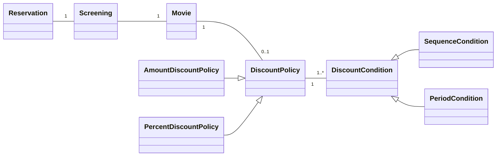
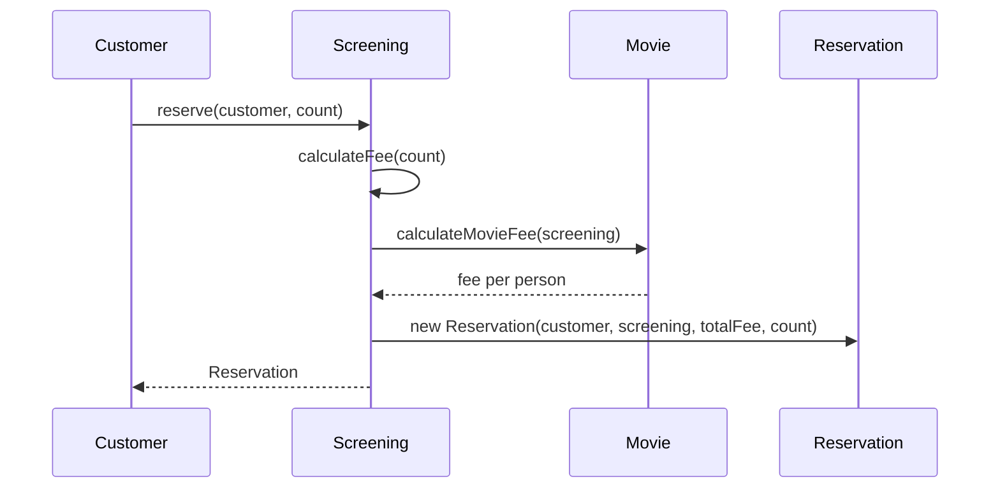
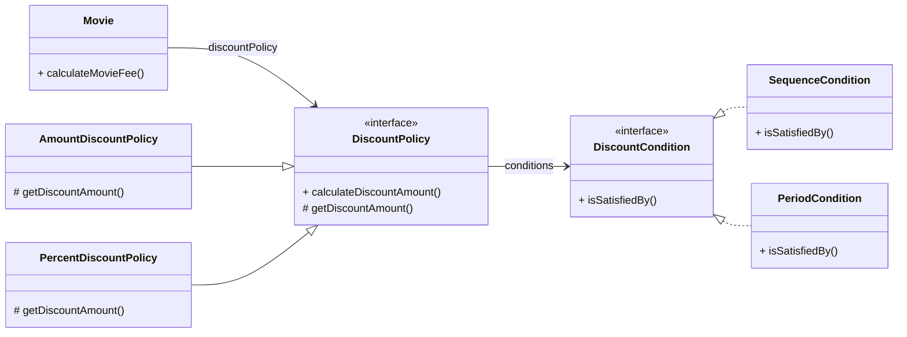
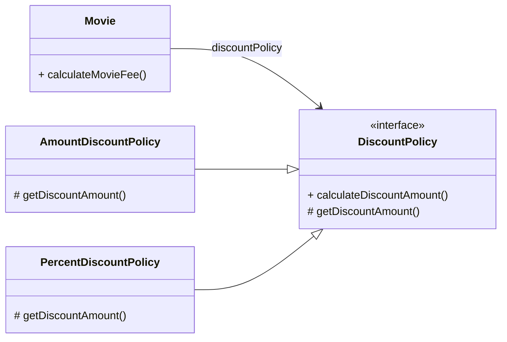
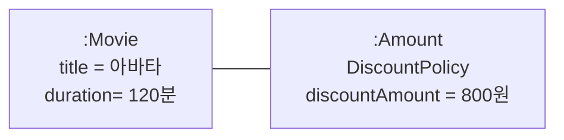
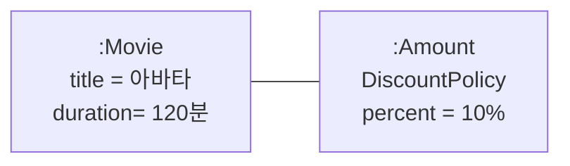
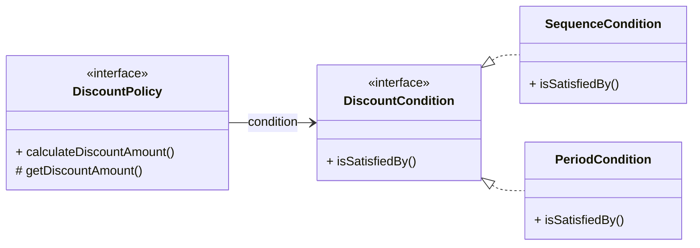
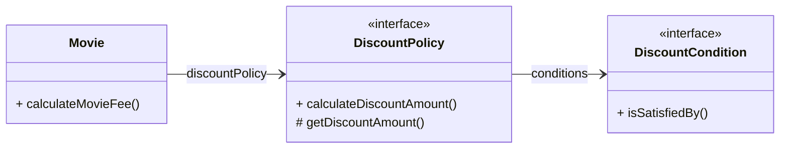
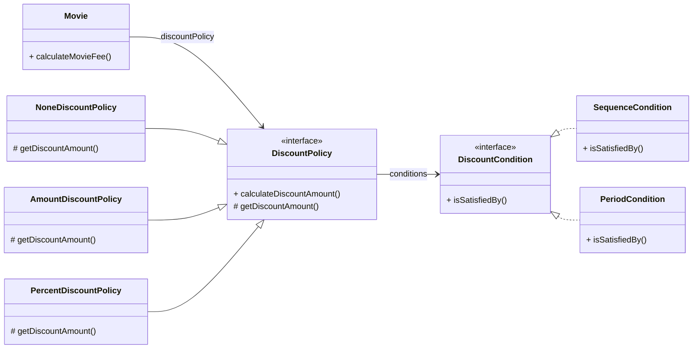
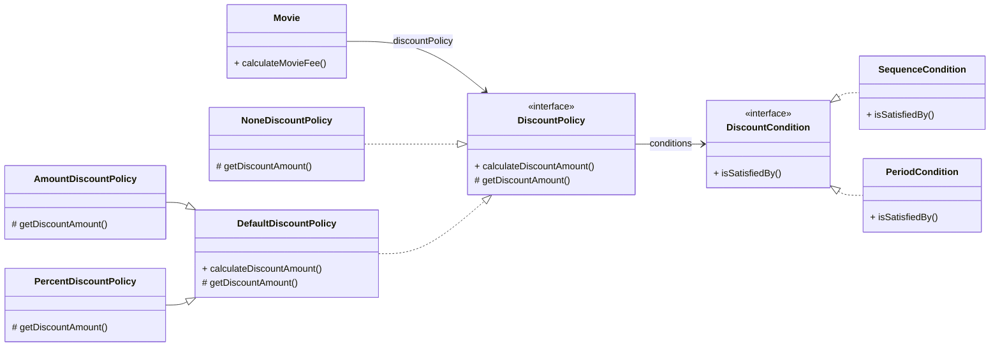

## 영화 예매 시스템

### 요구사항 살펴보기

1. 영화 vs 상영
    
    
    | 구분 | 내용 | 구성 요소 |
    | --- | --- | --- |
    | 영화(Movie) | 영화 자체 정보, 제목·상영시간·기본 가격 | 제목, 상영 시간, 가격 정보 |
    | 상영(Screening) | 특정 시간대에 영화가 상영되는 사건 | 상영 일자. 시간, 순번 |
2. 할인 조건(Discount Condition) :  가격의 할인 여부를 결정
    
    
    | 조건 종류 | 기준 | 구성 요소 |
    | --- | --- | --- |
    | 순서 조건(Sequence) | 상영 순번 | 순번 |
    | 기간 조건(Period) | 상영 시작 시간 | 요일, 시작 시간, 종료 시간 |
3. 할인 정책(Discount Policy)
    
    
    | 정책 종류 | 적용 방식 | 예시 |
    | --- | --- | --- |
    | 금액 할인 정책(Amount) | 고정 금액 할인 | 9,000원 영화 → 800원 할인 → 8,200원 |
    | 비율 할인 정책(Percent) | 정가의 일정 비율 할인 | 9,000원 영화 → 10% 할인 → 8,100원 |
4. 할인 적용 규칙
    - 정책: 영화별 1개만 적용 가능
    - 조건: 여러 개 지정 가능 (순서 + 기간 혼합 가능)
    
    | 영화 | 할인 정책 | 할인 조건 |
    | --- | --- | --- |
    | 아바타 | 금액 할인 정책 (할인액: 800원) | 순번 조건(조조, 10회 상영) |
    | 타이타닉 | 비율 할인 정책 (할인율: 10%) | 기간 조건(화요일 14~17시), 순번 조건(2회 상영) |
    | 스타워즈 | 없음 |  |
5. 예매 정보 구조
    
    
    | 항목 | 설명 |
    | --- | --- |
    | 영화 제목 | 예매한 영화 이름 |
    | 상영 정보 | 상영 날짜, 시간, 순번 |
    | 예약 인원 | 예매 인원 |
    | 정가 | 기본 영화 가격 |
    | 결제 금액 | 할인 적용 후 최종 결제 금액 |

## 객체지향 프로그래밍을 향해

### 협력, 객체, 클래스

**객체 중심 사고**

- 객체지향 = 객체를 지향
- 클래스가 아닌 객체에 초점을 맞춰야 한다.
    - 클래스부터 고민하는 습관은 객체지향의 본질과 다르다.
    - 우선 어떤 객체가 필요한지, 그 객체가 무엇을 알고 무엇을 할 수 있는지 고민해야 한다.

**클래스**

- 공동적인 상태와 행동을 공유하는 객체들을 추상화한 것
    - 클래스의 윤곽을 잡기 위해 객체의 상태와 행동, 협력 관계가 명확히 해야한다.

**객체**

- 상태+ 행동
- 독립적인 존재가 아니라 기능을 구현하기 위해 협력하는 공동체의 일원으로 생각한다.
    - 설계가 유연하고 확장 가능
- 협력의 시나리오를 고려하면 객체의 역할과 책임이 명확해짐

**결론: 좋은 협력 → 좋은 객체 → 좋은 클래스**

### 도메인의 구조를 따르는 프로그램 구조

**도메인(Domain)**

- 소프트웨어가 해결하고자 하는 문제 영역을 도메인이라고 한다.
    - 영화 예매 시스템의 도메인: 사용자가 영화를 쉽고 빠르게 예매하는 것

객체지향 패러다임에서는 요구사항을 분석하는 초기 단계부터 프로그램을 구현하는 마지막 단계까지 객체라는 동일한 추상화 기법을 사용할 수 있다. 

⇒ 프로그램의 객체/클래스와 매끄럽게 연결 가능

| 도메인 개념 | 대응 클래스 | 설명 |
| --- | --- | --- |
| 영화 | `Movie` | 영화 정보(제목, 상영시간, 기본 가격, 할인 정책) |
| 상영 | `Screening` | 특정 시간대 영화 상영, 순번 포함 |
| 예매 | `Reservation` | 사용자의 예매 정보(상영, 인원, 결제금액) |
| 할인 정책 | `DiscountPolicy` | 금액/비율 할인 정책 추상화 |
| 금액 할인 정책 | `AmountDiscountPolicy` | 정액 할인 구현 |
| 비율 할인 정책 | `PercentDiscountPolicy` | 비율 할인 구현 |
| 할인 조건 | `DiscountCondition` | 할인 적용 여부 판단 |
| 순번 조건 | `SequenceCondition` | 상영 순번 기반 할인 조건 |
| 기간 조건 | `PeriodCondition` | 상영 시간 기반 할인 조건 |



- 하나의 `Screening`은 하나의 `Movie`와 연결
- 하나의 `Reservation`은 하나의 `Screening`과 연결
- `Movie`는 하나의 할인 정책만 가질 수 있음, 할인 정책이 존재하면 하나 이상의 할인 조건 포함
- 할인 정책은 금액 할인 정책 또는 비율 할인 정책으로 구현
- 할인 조건은 순번 조건 또는 기간 조건으로 구현

### 클래스 구현하기

`Screening` 클래스는 사용자가 예매하는 상영을 구현

- 상영 정보(영화, 순번, 시작 시간)를 객체로 캡슐화

```java
public class Screening {
	private Movie movie:
	private int sequence;
	private LocalDateTime whenScreened;
	
	public Screening(Movie movie, int sequence, LocalDateTime whenScreened) {
		this.movie = movie;
		this.sequence = sequence;
		this.whenScreened = whenScreened;
	}
	
	// 상영 시작 시간을 반환
	public LocalDateTime getStartTime() {
		return whenScreened;
	}
	
	// 순번의 일치 여부를 검사
	public boolean isSequence(int sequence) {
		return this.sequence == sequence;
	}
	
	// 기본 요금을 반환
	public Money getMovieFee() {
		return movie.getFee();
	}
}
```

**주목할 점: 접근 제한자**

- 인스턴스 변수(private): 외부에서 직접 접근 불가
- 메서드(public): 외부에서 객체와 상호작용할 수 있는 통로
- public 메서드를 통해서만 내부 상태를 변경 할 수 있다.

**❓왜 클래스의 내부와 외부를 구분해야 할까❓**

1. **자율적인 객체**

**객체**

- 상태(State) + 행동(Behavior)을 함께 가지는 복합적 존재
- 스스로 판단하고 행동하는 자율적인 존재
    
    
    이전 패러다임에서는 데이터와 기능이 독립적 존재였지만 
    
    객체지향 패러다임에서는 객체 단위로 데이터와 기능을 하나로 묶는다.
    
    → **캡슐화(Encapsulation)**
    

**접근 제어**

- 객체 내부의 상태와 행동을 외부에서 직접 접근하지 못하도록 보호
- `public`, `protected`, `private`
- 목적: 객체의 자율성 보장(외부 간섭 최소화)
    - 외부에서 상태를 직접 변경 불가
    - 외부는 객체에게 요청만 하고 내부 결정은 객체가 스스로 수행

**퍼블릭 인터페이스 vs 구현**

|  | 설명 |
| --- | --- |
| 퍼블릭 인터페이스(Public Interface) | 외부에서 접근 가능. 객체와 상호작용 |
| 구현(Implementation) | 외부에서 접근 불가, 객체 내부에서만 사용. |
- 설계 원칙: 인터페이스와 구현의 분리(Separation of Interface and Implementation)
- 방법
    - 객체의 상태는 숨기고, 행동만 외부에 공개한다.
    - 속성 → `private`
    - 외부 공개 메서드 → `public`
    - 서브클래스, 내부 접근용 → `protected` / `private`
    - 퍼블릭 인터페이스에는 public으로 지정된 메서드만 포함한다.

1. **프로그래머의 자유**
    
    
    | 프로그래머의 역할 | 설명 |
    | --- | --- |
    | 클래스 작성자(Class Creator) | 새로운 데이터 타입을 설계·작성 |
    | 클라이언트 프로그래머(Client Programmer) | 작성된 클래스를 사용해 애플리케이션 구축 |
    
    **구현 은닉(Implementation Hiding)**
    
    - 클래스 작성자는 필요한 부분만 공개(public), 나머지는 숨김(private/protected)
    - 클라이언트 프로그래머가 내부 구현에 접근하는 것을 방지
    - 목적
        1. 외부 영향 최소화: 클래스 작성자는 내부 구현을 자유롭게 변경할 수 있다. 
        2. 인지 부담 감소: 클라이언트 프로그래머는 내부의 구현을 몰라도 인터페이스만 알고 있으면 클래스를 사용할 수 있다.
    

### 협력하는 객체들의 공동체

**Screening**

- `reserve(customer, audienceCount)`라는 메시지를 받는다.
- 요금 계산은 Movie.calculateMovieFee 에게 위임

```java
public class Screening {
	public Reservation reserve(Customer customer, int audienceCount) {
		return new Reservation(customer, this, calculateFee(audienceCount), audienceCount);
	}
	
	// Screening은 요금에 인원수만 곱하는 역할
	private Money calculateFee(int audienceCount) {
		return movie.calculateMovieFee(this).times(audienceCount);
	}
}
```

**Money**

- `Long` 같은 원시값을 쓰는 대신 도메인 개념을 표현하는 전용 타입 사용
- 장점
    - "돈"이라는 의미를 명확하게 전달
    - 금액 계산 로직(`plus`, `minus`, `times`)을 한 곳에 모아 중복 제거
    - 명확성과 유연성 확보
    
    ```java
    public class Money {
    	public static final Money ZERO = Money.wons(0);
    	private final BigDecimal amount;
    	
    	public static Money wons(long amount) {
    		return new Money(BigDecimal.valueOf(amount));
    	}
    	
    	public static Money wons(double amount) {
    		return new Money(BigDecimal.valueOf(amount));
    	}
    	
    	Money(BigDecimal amount) {
    		this.amount = amount;
    	}
    	
    	public Money plus(Money amount) {
    		return new Money(this.amount.add(amount.amount));
    	}
    	
    	public Money minus(Money amount) {
    		return new Money(this.amount.subtract(amount.amount));
    	}
    	
    	public Money times(double percent) {
    		return new Money(this.amount.multiply(
    		BigDecimal.valueOf(percent)));
    	}
    	
    	public boolean isLessThan(Money other) {
    		return amount.compareTo(other.amount) < 0;
    	}
    	
    	public boolean isGreaterThanOrEqual(Money other) {
    		return amount.compareTo(other.amount) >= 0;
    	}
    }
    ```
    

**Reservation** 

- `Customer`, `Screening`, `Money fee`, `audienceCount`를 속성으로 포함하며 서로의 메서드를 호출하며 상호작용한다.
- 협력의 최종 산출물 역할

```java
public class Reservation {
	private Customer customer;
	private Screening screening;
	private Money fee:
	private int audienceCount;
	
	public Reservation(Customer customer, Screening screening, Money fee, int audienceCount) {
		this.customer = customer;
		this.screening = screening;
		this.fee = fee;
		this.audienceCount = audienceCount;
	}
}
```

인스턴스 사이의 협력



**객체지향 프로그램을 작성할 때**

1. 협력의 관점에서 어떤 객체가 필요한지 결정
2. 공동 상태와 행위를 구현하기 위해 클래스를 작성
3. 협력이 먼저 결정되면, 그 협력 속에서 **역할 → 책임 → 클래스**가 도출된다.

### 협력에 관한 짧은이야기

객체는 다른 객체의 퍼블릭 인터페이스를 통해 요청(request)할 수 있다. 요청을 받은 객체는 자율적인 방법에 따라 요청을 처리한 후 응답(response)한다. 객체가 다른 객체와 상호작용할 수 있는 방법은 메시지를 전송하는 것뿐이다.

**메시지와 메서드**

- 메시지 (Message): 인터페이스
    - 객체 간 협력의 요청
    - 보낸 객체는 수신자가 어떻게 처리할지 모른다. “응답할 수 있다”는 믿음만 가지고 있다.
- 메서드 (Method): 구현
    - 객체가 받은 메시지를 구체적으로 처리하는 방법
    - 메시지를 처리하기 위한 자신만의 방법

👉 객체지향은 인터페이스와 구현의 분리를 전제로 한다.

**객체의 자율성**

Screening은 Movie 안에 `calculateMovieFee` 메서드가 어떻게 구현됐는지 모른다. 그저 Movie가 이 메시지를 이해할 수 있다고 믿고 요청한다. 그 메시지를 어떤 방식으로 처리할지는 Movie의 자유다.

## 할인 요금 구하기

### 할인 요금 계산을 위한 협력 시작하기

**Movie**

- 상영시간, 기본 요금, 할인 정책을 속성으로 가진다.

```java
public class Movie {
	private String title
	private Duration runningTime
	private Money fee
	private DiscountPolicy discountPolicy
	
	public Movie(String title, Duration runningTime, Money fee, DiscountPolicy discountPolicy) {
		this.title = title;
		this.runningTime = runningTime;
		this.fee = fee;
		this.discountPolicy = discountPolicy:
	}
	
	public Money getFee() {
		return fee;
	}
	
	public Money calculateMoviefee(Screening screening) {
		// 할인된 요금 반환
		return fee.minus(discountPolicy.calculateDiscountAmount(screening));
	}
}
```

어떤 할인 정책을 사용할 것인지 결정하는 코드가 존재하지 않는다. Movie는 discountPolicy에게 메시지를 전송할 뿐이다.

### 할인 정책과 할인 조건

**DiscountPolicy** 

- 추상 클래스 (abstract class)
    - 모든 할인 정책이 따라야 할 골격을 정의
    - 공통 흐름: 할인 조건들을 검사 → 만족하면 할인금액 반환 → 아니면 0 반환

```java
public abstract class DiscountPolicy {
	// 하나의 할인 정책은 여러 개의 할인 조건을 포함할 수 있다.
	private List<DiscountCondition> conditions = new ArrayList<>();
	
	public DiscountPolicy(DiscountCondition ... conditions) {
		this.conditions = Arrays.asList(conditions);
	}
	
	public Money calculateDiscountAmount(Screening screening) {
		for(DiscountCondition each : conditions) {
			// 할인 조건 확인
			if (each.isSatisfiedBy(screening)) {
				return getDiscountAmount(screening);
			}
		}
		
		// 만족하는 할인 조건 없음
		return Money.ZERO;
	}
	
	// 추상 메서드. 실제 요금 계산
	abstract protected Money getDiscountAmount(Screening Screening);
}
```

- 공통 로직은 상속 계층의 부모에, 세부 구현은 자식에 위치시켜 중복 제거
- TEMPLATE METHOD 패턴

**DiscountCondition**

- 다양한 조건(순번, 기간 등)을 전략(Strategy)처럼 끼워 넣을 수 있다.

```java
public interface DiscountCondition {
	boolean isSatisfiedBy(Screening screening);
}
```

```java
public class SequenceCondition implements DiscountCondition {
	private int sequence:
	
	public SequenceCondition(int sequence) {
		this.sequence = sequence;
	}
	
	// Screening의 상영 순번과 일치할 경우 할인
	public boolean isSatisfiedBy(Screening screening) {
		return screening.isSequence(sequence);
	}
}

public class PeriodCondition implements DiscountCondition {
	private DayOfWeek dayOfWeek;
	private LocalTime startTime;
	private LocalTime endTime:
	
	public PeriodCondition(DayOfWeek dayOfWeek, LocalTime startTime, LocalTime endTime) {
		this.dayOfWeek = dayOfWeek;
		this.startTime = startTime;
		this.endTime = endTime:
	}
	
	// 상영 시작 시간이 특정한 기간 안에 포함될 경우 할인
	public boolean isSatisfiedBy(Screening screening) {
		return screening.getStartTime().getDayOfWeek().equals(dayDfWeek) 8&
			startTime.compareTo(screening.getStartTime().toLocalTime()) <= 0 8&
			endTime.compareTo(screening.getStartTime().toLocalTime()) >= 0;
	}
}
```

**DiscountPolicy 구현체**

- DiscountPolicy 의 추상 메서드인 getDiscountAnount()를 오버라이딩한다.

```java
public class AmountDiscountPolicy extends DiscountPolicy {
	private Money discountAmount;
	
	public AmountDiscountPolicy(Money discountAmount, DiscountCondition ... conditions) {
		super(conditions);
		this.discountAmount = discountAmount;
	}
	
	@0verride
	protected Money getDiscountAmount(Screening screening) {
		// 고정 금액 할인
		return discountAmount;
	}
}

public class PercentDiscountPolicy extends DiscountPolicy {
	private double percent;
	
	public PercentDiscountPolicy(double percent, DiscountCondition ... conditions) {
	super(conditions);
	this.percent = percent;
	}
		
	@0verride
	protected Money getDiscountAmount(Screening screening) {
		// 비율 할인
		return screening.getMovieFee().times(percent);
	}
}
```



- `Movie` → `DiscountPolicy`를 위임해서 영화 요금을 계산
- `DiscountPolicy` → 여러 `DiscountCondition`을 조합해 활용

정책은 조건을 포함하고, 영화는 정책을 위임받아 요금 계산한다.

**장점**

- 중복 제거: 공통 흐름은 부모 추상 클래스에
- 유연한 확장: 정책과 조건을 독립적으로 확장 가능
- OCP(개방-폐쇄 원칙) 준수: 새로운 할인 정책/조건 추가 시 기존 코드 수정 불필요
- 조립 가능성: 영화마다 다른 정책+조건을 쉽게 조합 가능

### 할인 정책 구성하기

1. 할인 정책은 영화당 1개만 가능
    - `Movie` 생성자에서 `DiscountPolicy`를 단 하나만 받도록 강제
    
    ```java
    public class Movie {
    	public Movie(String title, Duration runningTime, Money fee, DiscountPolicy discountPolicy) {
    		this.discountPolicy = discountPolicy;
    	}
    }
    ```
    

1. 할인 조건은 여러 개 가능
    
    ```java
    public abstract class DiscountPolicy {
    	private List<DiscountCondition> conditions;
    	
    	// 생성자에서 DiscountCondition... 가변 인자를 받음
    	public DiscountPolicy(DiscountCondition ... conditions) {
    		this.conditions = Arrays.asList(conditions);
    	}
    }
    ```
    

**아바타**

- **정책**: 금액 할인 (800원 할인)
- **조건**:
    - 1회차 상영
    - 10회차 상영
    - 월요일 10:00~11:59
    - 목요일 10:00~20:59
    
    ```java
    Movie avatar = new Novie("아바타",
    	Duration.ofMinutes(128),
    	Money.wons(10009),
    	new AmountDiscountPolicy(Money.wons(800),
    			new SequenceCondition(1),
    			new SequenceCondition(10),
    			new PeriodCondition(DayOfWeek.MONDAY, LocalTime.of(10, @), LocalTime.of(11, 59)),
    			new PeriodCondition(DayOfWeek.THURSDAY, LocalTime.of(10, @), LocalTime.of(20, 59))));
    ```
    

**타이타닉**

- **정책**: 비율 할인 (10%)
- **조건**:
    - 화요일 14:00~16:59
    - 2회차 상영
    - 목요일 10:00~13:59
    
    ```java
    Movie titanic = new Movie("타이타닉",
    	Duration.ofMinutes(188),
    	Money.wons(1100@),
    	new PercentDiscountPolicy(0.1,
    			new PeriodCondition(DayOfWeek.TUESDAY, LocalTime.of(14, @), LocalTime.of(16, 59)),
    			new SequenceCondition(2),
    			new PeriodCondition(DayOfWeek.THURSDAY, LocalTime.of(10, @), LocalTime.of(13, 59))));
    ```
    

- 새로운 할인 조건 추가하려면 `DiscountCondition`만 구현하면 된다.
- 영화당 할인 정책은 하나만, 조건은 여러 개를 생성자에서 강제하고 있다.
- 객체 조립만으로 정책 변경 가능

## 상속과 다형성

Movie 내부에 할인 정책을 결정하는 조건문이 없는데 

어떻게 영화 요금을 계산할 때 정책을 선택할 수 있을까❓  👉 상속과 다형성

### 컴파일 시간 의존성과 실행 시간 의존성



**실행 시점 의존성과 런타임 의존성이 다르다**.

- 컴파일 시점: `Movie`는 오직 `DiscountPolicy`(추상 클래스)에만 의존한다.
- 실행 시점: 실제 객체는 `AmountDiscountPolicy` 또는 `PercentDiscountPolicy`가 주입된다.

**예시**

```java
Movie avatar = new Novie("아바타",
	Duration.ofMinutes(120),
	Money.wons(10000),
	new AmountDiscountPolicy(Money.wons(800), ... ));
```



이제 실행 시에 Movie 의 인스턴스는 AmountDiscountPolicy 클래스의 인스턴스에 의존한다.

```java
Movie avatar = new Novie("아바타",
	Duration.ofMinutes(120),
	Money.wons(10000),
	new PercentDiscountPolicy(0.1, ... ));
```



비율 할인 정책을 적용하고 싶다면 PercentDiscountPolicy의 인스턴스를 전달하면 된다.

**유연성과 가독성의 트레이드오프**

- 설계가 유연해질수록 재사용성과 확장 가능성이 좋아진다.
    - Movie는 정책의 종류를 몰라도 된다.
    - 코드 수정 없이 새로운 정책을 도입할 수 있다. (확장성 ↑, 재사용성 ↑)
- 설계가 유연해질수록 코드를 이해하고 디버깅하기는 점점 더 어려워진다.
    - Movie 코드만 봐서는 실제로 어떤 할인 정책이 적용되는지 알 수 없다.
    - 의존하고 있는 객체를 알기 위해서는 의존성을 연결하는 부분을 찾아봐야 한다. (가독성 ↓, 디버깅 난이도 ↑)

결국 설계자는 유연성 vs 단순성 사이에서 균형을 잡아야 한다.

### 차이에 의한 프로그래밍

추가하고 싶은 클래스가 기존의 어떤 클래스와 매우 흡사하다면 

1. 그 클래스의 코드를 가져와 약간만 추가하거나 수정해서 새로운 클래스를 만든다.
2. 그 클래스의 코드를 전혀 수정하지 않고도 재사용한다. → **상속**

**상속**

- 부모 클래스가 가지고 있는 모든 속성과 행동을 자식 클래스에 포함시킬 수 있다.
- 다른 부분만 오버라이딩해서 필요한 행동만 수정하거나 추가할 수 있다.
    - `DiscountPolicy` → `AmountDiscountPolicy`, `PercentDiscountPolicy`
        - 부모: “할인 계산”이라는 추상 메서드 제공.
        - 자식: 구체적으로 금액 할인, 비율 할인 로직만 다르게 구현.
- 기존 코드 수정 없이 빠른 확장 가능이 가능하다.

부모 클래스와 다른 부분만을 추가해서 새로운 클래스를 쉽고 빠르게 만드는 방법을 

**차이에 의한 프로그래밍(programming by difference)**이라 한다. 

### 상속과 인터페이스

흔히 상속의 가치를 코드 재사용 이라고 생각한다. 하지만 본질은 인터페이스 공유다. 상속을 통해 자식은 자신의 인터페이스에 부모의 인터페이스를 포함하게 된다. 

- 부모가 이해할 수 있는 메시지를 자식도 **그대로 이해**할 수 있다.
- 외부 객체는 자식 클래스를 부모 클래스와 동일한 타입으로 간주할 수 있다.
- 외부 객체(Movie)는 "이 메시지를 이해할 수 있느냐"만 신경 쓰면 된다.

```java
public class Movie {
	public Money calculateMovieFee(Screening screening) {
		return fee.minus(discountPolicy.calculateDiscountAmount(screening));
	}
}
```

- Movie는 calculateDiscountAmount 메시지에만 의존한다.
    - 메시지를 이해할 수만 있다면 그 객체가 어떤 클래스의 인스턴스인지는 상관하지 않는다.
    - discountPolicy의 구현체들은 모두 calculateDiscountAmount 메시지를 이해하므로 협력할 수 있다.

**자식 클래스는 상속을 통해 부모 클래스의 인터페이스를 물려받기 때문에 부모 클래스 대신 사용될 수 있다.** 

**👉 업캐스팅 (Upcasting):** 자식 클래스가 부모 클래스를 대신하는 것

### 다형성

- 메시지(message)
    - 객체에게 “이 일을 해 달라”라고 요청하는  것: `calculateDiscountAmount(screening)`
- 메서드(method)
    - 메시지를 실제로 수행하는 코드 조각

Movie는 DiscountPolicy에게 메시지를 보낸다.

실제 실행되는 메서드는 연결된 객체의 실제 타입에 따라 달라진다. 👉 다형성

**다형성은 의존성의 시점 차이에서 나온다.**

- 컴파일 시점
    - Movie → DiscountPolicy(추상 클래스)에 의존
    - 컴파일러는 Movie가 사용하는 건 DiscountPolicy 타입이라고만 알고 있다.
- 실행 시점
    - Movie → AmountDiscountPolicy 또는 PercentDiscountPolicy 인스턴스에 실제로 의존

**다형성:  동일한 메시지를 수신했을 때 객체의 타입에 따라 다르게 응답할 수 있는 능력**

- 다형성 협력에 참여하려면 객체들이 같은 메시지를 이해할 수 있어야 한다.
- 즉, 인터페이스가 동일해야 한다.

**동적 바인딩 (Dynamic Binding), 지연 바인딩(lazy binding)** 

**↔** 초기 바인딩 (early binding), 정적 바인딩(static binding)

메시지는 같아도 메서드 선택은 실행 시점 객체의 타입에 따라 달라진다. 

`Movie`가 `calculateDiscountAmount` 메시지를 보내면

- AmountDiscountPolicy 객체라면 → AmountDiscountPolicy의 메서드 실행
- PercentDiscountPolicy 객체라면 → PercentDiscountPolicy의 메서드 실행

**참고: 구현 상속과 인터페이스 상속**

**구현 상속 (Subclassing)**

- 단순히 코드 재사용 목적 (부모의 기능을 가져와서 쓰는 것).
- 장점: 빠른 개발. 단점: 변경에 취약, 부모 변경 시 자식도 연쇄적으로 깨질 위험.

**인터페이스 상속 (Subtyping)**

- 다형적 협력을 위해 동일한 메시지를 보장하는 목적.

상속의 주된 목적은 코드 재사용이 아니다. 구현을 재사용할 목적으로 상속을 사용하면 변경에 취약해진다. 구현 상속보다는 인터페이스 상속을 우선하는 것이 좋다. 

### 인터페이스와 다형성

|  | 추상 클래스 (DiscountPolicy) | 인터페이스 (DiscountCondition) |
| --- | --- | --- |
| 구현 공유 | 가능 (#getDiscountAmount 등) | 없음 |
| 다형성 | 가능 | 가능 |
| 용도 | 기본 동작 제공 + 다형성 | 순수 다형성 (메시지만 정의) |
| 자식 클래스 예 | AmountDiscountPolicy, PercentDiscountPolicy | SequenceCondition, PeriodCondition |



- DiscountPolicy는 공통 코드(conditions 리스트, calculateDiscountAmount 구현)를 공유할 필요가 있어서 추상 클래스로 구현
- DiscountCondition은 공유할 구현이 없고 메시지만 필요해서 인터페이스로 구현

## 추상화와 유연성

### 추상화의 힘

**추상화**

- 구체적인 구현이 아니라 공통된 인터페이스/개념에 집중하는 것
- 예시:
    - `DiscountPolicy` = "할인 정책"이라는 개념 (금액/비율은 구체적인 구현)
    - `DiscountCondition` = "할인 조건"이라는 개념 (순번/기간은 구체적인 구현)

추상화는 무엇을 할지에 집중하고, 어떻게 할지는 하위 클래스(구현체)에게 맡긴다.

**장점**



1. 요구사항의 정책을 높은 수준에서 서술할 수 있다
    - 도메인의 핵심 개념을 간단히 표현할 수 있다.
    - 영화 예매 요금은 최대 하나의 '할인 정책'과 다수의 '할인 조건'을 이용해 계산할 수 있다
        - 이 말은 **금액 할인 정책 + 두 개의 순번 조건 + 한 개의 기간 조건** 같은 구체적인 경우도 포함한다.
    - 표현의 수준을 조절할 수 있다.

1. 추상화를 이용하면 설계가 좀 더 유연해진다
    - 새로운 구현 클래스들은 추상화를 이용해서 정의한 상위의 협력 흐름을 그대로 따르게 된다.
        - 기존 구조(`Movie → DiscountPolicy → DiscountCondition`)는 그대로 유지.
    - 기존 구조를 수정하지 않고도 새로운 기능을 쉽게 추가하고 확장할 수 있다.
        - 새로운 할인 정책(`NewDiscountPolicy`)이나 새로운 조건(`NewCondition`)을 추가할 때도 기존의 `DiscountPolicy` / `DiscountCondition` 흐름을 그대로 따르면 된다.

### 유연한 설계

**문제: '스타워즈'는 할인 정책이 없다.**

```java
public class Movie {
	public Money calculateMovieFee(Screening screening) {
		if (discountPolicy == null) {
			return fee:
		}
		
		return fee.minus(discountPolicy.calculateDiscountAmount(screening));
	}
}
```

- 기존 설계로는 조건문을 사용해서 예외 상황을 처리해야 한다.
- 할인 금액을 계산하는 책임이 `DiscountPolicy`의 하위 클래스에 있었지만 이 경우, `Movie` 쪽으로 옮겨가면서 일관성이 없어진다.

**해결: 할인 요금을 계산할 책임을 DiscountPolicy 계층에 유지시킨다.**

```java
public class NoneDiscountPolicy extends DiscountPolicy {
	@Override
	protected Money getDiscountAmount(Screening screening) {
		return Money.ZERO;
	}
}

Movie starNars = new Movie("스타워즈",
	Duration.ofMinutes(210),
	Money.wons(10000),
	new NoneDiscountPolicy());
```

- `Movie`의 조건문 제거 가능.
- 예외 케이스도 일관된 협력 방식 유지.

**중요한 포인트**

- 기존 코드(Movie, DiscountPolicy) 수정 없음
- 새로운 클래스(NoneDiscountPolicy) 추가만으로 기능 확장 가능
- 확장에는 열려 있고, 수정에는 닫혀 있는 구조 → `OCP(개방-폐쇄 원칙)` 실현

**컨텍스트 독립성(Context Independency)**

- `Movie`는 특정한 할인 정책에 묶이지 않음 → 어떤 `DiscountPolicy` 하위 클래스와도 협력 가능
- `DiscountPolicy` 역시 특정 조건에 묶이지 않음 → 어떤 `DiscountCondition` 하위 클래스와도 협력 가능
- 새로운 정책/조건 추가 시 기존 흐름은 그대로 유지 가능



유연성이 필요한 곳에 추상화를 사용하자!

### 추상 클래스와 인터페이스 트레이드오프

**문제: `NoneDiscountPolicy`는 `getDiscountAmount()`를 호출하지 않을 것이라는 세부사항에 의존한다. 불필요한 개념적 결합이다.** 

**해결: 인터페이스 도입**

1. DiscountPolicy → 인터페이스로 변경
    
    ```java
    public interface DiscountPolicy {
    	Money calculateDiscountAmount(Screening screening);
    }
    ```
    
2. 기존의 추상 클래스는 `DefaultDiscountPolicy`로 이름을 바꾸고, 인터페이스를 구현하도록 변경
    
    ```java
    public abstract class DefaultDiscountPolicy implements DiscountPolicy {
    	...
    }
    ```
    
3. `NoneDiscountPolicy`는 `DiscountPolicy` 인터페이스를 구현
    
    ```java
    public class NoneDiscountPolicy implements DiscountPolicy {
    	@0verride
    	public Money calculateDiscountAmount(Screening screening) {
    		return Money.ZERO;
    	}
    }
    ```
    

이렇게 하면 **부모 클래스의 내부 동작에 의존하지 않고**, 오직 인터페이스만 구현하면 된다.

결합도 ↓, 명확성 ↑.



- **인터페이스 사용 장점**
    - 개념적으로 더 깔끔함
        - `NoneDiscountPolicy`가 "0원을 반환하는 정책"임을 직관적으로 드러냄
    - 불필요한 내부 의존 제거
    - 확장성 ↑
- **추상 클래스만 사용하는 경우 장점**
    - 구조 단순
        - 인터페이스까지 추가하지 않아도 됨.
    - 구현량 ↓

이상적인 설계는 **인터페이스 방식이다.** 하지만 실무에서는 NoneDiscountPolicy를 위해 인터페이스를 추가하는 게 과연 필요한지 고민 할 수 있다. 

중요한 것은 구현과 관련된 모든 것들이 트레이드오프의 대상이 될 수 있다는 것이다. **트레이드오프는 항상 존재**하며, 합당한 이유 없이 무조건 인터페이스/추상 클래스를 선택하는 것은 피해야 한다. 

### 코드 재사용

1. **상속 (Inheritance)**
    - 코드를 재사용하기 위해 널리 사용되는 방법
    - 부모 클래스를 확장해서 자식 클래스에서 기능을 재사용
        - `AmountDiscountMovie`, `PercentDiscountMovie`가 `Movie`를 상속받는 경우. 기존 방법과 기능적이 관점에서 동일하다.
            
            ```mermaid
            classDiagram
            direction BT
            		
            		class Movie{
            			+ calculateMovieFee(screening)
            			# getDiscountAmount(screening)
            		}
            		class Amount DiscountMovie{
            			# getDiscountAmount(screening)
            		}
            		class Percent DiscountMovie{
            			# getDiscountAmount(screening
            		}
            			
            		Amount DiscountMovie --|> Movie
                Percent DiscountMovie --|> Movie
            
            ```
            
2. **합성 (Composition)**
    - 다른 객체를 인스턴스 변수로 포함해서 그 기능을 재사용
        - `Movie`가 `DiscountPolicy`를 인스턴스 변수로 가지고 협력하는 경우.

**많은 사람들이 상속 대신 합성을 선호하는 이유는 무엇일까❓**

### 상속

**상속의 단점**

- 캡슐화 위반
    - 자식 클래스가 부모 클래스의 내부 구현을 알아야 동작 가능하다.
    - 예: `AmountDiscountMovie`는 `Movie.calculateMovieFee()` 내부에서 `getDiscountAmount()`를 호출한다는 사실을 알고 있어야만 올바르게 동작한다.
        - 부모 변경 시 자식도 같이 깨질 가능성이 높다.  (강한 결합).
- 유연하지 않음
    - 상속은 컴파일 시점에 관계가 결정된다.
    - 실행 중에 "금액 할인 정책"을 "비율 할인 정책"으로 바꾸려면?
        - `AmountDiscountMovie` 객체를 `PercentDiscountMovie`로 교체해야 함.
        - 이미 생성된 객체의 클래스를 바꾸려면 새 객체를 만들고 상태를 복사해야 한다.
    - 결과: 유지보수/확장성이 떨어짐.

반면 인스턴스 변수로 연결하는 방법을 사용하면 실행 시점에 할인 정책을 간단하게 변경할 수 있
다. (기존 방법)

**합성**

- Movie에 DiscountPolicy를 변경할 수 있는 changeDiscountPolicy 메서드를 추가한다.

```java
public class Movie {
	private DiscountPolicy discountPolicy;
	
	public void changeDiscountPolicy(DiscountPolicy discountPolicy) {
		this.discountPolicy= discountPolicy:
	}
}
```

- 실행 중에도 정책을 바꿀 수 있다.

```java
Movie avatar = new Movie("아바타",
	Duration.ofMinutes(120),
	Money.wons(10000),
	new AmountDiscountPolicy(Money.wons(800), ... ));

avatar.changeDiscountPolicy(new PercentDiscountPolicy(0.1, ... ));
```

- 객체 간 결합이 느슨하고, 변경/확장이 쉽다.
- 설계의 유연성 ↑, 캡슐화 보장

Movie가 DiscountPolicy를 포함하는 이 방법 역시 코드를 재사용하는 방법!

### 합성

**합성**

`Movie`는 요금을 계산하기 위해 `DiscountPolicy`를 포함한다. (인스턴스 변수로 참조) `Movie`는 `DiscountPolicy`의 내부 구현을 알 필요 없다. `calculateDiscountAmount()`라는 인터페이스만 알면 된다. 이렇게 인터페이스에 정의된 메시지를 통해서만 협력하는 방식을 합성이라 한다.

상속은 부모와 자식이 컴파일 시점에 하나의 단위로 강하게 결합되는데 합성은 인터페이스를 통해 약하게 결합된다. 

**합성이 상속보다 나은 이유**

1. 캡슐화 보장
    - 합성은 내부 구현을 숨기고, 인터페이스만 의존
    - 부모 클래스 내부 구조를 알아야 하는 상속의 캡슐화 위반 문제를 피할 수 있음.
2. 유연성
    - 의존하는 객체(`DiscountPolicy`)를 실행 시점에 교체 가능.
    - 설계가 훨씬 유연해지고 재사용성이 높아짐.
    - 반면, 상속은 컴파일 시점에 결합되어 변경 불가능.

**상속도 필요하다.**

대부분의 설계에서는 상속과 합성을 함께 사용해야 한다.

- 예:
    - `Movie` ↔ `DiscountPolicy`는 **합성 관계**.
    - `DiscountPolicy` ↔ `AmountDiscountPolicy`, `PercentDiscountPolicy`는 **상속 관계**.
- 즉, **합성과 상속은 함께 조합**해서 쓰이는 경우가 많음.
    - 코드 재사용은 합성을 선호.
    - 다형적 협력은 상속이 필요.


- `Movie` ↔ `DiscountPolicy`는 합성 관계
- `DiscountPolicy` ↔ `AmountDiscountPolicy`, `PercentDiscountPolicy`는 상속 관계

코드를 재사용하는 경우에는 상속보다 합성을 선호하는 것이 옳지만 다형성을 위해 인터페이스를 재사용하는 경우에는 상속과 합성을 조합해서 사용해야 한다. 

- 코드 재사용은 합성을 선호
- 다형적 협력은 상속이 필요

**객체지향의 본질**

많은 사람들이 객체지향을 클래스 작성 + 상속을 통한 코드 재사용 정도로 생각한다. → 틀림

객체지향의 본질은 객체들 간의 협력과 상호작용이다.

1. 협력: 적절한 협력을 식별하고 
2. 역할: 협력에 필요한 역할을 정의
3. 책임: 적절한 객체에게 적절한 책임을 할당