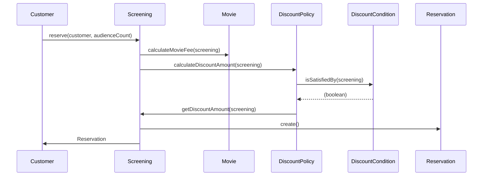
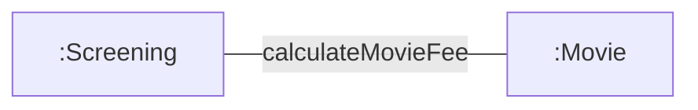
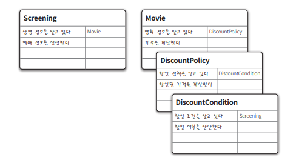
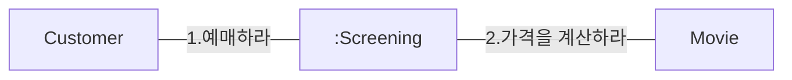
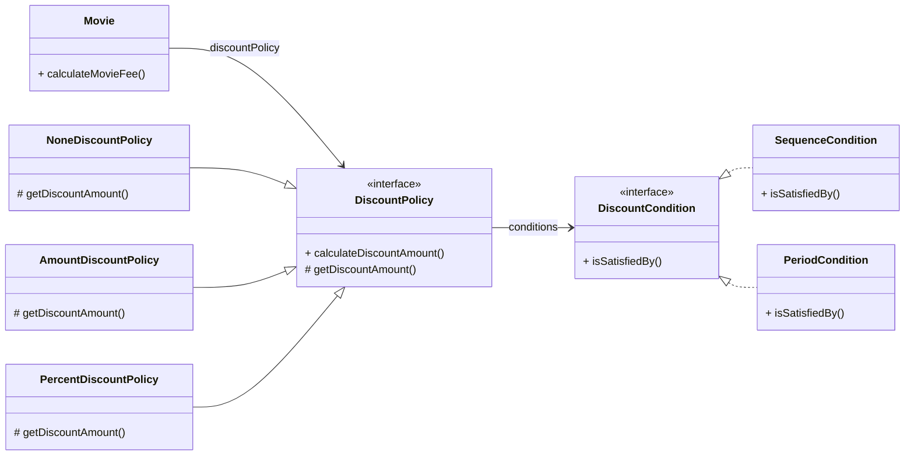
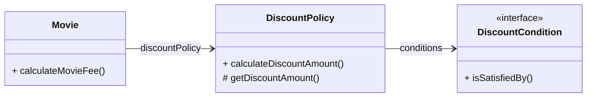

# 역할, 책임, 협력

**객체지향**

- 핵심: 역할(role), 책임(responsibility), 협력(collaboration)
- 중요한 이유: 객체지향 설계의 목적은 협력하는 객체들의 공동체를 만드는 것에 있음
- 잘못된 접근: 클래스, 상속, 지연 바인딩과 같은 구현 중심 요소에 초점을 너무 일찍 맞추는 것
    
    → 기능 구현 전부터 구조와 구현에 몰두하면 변경이 어렵고 유연하지 않은 코드가 만들어짐
    

**객체지향 설계 과정**

1. 협력을 정의한다
    - 애플리케이션 기능을 달성하기 위해 어떤 객체들이 서로 협력해야 하는지 고민
2. 역할과 책임을 할당한다
    - 각 객체가 맡을 역할과 책임을 명확히 정의
3. 구현 메커니즘 선택:
    - 클래스, 상속, 지연 바인딩 등은 책임과 협력이 정해진 뒤 사용하는 도구
    - 구현에 앞서 협력 구조를 설계하는 것이 우선

**구현보다 설계가 중요**

- 역할, 책임, 협력이 불명확한 상태에서
    - 응집도 높은 클래스
    - 중복 없는 상속 구조
    
    이런 구조만으로는 애플리케이션의 안정성과 확장성을 보장할 수 없음
    

## 협력

### 영화 예매 시스템 돌아보기



- 객체지향 시스템에서 제어 흐름은 하나의 객체가 독점하지 않고, 여러 객체에 균형 있게 분배됨
- 객체들의 메시지 상호작용을 통해 전체 기능이 구현됨 → 이것이 협력
- 각 객체가 수행하는 작업 = 책임
- 책임들의 모임 = 객체가 수행하는 역할

### 협력

**객체지향 시스템** = 자율적인 객체들의 공동체

- 객체는 고립된 존재가 아니며, **시스템 기능이라는 큰 목표를 달성**하기 위해 다른 객체와 협력함

**협력의 특징**

- 협력은 기능 구현의 유일한 방법
- 객체는 필요한 정보를 모를 때 다른 객체에 메시지를 보내 도움 요청
- 메시지를 수신한 객체도 자율적으로 처리 방법 선택
- 메시지 전송을 통한 협력 = 책임과 역할의 수행 기반

**예시**: Screening은 요금을 직접 계산하지 않고 Movie에게 위임 → Movie의 자율성과 캡슐화 유지



- Movie는 **요금 계산에 필요한 정보**(fee, discountPolicy)를 가장 잘 알고 있음

❓Screening이 요금 계산을 수행한다면❓

- Movie 내부 상태에 직접 접근 → **결합도 증가**
- Movie 자율성 훼손 → **캡슐화 원칙 위반**
- 해결
    - Movie가 스스로 요금 계산 → 객체 자율성 유지, 변경 영향 최소화
    - 자신이 할 수 없는 일을 다른 객체에게 위임하면 협력에 참여하는 객체들의 전체적인 자율성을 향상시킬 수 있다

자율 객체는 자신이 할 수 없는 작업을 다른 객체에 위임하며, 메시지 전송을 통한 협력 요청과 응답의 흐름으로 애플리케이션 기능이 구현된다.

### 협력이 설계를 위한 문맥을 결정한다

**객체**: 상태와 행동을 함께 캡슐화하는 실행 단위

- 객체가 존재하는 이유
    - 어떤 협력에 참여하기 때문
    - 협력에 필요한 적절한 행동이 있기 때문에 객체가 필요하다
- 행동 결정 기준
    - 객체가 참여하는 협력
    - 협력이 바뀌면 객체가 제공해야 하는 행동도 달라져야 한다
    

**예시: Movie 객체**

- 대부분 영화를 상영(play)한다고 생각할 수 있음
- 하지만 예매 시스템에서 Movie의 책임은 요금 계산
- Movie가 참여하는 협력(영화 예매) 때문에 `calculateMovieFee` 같은 행동을 수행

협력이라는 문맥을 고려하지 않고 Movie의 행동을 결정하는 것은 아무런 의미가 없다. 

**상태 결정 기준**

- 객체의 상태 = 행동을 수행하는 데 필요한 정보
- 객체는 자율적인 존재이기 때문에 객체가 수행하는 행동에 필요한 상태도 함께 가지고 있어야 한다.
- Movie의 상태: `fee`, `discountPolicy`
    - 요금 계산이라는 행동 수행에 반드시 필요
    

```java
public class Movie {
	private Money fee;
	private DiscountPolicy discountPolicy;
	
	public Money calculateMovieFee(Screening screening) {
		return fee.minus(discountPolicy.calculateDiscountAmount(screening));
	}
}
```

상태 = 그 행동을 수행하는 데 필요한 정보

행동 = 협력에서 처리할 메시

협력이 객체의 행동과 상태 모두를 결정한다. 따라서 협력은 객체 설계의 문맥(context)을 제공한다.

## 책임

객체를 설계하기 위해 필요한 문맥인 협력이 갖춰졌을 때 다음으로 할 일은 협력에 필요한 행동을 수행할 수 있는 적절한 객체를 찾는 것이다. 

이때 협력에 참여하기 위해 객체가 수행하는 행동을 **책임**이라고 부른다.

### 책임이란 무엇인가

책임

- 객체가 협력에 참여하기 위해 수행하는 행동
- 객체에 의해 정의되는 응집도 있는 행위의 집합
- 객체가 유지해야 하는 정보와 수행할 수 있는 행동에 대해 개략적으로 서술한 문장

**객체가**

- ***무엇을 할 수 있는가* (Doing)**
- ***무엇을 알고 있는가* (Knowing)**

Craig Larman 분류에 따른 책임의 유형:

**하는 것 (Doing)**

- 객체를 생성하거나 계산을 수행하는 등의 스스로 하는 것
- 다른 객체의 행동을 시작시키는 것
- 다른 객체의 활동을 제어하고 조절하는 것

**아는 것 (Knowing)**

- 사적인 정보에 관해 아는 것
- 관련된 객체에 관해 아는 것
- 자신이 유도하거나 계산할 수 있는 것에 관해 아는 것

**예시**

- Screening
    - 하는 것: 영화를 예매 (`reserve`)
    - 아는 것: 자신이 상영할 영화(`movie`)
- Movie
    - 하는 것: 요금 계산 (`calculateMovieFee`)
    - 아는 것: 기본 요금(`fee`), 할인 정책(`discountPolicy`)

👉 협력 안에서 부여된 책임이 곧 객체의 인터페이스와 속성을 결정한다.



오브젝트 그림 3.3 - 역할과 책임을 CRC 카드로 표현한 것

**책임과 메시지의 크기는 다르다.** 

- 책임은 체가 수행할 수 있는 행동을 종합적이고 간략하게 서술한 것. 더 추상적이고 큰 단위
    - 하나의 책임이 여러 메시지로 나뉠 수 있음
    - 하나의 객체가 수행할 수 있다고 생각했던 책임이 여러 객체가 협력해야 수행할 수 있는 큰 책임이 될 수도 있음

**중요한 것은 책임의 관점에서 '아는 것'과 '하는 것'이 밀접하게 연관돼 있다는 점**

- 객체는 책임을 수행하는 데 필요한 정보를 알고 있을 책임이 있다.
- 자신이 직접 할 수 없는 작업은 도와줄 객체를 알고 있을 책임이 있다.

> Craig Larman: "객체지향 개발에서 가장 중요한 능력은 책임을 능숙하게 소프트웨어 객체에 할당하는 것[Larman04]"
> 

**협력이 중요한 이유**

- 객체에게 할당할 책임을 결정할 수 있는 문맥을 제공
- 적절한 협력이 적절한 책임을 제공하고, 적절한 책임을 적절한 객체에 할당해야 단순하고 유연한 설계 가능
- 객체지향 설계 = 책임 중심 설계
- 구현 방식보다 더 중요한 것 = 객체에게 어떤 책임을 줄 것인가

### 책임 할당

자율적인 객체를 만드는 가장 기본적인 방법

- 책임은 가장 잘 아는 객체(정보 전문가, Information Expert) 에게 할당한다.
- 객체는 자신이 가진 정보와 행동을 바탕으로 자율적으로 책임을 수행해야 한다.
- 일상생활에서도 특정 일을 전문가에게 맡기듯, 협력에서도 필요한 지식과 방법을 가진 객체가 책임을 맡는다.

협력을 설계하는 출발점은 시스템이 사용자에게 제공하는 기능을 시스템이 담당할 하나의 책임으로 바라보는 것이다. 객체지향 설계는 시스템의 책임을 완료하는 데 필요한 더 작은 책임을 찾아내고 이를 객체들에게 할당하는 반복적인 과정을 통해 모양을 갖춰간다.

**설계 과정**

1. 시스템 책임 정의
    - 사용자 기능: 영화 예매
    - 시스템도 하나의 책임으로 본다 → 메시지: `reserve`
2. 책임 분배
    - 예매 전문가 = `Screening`
        - 상영 시간, 기본 요금 정보를 알고 있음 → 예매 책임 할당
    - 가격 계산 전문가 = `Movie`
        - 요금과 할인 정책을 알고 있음 → 요금 계산 책임 할당
    - 할인 요금 계산 전문가 = `DiscountPolicy`
        - 할인 규칙을 가장 잘 알고 있음 → 할인 계산 책임 할당
        
    
    ```mermaid
    flowchart LR
        A[":Screening"] 
    		B["Movie"]
    		C["Customer"]
    		D["DiscountPolicy"]
    				
    		C ---|1.예매하라| A ---|2.가격을 계산하라| B ---|3.할인 요금을 계산산하라| D
        
        
    ```
    

객체지향 설계는 협력 속에서 메시지를 찾고 

→ 메시지를 처리할 적절한 객체(정보 전문가)를 선택 

→ 메시지가 메시지를 수신할 객체의 책임을 결정

이렇게 결정된 메시지가 곧 객체의 퍼블릭 인터페이스를 구성한다.

👉 협력 설계 과정 = 인터페이스 도출 과정

단, 항상 정보 전문가에게 맡기는 것이 정답은 아니다. 응집도/결합도 관점에서 다른 선택이 필요할 수도 있다. 하지만 출발점은 항상 **Information Expert 패턴**이 바람직하다.

### 책임 주도 설계

책임 주도 설계(Responsibility-Driven Design): 책임 중심으로 객체와 협력을 설계하는 방법. **책임에 집중**

**책임 주도 설계 방법**

- 시스템이 사용자에게 제공해야 하는 기능인 시스템 책임을 파악한다 .
- 시스템 책임을 더 작은 책임으로 분할한다.
- 분할된 책임을 수행할 수 있는 적절한 객체 또는 역할을 찾아 책임을 할당한다.
- 객체가 책임을 수행하는 도중 다른 객체의 도움이 필요한 경우 이를 책임질 적절한 객체 또는 역할을 찾는다.
- 해당 객체 또는 역할에게 책임을 할당함으로써 두 객체가 협력하게 한다.

**협력 → 책임 → 객체** 로 설계가 구체화된다.

- 책임 주도 설계는  객체 구현 세부사항이 아니라, 객체가 무엇을 해야 하는가에 집중할 수 있게 한다.
- 책임에 집중하는 것은 **유연하고 견고한 객체지향 시스템**을 만드는 핵심 기반이 된다.

### 메시지가 객체를 결정한다

객체가 메시지를 선택하는 게 아니라, 메시지가 객체를 선택해야 한다.

**이유**

1. **최소한의 인터페이스(minimal interface)**
    - 필요한 메시지가 정해진 뒤에야 퍼블릭 인터페이스가 생기므로, 불필요한 메서드가 추가되지 않는다.
2. **추상적인 인터페이스(abstract interface)**
    - 메시지는 무엇(what) 을 요청하는 것이지 어떻게(how) 수행하는지를 드러내지 않는다.
    - 따라서 객체의 인터페이스는 추상적이고 유연해진다.

**예시**

- *“예매하라”* 메시지 → 수신할 객체는 `Screening`
- `Screening`이 *“가격을 계산하라”* 메시지를 전송 → 수신할 객체는 `Movie`

결과적으로 협력에 필요한 메시지에 맞춰 객체들이 결정되고, 인터페이스는 최소/추상적으로 유지된다.

### 행동이 상태를 결정한다

**객체는 협력에 필요한 행동을 제공해야 한다.**

- 객체는 협력 속에서 행동(책임)을 제공함으로써 존재 의미가 생긴다.
- 객체를 객체답게 만드는 것은 객체의 상태가 아니라 객체가 다른 객체에게 제공하는 행동이다.
- 얼마나 적절한 객체를 창조했느냐는 얼마나 적절한 책임을 할당했느냐에 달려있고, 책임이 얼마나 적절한지는 협력에 얼마나 적절한가에 달려있다.

**잘못된 접근: 데이터-주도 설계 (Data-Driven Design)**

- 초보자들이 흔히 상태(필드)를 먼저 정의하고, 그에 맞는 행동을 나중에 추가하는 방식.
- 문제: 내부 구현이 인터페이스에 노출 → 캡슐화 깨짐 → 변경 전파 → 객체에 의존하는 클라이언트

**올바른 접근: 협력 → 행동 → 상태**

- 협력 속에서 필요한 행동을 먼저 정한다.
- 그 행동을 수행하기 위해 어떤 상태가 필요한지가 결정된다.
- 상태는 단지 행동을 뒷받침하는 재료일 뿐이다.

객체는 행동을 중심으로 설계해야 응집도가 높고 결합도가 낮아진다.

행동이 중요하다. 객체가 가질 수있는 상태는 행동을 결정하고 나서야 결정할 수 있다. 

## 역할

### 역할과 협력

**객체는 협력 안에서 목적을 가진다**

- 객체의 목적 = 협력 속에서 맡은 책임들의 집합
- 이 책임의 집합을 역할(Role) 이라고 부른다.
- 협력을 모델링할 때 특정한 객체가 아니라 역할에게 책임을 할당한다고생각하는 게 좋다.

**설계 과정**

1. 먼저 “이 책임을 맡을 적절한 역할(Role)은 무엇인가?” 결정
2. 그 역할을 실제로 수행할 객체(Object)를 선택

**예시**

- "예매하라" 메시지를 맡을 역할 → **예매를 처리하는 역할**
- 그 역할을 실제 수행할 객체로 → **Screening 인스턴스**
- "가격을 계산하라" 메시지를 맡을 역할 → **가격 계산자 역할**
- 이를 수행할 객체로 → **Movie 인스턴스**

익명의 역할을 찾고 그 역할을 수행할 수 있는 객체를 선택하는 방식으로 설계를 진행한다.

❌ “Screening이 이걸 하자”

✅ “이 책임을 맡을 **역할**이 필요하다” → Screening이 그 역할을 맡을 수 있네?



❓ 어차피 역할이 없어도 객체만으로 충분히 협력을 설계할 수 있는 것 아닌가 ❓

### 유연하고 재사용 가능한 협력

역할을 통해 유연하고 재사용 가능한 협력을 얻을 수 있다.

**문제 상황(역할 고려 X)**

- Movie가 가격을 계산하려면 할인 요금이 필요하다.
- 할인 정책에는 `AmountDiscountPolicy`(금액 할인)와 `PercentDiscountPolicy`(비율 할인) 두 가지가 있다.
- 만약 객체에 직접 의존한다면, 각 정책마다 별도의 협력을 만들어야 한다 → 중복

**해결 방법: 책임에 초점**

- 사실 두 객체 모두 같은 책임을 수행한다: 할인 요금 계산
- 객체 개별로 협력을 따로 만들 필요가 없다.
- 공통된 책임을 대표할 수 있는 역할(Role)을 도입한다.
- 이 슬롯(역할)을 “할인 정책(DiscountPolicy)”이라고 부를 수 있다.

**역할의 효과**

1. **중복 제거**
    - AmountDiscountPolicy와 PercentDiscountPolicy를 따로 취급하지 않고, `DiscountPolicy` 역할로 통합.
    - 협력 코드 중복이 사라진다.
2. **유연성 향상**
    - `DiscountPolicy` 역할을 만족하는 객체라면 누구든 교체할 수 있다. (예: `NoneDiscountPolicy`)
    - 새로운 정책(예: `NoneDiscountPolicy`)을 추가해도 협력은 그대로 재사용 가능.
3. **확장 가능성 확보**
    - 새로운 할인 방식이 생겨도 기존 협력을 수정할 필요 없다.
    - `DiscountPolicy` 역할을 구현한 객체만 추가하면 된다.
    

### 객체 대 역할

**역할 = 객체가 들어갈 수 있는 슬롯**

- 여러 종류의 객체가 협력에 참여할 수 있다면 → 역할(Role)
- 한 종류의 객체만 참여한다면 → 그냥 객체(Object)

> “협력에 참여하는 후보가 여러 종류의 객체에 의해 수행될 필요가 있다면 그 후보는 역할이 되지만 단지 한 종류의 객체만이 협력에 참여할 필요가 있다면 후보는 객체가 된다.” [Wirfs-Brock03].
> 

> 역할은 실행되는 동안 협력 안에서 각자의 위치를 가지는 객체들에 대한 별칭이다.[Reenskaug07]
> 

협력은 역할들의 상호작용으로 구성되고, 

협력을 구성하기 위해 역할에 적합한 객체가 선택되며, 

객체는 클래스를 이용해 구현되고 생성된다.

**설계에서의 역할**

**초반** 

사람들은 세상을 이해할 때 무의식적으로 개념, 객체, 역할을 뒤섞는다. 도메인 모델은
불완전한 사람들이 세상을 바라보는 모델에 기반하기 때문에 그 역시 동일한 불완전성을 가질 수밖에
없다.

- 초반엔 책임과 협력의 큰 그림을 잡는 게 중요하다.
- 애매하다면 객체로 시작하고 반복적으로 책임과 협력을 정제한다.
- 필요한 순간에 객체에서 역할을 분리한다.

**특정 시나리오에 대한 협력을 구상할 때**

1. 도메인 모델 개념을 객체로 잡아 협력을 설계한다.
2. 시나리오를 늘려가며 설계를 반복 정제한다.
3. 비슷한 협력 구조가 발견되면 역할로 추상화한다.

**왜 역할이 중요한가?**

- 협력을 구체적인 객체가 아니라 추상적인 역할로 설계하면,
    - 설계가 유연해지고
    - 재사용 가능성이 커진다.
- 역할은 시스템을 일관되게 만들고, 변경/확장에 강하게 만든다.

**참고: 중요한 것은 책임이다**

- 설계 초기에는 대상이 객체인지, 역할인지, 클래스인지 크게 중요하지 않다.
- 협력을 위해 어떤 책임이 필요한지 파악하는 것이 중요하다.
- 후보(Candidate)는 그 책임을 담는 빈자리일 뿐이다.
- 여러 객체가 같은 책임을 수행해야 할 때가 오면 그때 역할을 도입하면 된다.

### 역할과 추상화

**추상화의 장점 두 가지**

1. 추상화 계층만을 이용하면 중요한 정책을 상위 수준에서 단순화할 수 있다
2. 설계가 좀 더유연해진다

역할은 공통의 책임을 바탕으로 객체의 종류를 숨기기 때문에 이런 관점에서 역할을 객체의 추상화로 볼
수 있다. 따라서 추상화가 가지는 두 가지 장점은 협력의 관점에서 역할에도 동일하게 적용될 수 있다.

**장점 1: 단순화**

역할은 객체의 구체적인 종류를 감춘다 → 핵심 개념을 단순하게 표현할 수 있다.



- 할인 정책(`Amount`, `Percent`, `None`)과 조건(`Sequence`, `Period`)의 조합은 무수히 많다.
- 할인 정책과 할인 조건의 종류를 파악하기에는 유용하지만 객체들 사이의 핵심적인 관계와 관련된 큰 그림을 파악하는 것을 방해한다.

협력 관점에서 보면



- “영화 예매 요금은 `DiscountPolicy`와 `DiscountCondition`의 조합으로 결정된다.”
- 세부적인 사항을 무시하고 추상화에 집중할 수 있다.
- 객체에게 중요한 것은 행동이고, 역할이 중요한 이유는 동일한 협력을 수행하는 객체들을 추상화할 수 있기 때문이다.

**장점 2: 유연성**

역할은 객체를 끼워 넣을 수 있는 슬롯이다.

- 같은 책임을 수행하는 객체라면 어떤 종류든 동일한 역할을 맡을 수 있다.
- 결과적으로,
    - 새로운 할인 정책이나 조건이 추가돼도 기존 협력은 건드리지 않아도 된다.
    - 협력이 재사용 가능해지고, 미래 확장에도 대비할 수 있다.

### 배우와 배역

연극 무대에서 배우는 자신이 맡은 배역을 연기한다. 공연이 끝나면 배역은 사라지고 배우 본래의 모습으로 돌아온다.

- 배역은 배우가 특정 연극 안에서 맡는 역할이다.
- 배역은 연극이 진행되는 동안에만 존재하는 일시적 개념이다.
- 연극이 끝나면 배우는 배역을 벗고 본래 배우로 돌아온다.

- 하나의 배역은 여러 배우가 연기할 수 있다. (예: 수많은 배우들이 연기한 로미오)
- 한 배우도 여러 연극에서 다른 배역을 맡을 수 있다. (예: 어떤 배우는 한 작품에서 로미오, 다른 작품에서 콰지모도)

**연극 = 협력**

**극본 = 코드**

**배우 = 객체**

**배역 = 역할**

배우가 공연 중 배역을 맡듯, 객체는 협력 안에서 역할을 수행하고, 협력이 끝나면 객체는 원래 모습으로 돌아온다.

> 일반적으로 역할은 객체가 협력에 참여하는 잠시 동안에만 존재하는 일시적인 개념이다. 역할은 모양
이나 구조에 의해 정의될 수 없으며 오직 시스템의 문맥 안에서 무엇을 하는지에 의해서만 정의될 수
있다[Reenskaug07].
> 

역할은 객체의 페르소나다.

**대체 가능성**

- 같은 역할을 여러 객체가 수행할 수 있다
    
    → 역할은 대체 가능하다.
    
- 한 객체가 여러 협력에 참여하면, 협력마다 다른 역할을 맡을 수 있다
    
    → 객체는 다수의 역할을 가질 수 있다.
    
- 하지만 특정 협력에서는 오직 하나의 역할만 수행한다.

결과적으로, 동일한 객체라도 협력마다 다른 얼굴을 가지게 된다.

역할이 객체의 종류를 감추기 때문에, 같은 역할을 수행하며 계약을 지키는 객체들은 서로 다형적이다.