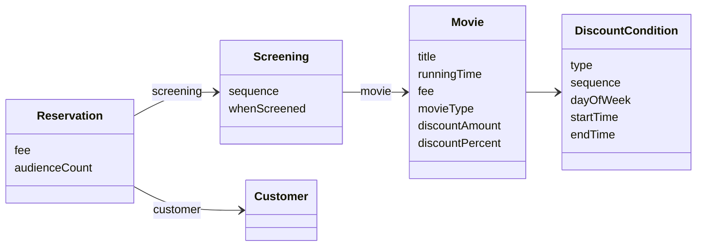
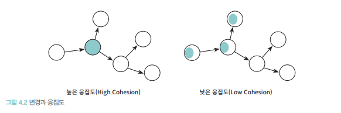
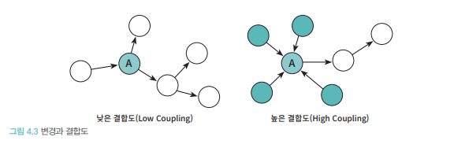
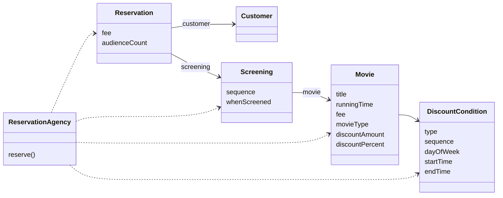
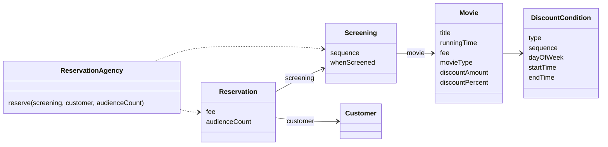

# 설계 품질과 트레이드오프

**객체지향 설계의 핵심은 역할, 책임, 협력이다.** 

- 협력: 애플리케이션의 기능을 구현하기 위해 메시지를 주고받는 객체들 사이의 상호작용
- 책임: 객체가 다른 객체와 협력하기 위해 수행하는 행동
- 역할: 대체 가능한 책임의 집합

**가장 중요한 것은 '책임'이다.**

협력은 책임이 모여야 가능하다. 역할은 책임의 집합이다. 따라서 책임이 적절히 할당되지 못하면 협력과 역할 모두 무너진다. 즉, 객체지향 설계의 품질은 책임 할당이 얼마나 적절한가에 달려 있다.

> 객체지향 설계란 올바른 객체에게 올바른 책임을 할당하면서, 낮은 결합도(loose coupling)와 높은 응집도(high cohesion)를 가진 구조를 창조하는 활동이다. [Evers09]
> 
- 관점 1: 객체지향 설계의 핵심은 책임이다.
- 관점 2: 책임 할당은 응집도와 결합도 같은 설계 품질과 밀접하게 연결된다.

**설계는 변경을 위해 존재하고 변경에는 어떤 식으로든 비용이 발생한다.**

- 훌륭한 설계 = 합리적인 비용안에서 변경을 수용할 수 있는 구조를 만드는 것
- 특징
    - 응집도가 높고
    - 결합도가 낮은 구조

결합도와 응직도를 합리적인 수준으로 유지하려면 객체의 상태가 아니라 객체의 책임에 초점을 맞춰야 한다.

책임은 객체의 상태에서 행동으로, 나아가 객체와 객체 사이의 상호작용으로 설계 중심을 이동시키고, 결합도가 낮고 응집도가 높으며 구현을 효과적으로 캡슐화하는 객체들을 창조할 수 있는 기반을 제공한다.

## 데이터 중심의 영화 예매 시스템

객체지향 설계에서는 두 가지 방법을 이용해 시스템을 객체로 분할할 수 있다. 

1. 상태(데이터) 중심 설계
    - 객체의 상태 = 객체가 저장해야 하는 데이터의 집합
    - 객체는 자신이 포함하고 있는 데이터를 조작하는 데 필요한 오퍼레이션을 정의한다.
2. 책임 중심 설계
    - 객체 = 다른 객체가 요청할 수 있는 오퍼레이션을 위해 필요한 상태를 보관
    - 협력에 필요한 행동(책임)을 먼저 정의 → 그 책임을 수행하기 위한 데이터가 따라옴

데이터 중심은 상태에, 책임 중심은 행동에 초점을 둔다. 좋은 객체지향 설계는 데이터가 아니라 책임에 초점을 맞춰야 한다.

- 상태(데이터)는 구현에 속한다 → 변하기 쉽다, 변경에 취약하다.
    
    데이터 중심으로 설계하면 내부 구현이 인터페이스로 노출 → 캡슐화 붕괴 → 인터페이스 변경 → 인터페이스에 의존하는 모든 객체에 영향
    
- 책임은 인터페이스에 속한다 → 상대적으로 안정적이다
    
    객체는 책임을 인터페이스로 드러내고, 내부 상태는 캡슐화 → 변경이 퍼져나가지 않는다
    

책임에 초점을 맞추면 상대적으로 변경에 안정적인 설계를 얻을 수 있게 된다.

데이터를 기준으로 분할한 영화 예매 시스템의 설계를 살펴보겠다. 

### 데이터를 준비하자

**데이터 중심의 설계:** 객체 내부에 저장되는 데이터를 기반으로 시스템을 분할하는 방법

```java
public class Movie {
	private String title;
	private Duration runningTime;
	private Money fee;
	
	private List<DiscountCondition> discountConditions;
	private MovieType movieType;
	private Money discountAmount;
	private double discountPercent;
}
```

- 기본 데이터: title, runningTime, fee (기존 설계와 동일)
- 할인 관련 데이터: discountConditions, movieType, discountAmount, discountPercent
    - 할인 정책이 Movie 안에 ‘데이터’로 직접 들어옴
    - DiscountPolicy라는 별도의 클래스 없음
- 할인에 사용되는 금액과 비율을 Movie 안에서 직접 정의
    - 할인 정책은 영화별로 하나만 지정할 수 있기 때문에 한 시점에 discountAmount와 discountPercent중 하나의 값만 사용

```java
public enum MovieType {
	AMOUNT_DISCOUNT,  // 금액 할인 정책
	PERCENT_DISCOUNT, // 비율 할인 정책
	NONE_DISCOUNT     // 미적용
}
```

- 영화에 사용된 할인 정책의 종류
- NONE_DISCOUNT인 경우에는 할인 정책을 적용하지 않기 때문에 discountAmount와 discountPercent 중 어떤 값도 사용하지 않는다.

Movie가 할인 금액을 계산하는 데 필요한 데이터는 무엇인가? 

- 금액 할인 정책의 경우에는 할인 금액이 필요하고 비율 할인 정책의 경우에는 할인 비율이 필요하다.
- 할인 금액과 할인 비율을 각각 discountAmount와 discountPercent라는 값으로 표현한다.

Movie에 설정된 할인 정책이 무엇인지를 알기 위해서 어떤 데이터가 필요한가?

- MovieType을 정의하고 이 타입의 값에 따라 어떤 데이터를 사용할지 결정한다.

데이터 중심의 설계에서는 객체가 포함해야 하는 데이터에 집중한다. 이 객체가 포함해야 하는 데이터는 무엇인가? 객체의 책임을 결정하기 전에 이런 질문의 반복에 휩쓸려 있다면 데이터 중심의 설계에 매몰돼 있을 확률이 높다. 

**데이터 중심의 설계 안에서 흔히 볼 수 있는 패턴**

- 인스턴스 변수(movieType)
- 인스턴스의 종류에 따라 배타적으로 사용될 인스턴스 변수(discountAmount, discountPercent)를 하나의 클래스 안에 함께 포함

캡슐화를 달성할 수 있는 가장 간단한 방법은 내부의 데이터를 반환하는 접근자(accessor)와 데이터를 변경하는 수정자(mutator)를 추가하는 것이다.

```java
public class Movie {

	public MovieType getMovieType() {
		return movieType;
	}
	
	public void setMovieType(MovieType movieType) {
		this.movieType = movieType;
	}
	
	public Money getFee() {
		return fee;
	}
	
	public void setFee(Money fee) {
		this.fee = fee;
	}
	
	public List<DiscountCondition> getDiscountConditions() {
		return Collections.unmodifiableList(discountConditions);
	}
	
	public void setDiscountConditions(
		List<DiscountCondition> discountConditions) {
		
		this.discountConditions = discountConditions;
	}
	
	public Money getDiscountAmount() {
		return discountAmount;
	}
	
	public void setDiscountAmount(Money discountAmount) {
		this.discountAmount = discountAmount;
	}
	
	public double getDiscountPercent() {
		return discountPercent;
	}
	
	public void setDiscountPercent(double discountPercent) {
		this.discountPercent = discountPercent;
	}
}
```

- getter/setter로 캡슐화

**할인 조건의 종류**

- 순번 조건: 상영 순번을 이용해 할인 여부를 판단
- 기간 조건: 상영 시간을 이용해 할인 여부를 판단

**할인 조건을 구현하는 데 필요한 데이터는 무엇인가?**

- 할인 조건의 종류를 저장할 데이터

```java
public enum DiscountConditionType {
	SEQUENCE,  // 순번 조건
	PERIOD     // 기간 조건
}
```

할인 조건을 구현하는 DiscountCondition은 할인 조건의 타입을 저장할 인스턴스 변수인 type을 포함한
다. 또한 movieType의 경우와 마찬가지로 순번 조건에서만 사용되는 데이터인 상영 순번(sequence)과 기
간 조건에서만 사용되는 데이터인 요일(dayofWeek), 시작 시간(startTime), 종료 시간(endTime)을 함께
포함한다.

```java
public class DiscountCondition {
	private DiscountConditionType type;
	private int sequence;
	private DayOfWeek dayOfWeek;
	private LocalTime startTime;
	private LocalTime endTime;
	
	public DiscountConditionType getType() {
		return type;
	}
	
	public void setType(DiscountConditionType type) {
		this.type = type;
	}
	
	public DayOfWeek getDayOfWeek() {
		return dayOfWeek;
	}
	
	public void setDayOfWeek(DayOfWeek dayOfWeek) {
		this.dayOfWeek = dayOfWeek;
	}
	
	public LocalTime getStartTime() {
		return startTime;
	}
	
	public void setStartTime(LocalTime startTime) {
		this.startTime = startTime;
	}
	
	public LocalTime getEndTime() {
		return endTime;
	}
	
	public void setEndTime(LocalTime endTime) {
		this.endTime = endTime;
	}
	
	public int getSequence() {
		return sequence;
	}
	
	public void setSequence(int sequence) {
		this.sequence = sequence;
	}
}
```

- DiscountConditionType (SEQUENCE, PERIOD)
    - 할인 조건의 타입을 저장할 인스턴스 변수인 type을 포함
- 타입에 따라 sequence / dayOfWeek + startTime + endTime 데이터를 가짐
- getter/setter 중심

```java
public class Screening {
	private Movie movie;
	private int sequence;
	private LocalDateTime whenScreened;
	
	public Movie getMovie() {
		return movie;
	}
	
	public void setMovie(Movie movie) {
		this.movie = movie;
	}
	
	public LocalDateTime getWhenScreened() {
		return whenScreened;
	}
	
	public void setWhenScreened(LocalDateTime whenScreened) {
		this.whenScreened = whenScreened;
	}
	
	public int getSequence() {
		return sequence;
	}
	
	public void setSequence(int sequence) {
		this.sequence = sequence;
	}
}
```

- 영화, 순번, 상영시간

```java
public class Reservation {
	private Customer customer;
	private Screening screening;
	private Money fee;
	
	private int audienceCount;
	public Reservation(Customer customer, Screening screening, Money fee, int audienceCount) {
		this.customer = customer;
		this.screening = screening;
		this.fee = fee;
		this.audienceCount = audienceCount;
	}
	
	public Customer getCustomer() {
		return customer;
	}
	
	public void setCustomer(Customer customer) {
		this.customer = customer;
	}
	
	public Screening getScreening() {
		return screening;
	}
	
	public void setScreening(Screening screening) {
		this.screening = screening;
	}
	
	public Money getFee() {
		return fee;
	}
	
	public void setFee(Money fee) {
		this.fee = fee;
	}
	
	public int getAudienceCount() {
		return audienceCount;
	}
	
	public void setAudienceCount(int audienceCount) {
		this.audienceCount = audienceCount;
	}
}
```

- 고객, 상영, 요금, 인원수

```java
public class Customer {
	private String name;
	private String id;
	
	public Customer(String name, String id) {
		this.id= id;
		this.name = name;
	}
}
```

- 이름, id



### 영화를 예매하자

`ReservationAgency`- 데이터 클래스들을 조합해서 영화 예매 절차를 구현하는 클래스

```java
public class ReservationAgency {
	public Reservation reserve(Screening screening, Customer customer, int audienceCount) {
		Movie movie = screening.getMovie();
		
		boolean discountable = false;
		
		// 1. DiscountCondition 확인 → 할인 가능 여부 결정
		for(DiscountCondition condition : movie.getDiscountConditions()) {
			if (condition.getType() = DiscountConditionType.PERIOD) {
					discountable = screening.getWhenScreened().getDayOfWeek().equals(condition.getDayOfWeek()) &&
					condition.getStartTime().compareTo(screening.getWhenScreened().toLocalTime()) <= 0 &&
					condition.getEndTime().compareTo(screening.getWhenScreened().toLocalTime())>0;
			} else {
				discountable = condition.getSequence() = screening.getSequence();
			}
			
			if (discountable) {
				break;
			}
		}
		
		Money fee;
		// 할인 여부 확인
		if (discountable) {
			Money discountAmount = Money.ZERO;
			
			// 2. 할인 정책 분기 → 금액/비율/없음에 따라 요금 계산
			switch(movie.getMovieType()) {
				case AMOUNT_DISCOUNT:
					discountAmount = movie.getDiscountAmount();
					break;
				case PERCENT_DISCOUNT:
					discountAmount = movie.getFee().times(movie.getDiscountPercent());
					break;
				case NONE_DISCOUNT:
					discountAmount = Money.ZERO;
					break;
			}
			
			// 할인 금액 차감
			fee = movie.getFee().minus(discountAmount);
		} else {
			// 기본 요금
			fee = movie.getFee();
		}
		
		// 3. Reservation 생성
		return new Reservation(customer, screening, fee, audienceCount);
	}
}
```

- 핵심 비즈니스 로직이 ReservationAgency 한 곳에 집중
- 개별 객체(Movie, DiscountCondition 등)는 수동적 데이터 보관소 역할만 함

## 설계 트레이드오프

데이터 중심 설계 vs 책임 중심 설계

### 캡슐화

변경 가능성이 높은 부분을 객체 내부로 숨기는 추상화 기법.

변경 가능성이 높은 구현(나중에 변경될 가능성이 높은 어떤 것)을 내부에 숨기고, 안정적인 인터페이스만 외부에 제공

> 복잡성을 다루기 위한 가장 효과적인 도구는 추상화다. 다양한 추상화 유형을 사용할 수 있지만 객체지향 프로그래밍에서 복잡성을 취급하는 주요한 추상화 방법은 캡슐화다. 그러나 프로그래밍할 때 객체지향 언어를 사용한다고 해서 애플리케이션의 복잡성이 잘 캡슐화될 것이라고 보장할 수는 없다. 훌륭한 프로그래밍 기술을 적용해서 캡슐화를 향상시킬 수는 있겠지만 객체지향 프로그래밍을 통해 전반적으로 얻을 수 있는 장점은 오직 설계 과정 동안 캡슐화를 목표로 인식할 때만 달성될 수 있다[Wirfs-Brock89]
> 

- 목표: 변경 파급효과 최소화
    - 변경의 정도에 따라 구현과 인터페이스를 분리하고 외부에서는 인터페이스에만 의존하도록 관계를 조절
- 데이터 중심 설계
    - getter/setter 중심 설계는 상태 노출 → 캡슐화 위반
    - 결국 내부 구현이 외부로 드러나며 변경에 취약해짐

> 유지보수성이 목표다. 여기서 유지보수성이란 두려움 없이, 주저함 없이, 저항감 없이 코드를 변경할 수 있는 능력을 말한다. … 가장 중요한 동료는 캡슐화다. 캡슐화란 어떤 것을 숨긴다는 것을 의미한다. 우리는 시스템의 한 부분을 다른 부분으로부터 감춤으로써 뜻밖의 피해가 발생할 수 있는 가능성을 사전에 방지할 수 있다. 만약 시스템이 완전히 캡슐화된다면 우리는 변경으로부터 완전히 자유로워질 것이다. 만약 시스템의 캡슐화가 크게 부족하다면 우리는 변경으로부터 자유로울 수 없고, 결과적으로 시스템은 진화할 수 없을 것이다. 응집도, 결합도, 중복 역시 훌륭한(변경 가능한) 코드를 규정하는 데 핵심적인 품질인 것이 사실이지만 캡슐화는 우리를 좋은 코드로 안내하기 때문에 가장 중요한 제1원리다[Bain08]
> 

### 응집도와 결합도

**응집도**

- 모듈에 포함된 내부 요소들이 연관돼 있는 정도. 객체 또는 클래스에 얼마나 관련 높은 책임들을 할당했는지를 나타낸다
- 모듈 내의 요소들이 하나의 목적을 위해 긴밀하게 협력한다면 그 모듈은 높은 응집도를 가진다
- 낮은 응집도
    - 모듈 내의 요소들이 서로 다른 목적을 추구
    - 하나의 요구사항 변경을 반영하기 위해 여러 클래스를 동시에 수정해야 함
- **예시(영화 예매 시스템)**:
    - ReservationAgency 안에 **할인 정책 선택 로직 + 할인 조건 판단 로직 + 요금 계산 로직**이 모두 뒤섞여 있음.
    - 새로운 할인 정책/조건 추가 시 `ReservationAgency`, `Movie`, `DiscountCondition` 등 여러 클래스가 함께 변경돼야 함.

**결합도**

- 의존성의 정도. 객체 또는 클래스가 협력에 필요한 적절한 수준의 관계만을 유지하고 있는지를 나타낸다.
- 다른 모듈에 대해 얼마나 많은 지식을 갖고 있는지를 나타내는 척도
- 낮은 결합도
    - 다른 모듈에 대해 꼭 필요한 지식만 알고 있다
    - 변경이 발생해도 영향 범위가 최소화된다
- 높은 결합도(데이터 중심 설계):
    - 접근자(getter) 의존 → 내부 필드 변경 시 연쇄적으로 클라이언트 코드 수정 필요.
    - 제어 로직 집중 → ReservationAgency가 거의 모든 데이터 객체와 결합.
    - 결과적으로 시스템 전체가 거대한 의존성 덩어리가 됨.
- 예외: 변경될 가능성이 낮은 안정된 모듈(String, ArrayList 등)에 대한 결합은 문제 아님

❓ ****모듈 내의 요소가 얼마나 강하게 연관돼 있어야 응집도가 높다고 말할 수 있는가 ❓

❓ 모듈사이에 어느 정도의 의존성만 남겨야 결합도가 낮다고 말할 수 있는가 ❓

**두 개념 모두 설계와 관련 있다**

좋은 설계란 높은 응집도와 낮은 결합도를 가진 모듈로 구성된 설계를 의미한다.

좋은 설계 = 오늘의 기능을 수행하면서 내일의 변경을 수용할 수 있는 설계

👉 응집도와 결합도는 변경과 관련된다.

변경의 관점

- 응집도
    - 변경이 발생할 때 모듈 내부에서 발생하는 변경의 정도로 측정
    - 변화 → 모듈 전체가 함께 변경 = 응집도 ⏫
    - 변화 → 모듈의 일부만 변경 = 응집도 ⏬
    - 변화 → 하나의 모듈만 변경 = 응집도 ⏫
    - 변화 → 다수의 모듈이 변경 = 응집도 ⏬
        
        
        
        음영: 변경이 발생했을 때 수정되는 영역
        
        응집도가 높을수록 변경의 대상과 범위가 명확해지기 때문에 코드를 변경하기 쉬워진다
        
- 결합도
    - 한 모듈이 변경되기 위해서 다른 모듈의 변경을 요구하는 정도로 측정
        
        결합도가 높을수록 함께 변경해야 하는 모듈의 수가 늘어나기 때문에 변경이 어려워진다
        
    - 내부 구현을 변경 → 다른 모듈에 영향 = 결합도 ⏫
    - 퍼블릭 인터페이스를 수정했을 때만 다른 모듈에 영향 = 결합도 ⏬
        
        
        
    - 결합도가 높아도 상관 없는 경우: 변경될 확률이 매우 적은 안정적인 모듈에 의존하
    는 것 (표준 라이브러리, 성숙 단계에 접어든 프레임워크 - String, ArrayList)

**캡슐화의 정도가 응집도와 결합도에 영향을 미친다**

캡슐화를 지키면 모듈 안의 응집도는 높아지고 모듈 사이의 결합도는 낮아진다. 

따라서 응집도와 결합도를 고려하기 전에 먼저 캡슐화를 향상시키기 위해 노력하라.

## 데이터 중심의 영화 예매 시스템의 문제점

데이터 중심 설계와 책임 중심 설계는 기능적인 측면에서 동일하지만 캡슐화를 다루는 방식에서 완전히 다르다.

데이터 중심 설계: 캡슐화를 위반하고 객체의 내부 구현을 인터페이스의 일부로 만든다.

책임 중심의 설계: 객체의 내부 구현을 안정적인 인터페이스 뒤로 캡슐화한다.

**데이터 중심의 설계가 가진 대표적인 문제점**

- 캡슐화 위반
- 높은 결합도
- 낮은 응집도

### 캡슐화 위반

```java
public class Movie {
	private Money fee;
	
	public Money getFee() {
		return fee;
	}
	
	public void setFee(Money fee) {
		this.fee = fee;
	}
}
```

- 메서드를 통해서만 객체의 내부 상태에 접근할 수 있다. getter/setter
- 캡슐화의 원칙을 지키고 있는 것처럼 보이지만 접근자와 수정자 메서드는 객체 내부의 상태에 대한 어떤 정보도 캡슐화하지 못한다
    - Movie 내부에 Money 타입의 fee라는 이름의 인스턴스 변수가 존재한다는 사실을 퍼블릭 인터페이스에 드러남

**문제: 객체가 수행할 책임이 아니라 내부에 저장할 데이터에 초점을 맞춤**

객체 지향의 핵심은 데이터보다 책임에 있다.

- 책임은 혼자 정할 수 없고, 협력이라는 문맥 안에서 적절하게 정의된다.
- 맥을 추측할 수밖에 없는 경우, 객체의 내부 상태를 외부에서 직접 꺼내 쓰거나 바꾸려는 요구가 생긴다.
    - 접근자(getter), 수정자(setter) 가 남발
    - 객체의 내부 구현이 퍼블릭 인터페이스에 그대로 노출
    - 무너지는 캡슐화

> 앨런 홀럽(Allen Holub)은 이처럼 접근자와 수정자에 과도하게 의존하는 설계 방식을 **추측에 의한 설
계** 전략(design-by-guessing strategy)[Holub04]이라고 부른다.
> 
- 객체가 협력 속에서 어떤 책임을 질지 고민하지 않고, “언젠가 필요할지도 모른다”는 추측에 따라 설계하는 방식
    - **최대한 많은 접근자/수정자**를 만들어둔다.
    - 결과적으로 객체가 모든 상황에서 사용될 수 있는 것처럼 보이지만, 사실상 아무것도 보호하지 못한다.
    - 변경에 취약한 코드가 된다.

### 높은 결합도

객체 내부의 구현이 객체의 인터페이스에 드러난다 = 클라이언트가 구현에 강하게 결합

= 객체의 내부 구현을변경한다 = 이 인터페이스에 의존하는 모든 클라이언트들도 함께 변경해야 한다

```java
public class ReservationAgency {
	public Reservation reserve(Screening screening, Customer customer, int audienceCount) {
		...
		Money fee;
		if (discountable) {
			fee = movie.getFee().minus(discountedAmount).times(audienceCount);
		} else {
			fee = movie.getFee();
		}
		...
	}
}
```

Movie의 getFee() 반환 타입이 바뀌면? ⇒ Movie 뿐 아니라 ReservationAgency 까지 수정해야 한다.

- private 변수를 public으로 바꾼 것과 다를 바 없다
- 클라이언트 코드가 객체 구현에 강하게 결합된다.

**여러 데이터 객체들을 사용하는 제어 로직이 특정 객체 안에 집중된다.**

하나의 제어 객체가 다수의 데이터 객체에 강하게 결합된다. 데이터 객체를 변경하더라도 제어 객체를 함께 변경할 수밖에 없다.

- `ReservationAgency`가 제어 객체 역할
    - `Movie`, `Screening`, `DiscountCondition`, `Reservation` 등 모든 데이터 객체에 의존
    - 하나라도 데이터 구조가 바뀌면 `ReservationAgency`까지 수정해야함
- 그 결과 제어 객체는 의존성의 집결지가 된다.



데이터 중심의 설계는 전체 시스템을 하나의 거대한 의존성 덩어리로 만들다.

### 낮은 응집도

하나의 모듈이 서로 다른 이유로 변경되는 코드를 동시에 포함할 때, 그 모듈의 응집도가 낮다고 한다.

모듈의 응집도를 살펴보기 위해서는 코드를 수정하는 이유를 봐야 한다.

**ReservationAgency 수정 이유**

- 할인 정책이 추가 될 경우
- 할인 정책별로 할인 요금을 계산하는 방법이 변경될 경우
- 할인 조건이 추가되는 경우
- 할인 조건별로 할인 여부를 판단하는 방법이 변경될 경우
- 예매 요금을 계산하는 방법이 변경될 경우

서로 관련 없는 변경 이유가 한 클래스 안에 몰려 있다.

**낮은 응집도가 불러오는 문제**

1. 불필요한 변경 전파
    - 관련 없는 코드가 한 모듈 안에 묶여 있기 때문에, A를 수정했는데 B까지 영향을 받는다.
        - `ReservationAgency` 안에 할인 정책 선택 로직 + 할인 조건 판단 로직이 같이 존재.
        - 새로운 할인 정책 추가 시, 할인 조건 코드까지 영향 가능.
2. 하나의 요구사항 변경 반영 → 여러 모듈 수정
    - 응집도가 낮으면 책임이 흩어져 있어서, 작은 요구사항 변경도 여러 클래스 동시 수정으로 이어진다.
    - 새로운 할인 정책 추가 시
        - `MovieType` → 새로운 enum 값 추가
        - `ReservationAgency` → `reserve()` 메서드의 switch문에 case 추가
        - `Movie` → 새로운 정책에 필요한 데이터 추가
    - 할인 조건 추가 시
        - `DiscountConditionType`에 enum 값 추가
        - `DiscountCondition`에 데이터 추가
        - `ReservationAgency`에 if문 조건식 추가

## 자율적인 객체를 향해

### 캡슐화를 지켜라

객체지향 설계의 제1원리 = 캡슐화

- 객체는 자신의 데이터를 외부에 공개해서는 안된다
- 객체는 자신의 상태를 스스로 책임져야 하며,  외부에서는 인터페이스에 정의된 메서드를 통해서만 접근해야 한다.
- 객체에게 의미 있는 메서드는 객체가 책임져야 하는 무언가를 수행하는 메서드다.
    - 접근자와 수정자를 통해 속성을 외부로 제공하고 있다면 캡슐화를 위반하는 것(getter/setter)

**예시**

Rectangle은 사각형의 좌표들을 포함하고 각 속성에 대한 접근자와 수정자 메서드를 제공한다.

```java
class Rectangle {
	private int left;
	private int top;
	private int right;
	private int bottom;
	
	public Rectangle(int left, int top, int right, int bottom) {
		this.left = left;
		this.top = top;
		this.right = right;
		this.bottom = bottom;
	}
	public int getLeft() { return left; }
	public void setLeft(int left) { this.left = left; }
	public int getTop() { return top; }
	public void setTop(int top) { this.top = top; }
	public int getRight() { return right; }
	public void setRight(int right) { this.right = right; }
	public int getBottom() { return bottom; }
	public void setBottom(int bottom) { this.bottom = bottom; }
}
```

이 사각형의 너비와 높이를 증가시키는 코드가 필요하다. 이 코드는 Rectangle 외부의 어떤 클래스 안에 구현돼있다.

```java
class AnyClass {
	void anyMethod(Rectangle rectangle, int multiple) {
		rectangle.setRight(rectangle.getRight() *multiple);
		rectangle.setBottom(rectangle.getBottom() * multiple);
		...
	}
}
```

**문제점**

1. 코드 중복 
    
    너비/높이 변경 로직이 외부 클래스에서 중복 작성된다
    
    - 아마 그곳에서 getRight와 getBottom 메서드를 호출해서 수정자 메서드를 이용해 값을 설정할 것
2. 변경에 취약
    
    `right`, `bottom`을 `length`, `height`로 바꾸면, 관련 getter/setter 및 이를 호출하는 모든 외부 코드 변경이 필요하다.
    

**해결 방법 = 책임 이동 + 캡슐화 강화**

```java
class Rectangle {
	public void enlarge(int multiple) {
		right *= multiple;
		bottom *= multiple;
	}
}
```

- 외부에서 크기를 조정하던 로직을 Rectangle 내부로 이동.
- 객체가 스스로 자신의 상태를 책임짐.

### 스스로 자신의 데이터를 책임지는 객체

객체를 단순히 데이터 구조체로 만들지 않으려면 두 가지 질문이 필요하다:

1. 이 객체가 어떤 데이터를 포함해야 하는가 ?
2. 이 객체가 데이터에 대해 수행해야 하는 오퍼레이션은 무엇인가?

이 두 질문을 조합하면, **데이터 + 행동 = 객체** 가 된다.

**할인 조건 책임 이동:** `ReservationAgency` →`DiscountCondition`

```java
public class DiscountCondition {
	private DiscountConditionType type;
	private int sequence;
	private DayOfWeek dayOfWeek;
	private LocalTime startTime;
	private LocalTime endTime;
	
	public DiscountConditionType getType() {
		return type;
	}
	
	public boolean isDiscountable(DayOfWeek dayOfWeek, LocalTime time) {
		if (type != DiscountConditionType.PERIOD) {
			throw new IllegalArgumentException();
		}
		
		return this.dayOfWeek.equals(dayOfWeek) &&
						this.startTime.compareTo(time) <= 0 8&
						this.endTime.compareTo(time) > 0;
	}
	
	public boolean isDiscountable(int sequence) {
		if (type != DiscountConditionType.SEQUENCE) {
			throw new IllegalArgumentException();
		}
		return this.sequence = sequence;
	}
}
```

책임: 할인 가능 여부 판단

1. 포함할 데이터: `type`, `sequence`, `dayOfWeek`, `startTime`, `endTime`
2. 수행해야 하는 오퍼레이션: `isDiscountable()` 두 가지 할인 조건을 판단

**영화 책임 이동:** `Movie`

```java
public class Movie {
	private String title;
	private Duration runningTime;
	private Money fee;
	private List<DiscountCondition> discountConditions;
	private MovieType movieType;
	private Money discountAmount;
	private double discountPercent;
	
	public MovieType getMovieType() {
		return movieType;
	}
	
	// 정책별로 요금을 계산하는 세 가지 방법
	public Money calculateAmountDiscountedFee() {
		if (movieType != MovieType.AMOUNT_DISCOUNT) {
			throw new IllegalArgumentException();
		}
		return fee.minus(discountAmount);
	}
	
	public Money calculatePercentDiscountedFee() {
		if (movieType != MovieType.PERCENT_DISCOUNT) {
			throw new IllegalArgumentException();
		}
		return fee.minus(fee.times(discountPercent));
	}
	
	public Money calculateNoneDiscountedFee() {
		if (movieType != MovieType.NONE_DISCOUNT) {
			throw new IllegalArgumentException();
		}
		return fee;
	}
	
	public boolean isDiscountable(LocalDateTime whenScreened, int sequence) {
		// 조건 확인
		for(DiscountCondition condition : discountConditions) {
			// 기간 조건
			if (condition.getType() = DiscountConditionType.PERIOD) {
				if (condition.isDiscountable(whenScreened.getDayOfWeek(), whenScreened.toLocalTime())) {
					return true;
				}
			} else {
				// 순번 조건
				if (condition.isDiscountable(sequence)) {
					return true;
				}
			}
		}

		return false;
	}
	
}
```

책임: 요금 계산, 할인 조건 판단

1. 포함할 데이터: 영화 기본 정보, 할인 정책 정보
2. 수행해야 하는 오퍼레이션: 
    - `calculateXxxFee()` 정책별로 요금 계산
    - `isDiscountable()` 할인 여부를 판단
        - 기간 조건: dayOfWeek, whenScreened
        - 순번 조건: sequence
        

**상영 책임 이동:** `Screening`

```java
public class Screening {
	private Movie movie;
	private int sequence;
	private LocalDateTime whenScreened;
	
	public Screening(Movie movie, int sequence, LocalDateTime whenScreened) {
		this.movie = movie;
		this.sequence = sequence;
		this.whenScreened = whenScreened;
	}
	
	public Money calculateFee(int audienceCount) {
		switch (movie.getMovieType()) {
			case AMOUNT_DISCOUNT:
				if (movie.isDiscountable(whenScreened, sequence)) {
					return movie.calculateAmountDiscountedFee().times(audienceCount);
				}
				break;
			case PERCENT_DISCOUNT:
				if (movie.isDiscountable(whenScreened, sequence)) {
					return movie.calculatePercentDiscountedFee().times(audienceCount);
				}
			case NONE_DISCOUNT:
				return movie.calculateNoneDiscountedFee().times(audienceCount);
		}
		
		return movie.calculateNoneDiscountedFee().times(audienceCount);
	}
}
```

책임: 상영 요금 계산

1. 포함할 데이터: 영화, 상영 순번, 상영 시간
2. 수행해야 하는 오퍼레이션:  할인 여부 판단은 `Movie`에게 위임

**예약 절차 단순화**: `ReservationAgency`

```java
public class ReservationAgency {
	public Reservation reserve(Screening screening, Customer customer, int audienceCount) {
		Money fee = screening.calculateFee(audienceCount);
		return new Reservation(customer, screening, fee, audienceCount);
	}
}
```

- 단순히 Screening에게 요금 계산을 위임
- 예매 요금 계산 로직이 사라지고, 응집도와 캡슐화가 강화됨



1. 결합도 감소
    - `ReservationAgency`에 몰려있던 책임이 흩어짐
2. 응집도 증가
    - 할인 로직은 `DiscountCondition`
    - 요금 계산은 `Movie`와 `Screening`이 맡음
3. 캡슐화 강화
    - 각 객체가 자신의 데이터를 스스로 책임짐

데이터 객체 → 책임 객체

## 하지만 여전히 부족하다

본질적으로는 두 번째 설계 역시 데이터 중심의 설계 방식에 속한다.
첫 번째 설계에서 발생했던 대부분의 문제는 두 번째 설계에서도 여전히 발생한다.

### 캡슐화 위반

DiscountCondition은 자기 자신의 데이터를 이용해 할인 가능 여부를 스스로 판단하고 있지만

```java
public class DiscountCondition {
	private DiscountConditionType type;
	private int sequence;
	private DayOfWeek dayOfWeek;
	private LocalTime startTime;
	private LocalTime endTime;
	
	public DiscountConditionType getType() { ... }
	public boolean isDiscountable(DayOfWeek dayOfWeek, LocalTime time) { ... }
	
	public boolean isDiscountable(int sequence) { ... }
}
```

- `isDiscountable` 메서드의 시그니처가 내부 상태(`dayOfWeek`, `LocalTime`, `sequence`)를 외부에 노출한다.
- `getType()` 메서드가 `DiscountConditionType`을 외부로 드러낸다.

만약 DiscountCondition의 속성을 변경해야 한다면?

1. 두 isDiscountable 메서드의 파라미터를 수정
2. 해당 메서드를 사용하는 모든 클라이언트도 함께 수정

⇒  캡슐화 실패.

```java
public class Movie {
	private String title;
	private Duration runningTime;
	private Money fee;
	private List<DiscountCondition> discountConditions;
	
	private MovieType movieType;
	private Money discountAmount;
	private double discountPercent;
	
	public MovieType getMovieType() { ... }
	public Money calculateAmountDiscountedFee() { ... }
	public Money calculatePercentDiscountedFee() { ... }
	public Money calculateNoneDiscountedFee() { ... }
}
```

- 요금 계산 메서드들이 할인 정책의 종류(`AMOUNT_DISCOUNT`, `PERCENT_DISCOUNT`, `NONE_DISCOUNT`)를 인터페이스에서 드러냄
    - "할인 정책이 세 가지 존재한다"라는 사실을 클라이언트가 알게 된다.
- 새로운 할인 정책 추가/제거 시, 클라이언트 코드도 수정해야 한다. → 캡슐화 실패

### 높은 결합도

DiscountCondition의 내부 구현이 외부로 노출됐기 때문에 Movie와 DiscountCondition 사이의 결합도는 높을 수밖에 없다. 

- `Movie.isDiscountable` 메서드는 `DiscountCondition`의 내부 구현(타입, 조건 판단 방식)에 직접 의존한다.

```java
public class Movie {
	public boolean isDiscountable(LocalDateTime whenScreened, int sequence) {
		for(DiscountCondition condition : discountConditions) {
			if (condition.getType() = DiscountConditionType.PERIOD) {
				if (condition.isDiscountable(whenScreened.getDayOfWeek(), whenScreened.toLocalTime())) {
					return true;
				}
			} else {
				if (condition.isDiscountable(sequence)) {
					return true;
				}
			}
		}
		return false;
	}
}
```

**문제: DiscountCondition의 구현 변경이 Movie에 전파된다.**

1. `DiscountConditionType.PERIOD`이 다른 값으로 바뀌면 `Movie`도 수정해야 한다.
2. 새로운 할인 조건 추가/삭제 시 `Movie`의 `if~else` 구문을 수정해야 한다.
3. 조건 판단에 필요한 정보 변경 시 `isDiscountable` 시그니처가 바뀌고, `Screening`까지 수정해야 한다.

→ 결합도 높음

원인: DiscountCondition의 내부 구현을 제대로 캡슐화하지 못함

### 낮은 응집도

`Screening.calculateFee`는 영화 요금을 계산하면서 할인 정책 종류와 조건 판단 방식까지 함께 다룬다.

```java
public class Screening {
	public Money calculateFee(int audienceCount) {
		switch (movie.getMovieType()) {
		case AMOUNT_DISCOUNT:
			if (movie.isDiscountable(whenScreened, sequence)) {
				return movie.calculateAmountDiscountedFee().times(audienceCount);
			}
			break;
		case PERCENT_DISCOUNT:
			if (movie.isDiscountable(whenScreened, sequence)) {
				return movie.calculatePercentDiscountedFee().times(audienceCount);
			}
		case NONE_DISCOUNT:
			return movie.calculateNoneDiscountedFee().times(audienceCount);
		}
		
		return movie.calculateNoneDiscountedFee().times(audienceCount);
	}
}
```

**문제**

1. `DiscountCondition`이 할인 여부를 판단하는 데 필요한 정보 변경됨 
2. `Movie.isDiscountable` 메서드로 전달해야 하는 파라미터의 종류 변경 
3. `Screening`에서 `Movie.isDiscountable` 메서드를 호출하는 부분도 함께 변경

→ 응집도 낮음: 하나의 변경이 여러 클래스에 파급 

원인: 캡슐화를 위반. DiscountCondition과 Movie의 내부 구현이 인터페이스에 그대로 노출되고 있고 Screening은 노출된 구현에 직접적으로 의존. 

## 데이터 중심 설계의 문제점

데이터 중심 설계는 캡슐화를 위반하기 때문에 변경에 취약하다.

데이터 중심의 설계가 변경에 취약한 이유는

- 데이터 중심의 설계는 본질적으로 너무 이른 시기에 데이터에 관해 결정하도록 강요한다.
- 데이터 중심의 설계에서는 협력이라는 문맥을 고려하지 않고 객체를 고립시킨 채 오퍼레이션을 결정한다.

### 데이터 중심 설계는 객체의 행동보다는 상태에 초점을 맞춘다

데이터 중심의 설계를 시작할 때 던졌던 첫 번째 질문:  **"이 객체가 포함해야 하는 데이터가 무엇인가?"** 

처음부터 데이터에 관해 결정하도록 강요하기 때문에 너무 이른 시기에 내부 구현에 초점을 맞추게 한다.

데이터와 기능을 분리하는 절차적 프로그래밍 방식으로 흐르기 쉽다.

**설계 실패의 두가지 이유**

1. 객체가 단순히 데이터 집합이 되며, 접근자(getter)와 수정자(setter)가 남발된다. 이 경우 public 필드와 다를 게 없어서 캡슐화가 무너진다.
2. 데이터를 먼저 결정하고 오퍼레이션을 나중에 붙이다 보니, 인터페이스가 내부 구현을 드러낸다.

결과적으로 응집도·결합도가 망가지고 변경에 취약해진다.

### 데이터 중심 설계는 객체를 고립시킨 채 오퍼레이션을 정의하도록 만든다

객체지향 애플리케이션을 구현한다 = 것협력하는 객체들의 공동체를 구축한다

책임은 “내부 구현”이 아니라 외부 협력 문맥 속에서 정해져야 한다. **“다른 객체와 어떻게 협력하는가”**

데이터 중심 설계는 협력 고려 없이 내부 데이터부터 정한다.

- 객체의 구현이 이미 결정된 상태에서 협력 방식을 맞추려다 보니, 객체 인터페이스가 구현 세부사항에 종속된다.
- 내부 변경이 협력 객체 전부에 영향을 주게 되어 변경에 취약해진다.