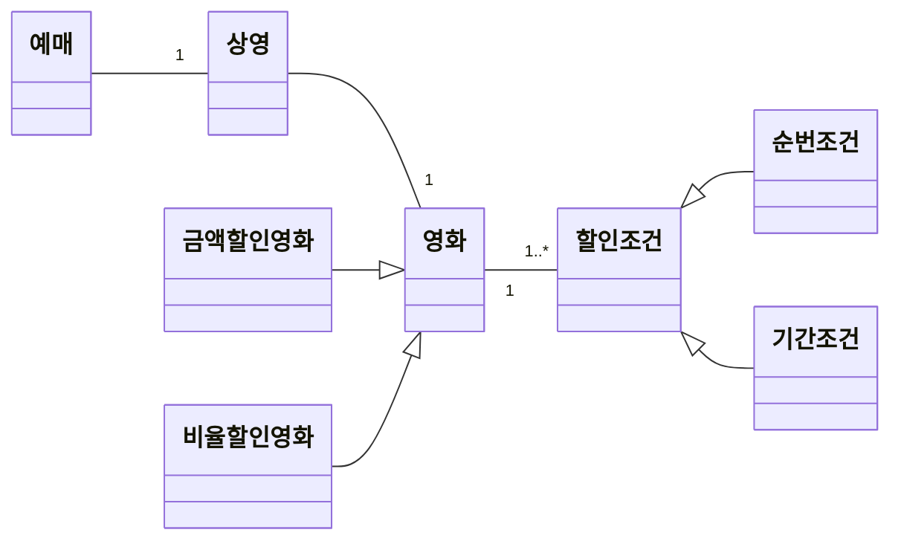
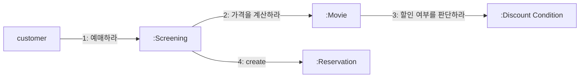
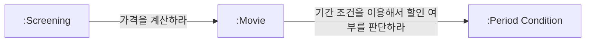
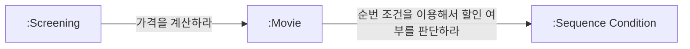
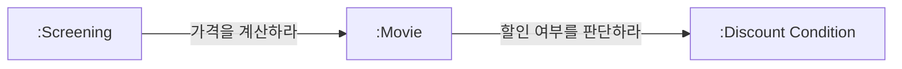
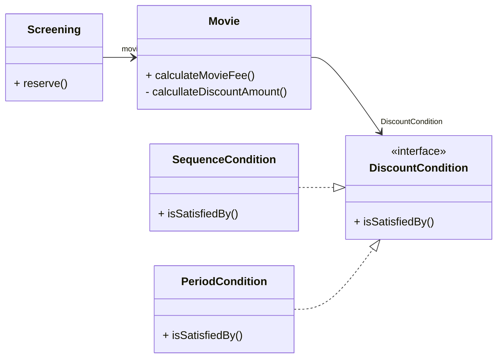
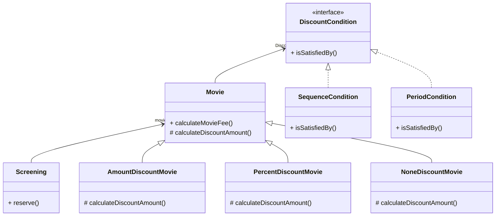
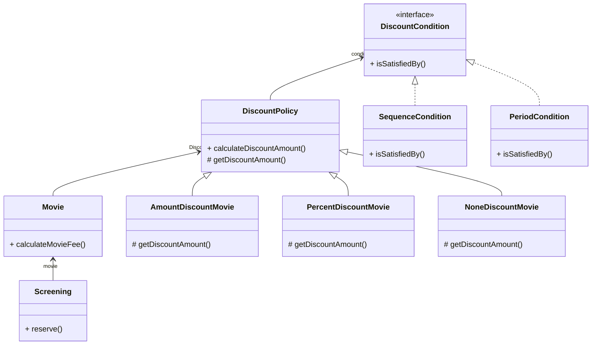

# 책임 할당하기

책임 할당은 트레이드오프 활동이다. 

→ 여러 가지 방법이 가능하고, 상황과 문맥에 따라 최선의 선택이 달라진다. 따라서 책임을 올바르게 할당하려면 응집도, 결합도, 캡슐화 같은 다양한 기준으로 설계를 평가할 수 있어야 한다. 이를 돕는 것이 **GRASP 패턴**이다.

## 책임 주도 설계를 향해

데이터 중심의 설계에서 책임 중심의 설계로 전환하기 위한 두 가지 원칙

- 데이터보다 행동을 먼저 결정하라
- 협력이라는 문맥 안에서 책임을 결정하라

### 데이터보다 행동을 먼저 결정하라

**객체지향 설계에서 가장 중요한 것은 적절한 객체에게 적절한 책임을 할당하는 능력이다.**

- 클라이언트의 관점에서 객체가 하는 행동 = 객체의 **책임**
    - 객체는 협력에 참여하기 위해 존재하며 협력 안에서 수행하는 책임이 객체의 존재가치를 증명한다.
    - 데이터는 단지 책임을 수행하기 위한 재료일 뿐이다.
- 잘못된 접근
    - 객체의 행동이 아니라 데이터에 초점을 맞춤 → 캡슐화 약화 → 변경 취약
    - "이 객체가 포함해야 하는 데이터가 무엇인가" → "데이터를 처리하는 데 필요한 오퍼레이션은 무엇인가"
- 올바른 접근
    - 행동에 초점. 책임 결정 후 상태 결정
    - "이 객체가 수행해야 하는 책임은 무엇인가" → "이 책임을 수행하는 데 필요한 데이터는 무엇인가”

### 협력이라는 문맥 안에서 책임을 결정하라

**책임은 객체의 입장이 아니라 객체가 참여하는 협력에 적합해야 한다.**

- 책임은 객체 자신의 입장이 아니라, 협력하는 문맥에 맞아야 한다.
- 책임이 조금 어색해 보이더라도 협력에 적합하다면 그 책임은 좋은 것이다.

**메시지의 역할**

협력은 메시지 전송자에서 시작한다. 따라서 올바른 책임은 메시지를 전송하는 클라이언트의 의도에 맞아야 한다.

- 절차: 메시지가 객체를 선택
    - 메시지를 먼저 결정한다 → 메시지를 처리할 객체가 뒤따라 결정된다.

**메시지가 클라이언트의 의도를 표현한다**

**객체를 결정하기 전에 객체가 수신할 메시지를 먼저 결정한다**

⇒ 클라이언트는 단지 임의의 객체가 메시지를 수신할 것이라는 사실을 믿고 자신의 의도를 표현한 메시지를 전송할 뿐이다. 메시지를 수신하기로 결정된 객체는 메시지를 처리할 '책임'을 할당받게 된다.

👉 메시지 전송자의 관점에서 메시지 수신자가 깔끔하게 캡슐화되는 것. 이렇게 하면 객체의 구현 세부사항이 캡슐화되고, 응집도가 높고 결합도가 낮은 설계를 만들 수 있다.

**정리**

- 객체에게 적절한 책임을 할당하기 위해서는 협력이라는 문맥을 고려해야 한다.
- 협력이라는 문맥에서 적절한 책임이란 곧 클라이언트의 관점에서 적절한 책임을 의미한다.
- 올바른 객체지향 설계는 클라이언트가 전송할 메시지를 결정한 후에야 비로소 객체의 상태를 저장하는 데 필요한 내부 데이터에 관해 고민하기 시작한다.

### 책임 주도 설계

3장에서 설명한 책임 주도 설계의 흐름

1. 시스템이 사용자에게 제공해야 하는 기능인 시스템 책임을 파악한다.
2. 시스템 책임을 더 작은 책임으로 분할한다.
3. 분할된 책임을 수행할 수 있는 적절한 객체 또는 역할을 찾아 책임을 할당한다.
4. 객체가 책임을 수행하는 도중 다른 객체의 도움이 필요한 경우 이를 책임질 적절한 객체 또는 역할을 찾는다.
5. 해당 객체 또는 역할에게 책임을 할당함으로써 두 객체가 협력하게 한다.

**책임 결정 → 객체 결정**

- 책임이 정리되기 전까지는 객체의 내부 상태에 대해 관심을 가지지 않는다.

## 책임 할당을 위한 GRASP 패턴

**GRASP**

- 여러 책임 할당 기법 중 가장 널리 알려진 기법
- 크레이그 라만(Craig Larman)이 제안
- GRASP = *General Responsibility Assignment Software Pattern.* 일반적인 책임 할당을 위한 소프트웨어 패턴
- 객체에게 책임을 할당할 때 지침으로 삼을 수 있는 원칙들의 집합을 패턴 형식으로 정리한 것

### 도메인 개념에서 출발하기

**설계를 시작하기 전, 도메인의 개략적 모습을 그려보는 것이 유용하다.**

- 도메인 개념은 책임 할당의 중요한 후보가 되며, 코드에 도메인의 모습을 투영하기 쉽게 만든다.
- 이 단계에서는 정확하고 완벽할 필요는 없다. 출발점으로서 충분하다.
- 중요한 것은 설계를 시작하는 것이지 도메인 개념들을 완벽하게 정리하는 것이 아니다.



- 하나의 영화는 여러 번 상영될 수 있다.
- 하나의 상영은 여러 번 예약될 수 있다.
- 영화는 다수의 할인 조건을 가질 수 있으며 할인 조건에는 순번 조건과 기간 조건이 존재한다.
- 할인 조건은 순번 조건과 기간 조건으로 분류되고 영화는 금액이 나 비율에 따라 할인될 수 있지만 동시에 두 가지 할인 정책을 적용할 수 없다.

**참고: 올바른 도메인 모델이란 존재하지 않는다**

2장 도메인: 할인 정책이라는 개념이 하나의 독립적인 개념으로 분리되어 있음

현재:  영화의 종류로 표현

어떤 쪽이 올바른 도메인 모델인가? 

→ 만약 두 도메인 모델 모두 올바른 구현을 이끌어낼 수만 있다면 정답은 '둘 다'다.

도메인 모델은 구현의 기반이 되어야 한다. = 구현을 염두에 두고 구조화되는 것이 바람직하다.

반대로, 실제 코드 구조와 구현 경험이 도메인을 바라보는 관점(모델의 구조)에 영향을 주기도 한다.

필요한 것은 구현에 도움이 되고, 유연성과 재사용성을 뒷받침하는 실용적이고 유용한 모델이 좋은 모델이다.

### 정보 전문가에게 책임을 할당하라

**책임 주도 설계 방식**

1. 애플리케이션이 제공해야 하는 기능을 애플리케이션의 책임으로 생각한다.
    - 이 책임을 애플리케이션에 대해 전송된 메시지로 간주하고 이 메시지를 책임질 첫 번째 객체를 선택하는 것으로 설계를 시작한다. (영화 예매 시스템은 영화를 예매할 책임이 있다.)
    - 메시지는 메시지를 수신할 객체가 아니라 메시지를 전송할 객체의 의도를 반영해서 결정해야 한다.
        - 메시지를 전송할 객체는 무엇을 원하는가? → 영화 예매(메시지 = 예매하라)
2. 메시지를 수신할 적합한 객체는 누구인가?
    - 객체 = 상태와 행동을 통합한 캡슐화의 단위 = 자신의 상태를 스스로 처리하는 자율적인 존재.
    - 원칙: 책임은 정보를 가장 잘 아는 객체(정보 전문가)에게 할당한다.
        - 예매에 필요한 정보를 가장 많이 가진 객체 = Screening(상영)
        - GRASP에서는 이를 INFORMATION EXPERT(정보 전문가) 패턴이라고 부른다.

**참고: INFORMATION EXPERT 패턴** 

- 책임을 객체에 할당하는 일반적인 원리
    - 객체란 상태와 행동을 함께 가지는 단위라는 객체지향의 가장 기본적인 원리를 책임 할당의 관점에서 표현
    - 책임을 수행하는 데 필요한 정보를 가지고 있는 객체에게 할당하라.
- 정보를 알고 있는 객체만이 책임을 어떻게 수행할지 스스로 결정할 수 있기 때문에 INFORMATION EXPERT 패턴을 따르면 정보와 행동을 최대한 가까운 곳에 위치시키기 때문에 캡슐화를 유지할 수 있다.
- 정보 ≠ 데이터
    - 책임을 수행하는 객체가 정보를 '알고' 있다고 해서 그 정보를 '저장'하고 있을 필요는 없다.
    - 객체는 해당 정보를 제공할 수 있는 다른 객체를 알고 있거나 필요한 정보를 계산해서 제공할 수도 있다.
    - 어떤 방식이건 정보 전문가가 데이터를 반드시 저장하고 있을 필요는 없다.
- INFORMATION EXPERT 패턴을 따르는 것만으로도 자율성이 높은 객체들로 구성된 협력 공동체를 구축할 가능성이 높아진다.

**예매 시스템(INFORMATION EXPERT 패턴)**

1. 영화 예매 시스템의 첫 책임: **“영화를 예매하라”**
- 예매에 필요한 정보를 가장 많이 가진 객체 = Screening(상영 시간, 상영 순번 등)
    
    ```mermaid
    flowchart LR
        A["customer"] --->|1: 예매하라| B[":Screening"]
      
    
    ```
    

1. 영화 예매 시스템의 두 번째 책임: **“가격을 계산하라”**
- Screening은 가격 계산을 직접 할 수 없으므로 외부 객체에 요청해야 한다.
- 가격 계산 전문가 = Movie(영화)
    
    ```mermaid
    flowchart LR
        A["customer"] --->|1: 예매하라| B[":Screening"]
    	  B --->|2: 가격을 계산하라| C[":Movie"]
    
    ```
    

1. 영화 예매 시스템의 세 번째 책임: **“할인 여부를 판단하라”**
- Movie는 가격을 계산하기 위해 할인 여부 확인이 필요하다.
- 할인 여부 전문가 = DiscountCondition(할인 조건)
    
    ```mermaid
    flowchart LR
        A["customer"] --->|1: 예매하라| B[":Screening"]
    	  B --->|2: 가격을 계산하라| C[":Movie"]
    	  C --->|3: 할인 여부를 판단하라| D[":Discount Condition"]
    
    ```
    

### 높은 응집도와 낮은 결합도

**설계는 트레이드오프 활동**

- 동일한 기능을 구현하는 설계 대안은 무수히 많다.
- 몇 가지 설계 중에서 한 가지를 선택해야 하는 경우가 많다.
- ❓ 만약Movie 대신 Screening이 직접 DiscountCondition과 협력한다면❓
    - Screening이DiscountCondition에게 할인 여부를 판단하라 메시지를 전송
    - 반환 받은 할인 여부를 Movie에 전송하는 메시지의 인자로 전달하도록 수정
    - Movie는 전달된 할인 여부 값을 이용해서 할인 요금을 계산
    - 기능적으로 보면 앞의 설계와 동일하다.
- ❓ 왜 우리는 Movie가 DiscountCondition과 협력하는 방법을 선택했을까❓
    
    → 응집도와 결합도
    

**LOW COUPLING (낮은 결합도)**

의존성을 줄이고 변화의 영향을 최소화하며 재사용성을 높이는 방향으로 책임을 할당

- 가능한 결합도를 추가하지 않고 기존 관계를 활용하는 설계가 더 낫다
- 예시
    - `Movie` / `DiscountCondition`
        - 이미 도메인상으로 `Movie`가 `DiscountCondition` 목록을 가지고 있음
        - 새로운 결합도 추가 없음
    - `Screening` / `DiscountCondition`
        - 새로운 결합도가 생김
        - 불필요한 의존성 증가
- 결론: Movie가 DiscountCondition과 협력하는 편이 더 낮은 결합도 유지 가능

**HIGH COHESION (높은 응집도)**

객체가 맡은 책임을 일관되게 유지하고, 불필요한 지식이나 책임을 떠안지 않게 하는 것

- 예시
    - `Screening`의 주요 책임 = 예매 생성
        - 할인 여부까지 알게 되면, 변경 이유가 늘어나고 응집도가 낮아진다.
    - `Movie`의 주요 책임 = 요금 계산
        - 할인 조건 판단은 본래 책임에 자연스럽게 포함됨
- LOW COHESION 패턴의 관점에서 `Movie`가 `DiscountCondition`과 협력하는 것이 응집도 측면에서도 더 적절하다

LOW COUPLING 패턴과 HIGH COHESION 패턴은 설계를 진행하면서 책임과 협력의 품질을 검토하는 데 사용할 수 있는 중요한 평가 기준이다. 책임을 할당하고 코드를 작성하는 매순간마다 LOW COUPLING과 HIGH COHESION의 관점에서 전체적인 설계 품질을 검토하면 단순하면서도 재사용 가능하고 유연한 설계를 얻을 수 있다.

### 창조자에게 객체 생성 책임을 할당하라

**CREATOR 패턴 (생성자)**

객체를 생성할 책임을 어떤 객체에게 할당할지에 대한 지침

- 객체 A를 생성할 책임은 A와 가장 관련이 깊고 필요한 데이터를 가진 객체 B에게 할당한다.
    - B가 A 객체를 포함하거나 참조한다.
    - B가 A 객체를 기록한다.
    - B가 A 객체를 긴밀하게 사용한다.
    - B가 A 객체를 초기화하는 데 필요한 데이터를 가지고 있다(이 경우 B는 A에 대한 정보 전문가다)
- 이미 결합돼 있는 객체에게 생성 책임을 할당하는 것은 설계의 전체적인 결합도에 영향을 미치지 않는다.
- 예시
    - `Screening`이 `Reservation`의 Creator
        - Screening은 영화, 상영 시간, 순번 등 예매에 필요한 데이터 전문가
        - 예매 요금 계산 시 `Movie`도 알고 있음



## 구현을 통한 검증

**Screening**

```java
public class Screening {
	private Movie movie;
	private int sequence;
	private LocalDateTime whenScreened;
	
	public Reservation reserve(Customer customer, int audienceCount) {
		return new Reservation(customer, this, calculateFee(audienceCount), audienceCount);
	}
	
	private Money calculateFee(int audienceCount) {
		return movie.calculateMovieFee(this).times(audienceCount);
	}
}
```

- 책임: 예매 요청 처리 + `Reservation` 생성 (예매 정보 전문가 & Creator)
    - 상영 시간(whenScreened)
    - 상영 순번(sequence)
    - 영화(movie)
- 협력 메시지:
    - 예매하라: `reserve(Customer, audienceCount)`
    - 가격을 계산하라: `calculateFee(audienceCount)`→ `Movie.calculateMovieFee(Screening)` 에 메시지 전송
    

> `Movie.calculateMovieFee(Screening)`
> 
> - 이 메시지는 수신자인 Movie가 아니라 송신자인 Screening의 의도를 표현한다.
> - Movie의 내부 구현에 대한 어떤 지식도 없이 전송할 메시지를 결정했다
> 
> 이처럼 Movie의 구현을 고려하지 않고 필요한 메시지를 결정하면 Movie의 내부 구현을 깔끔하게 캡슐화할 수 있다.
> 

**Movie**

```java
public enum MovieType {
	AMOUNT_DISCOUNT,// 금액 할인 정책
	PERCENT_DISCOUNT, // 비율 할인 정책
	NONE_DISCOUNT // 미적용
}
```

```java
public class Movie {
	private String title;
	private Duration runningTime;
	private Money fee;
	private List<DiscountCondition> discountConditions;
	
	private MovieType movieType;
	private Money discountAmount;
	private double discountPercent;
	
	public Money calculateMovieFee(Screening screening) {
		if (isDiscountable(screening)) {
			return fee.minus(calculateDiscountAmount());
		}
		return fee;
	}
	
	// 1. 할인 여부를 판단
	private boolean isDiscountable(Screening screening) {
		return discountConditions.stream()
						.anyMatch(condition -> condition.isSatisfiedBy(screening));
						// 2. DiscountCondition 메시지 전송
	}
	
	// 3. 할인 요금 계산
	private Money calculateDiscountAmount() {
		switch(movieType) {
			case AMOUNT_DISCOUNT:
			return calculateAmountDiscountAmount();
		case PERCENT_DISCOUNT:
			return calculatePercentDiscountAmount();
		case NONE_DISCOUNT:
			return calculateNoneDiscountAmount();
		}
		throw new IllegalStateException();
	}
	
	private Money calculateAmountDiscountAmount() {
		return discountAmount;
	}
	
	private Money calculatePercentDiscountAmount() {
		return fee.times(discountPercent);
	}
	
	private Money calculateNoneDiscountAmount() {
		return Money.ZERO;
	}
}
```

- 책임: 영화 요금 계산
- 인스턴스 변수
    - 기본 금액 `fee`
    - 할인 조건 목록 `discountConditions`
    - 할인 정책(`MovieType`), 할인 금액(`discountAmount`), 할인 비율(`discountPercent`)
- 할인 조건 판단은 `DiscountCondition`에게 위임
- 실제 할인 계산은 Movie가 책임

**DiscountCondition** 

```java
public enum DiscountConditionType {
	SEQUENCE, // 순번 조건
	PERIOD // 기간 조건
}
```

```java
public class DiscountCondition {
	private DiscountConditionType type;
	private int sequence;
	private DayOfWeek dayOfWeek;
	private LocalTime startTime;
	private LocalTime endTime;
	
	public boolean isSatisfiedBy(Screening screening) {
		// type의 값에 따라 적절한 메서드를 호출
		if (type == DiscountConditionType.PERIOD) {
			return isSatisfiedByPeriod(screening);
		}
		return isSatisfiedBySequence(screening);
	}
	
	private boolean isSatisfiedByPeriod(Screening screening) {
		return dayOfWeek.equals(screening.getWhenScreened().getDayOfWeek()) &&
		startTime.compareTo(screening.getWhenScreened().toLocalTime()) <= 0 8&
		endTime.isAfter(screening.getWhenScreened().toLocalTime()) > 0;
	}
	
	private boolean isSatisfiedBySequence(Screening screening) {
		return sequence == screening.getSequence();
	}
}
```

- 책임: 할인 여부 판단
- 인스턴스 변수
    - 종류: `DiscountConditionType`
    - 순번 조건: `sequence`
    - 기간 조건: `dayOfWeek`, `startTime`, `endTime`
- 할인 조건을 판단하기 위해 Screening의 상영 시간과 상영 순번을 알아야 한다
    
    ```java
    public class Screening {
    	public LocalDateTime getWhenScreened() {
    		return whenScreened;
    	}
    	
    	public int getSequence() {
    		return sequence;
    	}
    }
    ```
    

### DiscountCondition 개선하기

**문제점: 변경에 취약한 클래스**

- `DiscountCondition`은 서로 다른 이유로 변경될 수 있다.
    1. 새로운 할인 조건 추가
        
        → `isSatisfiedBy`의 `if ~ else` 수정 및 새로운 속성 추가
        
    2. 순번 조건 로직 변경
        
        → `isSatisfiedBySequence` 구현 및 `sequence` 속성 변경
        
    3. 기간 조건 로직 변경
        
        → `isSatisfiedByPeriod` 구현 및 `dayOfWeek`, `startTime`, `endTime` 속성 변경
        

**낮은 응집도의 징후**

1. 변경 이유가 여러 개: `DiscountCondition`은 순번 조건, 기간 조건 모두 책임진다.
2. 초기화 시점이 다름
    - 응집도가 높은 클래스는 인스턴스를 생성할 때 모든 속성을 함께 초기화한다
    - 순번 조건일 때: `sequence`만 초기화됨
    - 기간 조건일 때: `dayOfWeek`, `startTime`, `endTime`만 초기화됨
3. 메서드들이 인스턴스 변수를 사용하는 방식
    - 모든 메서드가 객체의 모든 속성을 사용한다면 클래스의 응집도는 높다고 볼 수 있다
    - `isSatisfiedBySequence`: `sequence`만 사용
    - `isSatisfiedByPeriod`: `dayOfWeek`, `startTime`, `endTime`만 사용
        
        

해결: 변경의 이유에 따라 클래스를 분리한다

### 타입 분리하기

`DiscountCondition` → `SequenceCondition`, `PeriodCondition` 

```java
public class PeriodCondition {
	private DayOfWeek dayOfWeek;
	private LocalTime startTime;
	private LocalTime endTime;
	
	public PeriodCondition(DayOfWeek dayOfWeek, LocalTime startTime, LocalTime endTime) {
		this.dayOfWeek = dayOfWeek;
		this.startTime = startTime;
		this.endTime = endTime;
	}
	
	public boolean isSatisfiedBy(Screening screening) {
		return dayOfWeek.equals(screening.getWhenScreened().getDayOfWeek()) 8&
					startTime.compareTo(screening.getWhenScreened().toLocalTime()) <= 0 &&
					endTime.compareTo(screening.getWhenScreened().toLocalTime() > 0);
	}
}
```

```java
public class SequenceCondition {
	private int sequence;
	
	public SequenceCondition(int sequence) {
		this.sequence = sequence;
	}
	
	public boolean isSatisfiedBy(Screening screening) {
		return sequence == screening.getSequence();
	}
}
```

- SequenceCondition과 PeriodCondition은 자신의 모든 인스턴스 변수를 함께 초기화할 수 있다
- 클래스에 있는 모든 메서드는 동일한 인스턴스 변수 그룹을 사용한다 → 응집도 향상.

하지만 안타깝게도 클래스를 분리한 후에 새로운 문제가 나타났다. 수정 전에는 Movie와 협력하는 클
래스는 DiscountCondition 하나뿐이었다. 그러나 수정 후에 Movie의 인스턴스는 SequenceCondition과
PeriodCondition이라는 두 개의 서로 다른 클래스의 인스턴스 모두와 협력할 수 있어야 한다.

**새로운 문제: 결합도 증가**





```java
public class Movie {
	private List<PeriodCondition> periodConditions;
	private List<SequenceCondition> sequenceConditions;
	
	private boolean isDiscountable(Screening screening) {
		return checkPeriodConditions(screening) || checkSequenceConditions(screening);
	}
	
	private boolean checkPeriodConditions(Screening screening) {
		return periodConditions.stream()
					.anyMatch(condition -> condition.isSatisfiedBy(screening));
	}
	
	private boolean checkSequenceConditions(Screening screening) {
		return sequenceConditions.stream()
					.anyMatch(condition -> condition.isSatisfiedBy(screening));
	}
}
```

- `Movie`는 이제 `SequenceCondition`, `PeriodCondition` 두 클래스 모두에 의존해야 한다
- 새로운 할인 조건을 추가하려면 Movie도 수정해야 함
    - `Movie`에 해당 조건용 `List` 추가.
    - 체크 메서드 추가.
    - `isDiscountable` 수정 필요.

클래스를 분리하기 전에는 DiscountCondition의 내부 구현만 수정하면 Movie에는 아무런 영향도 미치지
않았지만 수정 후에는 할인 조건을 추가하려면 Movie도 함께 수정해야 한다. 

DiscountCondition의 입장에서 보면 응집도가 높아졌지만 변경과 캡슐화라는 관점에서 보면 전체적으로 설계의 품질이 나빠진 것!

### 다형성을 동해 분리하기

`Movie` 입장에서는 `SequenceCondition`과 `PeriodCondition`은 아무 차이가 없다.

→ 둘 다 “할인 여부를 판단한다”는 동일한 책임만 수행한다. 하지만 현재 구조에서는 `Movie`가 두 클래스의 구체적인 타입을 알아야 협력할 수 있다.

**👉 역할 등장**



- 두 클래스가 같은 책임을 수행한다면 공통 역할로 묶을 수 있다.
- 역할의 개념을 적용하면 Movie가 구체적인 클래스는 알지 못한 채 오직 역할에 대해서만 결합되도록 의존성을 제한할 수 있다.
    - 추상 클래스: 역할을 대체할 클래스들 사이에서 구현을 공유해야 할 필요가 있을 때
    - 인터페이스: 구현을 공유할 필요 없이 역할을 대체하는 객체들의 책임만 정의하고 싶을 때

```java
public interface DiscountCondition {
	boolean isSatisfiedBy(Screening screening);
}

public class PeriodCondition implements DiscountCondition { ... }
public class SequenceCondition implements DiscountCondition { ... }
```

- 각 조건 클래스가 인터페이스를 구현하도록 변경

```java
public class Movie {
	private List<DiscountCondition> discountConditions;
	
	public Money calculateMovieFee(Screening screening) {
		if (isDiscountable(screening)) {
			return fee.minus(calculateDiscountAmount());
		}
		return fee;
	}
	
	private boolean isDiscountable(Screening screening) {
		return discountConditions.stream().anyMatch(condition -> condition.isSatisfiedBy(screening));
	}
}
```

Movie는 더 이상 SequenceCondition, PeriodCondition의 구체적인 타입을 알 필요 없다. 오직 DiscountCondition 역할과 isSatisfiedBy 메시지에만 의존한다.

- `Movie` → `condition.isSatisfiedBy(screening)` 메시지를 전송
- 실제 실행되는 메서드는 객체의 구체 타입에 따라 달라짐
    - `SequenceCondition` → `SequenceCondition.isSatisfiedBy` 실행
    - `PeriodCondition` → `PeriodCondition.isSatisfiedBy` 실행
- 협력이 다형적(polymorphic) 으로 이루어짐



### 변경으로부터 보호하기

**PROTECTED VARIATIONS (변경 보호) 패턴**

변경이 발생할 가능성이 높은 지점을 안정된 인터페이스로 캡슐화

1. 변화가 예상되는 클래스나 서브시스템을 식별
2. 안정된 추상화(인터페이스)를 통해 외부에 공개
3. 변화가 추상화 뒤로 숨겨지도록 책임 할당
- `DiscountCondition`
    - DiscountCondition이라는 역할이 Movie로부터 PeriodCondition과 SequenceCondition의 존재를 감춘다
    - Movie의 관점에서 새로운 DiscountCondition 타입을 추가하더라도 Movie가 영향을 받지 않는다

**클래스 분리 + 인터페이스 활용 = 응집도 증가 + 결합도 감소**

POLYMORPHISM 패턴 → 타입별 변화 책임 분산

PROTECTED VARIATIONS 패턴 → 예측 가능한 변경 캡슐화

두 패턴을 조합하면:

- 기존 코드는 최소 변경
- 새로운 기능 추가 유연
- 변경으로 인한 시스템 불안정성 감소

### Movie 클래스 개선하기

기존 `Movie` 클래스는 금액 할인 정책과 비율 할인 정책을 한 클래스 안에서 처리한다.

- 하나 이상의 이유로 변경될 가능성이 존재 → 응집도 낮음
- 새 정책 추가 시 기존 코드 수정 필요 → 결합도 높음

**해결 방법: 역할과 다형성 적용, POLYMORPHISM 패턴**

1. Movie 역할 추상화
    - `Movie` 추상 클래스를 정의하고, 금액/비율/없음 할인 정책을 서브클래스로 분리
    - `calculateDiscountAmount()` 메서드를 추상 메서드로 선언 → 서브클래스가 각자의 계산 방식 구현
2. 서브클래스
    - AmountDiscountMovie: 금액 할인 정책
    - PercentDiscountMovie: 비율 할인 정책
    - NoneDiscountMovie: 할인 없음
3. 다형성 활용
    - `Screening`과 `Movie`는 메시지를 통해 다형적으로 협력
    - Movie의 구체 타입이 바뀌어도 Screening에 영향 없음 → PROTECTED VARIATIONS 패턴 적용

```java
public abstract class Movie {
	private String title;
	private Duration runningTime;
	private Money fee;
	private List<DiscountCondition> discountConditions;
	
	public Movie(String title, Duration runningTime, Money fee, DiscountCondition ... discountConditions) {
		this.title = title;
		this.runningTime = runningTime;
		this.fee = fee;
		this.discountConditions = Arrays.asList(discountConditions);
	}
	
	public Money calculateMovieFee(Screening screening) {
		if (isDiscountable(screening)) {
			return fee.minus(calculateDiscountAmount());
		}
		return fee;
	}
	
	private boolean isDiscountable(Screening screening) {
		return discountConditions.stream().anyMatch(condition -> condition.isSatisfiedBy(screening));
	}
	
	abstract protected Money calculateDiscountAmount();
}
```

- discountAmount, discountPercent와 이 인스턴스 변수들을 사용하는 메서드들 삭제
- calculateDiscountAmount 메서드를 추상 메서드로 선언
- 서브클래스들 Movie를 상속

```java
public class AmountDiscountMovie extends Movie {
	private Money discountAmount;

	public AmountDiscountMovie(String title, Duration runningTime,
			Money fee, Money discountAmount, DiscountCondition ... discountConditions) {
		super(title, runningTime, fee, discountConditions);
		this.discountAmount = discountAmount;
	}
	
	@0verride
	protected Money calculateDiscountAmount() {
		return discountAmount;
	}
}
```

```java
public class PercentDiscountMovie extends Movie {
	private double percent;
	
	public PercentDiscountMovie(String title, Duration runningTime,
			Money fee, double percent, DiscountCondition ... discountConditions) {
		super(title, runningTime, fee, discountConditions);
		this.percent = percent;
	}
	
	@Override
	protected Money calculateDiscountAmount() {
		return getFee().times(percent);
	}
}
```

```java
public class NoneDiscountMovie extends Movie {
	public NoneDiscountMovie(String title, Duration runningTime, Money fee) {
		super(title, runningTime, fee);
	}
	
	@0verride
	protected Money calculateDiscountAmount() {
		return Money.ZERO;
	}
}
```

할인 요금을 계산하기 위해 영화의 기본 금액이 필요하다. 

Movie에서 금액을 반환하는 getFee 메서드는 서브클래스에서만 사용해야 하므로 protected로 제한한다.

```java
public abstract class Movie {
	protected Money getFee() {
		return fee;
	}
}
```



- 모든 클래스의 내부 구현은 캡슐화
- 모든 클래스는 변경의 이유를 오직 하나씩만 가진다
- 클래스는 작고 오직 한 가지 일만 수행한다

### 변경과 유연성

설계를 주도하는 것은 변경이다. 

변경에 대비할 수 있는 두 가지 방법

1. 하나는 코드를 이해하고 수정하기 쉽도록 최대한 단순하게 설계하는 것 
2. 다른 하나는 코드를 수정하지 않고도 변경을 수용할 수 있도록 코드를 더 유연하게 만드는 것 

대부분의 경우에 전자가 더 좋은 방법이지만 유사한 변경이 반복적으로 발생하고 있다면 복잡성이 상승하더라도 유연성을 추가하는 두 번째 방법이 더 좋다.

**예시: 영화에 설정된 할인 정책을 실행 중에 변경할 수 있어야 한다는 요구사항이 추가됐다.**

기존 설계: `Movie` → `AmountDiscountMovie`, `PercentDiscountMovie`, `NoneDiscountMovie` 상속 구조

- 실행 중에 영화의 할인 정책을 바꾸고 싶으면 새로운 인스턴스를 생성해야 한다.
- 상태 복사, 식별자 관리 등 번거로운 작업 필요 → 오류 가능성 증가

이 경우 코드의 복잡성이 높아지더라도 할인 정책의 변경을 쉽게 수용할 수 있게 코드를 유연하게 만드는 것이 더 좋은 방법이다.

**해결 방법: 상속 대신 합성을 사용한다.** 

Movie의 상속 계층 안에 구현된 할인 정책을 독립적인 DiscountPolicy로 분리한 후 Movie에 합성시킨다.



- **DiscountPolicy**라는 독립적인 클래스 계층으로 할인 정책 분리
    - AmountDiscountPolicy
    - PercentDiscountPolicy
    - NoneDiscountPolicy
- `Movie`는 상속 대신 DiscountPolicy를 **필드로 포함**
    
    → Movie 인스턴스는 그대로 두고, 할인 정책만 교체 가능
    
- 할인 정책 변경 예시
    
    ```java
    Movie movie =new Movie("타이타닉",
    											Duration.ofMinutes(120),
    											Money.wons(10000),
    											new AmountDiscountPolicy( ... ));
    											movie.changeDiscountPolicy(new PercentDiscountPolicy( ... ));
    ```
    

**합성을 사용하면**

- 새로운 할인 정책 추가 시 Movie 수정 불필요
- 할인 정책 변경이 단순한 객체 교체로 가능 → 유연성 확보
- 의존성이 Movie → DiscountPolicy 하나로 단순화
- 상속보다는 합성: 실행 중 유연성이 필요한 경우 합성 사용 권장

유연성은 의존성 관리의 문제다. 요소들 사이의 의존성의 정도가 유연성의 정도를 결정한다. 유연성의 정도에 따라 결합도를 조절할 수 있어야 한다.


## 책임 주도 설계의 대안

책임 주도 설계(RDD)에 익숙하지 않다면, 일단 동작하는 코드를 작성한 후 리팩터링을 통해 책임을 올바른 객체로 이동시키는 것이 현실적이다. 

주의할 점은 코드를 수정한 후에 겉으로 드러나는 동작이 바뀌어서는 안 된다는 것이다.
이처럼 이해하기 쉽고 수정하기 쉬운 소프트웨어로 개선하기 위해 겉으로 보이는 동작은 바꾸지 않은 채 내부 구조를 변경 =하는 것을 리팩터링(Refactoring)이라고 부른다[Fowler99a].

### 메서드 응집도

```java
public class ReservationAgency {
	public Reservation reserve(Screening screening, Customer customer, int audienceCount) {
		Movie movie = screening.getMovie();
		
		boolean discountable = false;
		for(DiscountCondition condition : movie.getDiscountConditions()) {
			if (condition.getType() == DiscountConditionType.PERIOD) {
				discountable = screening.getWhenScreened().getDayOfWeek().equals(condition.getDayOfWeek()) &&
				condition.getStartTime().compareTo(screening.getWhenScreened().toLocalTime()) <= 0 8&
				condition.getEndTime().compareTo(screening.getWhenScreened().toLocalTime()) >0;
			} else {
				discountable = condition.getSequence() == screening.getSequence();
			}
			
			if (discountable) {
				break;
			}
		}
		
		Money fee;
		if (discountable) {
			Money discountAmount = Money.ZERO;
			switch(movie.getMovieType()) {
				case AMOUNT_DISCOUNT:
					discountAmount = movie.getDiscountAmount();
					break;
				case PERCENT_DISCOUNT:
					discountAmount = movie.getFee().times(movie.getDiscountPercent());
					break;
				case NONE_DISCOUNT:
					discountAmount = Money.ZERO;
					break;
			}
		
			fee = movie.getFee().minus(discountAmount).times(audienceCount);
		} else {
			fee = movie.getFee().times(audienceCount);
		}
		return new Reservation(customer, screening, fee, audienceCount);
	}
}
```

**문제: reserve 메서드는 길이가 너무 길고 이해하기 어렵다**

- 긴 메서드는 다양한 측면에서 코드의 유지보수에 부정적인 영향을 미친다.
    - 어떤 일을 수행하는지 한눈에 파악하기 어럽기 때문에 코드를 전체적으로 이해하는 데 너무 많은 시간이 걸린다.
    - 하나의 메서드 안에서 너무 많은 작업을 처리하기 때문에 변경이 필요할 때 수정해야 할 부분을 찾기 어렵다.
    - 메서드 내부의 일부 로직만 수정하더라도 메서드의 나머지 부분에서 버그가 발생할 확률이 높다.
    - 로직의 일부만 재사용하는 것이 불가능하다.
    - 코드를 재사용하는 유일한 방법은 원하는 코드를 복사해서 붙여넣는 것뿐이므로 코드 중복을 초래하기 쉽다.

**메서드를 작은 단위로 분리해 응집도를 높이는 것이 중요하다.**

- 메서드가 명령문들의 그룹으로 구성되고 각 그룹에 주석을 달아야 할 필요가 있다면 그 메서드의 응집도는 낮은 것이다.
- 작은 메서드는 목적이 명확하고, 변경 이유가 단일화된다.
- 이해하기 쉬우며, 코드 재사용과 유지보수가 용이하다.

객체로 책임을 분배할 때 가장 먼저 할 일은 메서드를 응집도 있는 수준으로 분해하는 것이다. 긴 메서드를 작고 응집도 높은 메서드로 분리하면 각 메서드를 적절한 클래스로 이동하기가 더 수월해지기 때문이다.

응집도 높은 메서드들로 잘게 분해한 `ReservationAgency`

```java
public class ReservationAgency {
	public Reservation reserve(Screening screening, Customer customer, int audienceCount) {
		boolean discountable = checkDiscountable(screening);
		Money fee = calculateFee(screening, discountable, audienceCount);
		return createReservation(screening, customer, audienceCount, fee);
	}
	
	private boolean checkDiscountable(Screening screening) {
		return screening.getMovie().getDiscountConditions().stream()
					.anyMatch(condition -> isDiscountable(condition, screening));
	}
	
	private boolean isDiscountable(DiscountCondition condition, Screening screening) {
		if (condition.getType() == DiscountConditionType.PERIOD) {
			return isSatisfiedByPeriod(condition, screening);
		}
		return isSatisfiedBySequence(condition, screening);
	}
	
	private boolean isSatisfiedByPeriod(DiscountCondition condition, Screening screening) {
		return screening.getWhenScreened().getDayOfWeek().equals(condition.getDayOfWeek()) &&
						condition.getStartTime().compareTo(screening.getWhenScreened().toLocalTime()) <= 0 8&
						condition.getEndTime().compareTo (screening.getWhenScreened().toLocalTime()) > 0;
	}
	
	private boolean isSatisfiedBySequence(DiscountCondition condition, Screening screening) {
		return condition.getSequence() == screening.getSequence();
	}
	
	private Money calculateFee(Screening screening, boolean discountable, int audienceCount) {
		if (discountable) {
			return screening.getMovie().getFee()
							.minus(calculateDiscountedFee(screening.getMovie()))
							.times(audienceCount);
		}
		return screening.getMovie().getFee().times(audienceCount);
	}
	
	private Money calculateDiscountedFee(Movie movie) {
		switch(movie.getMovieType()) {
			case AMOUNT_DISCOUNT:
				return calculateAmountDiscountedFee(movie);
			case PERCENT_DISCOUNT:
				return calculatePercentDiscountedFee(movie);
			case NONE_DISCOUNT:
				return calculateNoneDiscountedFee(movie);
		}
		
		throw new IllegalArgumentException();
	}
	
	private Money calculateAmountDiscountedFee(Movie movie) {
		return movie.getDiscountAmount();
	}
	
	private Money calculatePercentDiscountedFee(Movie movie) {
		return movie.getFee().times(movie.getDiscountPercent());
	}
	
	private Money calculateNoneDiscountedFee(Movie movie) {
		return Money.ZERO;
	}
	
	private Reservation createReservation(Screening screening,
		Customer customer, int audienceCount, Money fee) {
		return new Reservation(customer, screening, fee, audienceCount);
	}
}
```

- 오직 하나의 작업만 수행
- 하나의 변경 이유만 가지는 작고, 명확하고, 응집도가 높은 메서드들로 구성
- 클래스의 길이는 더 길어졌지만 일반적으로 명확성의 가치가 클래스의 길이보다 더 중요하다

```java
public Reservation reserve(Screening screening, Customer customer, int audienceCount) {
	boolean discountable = checkDiscountable(screening);
	Money fee = calculateFee(screening, discountable, audienceCount);
	return createReservation(screening, customer, audienceCount, fee);
}
```

수정 후 reserve 메서드를 보면

- 메서드가 어떤 일을 하는지를 한눈에 알아볼 수 있다.
- 코드를 변경하기 쉽다.
    - 할인 조건 중에서 기간 조건을 판단하는 규칙이 변경된다면 `isSatisfiedByPeriod`메서드를 수정하면 된다.
    - 할인 규칙 중에서 금액 할인 규칙이 변경된다면 calculateAmountDiscountedFee 메서드를 수정하면 된다.
    - 예매 요금을 계산하는 규칙이 변경된다면 calculateFee 메서드를 수정하면 된다.

하지만 아직 ReservationAgency의 응집도는 여전히 낮다. ReservationAgency의 응집도를 높이기 위해서는 변경의 이유가 다른 메서드들을 적절한 위치로 분배해야 한다. 

### 객체를 자율적으로 만들자

메서드가 주로 사용하는 데이터가 있는 객체로 이동시키면, 자율적인 객체가 된다!

어떤 데이터를 사용하는지를 가장 쉽게 알 수 있는 방법은 메서드 안에서 어떤 클래스의 접근자 메서드를 사용하는지 파악하는 것

```java
public class ReservationAgency {
	private boolean isDiscountable(DiscountCondition condition, Screening screening) {
		if (condition.getType() == DiscountConditionType.PERIOD) {
			return isSatisfiedByPeriod(condition, screening);
		}
		return isSatisfiedBySequence(condition, screening);
	}
	
	private boolean isSatisfiedByPeriod(DiscountCondition condition, Screening screening) {
		return screening.getWhenScreened().getDayOfWeek().equals(condition.getDayOfWeek()) &&
						condition.getStartTime().compareTo (screening.getWhenScreened().toLocalTime()) <= 0 &&
						condition.getEndTime().compareTo(screening.getWhenScreened().toLocalTime()) >= 0;
	}
	
	private boolean isSatisfiedBySequence(DiscountCondition condition,Screening screening) {
		return condition.getSequence() == screening.getSequence();
	}
}
```

- `DiscountCondition.getType()` 메서드를 호출 후 할인 조건 타입에 따라 `isSatisfiedBySequence`메서드나 `isSatisfiedByPeriod`메서드를 호출한다.
- isSatisfiedBySequence 메서드와 isSatisfiedByPeriod 메서드도 할인 여부를 판단하기 위해 `DiscountCondition`의 접근자 메서드를 이용한다.

⇒ 두 메서드는 데이터가 존재하는 `DiscountCondition`으로 이동하고 `ReservationAgency`에서 삭제한다.

```java
public class DiscountCondition {
	private DiscountConditionType type;
	private int sequence;
	private DayOfWeek dayOfWeek;
	private LocalTime startTime;
	private LocalTime endTime;
	
	public boolean isDiscountable(Screening screening) {
		if (type == DiscountConditionType.PERIOD) {
			return isSatisfiedByPeriod(screening);
		}
		return isSatisfiedBySequence(screening);
	}
	
	private boolean isSatisfiedByPeriod(Screening screening) {
		return screening.getWhenScreened().getDayOfWeek().equals(dayOfWeek) &&
						startTime.compareTo(screening.getWhenScreened().toLocalTime()) <= 0 8&
						endTime.compareTo(screening.getWhenScreened().toLocalTime()) >0;
	}
	
	private boolean isSatisfiedBySequence(Screening screening) {
		return sequence == screening.getSequence();
	}
}
```

- isDiscountable 메서드는 외부에서 호출 가능해야 하므로 `private`→ `public`
- 메서드를 다른 클래스로 이동시킬 때는 인자에 정의된 클래스 중 하나로 이동하는 경우가 일반적이다.
    - isDiscountable메서드는 DiscountCondition 인스턴스를 인자로 전달받을 필요가 없어졌다.
- DiscountCondition 내부에서만 DiscountCondition의 인스턴스 변수에 접근한다.
    - 모든 접근자 제거, DiscountCondition의 내부 구현을 캡슐화
    - 모든 할인 조건 계산 로직이 DiscountCondition에 모여있다  → 응집도 ⏫

```java
public class ReservationAgency {
	private boolean checkDiscountable(Screening screening) {
		return screening.getMovie().getDiscountConditions().stream()
					.anyMatch(condition -> condition.isDiscountable(screening));
	}
}
```

- 내부 구현을 노출하는 접근자 메서드를 사용하지 않음
- 메시지를 통해서만 DiscountCandition과 협력

변경 후 코드는 책임 주도 설계를 적용한 `DiscountCondition` 클래스 초기 모습과 유사해졌다. 여기에 Polymorphism과 Protected Variations 패턴을 적용하면 최종 설계와 거의 동일한 구조를 얻을 수 있다.

책임 주도 설계 방법에 익숙하지 않다면 일단 데이터 중심으로 구현한 후 이를 리팩터링하더라도 유사한 결과를 얻을 수 있다는 것이다. 처음부터 책임 주도 설계 방법을 따르는 것보다 동작하는 코드를 작성한 후에 리팩터링하는 것이 더 훌륭한 결과물을 낳을 수도 있다. 캡슐화, 결합도, 응집도를 이해하고 훌륭한 객체지향 원칙을 적용하기 위해 노력한다면 책임 주도 설계 방법을 단계적으로 따르지 않더라도 유연하고 깔끔한 코드를 얻을 수 있을 것이다.