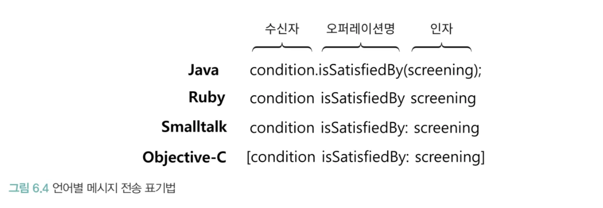
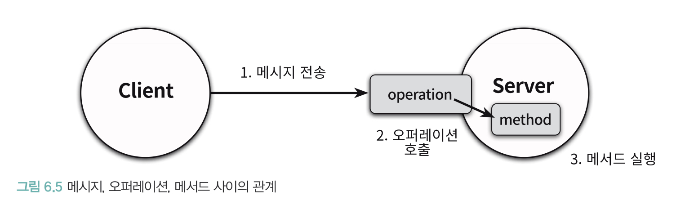
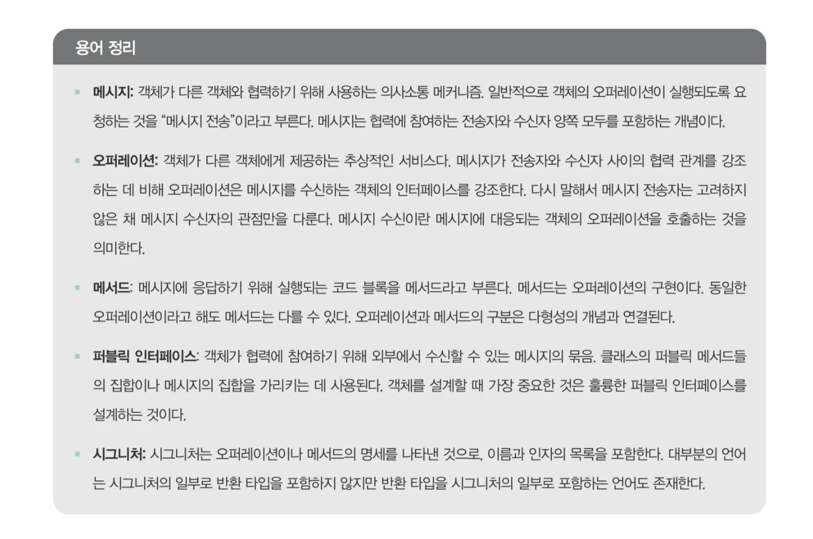
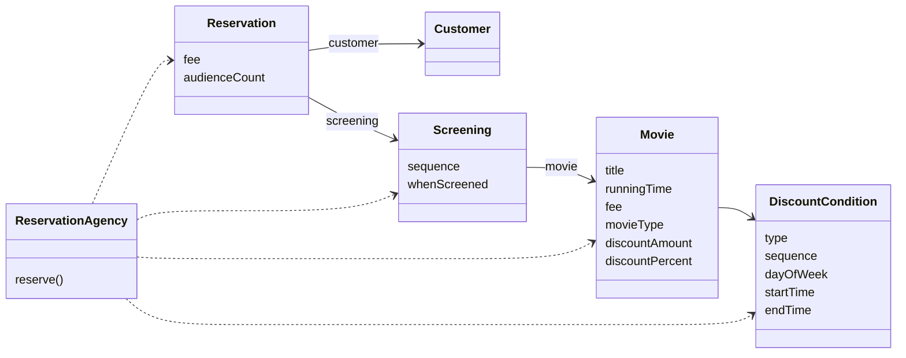
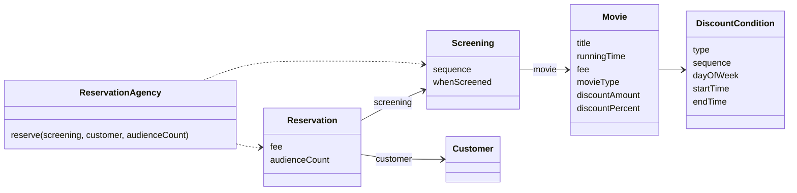
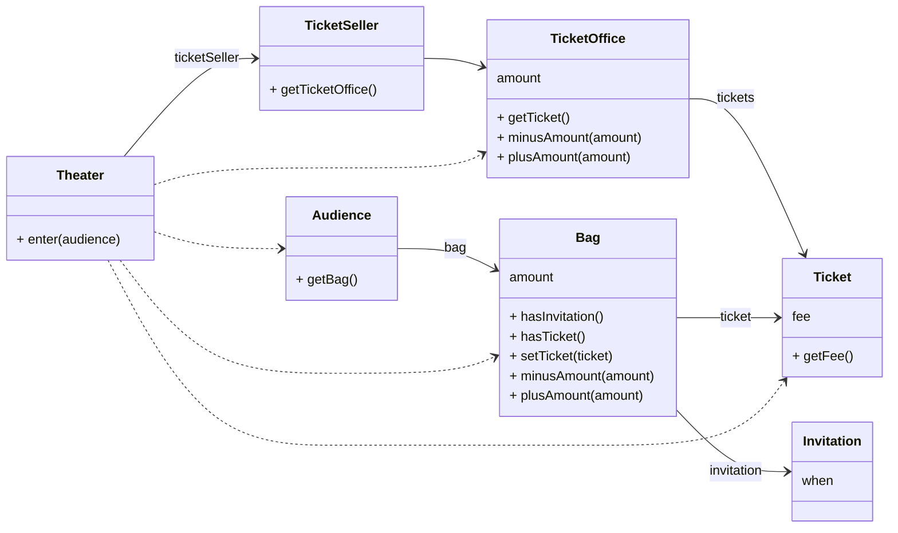

# 메시지와 인터페이스

객체지향에 대한 가장 흔한 오해는 애플리케이션이 클래스들의 집합으로 구성된다고 보는 것이다.

- 클래스는 중요한 도구지만, 어디까지나 구현 수단일 뿐이며 목적이 아니다.
- 객체지향의 본질은 객체가 협력 속에서 주고받는 메시지에 있다. 따라서 클래스 간 정적인 관계보다 협력 안에서 객체가 수행하는 책임에 초점을 맞춰야 한다.
- 중요한 것은 책임이 객체가 수신할 수 있는 메시지의 기반이 된다는 것이다.

이번 장에서는 유연하고 재사용 가능한 퍼블릭 인터페이스를 만드는 데 도움이 되는 설계 원칙과 기법을 살펴 본다. 

## 협력과 메시지

### 클라이언드-서버 모델

협력은 한 객체가 다른 객체에게 무언가를 요청할 때 시작된다.

- 객체 간 상호작용의 유일한 방법은 메시지 전송이다.
- 메시지를 매개로 한 요청(Request)과 응답(Response) 의 조합이 협력을 형성한다.
- 전통적 메타포: 클라이언트-서버 모델
    - 메시지를 전송하는 객체 → 클라이언트
    - 메시지를 수신하는 객체 → 서버
- 예시:
    - `Screening` → `Movie`
        
        ```mermaid
        flowchart LR
        		B --->|예매 요금| A
            A[":Screening"] --->|가격을 계산하라| B[":Movie"]
            
          
        
        ```
        
    - `Movie` → `DiscountPolicy`
        
        ```mermaid
        flowchart LR
        		B --->|할인 요금| A
            A[":Movie"] --->|할인 요금을 계산하라| B[":DiscountPolicy"]
            
          
        
        ```
        

Movie에서 알 수 있듯이 객체는 협력 속에서 클라이언트와 서버의 역할을 동시에 수행할 수 있다.

협력의 관점에서 객체는 두 가지 종류의 메시지 집합으로 구성된다

1. **수신하는 메시지** (퍼블릭 인터페이스)
2. **외부로 전송하는 메시지**

협력에 적합한 객체를 설계하려면 두 메시지 집합 모두 고려해야 한다.

❗**더 큰 책임을 수행하기 위해서는 다른 객체와 협력해야 한다.**

→ 두 객체 사이의 협력을 가능하게 해주는 매개체가 메시지

### 메시지와 메시지 전송

**메시지(message)**: 객체들이 협력하기 위해 사용하는 유일한 의사소통 수단

**메시지 전송(message sending / passing)**: 한 객체가 다른 객체에게 도움을 요청하는 행위

- 메시지 전송자 = 클라이언트
- 메시지 수신자 = 서버
- 메시지의 구성 요소:
    1. 오퍼레이션명 (operation name)
    2. 인자 (argument)
- 메시지 전송 = 메시지 수신자 + 오퍼레이션명 + 인자
    - 메시지: `isSatisfiedBy(screening)`
    - 메시지 전송: `condition.isSatisfiedBy(screening)`
        
        
        

### 메시지와 메서드

메시지를 수신했을 때 실제 실행되는 코드는 수신자의 실제 타입에 따라 달라진다.

- `condition.isSatisfiedBy(screening)`
    - `condition`이 `PeriodCondition` → `PeriodCondition.isSatisfiedBy` 실행
    - `condition`이 `SequenceCondition` → `SequenceCondition.isSatisfiedBy` 실행

메서드: 메시지를 수신했을 때 실제로 실행되는 함수 또는 프로시저

메시지 전송과 메서드는 구분해야 한다.

- **메시지**: “무엇을 해라” (요청)
- **메서드**: “어떻게 할 것인가” (구현)

전통적 함수 호출과 차이점:

- 함수 호출: 컴파일 시점 = 실행 시점 (실행될 코드가 확정됨)
- 메시지 전송: 컴파일 시점 ≠ 실행 시점 (실행될 메서드는 런타임에 결정)

메시지 전송자와 메시지 수신자는 느슨하게 결합될 수 있다.

- 전송자는 어떤 메시지를 보내야 하는지만 알면 된다.
- 수신자는 누가 보냈는지 몰라도 되고, 어떤 메서드로 처리할지 스스로 결정할 수 있다.
    - 유연한 협력 관계
    - 낮은 결합도
    - 높은 확장성

### 퍼블릭 인터페이스와 오퍼레이션

객체는 안과 밖을 구분하는 뚜렷한 경계를 가진다.

- 내부는 검은 상자(black box). 외부는 알 수 없다.
- 외부와의 유일한 소통 수단 = 퍼블릭 인터페이스(public interface)
- 퍼블릭 인터페이스 = 객체가 외부와 협력하기 위해 공개하는 메시지들의 집합
- 프로그래밍 언어 관점: 퍼블릭 인터페이스에 포함된 메시지 = 오퍼레이션(operation)
    - 오퍼레이션 = 수행 가능한 어떤 행동에 대한 추상화 (구현 X, 시그니처만)
        - `DiscountCondition` 인터페이스의 `isSatisfiedBy`
        - 메서드(method) = 메시지를 수신했을 때 실제로 실행되는 코드
            - `SequenceCondition.isSatisfiedBy()`

객체가 다른 객체에게 메시지를 전송하면

1. 런타임 시스템은 메시지 전송을 오퍼레이션 호출로 해석
2. 메시지를 수신한 객체의 실제 타입을 기반으로 적절한 메서드를 찾아 실행

따라서 퍼블릭 인터페이스와 메시지의 관점에서 보면 '메서드 호출'보다는 '오퍼레이션 호출'이 라는 용어를 사용하는 것이 더 적절하다.



### 시그니처

**오퍼레이션(또는 메서드)의 이름 + 파라미터 목록**

- 오퍼레이션 = 시그니처만 정의 (구현 X)
- 메서드 = 시그니처 + 구현
- 일반적으로 메시지를 수신하면, 오퍼레이션의 시그니처와 동일한 메서드가 실행됨

다형성의 이용하기 위해서는 하나의 오퍼레이션에 대해 다양한 메서드를 구현해야 한다. 

오퍼레이션의 관점에서 다형성 = 동일한 오퍼레이션 호출에 대해 서로 다른 메서드들이 실행되는 것



**중요한 것은** 

**객체가 수신할 수 있는 메시지가 객체의 퍼블릭 인터페이스와 그 안에 포함될 오퍼레이션을 결정한다.**

## 인터페이스와 설계 품질

**좋은 인터페이스**

- 최소한의 인터페이스: 꼭 필요한 오퍼레이션만 포함
- 추상적인 인터페이스: “어떻게”가 아니라 “무엇”을 하는지 표현

가장 좋은 방법 = 책임 주도 설계

- 메시지를 먼저 선택 → 불필요한 오퍼레이션이 끼어드는 것을 방지
- 메시지가 객체를 선택 → 클라이언트 의도가 드러남

퍼블릭 인터페이스의 품질에 영향을 미치는 원칙과 기법

- 디미터 법칙
- 묻지 말고 시켜라
- 의도를 드러내는 인터페이스
- 명령-쿼리 분리

### 디미터 법칙

```java
public class ReservationAgency {
	public Reservation reserve(Screening screening, Customer customer, int audienceCount) {
		Movie movie = screening.getMovie();
		
		boolean discountable = false;
		for (DiscountCondition condition : movie.getDiscountConditions()) {
			if (condition.getType() == DiscountConditionType.PERIOD) {
				discountable = screening.getWhenScreened().getDay0fWeek().equals(condition.getDay0fWeek()) &&
				condition.getStartTime.compareTo(screening.getWhenScreened.toLocalTime) <= 0 &&
				condition.getEndTime().compareTo(screening.getWhenScreened().toLocalTime()) >= 0;
			} else {
				discountable = condition.getSequence() == screening.getSequence();
			}
			
			if (discountable) {
				break;
			}
		}
		...
	}
}
```



- Screening와 결합도가 높다
- Movie와 DiscountCondition와도 결합도가 높다
- ReservationAgency의 의존도가 너무 높다!

**디미터 법칙(Law of Demeter)**

협력하는 객체의 내부 구조에 대한 결합으로 인해 발생하는 설계 문제를 해결하기 위해 제안된 원칙

- 객체의 내부 구조에 강하게 결합되지 않도록 협력 경로를 제한한다.
    - **낯선 자에게 말하지 말라** (Don’t talk to strangers)
    - **오직 인접한 이웃과만 말하라** (Only talk to your immediate neighbors)
    - **점(.)은 한 번만 써라** (use only one dot)
- 클래스가 특정한 조건을 만족하는 대상에게만 메시지를 전송하도록 프로그래밍 해야 한다.
- 허용되는 메시지 전송 대상
    - `this` 객체
    - 메서드의 매개변수
    - 인스턴스 변수(속성)
    - 속성인 컬렉션의 요소
    - 메서드 내 지역 객체

**개선된 `ReservationAgency`**

```java
public class ReservationAgency {
	public Reservation reserve(Screening screening, Customer customer, int audienceCount) {
		Money fee = screening.calculateFee(audienceCount);
		return new Reservation(customer, screening, fee, audienceCount);
	}
}
```



- `ReservationAgency`는 `Screening`에게만 메시지를 보냄
- 내부 구조(`Movie`, `DiscountCondition`)는 몰라도 됨 → **낮은 결합도**

디미터 법칙을 따르는 코드는 메시지 수신자의 내부 구조가 전송자에게 노출되지 않으며, 메시지 전송자는 수신자의 내부 구현에 결합되지 않는다. 

**디미터 법칙을 위반하는 코드의 전형적인 모습**

```java
screening.getMovie().getDiscountConditions();
```

기차 충돌(train wreck): 클래스의 내부 구현이 외부로 노출됐을 때 나타나는 전형적인 형태

- 메시지 전송자가 수신자의 내부 구조를 물어봄
- 반환 받은 요소에 대해 연쇄적으로 메시지를 전송함
    
    ⇒ 메시지 수신자의 캡슐화는 무너지고, 메시지 전송자가 메시지 수신자의 내부 구현에 강하게 결합된다.
    

디미터 법칙을 따르도록 코드를 개선하면 메시지 전송자는 더 이상 메시지 수신자의 내부 구조에 관해 묻지 않게 된다. 단지 자신이 원하는 것이 무엇인지를 명시하고 단순히 수행하도록 요청한

**디미터 법칙을 따르도록 개선된 코드**

```java
screening.calculateFee(audienceCount);
```

- 전송자는 메시지 수신자의 내부 구조에 관해 묻지 않음
- 전송자가 원하는 것이 무엇인지 명시하고 수행하도록 요

디미터 법칙을 따르면 정보를 처리 하는 데 필요한 책임을 정보를 알고 있는 객체에게 할당하기 때문에 응집도가 높은 객체가 만들어진다.

❌ 주의점
무비판적으로 디미터 법칙을 수용하면 퍼블릭 인터페이스 관점에서 객체의 응집도가 낮아질 수도 있다. 

### 묻지 말고 시켜라

디미터 법칙은 훌륭한 메시지는 객체의 상태에 관해 묻지 말고 원하는 것을 시켜야 한다는 사실을 강조한다. 메시지 전송자는 메시지 수신자의 상태를 기반으로 결정을 내린 후 메시지 수신자의 상태를 바꿔서는 안 된다. 

- 절차적 코드 → 묻고 결정한다.
- 객체지향 코드 → 시키고 실행한다.

**묻지 말고 시켜라 원칙을 따르면 밀접하게 연관된 정보와 행동을 함께 가지는 객체를 만들 수 있다.** 

- 정보 + 행동을 같은 객체 안에 둔다 → 응집도 ↑
- 자연스럽게 정보 전문가(Information Expert) 에게 책임이 배분됨
- 불필요하게 상태를 노출하지 않아도 됨 → 캡슐화 강화
- 코드가 유연해지고 교체 용이

**디미터 법칙과의 관계**

- 두 원칙 모두 좋은 인터페이스 설계의 기준을 제시한다.
- getter로 내부 상태를 노출하는 대신, 필요한 행동을 메서드로 제공해야 함.
- 묻지 말고 시켜라 + 디미터 법칙 = 낮은 결합도 + 높은 응집도

단순하게 객체에게 묻지 않고 시킨다고 해서 모든 문제가 해결되는 것은 아니다. 

- 훌륭한 인터페이스를 수확하기 위해서는 객체가 어떻게 작업을 수행하는지를 노출해서는 안된다.
- 인터페이스는 객체가 어떻게 하는지가 아니라 무엇을 하는지를 서술해야 한다.

### 의도를 드러내는 인터페이스

**켄트 벡(Kent Beck)의 메서드를 명명하는 두 가지 방법**

1. 메서드가 작업을 어떻게 수행하는지를 나타내도록 이름 짓는다.
    - 메서드의 이름은 내부의 구현 방법을 드러낸다.
        
        ```java
        public class PeriodCondition {
        	public boolean isSatisfiedByPeriod(Screening screening) { ... }
        }
        
        public class SequenceCondition {
        	public boolean isSatisfiedBySequence(Screening screening) { ... }
        }
        ```
        
        **이런 스타일이 좋지 않은 이유**
        
        - 메서드에 대해 제대로 커뮤니케이션하지 못한다.
            - 두 메서드가 같은 역할(할인 조건 판단)을 하지만 이름이 달라 혼란을 준다.
            - 클라이언트는 내부 구현을 알아야 의미를 파악할 수 있다.
        - 메서드 수준에서 캡슐화를 위반한다.
            - 메서드 이름이 내부 구조를 암시 → 구현 변경 시 클라이언트 코드까지 수정해야 함.
            - 구현 변경 = 메서드명 변경 = 메시지 송신자 수정

1. '어떻게'가 아니라 '무엇'을 하는지를 드러낸다.
    - 무엇을 하는지를 드러내는 이름은 코드를 읽고 이해하기 쉽게 만든다.
    - 어떻게 수행하는지를 드러내는 이름 = 메서드의 내부 구현을 설명하는 이름
    - 무엇을 하는지 드러내도록 메서드의 이름을 짓기 위해서는 객체가 협력 안에서 수행해야 하는 책임에 관해 고민해야 한다.
        
        ```java
        public class PeriodCondition {
        	public boolean isSatisfiedBy(Screening screening) { ... }
        }
        
        public class SequenceCondition {
        	public boolean isSatisfiedBy(Screening screening) { ... }
        }
        ```
        
        - 두 클래스가 동일한 의도(할인 조건 판단)를 공유함이 명확하다.
        - 클라이언트는 “할인 조건을 검사하겠구나” 라는 걸 직관적으로 이해할 수 있다.
        - 내부 구현은 감춘다.
    - 인터페이스 사용
        - 자바에서는 단순히 이름이 같다고 해서 동일한 메시지를 처리할 수 없다. 인터페이스를 통해 다형적 협력을 가능하게 해야 한다.
            
            ```java
            public interface DiscountCondition {
            	boolean isSatisfiedBy(Screening screening);
            }
            
            public class PeriodCondition implements DiscountConditon {
            	public boolean isSatisfiedBy(Screening screening) { ... }
            }
            
            public class SequenceCondition implements DiscountConditon {
            	public boolean isSatisfiedBy(Screening screening) { ... }
            }
            ```
            
            - `DiscountCondition` 타입을 통해 클라이언트는 `PeriodCondition`과 `SequenceCondition`을 동일한 메시지로 다룰 수 있음
            - 새로운 조건이 추가되어도 클라이언트는 수정 없이 확장 가능 (OCP 충족)

✅ **의도를 드러내는 선택자 (Intention Revealing Selector)**

- 어떻게 하느냐가 아니라 무엇을 하느냐에 따라 메서드의 이름을 짓는 패턴
- 메서드 이름이 내부 동작을 설명하는 대신, **목적**을 표현해야 한다는 켄트 백의 제안.
- “다른 구현을 상상해보고, 그 둘에 공통으로 붙일 수 있는 가장 추상적인 이름을 붙여라.”

✅ **의도를 드러내는 인터페이스 (Intention Revealing Interface)**

- 에릭 에반스(Eric Evans, *DDD*)가 켄트 백의 의도를 드러내는 선택자를 인터페이스 레벨로 확장
- 인터페이스는 협력의 목적만 드러내고, 구현 세부 사항은 캡슐화해야 함.

👩‍🏫 객체에게 묻지 말고 시키되 구현 방법이 아닌 클라이언트의 의도를 드러내야 한다. 

### 함께 모으기

**디미터 법칙을 위반하는 티켓 판매 도메인**

```java
public class Theater {
	private TicketSeller ticketSeller;
	
	public Theater(TicketSeller ticketSeller) {
		this.ticketSeller = ticketSeller;
	}
	
	public void enter(Audience audience) ( 
		if (audience.getBag().hasInvitation)) {
			Ticket ticket = ticketSeller.getTicketOffice().getTicket():
			audience.getBag().setTicket(ticket);
		} else {
			Ticket ticket = ticketSeller.getTicketOffice().getTicket();
			audience.getBag().minusAmount(ticket.getFee()); 
			ticketSeller.getTicketOffice().plusAmount(ticket.getFee()); 
			audience.getBag.setTicket(ticket);
		}
	}
}
```

👍 : Theater가 인자로 전달된 audience와 인스턴스 변수인 ticketSeller에게 메시지를 전송하는 것

👎 : Theater가 audience와 ticketSeller 내부에 포함된 객체에도 직접 접근

- `audience.getBag()` → 내부 구조 접근
- `ticketSeller.getTicketOffice()` → 또 다른 내부 접근
- 기차 충돌(train wreck) 형태의 메시지 체인

```java
audience.getBag().minusAmount(ticket.getFee());
```

- Theater는 Audience 내부(Bag) 와 TicketSeller 내부(TicketOffice) 에 직접 접근
- 퍼블릭 인터페이스로 내부 구조가 노출됨 → 캡슐화 위반
- 변경에 약하고, 사용도 어렵다 (내부 구조를 알아야 호출 가능)



**묻지 말고 시켜라**

```java
public class TicketSeller {
	public void setTicket(Audience audience) {
		if (audience.getBag().hasInvitation) {
			Ticket ticket = ticketOffice.getTicket();
			audience.getBag().setTicket(ticket);
		} else {
			Ticket ticket = ticketOffice.getTicket();
			audience.getBag.minusAmount(ticket.getFee)):
			ticketOffice.plusAmount(ticket.getFee());
			audience.getBag().setTicket(ticket);
		}
	}
}
```

TicketSeller와 Audience는 묻지 말고 시켜라 스타일을 따르는 퍼블릭 인터페이스를 가져야 한다.

1. Theater → TicketSeller에게 직접 “시킴”
    
    ```java
    public class Theater {
    	public void enter (Audience audience) {
    		ticketSeller.setTicket(audience);
    	}
    }
    ```
    
    - TicketSeller의 인스턴스에게만 메시지를 전송
2. TicketSeller가 내부 로직을 담당
    
    ```java
    public class Audience {
    	public Long setTicket(Ticket ticket) {
    		if (bag.hasInvitation()) {
    			bag.setTicket(ticket);
    			return OL;
    		} else {
    			bag.setTicket(ticket);
    			bag.minusAmount(ticket.getFee());
    			return ticket.getFee();
    		}
    	}
    }
    ```
    
    - TicketSeller가 원하는 것 = Audience가 Ticket을 보유하도록 만드는 것
        
        ⇒ Audience에게 setTicket 메서드 추가
        
    - TicketSeller는 인자로 전달된 Audience에게만 메시지를 전송
    
    ```java
    public class TicketSeller {
    	public void setTicket (Audience audience) ( 
    		ticketOffice.plusAmount(
    					audience.setTicket(ticketOffice.getTicket()));
    	}
    }
    ```
    

1. Audience가 자기 책임을 수행, 
2. Bag이 실제 로직을 수행
    
    Audience가 Bag에게 원하는 일을 시키기 전에 `hasInvitation`메서드를 이용해 초대권을 가지고 있는지를 묻는다. → 디미터 위반
    
    ```java
    // Audience의 setTicket 메서드를 Bag의 setTicket 메서드로 이동
    public class Bag {
    	public Long setTicket (Ticket ticket) {
    		if (hasInvitation) {
    			this.ticket = ticket;
    			return OL;
    		) else (
    			this.ticket = ticket;
    			minusAmount(ticket.getFee());
    			return ticket.getFee();
    		}
    	}
    	
    	private boolean hasInvitation() {
    		return invitation != null;
    	}
    	
    	private void minusAmount(Long amount) {
    		this.amount -= amount;
    	}
    }
    ```
    
    - Audience의 setTicket 메서드가 Bag의 setTicket 메서드를 호출하도록 수정하면 묻지 말고 시켜라 스타일을 따르고 디미터 법칙을 준수한다.
    
    ```java
    public class Audience {
    	public Long setTicket(Ticket ticket) { 
    		return bag.setTicket(ticket);
    	}
    }
    ```
    

- Theater는 오직 TicketSeller에게만 메시지 전송 → **디미터 법칙 준수**
- 각 객체가 스스로 자신의 일을 수행 → **자율적 객체**
- 객체 간 결합도 낮음 → **변경 용이성 향상**

**인터페이스에 의도를 드러내자**

현재 메서드 이름:

- `setTicket()` - TicketSeller, Audience, Bag 모두 사용 중

→ **의미가 모호하다.**

- TicketSeller의 `setTicket()` → 판매하기
- Audience의 `setTicket()` → 구매하기
- Bag의 `setTicket()` → 보관하기

이름은 같지만 협력 의도(intent) 가 다르다. 따라서 클라이언트의 의도가 분명하게 드러나도록 객체의 퍼블릭 인터페이스를 개선해야 한다.

```java
public class TicketSeller {
	public void sellTo(Audience audience) { ... }
}

public class Audience {
	public Long buy (Ticket ticket) { ... }
}

public class Bag {
	public Long hold(Ticket ticket) { ... }
}
```

| 클래스 | 잘못된 이름 | 의도를 드러내는 이름 | 의미 |
| --- | --- | --- | --- |
| `TicketSeller` | setTicket | sellTo | 관객에게 티켓을 판다 |
| `Audience` | setTicket | buy | 티켓을 구매한다 |
| `Bag` | setTicket | hold | 티켓을 보관한다 |

> 객체에게 묻지 말고 시켜라. 그리고 그 요청의 이름으로 의도를 드러내라.

디미터 법칙은 캡슐화를 지키게 하고, 묻지 말고 시켜라는 자율적인 객체를 만들며, 의도를 드러내는 인터페이스는 협력의 목적을 명확히 한다.
> 

## 원칙의 함정

> “디미터 법칙”과 “묻지 말고 시켜라”는 훌륭한 원칙이지만, 절대적인 법칙은 아니다. 소프트웨어 설계에 법칙이란 존재하지 않는다. 

객체지향 설계의 핵심은 트레이드오프를 판단할 수 있는 능력이다. 원칙은 “무조건 적용”이 아니라 “상황에 맞게 적용할지 결정하는 기준”이다. 원칙을 맹목적으로 따르는 것은 오히려 유연하지 못한 설계로 이어진다.

숙련자와 초보자의 차이는 원칙을 아는 것이 아니라, 언제 적용하고 언제 무시해야 하는지 판단하는 능력이다.
> 

### 디미터 법칙은 하나의 도트(.)를 강제하는 규칙이 아니다

디미터 법칙은 도트 개수를 제한하는 문법적 규칙이 아니라, 객체의 내부 구조를 외부에 노출하지 말라는 결합도에 관한 원칙이다. 결합도가 문제가 되는 것은 객체의 내부 구조가 외부로 노출되는 경우로 한정된다. 

**해야할 질문은 과연 여러 개의 도트를 사용한 코드가 객체의 내부 구조를 노출하고 있는가? 이다.**

```java
IntStream.of(1, 15, 20, 3, 9).filter(x → x > 10).distinct().count();
```

자바 8의 IntStream을 사용한 아래의 코드가 기차 충돌을 초래하기 때문에 디미터 법칙을 위반한다고 생각할 수 있다. 

**올바른 해석**

- `of`, `filter`, `distinct` 모두 IntStream의 인스턴스를 반환한다.
- 즉, 내부 구조를 노출하지 않고 IntStream을 다른 IntStream으로 변환할 뿐이다.
- 캡슐화(Encapsulation) 는 여전히 유지된다.

하나 이상의 도트(.)를 사용하는 모든 케이스가 디미터 법칙 위반인 것은 아니다. 기차 충돌처럼 보이는 코드라도 객체의 내부 구현에 대한 어떤 정보도 외부로 노출하지 않는다면 그것은 디미터 법칙을 준수한 것이다.

이 메서드들은 객체의 내부에 대한 어떤 내용도 묻지 않는다. 그저 객체를 다른 객체로 변환하는 작업을 수행하라고 시킬 뿐이다. 따라서 묻지 말고 시켜라 원칙을 위반하지 않는다.

### 결합도와 응집도의 충돌

어떤 객체의 상태를 물어본 후 반환된 상태를 기반으로 결정을 내리고 그 결정에 따라 객체의 상태를 변경하는 코드는 묻지 말고 시켜라 스타일로 변경해야 한다. 

```java
public class Theater {
	public void enter(Audience audience) {
		if (audience.getBag().hasInvitation()) {
			Ticket ticket = ticketSeller.getTicketOffice.getTicket;
			audience.getBag().setTicket(ticket);
		} else {
			Ticket ticket = ticketSeller.getTicketOffice().getTicket();
			audience.getBag.minusAmount(ticket.getFee()); 
			ticketSeller.getTicketOffice().plusAmount(ticket.getFee()); 
			audience.getBag().setTicket(ticket);
		}
	}
}
```

`Theater`**문제점 분석**

- `Theater`는 `Audience`의 내부(`Bag`)에 직접 접근한다.
    - 내부 구조를 알기 때문에 캡슐화를 위반하고 결합도가 높다.
    - “Bag이 존재한다”는 사실을 `Theater`가 알아야 하므로, 내부 구조가 외부로 노출됨.

**개선 방법:  “묻지 말고 시켜라” 적용**

질문하고, 판단하고, 상태를 변경하는 모든 코드를 Audience로 옮긴다. 

```java
public class Audience {
	public Long buy (Ticket ticket) {
		if (bag.hasInvitation()) {
			bag.setTicket(ticket);
			return OL;
		} else {
			bag.setTicket(ticket);
			bag.minusAmount(ticket.getFee());
			return ticket.getFee();
		}
	}
}

public class Theater {
    public void enter(Audience audience) {
        Ticket ticket = ticketSeller.getTicketOffice().getTicket();
        Long fee = audience.buy(ticket);
        ticketSeller.getTicketOffice().plusAmount(fee);
    }
}
```

- **응집도↑** (`Audience`는 자신의 상태와 행동을 함께 관리한다)
- **결합도↓** (`Theater`는 `Audience` 내부 구조를 모른다)

> 위임 메서드를 통해 객체의 내부 구조를 감추는 것은 협력에 참여하는 객체들의 결합도를 낮출 수 있는 동시에 객체의 응집도를 높일 수 있는 가장 효과적인 방법이다.
> 

❗**하지만**❗

묻지 말고 시켜라 / 디미터 법칙을 맹목적으로 적용하면 

같은 퍼블릭 인터페이스 안에 어울리지 않는 오퍼레이션들이 공존하게 되고 객체는 상관 없는 책임들을 한꺼번에 떠안게 되기 때문에 결과적으로 응집도가 낮아진다.

```java
public class PeriodCondition implements DiscountCondition {
	public boolean isSatisfiedBy(Screening screening) {
		return screening.getStartTime().getDayOfWeek().equals(day0fWeek) &&
		startTime.compareTo(screening.getStartTime.toLocalTime) <= 0 &&
		endTime.compareTo(screening.getStartTime(). toLocalTime() >= 0;
	}
}
```

`screening.getStartTime()`으로 상영 시작 시간을 이용해 할인 여부를 결정 (Screening의 내부 상태 사용)

캡슐화를 위반한 것으로 보일 수 있다. 

1. 할인 여부를 판단하는 로직을 Screening의 isDiscountable 메서드로 이동
2. PeriodCondition이 이 메서드를 호출하도록 변경

```java
public class Screening {
	public boolean isDiscountable(DayOfWeek dayOfWeek, LocalTime startTime, LocalTime endTime) ( 
		return whenScreened.getDayOfWeek().equals(dayOfWeek) &&
		startTime.compareTo(whenScreened.toLocalTime()) <= 0 &&
		endTime.compareTo(whenScreened. toLocalTime)) >= 0;
	}
}

public class PeriodCondition implements DiscountCondition { 
	public boolean isSatisfiedBy(Screening screening) { 
		return screening.isDiscountable(dayOfWeek, startTime, endTime);
	}
}
```

❌

- `Screening`의 핵심 책임: 영화 예매 관리
- `PeriodCondition`의 책임: 할인 가능 여부를 판단
- 이제 `Screening`은 `PeriodCondition`의 인스턴스 변수 목록이 변경될 경우에도 영향을 받는다.
    - 응집도↓
    - PeriodCondition과의 결합도↑ 가 되어버린다.

Screening의 캡슐화를 향상시키는 것보다 Screening의 응집도를 높이고 Screening과 PeriodCondition 사이의 결합도를 낮추는 것이 전체적인 관점에서 더 좋은 방법이다.

가끔씩은 묻는 것 외에는 다른 방법이 존재하지 않는 경우도 존재한다. 컬렉션에 포함된 객체들을 처리 하는 유일한 방법은 객체에게 물어보는 것이다. 다음 코드에서 Movie에게 묻지 않고도 movies 컬렉션에 포함된 전체 영화의 가격을 계산할 수 있는 방법이 있을까?

**❗하지만❗**

**“물어야만 하는” 경우도 있다 - 컬렉션**

```java
for (Movie each : movies) {
	total += each.getFee();
}
```

- `movies`는 단순한 **데이터 컬렉션**이다.
- 각 `Movie` 객체는 단순히 금액 정보를 제공하는 데이터 역할이다.
- 이런 경우엔 “묻지 말고 시켜라”를 억지로 적용할 이유가 없다.
- 객체는 내부 구조를 숨겨야 하므로 디미터 법칙을 따르는 것이 좋지만 자료 구조라면 당연히 내부를 노출해야 하므로 디미터 법칙을 적용할 필요가 없다.

> 로버트 마틴은 《클린 코드》[Martin08]에서 디미터 법칙의 위반 여부는 묻는 대상이 객체인지, 자료 구조인지에 달려있다고 설명한다.
> 

> 소프트웨어 설계에 법칙이란 존재하지 않는다. 
원칙을 맹신하지 마라. 
원칙이 적절한 상황과 부적절한 상황을 판단할 수 있는 안목을 길러라. 
설계는 트레이드오프의 산물이다**.**
> 

## 명령-쿼리 분리 원칙(CQS, Command-Query Separation)

- 퍼블릭 인터페이스에 오퍼레이션을 정의할 때 참고할 수 있는 지침을 제공한다.

| 구분 | 설명 | 부수효과 | 반환값 |
| --- | --- | --- | --- |
| **명령(Command)** | 객체의 상태를 **변경하는** 오퍼레이션 | 있음 | 없음 |
| **쿼리(Query)** | 객체의 상태를 **조회하는** 오퍼레이션 | 없음 | 있음 |

**루틴(routine):** 어떤 절차를 묶어 호출 가능하도록 이름을 부여한 기능 모듈

| 루틴 유형 |  |  |
| --- | --- | --- |
| **프로시저** | 정해진 절차에 따라 내부의 상태를 변경하는 루틴의 한 종류 | 프로시저는 부수효과를 발생시킬 수 있지만 값을 반환할 수 없다. |
| **함수** | 어떤 절차에 따라 필요한 값을 계산해서 반환하는 루틴의 한 종류 | 함수는 값을 반환할 수 있지만 부수효과를 발생시킬 수 없다. |

명령(Command)과 쿼리(Query)는 객체의 인터페이스 측면에서 프로시저와 함수를 부르는 또 다른 이름이다. 

- 프로시저 ≒ 명령(Command)
- 함수 ≒ 쿼리(Query)

**CQS 원칙의 규칙**

오퍼레이션은 부수효과를 발생시키는 명령이거나 부수효과를 발생시키지 않는 쿼리 중 하나여야 한다

- 객체의 상태를 변경하는 명령은 반환값을 가질 수 없다.
- 객체의 정보를 반환하는 쿼리는 상태를 변경할 수 없다.

**⇒ "질문이 답변을 수정해서는 안 된다"**

명령은 상태를 변경할 수 있지만 상태를 반환해서는 안 된다. 

쿼리는 객체의 상태를 반환할 수 있지만 상태를 변경해서는 안 된다.

**CQS의 장점**

- 캡슐화 유지: 내부 상태가 임의로 변경되지 않음
- 예측 가능성 향상: 쿼리는 항상 동일한 결과를 반환
- 재사용성과 테스트 용이성 향상: 부수효과 없는 쿼리는 독립적으로 검증 가능
- 의도 명확화: 메서드 이름만으로도 “상태 변경” vs “조회” 구분이 가능

### 반복 일정의 명령과 쿼리 분리하기

자연과 인간의 생활은 주기적인 이벤트로 이루어진다. 

- 매년 돌아오는 생일
- 매주 수요일의 회의
- 매달 돌아오는 월급날

이처럼 반복되는 일정을 관리하기 위한 소프트웨어를 개발하던 중, 치명적인 버그가 발생했다.

| 도메인 | 설명 |
| --- | --- |
| 이벤트(Event) | 특정 시점에 실제로 발생하는 사건.예: 2019년 5월 8일 수요일 10:30 회의 |
| 반복 일정(RecurringSchedule) | 특정 주기(예: 매주 수요일 10:30)에 반복되는 이벤트의 규칙 집합 |

**이벤트**

```java
public class Event {
	private String subject;
	private LocalDateTime from;
	private Duration duration;
	
	public Event(String subject, LocalDateTime from, Duration duration) (
		this subject = subject;
		this. from = from;
		this duration = duration;
	}
	
	// 반복 일정 조건을 만족하는지를 검사
	public boolean isSatisfied(RecurringSchedule schedule) {
		if (from.getDayOfWeek() != schedule.getDayOfWeek() ||
				!from.tolocalTime().equals(schedule.getFrom()) ||
				!duration.equals(schedule.getDuration())) {
				
			reschedule(schedule);
			return false:
		}
		
		return true:
	}
	
	private void reschedule(RecurringSchedule schedule) {
		from = LocalDateTime.of(from.tolocalDate().plusDays(daysDistance(schedule)),
		schedule.getFrom());
		duration = schedule.getDuration();
	}
	
	private long daysDistance(RecurringSchedule schedule) {
		return schedule.getDayOfWeek().getValue() - from.getDayOfWeek().getValue();
	}
}
```

2019년 5월 8일 수요일 10시 30분부터 11시까지 열리는 회의를 표현하는 Event의 인스턴스

```java
Event meeting = new Event ("회의",
	LocalDateTime.of (2019, 5, 8, 10, 30),
	Duration.ofMinutes (30));
```

**반복 일정**

```java
public class RecurringSchedule ( 
	private String subject; 
	private DayOfWeek dayOfWeek; // 반복될 요일
	private LocalTime from;
	private Duration duration;
	
	public RecurringSchedule(String subject, DayOfWeek dayOfWeek, LocalTime from, Duration duration)
		this subject = subject;
		this dayOfWeek = dayOfWeek;
		this.from = from;
		this duration = duration;
	}
	
	public DayOfWeek getDay0fWeek(){
		return dayOfWeek;
	}
	
	public LocalTime getFrom {
		return from;
	}
	
	public Duration getDuration {
		return duration;
	}
}
```

매주 수요일 10시 30분부터 30분 동안 열리는 회의에 대한 인스턴스

```java
RecurringSchedule schedule = new RecurringSchedule("회의", Day0fWeek.WEDNESDAY,
																		LocalTime.of (10, 30), Duration.ofMinutes(30));
```

```java
// 매주 수요일 10시 30분부터 30분 동안 진행되는 회의에 대한 반복 일정
RecurringSchedule schedule = new RecurringSchedule("회의", DayOfWeek.WEDNESDAY,
	LocalTime.of(10, 30), Duration.ofMinutes(38));

// 2019년 5월 8일 10시 30분부터 30분 동안 진행되는 회의를 위한 인스턴스
Event meeting = new Event("회의", LocalDateTime.of(2019, 5, 8, 10, 38), Duration.ofMinutes(30));

// 5월 8일은 수요일이므로 반복 일정의 조건을 만족
assert meeting.isSatisfied(schedule) == true;
```

```java
// 매주 수요일 10시 30분부터 30분 동안 진행되는 회의
RecurringSchedule schedule = new RecurringSchedule("회의", DayOfWeek.WEDNESDAY,
	LocalTime.of(10, 38), Duration.ofMinutes(38));

// 2019년 5월 9일 10시 30분부터 30분 동안 진행되는 회의
Event meeting = new Event("회의", LocalDateTime.of(2019, 5, 9, 10, 38), Duration.ofMinutes(30));

// 2019년 5월 9일은 목요일이므로 수요일이라는 반복 일정의 조건을 만족시키지 못한다.
assert meeting.isSatisfied(schedule) == false;

// 다시 실행하면 true??
assert meeting.isSatisfied(schedule) == true;
```

```java
public class Event {
	private void reschedule(RecurringSchedule schedule) {
		from = LocalDateTime.of(from.tolocalDate().plusDays(daysDistance(schedule)),
		schedule.getFrom());
		duration = schedule.getDuration();
	}
	
	private long daysDistance(RecurringSchedule schedule) {
		return schedule.getDayOfWeek().getValue() - from.getDayOfWeek().getValue();
	}
}
```

`isSatisfied()`는 먼저 인자로 전달된 값이 하나라도 같지 않다면 `reschedule()`을 실행해서 Event 객체의 상태를 변경 하고 있다. 

→ 첫 번째 호출 후에는 Event가 RecurringSchedule 조건에 맞는 상태로 변경 → true 반환

→ 비결정성(Bad determinism) 발생

**버그를 찾기 어려웠던 이유: isSatisfied()가 명령과 퀴리의 두 가지 역할을 동시에 수행**

- isSatisfied 메서드는 Event가 RecurringSchedule의 조건에 부합하는지를 판단한 후 부합할 경우 true 를 반환한다. 따라서 isSatisfied 메서드는 개념적으로 쿼리다.
- isSatisfied 메서드는 Event가 Recurringschedule의 조건에 부합하지 많을 경우 Event의 상태를 조건에 부합하도록 변경한다. 따라서 isSatisfied는 실제로는 부수효과를 가지는 명령이다.

**해결 방법: 명령과 쿼리 분리**
명령과 쿼리를 뒤섞으면 실행 결과를 예측하기가 어려워질 수 있다. isSatisfied 메서드처럼 겉으로 보기에는 쿼리처럼 보이지만 내부적으로 부수효과를 가지는 메서드는 이해하기 어랩고, 잘못 사용하기 쉬우며, 버그를 양산하는 경향이 있다, 가장 깔끔한 해결책은 명령과 쿼리를 명확하게 분리하는 것이다.

```java
public class Event {
	public boolean isSatisfied(RecurringSchedule schedule) {
		if (from.getDayOfWeek() |= schedule.getDayOfWeek() !!
				Ifrom.tolocalTime().equals(schedule.getFrom()) !
				Iduration.equals(schedule.getDuration())) {
			
			return false:
		}
		
		return true;
	}
	
	public void reschedule(RecurringSchedule schedule) {
		from = LocalDateTime.of(from.toLocalDate().plusDays(daysDistance(schedule)),
			schedule.getFrom());
		duration = schedule.getDuration();
	}
}
```

- `isSatisfied()` → 쿼리 (상태 확인, 부수효과 없음)
- `reschedule()` → 명령 (상태 변경, 반환값 없음)

```java
public class Event {
	public boolean isSatisfied(RecurringSchedule schedule) { ... }
	public void reschedule(RecurringSchedule schedule) { ... }
}
```

반환 값을 돌려주는 메서드는 쿼리이므로 부수 효과에 대한 부담이 없다. 

반환 값을 가지지 않는 메서드는 모두 명령이므로 해당 메서드를 호출할 때는 부수효과에 주의해야 한다. 

```java
if (!event.isSatisfied(schedule)) {
	event.reschedule(schedule);
}
```

| 장점 | 효과 |
| --- | --- |
| **예측 가능성** | 동일 입력 → 동일 결과 (Side Effect 제거) |
| **가독성 향상** | 메서드명만 봐도 동작 의도 파악 가능 |
| **디버깅 용이성** | 상태 변경 지점을 명확히 추적 가능 |
| **유지보수성 향상** | 메서드 책임이 단일해짐 (SRP 강화) |

### 명령-퀴리 분리와 참조 투명성

- 명령과 쿼리를 엄격히 구분하면 부수효과를 제어하기 쉬워진다.
- 쿼리는 객체의 상태를 변경하지 않기 때문에 몇 번을 호출하든, 순서를 바꾸든 결과가 변하지 않는다.
    
    👉 언어 안에서도 부분적인 참조 투명성을 확보할 수 있다.
    
    `isSatisfied()`는 이런 특성을 가진 좋은 예다.
    
    → `reschedule()`이 호출되지 않는 한, 몇 번 호출하든 항상 같은 결과를 돌려준다.
    
- 참조 투명성이라는 특성을 잘 활용하면 버 그가 적고, 디버깅이 용이하며, 쿼리의 순서에 따라 실행 결과가 변하지 않는 코드를 작성할 수 있다.

**참조 투명성**

**:** 어떤 표현식 e가 있을 때 e의 값으로 e가 나타나는 모든 위치를 교체하더라도 결과가 달라지지 않는 특성

표현식을 값으로 치환해도 결과가 같다면 참조 투명성을 만족한다.

수학은 참조 투명성을 엄격하게 준수하는 가장 유명한 체계다.

```
f(1) = 3이라면,

f(1) + f(1) = 6
f(1) * 2 = 6
f(1) - 1 = 2

f(1)을 모두 값 3으로 바꾸어도 결과는 똑같다.

3 + 3 = 6
3 * 2 = 6
3 - 1 = 2

```

이제 `f(1)`을 모두 값 `3`으로 바꾸어도 결과는 똑같다.

```
3 + 3 = 6
3 * 2 = 6
3 - 1 = 2
```

`f(1)`이라는 표현식을 3으로 치환해도 식 전체의 의미가 변하지 않는다. ⇒ **참조 투명성**

- `f(1)`을 항상 3이라고 말할 수 있는 이유는 **값이 변하지 않기 때문.**
- 이처럼 값이 변하지 않는 성질 =  불변성(immutability)
- 불변성 =  부수효과가 없다
    
    ⇒ 부수효과가 없으면, 표현식을 값으로 치환할 수 있다.
    

**참조 투명성을 만족하는 식은**

- 모든 함수를 이미 알고 있는 하나의 결과값으로 대체할 수 있기 때문에 식을 쉽게 계산할 수 있다.
- 모든 곳에서 함수의 결값이 동일하기 때문에 식의 순서를 변경하더라도 각 식의 결과는 달라지지 않는다.

**❗하지만 객체지향(OOP)은 참조 투명성과 정반대다.❗**

- 객체지향은 **“상태 변경”**을 전제로 한다.
- 객체는 메시지를 받아 내부 상태를 변경한다.
- 즉, 부수효과가 존재한다.
- 따라서 객체지향 시스템은 본질적으로 참조 투명하지 않다.

**CQS로 얻는 안정성**

완벽한 참조 투명성은 OOP에서 불가능하다.

하지만 명령-쿼리 분리 원칙(CQS)을 적용하면 균열을 조금이나마 줄일 수 있다.

- `reschedule()` : 명령 (부수효과 있음)
- `isSatisfied()` : 쿼리 (부수효과 없음)

👉 `reschedule()`을 호출하지 않는 한, `isSatisfied()`는 몇 번이고 호출해도 항상 같은 결과를 반환한다.

### 책임에 초점을 맞춰라

결국 메시지를 먼저 선택하고 그 후에 메시지를 처리할 객체를 선택하면

- 디미터 법칙
- 묻지 말고 시켜라
- 의도를 드러내는 인터페이스

설계할 수 있다.

**중요한 것은 객체의 책임(Responsibility)**

❌ 이 객체가 무엇을 할 수 있는가? ❌

⭕ 이 협력 안에서 어떤 메시지가 오가야 하는가? ⭕ 

그 후 그 메시지를 처리할 적절한 객체를 선택한다.

**효과**

- 디미터 법칙
    - 협력이라는 컨텍스트 안에서 객체보다 메시지를 먼저 결정하면 두 객체 사이의 구조적인 결합도를 낮출 수 있다. 수신할 객체를 알지 못한 상태에서 메시지를 먼저 선택하기 때문에 객체의 내부 구조에 대해 고민할 필요가 없어진 다. 따라서 메시지가 객체를 선택하게 함으로써 의도적으로 디미터 법칙을 위반할 위험을 최소화할 수 있다.
- 묻지 말고 시켜라
    - 메시지를 먼저 선택하면 묻지 말고 시켜라 스타일에 따라 협력을 구조화하게 된다. 클라이언트의 관점 에서 메시지를 선택하기 때문에 필요한 정보를 물을 필요 없이 원하는 것을 표현한 메시지를 전송하면 된다.
- 의도를 드러내는 인터페이스
    - 메시지를 먼저 선택한다는 것은 메시지를 전송하는 클라이언트의 관점에서 메시지의 이름을 정한다는 것이다. 당연히 그 이름에는 클라이언트가 무엇을 원하는지. 그 의도가 분명하게 드러날 수밖에 없다.
- 명령-쿼리 분리 원칙
    - 메시지를 먼저 선택한다는 것은 협력이라는 문맥 안에서 객체의 인터페이스에 관해 고민한다는 것 을 의미한다. 객체가 단순히 어떤 일을 해야 하는지뿐만 아니라 협력 속에서 객체의 상태를 예측하고 이해하기 쉽게 만들 기 위한 방법에 관해 고민하게 된다. 따라서 예측 가능한 협력을 만들기 위해 명령과 쿼리를 분리하게 될 것이다.

좋은 메시지를 얻기 위한 출발점은 책임 주도 설계이다.

책임 주도 설계에서는 **객체가 메시지를 고르는 것이 아니라, 메시지가 객체를 선택한다.**