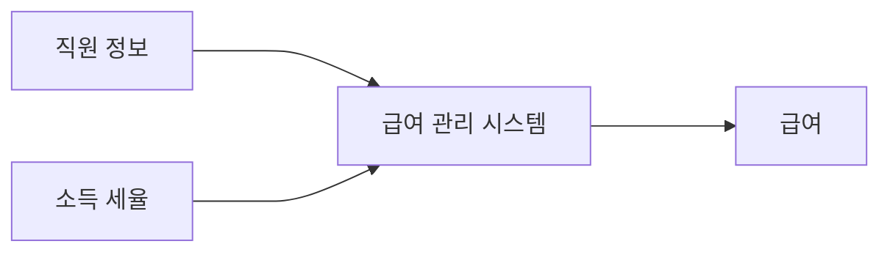
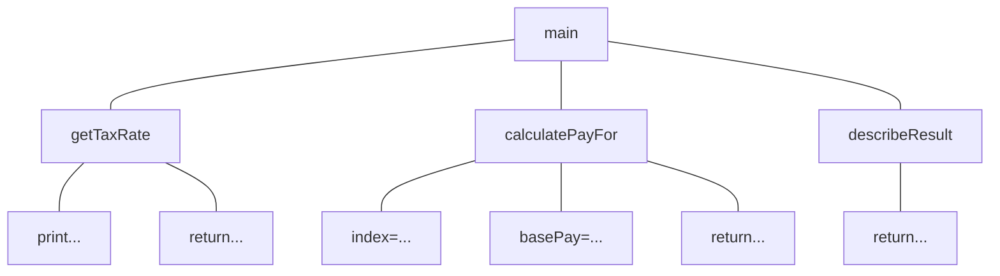

# 객체 분해

인간의 기억은 단기 기억(short-term) 과 장기 기억(long-term) 으로 나뉜다.

- **장기 기억:**
    - 사실상 무한한 저장 용량을 가짐
    - 하지만 직접 접근 불가. 필요한 정보는 단기 기억으로 옮겨야 사용 가능.
- **단기 기억:**
    - 정보에 직접 접근 가능하지만
    - 저장 용량과 속도가 제한됨.
    - 동시에 기억할 수 있는 정보의 개수는 5~9개(매직 넘버 7 ± 2)
    - 새로운 정보를 받아들이는 데 약 5초 소요됨.

사람은 시간적·공간적 트레이드오프가 불가능하며, 단기 기억 용량이 한계점이다.

핵심은 실제로 문제를 해결하기 위해 사용하는 저장소는 장기 기억이 아니라 단기 기억이라는 점.

너무 많은 정보를 한 번에 처리하려 하면 인지 과부하(cognitive overload) 가 발생한다.

#### 인지 과부하를 방지하는 방법: 추상화

- 문제 해결에 필요한 정보를 필요 최소한으로 줄이고 단순화해야 한다.
- 불필요한 세부 사항을 제거하고 핵심 정보만 남기는 과정을 추상화라 한다.
- 추상화의 목적은 단기 기억의 부하를 줄이고 문제를 단순화하는 것.
- 가장 일반적인 추상화 방법은 한 번에 다뤄야 하는 문제의 크기를 줄이는 것이다.

#### 문제를 나누는 방법: 분해 (Decomposition)

- 한 번에 처리하기 어려운 큰 문제를 작은 문제들로 나누는 것이 분해다.
- 분해는 단기 기억이 한 번에 다룰 수 있는 문제 크기로 쪼개는 작업이다.
- 아직 복잡하다면, 더 작은 단위로 반복적으로 분해할 수 있다.
- 매직 넘버 7이은정보의 가장 작은 단위로서의 개별 항목을 의미하는 것이 아니라 하나의 단위로 취급될 수 있는 논리적인 청크(chunk)를 의미한다
    - 11자리 숫자 8개를 외우는 것은 불가능하지만, “전화번호”라는 개념으로 묶으면 8개의 전화번호를 기억할 수 있다.
    - 숫자 11개가 아니라, “전화번호 8개”라는 청크(chunk) 로 인식하는 것

## 프로시저 추상화와 데이터 추상화

프로그래밍 언어의 역사는 복잡성을 줄이려는 인간의 추상화 노력의 역사다.

- 어셈블리어 → 기계어의 숫자에 의미 있는 상징을 부여한 것
- 고수준 언어 → 기계 명령어의 수준을 벗어나 인간의 사고 방식에 가까운 표현력을 제공

결국 언어 발전의 목적은 기계 중심 사고에서 인간 중심 사고로 전환하는 것.

#### 프로그래밍 패러다임 =

→ “어떤 종류의 추상화”를 사용하고

→ “그 추상화를 기준으로 시스템을 어떻게 분해할지”를 정의하는 방법이다.

즉, 모든 패러다임은 ‘무엇을 감추고(추상화)’ ‘어떻게 나눌지(분해)’ 로 설명할 수 있다.

#### 추상화 메커니즘

| 추상화 종류 | 의미 | 질문에 대한 답 |
| --- | --- | --- |
| 프로시저 추상화 (Procedure Abstraction) | “무엇을 해야 하는가?” 를 추상화 | 행동 중심 (기능, 절차) |
| 데이터 추상화 (Data Abstraction) | “무엇을 알아야 하는가?” 를 추상화 | 정보 중심 (데이터, 상태) |

소프트웨어는 데이터를 표현하고, 프로시저를 이용해 그 데이터를 조작한다.

두 추상화는 서로 분리될 수 없는 관계다.

#### 시스템을 어떻게 나눌 것인지를 결정하는 기준 : 프로시저 추상화 중심 vs 데이터 추상화 중심

1. 프로시저 중심 분해
    1. 기능 분해(Functional Decomposition)
        - 기능(what to do) 중심으로 프로그램을 쪼갠다.
        - 흔히 알고리즘 분해(Algorithmic Decomposition) 라고도 부른다.
        - 절차적 프로그래밍(C, Pascal 등)이 이 방식에 해당한다.
2. 데이터 중심 분해
    1. 타입 추상화 (Type Abstraction)
        - 추상 데이터 타입(Abstract Data Type)
        - 데이터를 중심으로 타입을 추상화한다.
        - 추상 데이터 타입(Abstract Data Type, ADT) 으로 발전.
    2. 프로시저 추상화 (Procedure Abstraction)
        - 객체지향(Object-Oriented)
        - 데이터를 중심으로 관련된 행동(프로시저)을 함께 묶는다.

#### 객체지향 패러다임
= 역할과 책임을 수행하는 자율적인 객체들의 협력 공동체를 구축하는 것

- '역할과 책임을 수행하는 객체'가 바로 객체지향 패러다임이 이용하는 추상화다.
- 기능을 '협력하는 공동체'를 구성하도록 객체들로 나누는 과정이 바로 객체지향 패러다임에서의 분해를
의미한다.

#### 객체지향
= 데이터를 중심으로 데이터 추상화와 프로시저 추상화를 통합한 객체를 이용해 시스템을 분해하는 방법

- 객체는 상태(데이터) 와 행동(프로시저) 을 하나로 묶은 단위이며, 역할과 책임을 수행하며 서로 협력한다.
- 대부분의 객체지향 언어는 이를 구현하기 위한 도구로 클래스(Class)를 제공한다.

#### 언어적 관점에서 객체지향은
= 데이터 추상화와 프로시저 추상화를 통합한 클래스를 이용해 시스템을 분해하는 방식

## 프로시저 추상화와 기능 분해

### 메인 함수로서의 시스템

- 과거 소프트웨어 설계는 ‘기능(프로시저)’ 중심의 분해를 따랐다.
- 기능 분해의 관점에서 추상화의 단위는 프로시저이며 시스템은 프로시저를 단위로 분해된다.
    - 프로시저 = 반복적으로 실행되거나 거의 유사하게 실행되는 작업들을 하나의 장소에 모아놓고 로직을 재사용하고 중복을 방지하는 추상화 방법
- 시스템을 입력 → 처리 → 출력 형태의 하나의 ‘거대한 메인 함수’로 보고, 이 함수를 단계적으로 세분화하는 하향식 접근(Top-Down Approach) 을 사용했다. 분해는 세분화된 마지막 하위 기능이 프로그래밍 언어로 구현 가능한 수준이 될 때까지 계속된다. 상위 기능은 하나 이상의 더 간단
하고 더 구체적이며 덜 추상적인 하위 기능의 집합으로 분해된다.
- 이 방식을 기능 분해(Function Decomposition) 혹은 알고리즘 분해(Algorithmic Decomposition) 라 부른다.

### 급여 관리 시스템

- 회사는 매달 직원에게 **기본급 - (기본급 × 소득세율)** 로 급여를 지급해야 한다.
- 이 로직을 프로그램으로 구현하고자 한다.

#### 기능 분해 (Functional Decomposition)

시스템을 하향식 접근법을 따르며 기능 중심으로 단계적으로 나누어 구현한다.

- 가장 추상적인 목표:
    
    `직원의 급여를 계산한다`
    
- 세분화된 절차로 구체화하기
    - 급여를 계산하는 데 필요한 정보는 직원의 이름과 소득세율이다.
    - 직원의 이름은 프로시저의 인자로 전달받고 소득세율은 사용자로부터 직접 입력받는다.
    
    ```java
    직원의 급여를 계산한다
     ├─ 사용자로부터 소득세율을 입력받는다
     ├─ 직원의 급여를 계산한다
     └─ 양식에 맞게 결과를 출력한다
    ```
    
- 더 구체화.. 
각 정제 단계는 이전 문장의 추상화 수준을 감소시켜야 한다. 개발자는 각 단계에서 불완전하고 좀 더 구체화될 수 있는 문장들이 남아있는지 검토한다.
    - 직원의 급여를 계산하기 위해서는 소득세율뿐만 아니라 직원의 기본급 정보도 필요하다.
    - 개발팀은 직원의 목록과 개별 직원에 대한 기본급 데이터를 시스템 내부에 보관하기로 결정했다.
    - 급여 계산 결과는 "이름: {직원명}, 급여: {계산된 금액}" 형식으로 스크린에 출력한다.
    
    ```java
    직원의 급여를 계산한다
     ├─ 사용자로부터 소득세율을 입력받는다
     │   ├─ "세율을 입력하세요:" 문장을 화면에 출력한다
     │   └─ 키보드로 세율을 입력받는다
     ├─ 직원의 급여를 계산한다
     │   ├─ 전역 변수에 저장된 직원의 기본급 정보를 얻는다
     │   └─ 급여를 계산한다
     └─ 양식에 맞게 결과를 출력한다
         └─ "이름: {직원명}, 급여: {계산된 금액}" 형식으로 출력 문자열을 생성한다
    ```
    

기능 분해의 결과는 최상위 기능을 수행하는 데 필요한 절차들을 시간 순서에 따른 실행 절차로 구성된다.

책의 목차를 정리하고 그 안에 내용을 채워 넣는 것과 유사하다.



- 입력(Input): 직원 정보, 소득세율
- 처리(Process): 급여 계산
- 출력(Output): 계산된 급여
- 기능 분해 방법에서는 기능을 중심으로 필요한 데이터를 결정한다.
    - 주연은 기능(Function) : 무엇을 해야 하는가
    - 데이터는 조연(Data): 기능이 필요로 할 때만 등장한다.
    - 하향식 기능 분해 방식은 유지보수에 다양한 문제를 야기한다.
        
        

### 급여 관리 시스템 구현

- 기능 분해 방식(Top-down approach)을 이용해 급여 관리 시스템을 단계적으로 구현한다.
- 최상위 목표: `직원의 급여를 계산한다.`
- 언어: 루비
    
    ```java
    직원의 급여를 계산한다
     ├─ 사용자로부터 소득세율을 입력받는다
     │   ├─ "세율을 입력하세요:" 문장을 화면에 출력한다
     │   └─ 키보드로 세율을 입력받는다
     ├─ 직원의 급여를 계산한다
     │   ├─ 전역 변수에 저장된 직원의 기본급 정보를 얻는다
     │   └─ 급여를 계산한다
     └─ 양식에 맞게 결과를 출력한다
         └─ "이름: {직원명}, 급여: {금액}" 형식으로 문자열을 만든다
    ```
    

이 문장은 하나의 메인 함수로 매핑된다. 앞에서 급여를 계산하는 데 필요한 소득세율은 사용자로부터
입력받고 직원의 기본급 정보는 시스템에 저장된 값을 참조하기로 결정했었다. 그리고 직원에 대한 정
보를 찾기 위해 필요한 직원의 이름은 함수의 인자로 받기로 결정했었다. 따라서 급여 관리 시스템의
최상위 문장을 다음과 같은 함수 정의로 바꿀 수 있다.

#### `main` 함수

```java
직원의 급여를 계산한다.
	사용자로부터 소득세율을 입력받는다.
	직원의 급여를 계산한다.
	양식에 맞게 결과를 출력한다.
```

```ruby
def main(name)
	taxRate = getTaxRate()
	pay = calculatePayFor(name, taxRate)
	puts(describeResult(name, pay))
end
```

- 프로그램의 시작점이자 전체 절차를 조립하는 함수
- 각 세부 단계 프로시저 호출: `getTaxRate`, `calculatePayFor`, `describeResult`

---

#### 사용자로부터 소득세율을 입력받는 `getTaxRate`함수

```java
직원의 급여를 계산한다.
	사용자로부터 소득세율을 입력받는다.
		**"세율을 입력하세요: "라는 문장을 화면에 출력한다**
		**키보드를 통해 세율을 입력받는다**
```

```ruby
def getTaxRate()
	print("세율을 입력하세요: ")
	return gets().chomp().to_f()
end
```

- 사용자에게 세율을 입력받음
- 입력 문자열을 숫자형으로 변환

---

#### 직원 데이터 (전역 변수)

```java
직원의 급여를 계산한다
	직원의 급여를 계산한다
		**전역 변수에 저장된 직원의 기본급 정보를 얻는다**
		**급여를 계산한다**
```

```ruby
$employees = ["직원A", "직원B", "직원C"] // 직원 목록
$basePays = [400, 300, 250] // 직원별 기본급
```

- 두 배열의 인덱스가 동일한 직원의 정보를 연결
- `$employees[i]` → `$basePays[i]`의 기본급 의미

---

**급여 계산**

```ruby
def calculatePayFor(name, taxRate)
	index = $employees.index(name)
	basePay = $basePays[index]
	return basePay - (basePay * taxRate)
end
```

- 직원 이름으로 인덱스를 찾아 기본급을 얻고, `급여 = 기본급 - (기본급 × 세율)` 로 계산

---

#### 출력 포맷 생성

```java
직원의 급여를 계산한다.
	양식에 맞게 결과를 출력한다.
		**"이름: {직원명}, 급여: {계산된 금액]" 형식에 따라 출력 문자열을 생성한다.**
```

```ruby
def describeResult(name, pay)
	return "이름: #{name}, 급여: #{pay}"
end
```

---

이름이 "직원C"인 직원의 급여를 계산하려면 다음과 같이 프로시저를 호출한다.

```ruby
main("직원C")
```



하향식 기능 분해는 논리적이고 체계적인 시스템 개발 절차를 제시한다.

### 하향식 기능 분해의 문제점

하향식 기능 분해 방법은 겉으로는 이상적인 방법으로 보일 수 있지만 실제로 설계에 적용하다 보면 다음과 같은 다양한 문제에 직면한다.

- 시스템은 하나의 메인 함수로 구성돼 있지 않다.
- 기능 추가나 요구사항 변경으로 인해 메인 함수를 빈번하게 수정해야 한다.
- 비즈니스 로직이 사용자 인터페이스와 강하게 결합된다.
- 하향식 분해는 너무 이른 시기에 함수들의 실행 순서를 고정시키기 때문에 유연성과 재사용성이 저하된다.
- 데이터 형식이 변경될 경우 파급효과를 예측할 수 없다.

현재의 요구사항이 변하지 않고 코드를 변경할 필요가 없다면 소프트웨어를 어떻게 설계하건 문제없겠지만 소프트웨어는 항상 변경된다.

#### 1. **하나의 메인 함수라는 비현실적인 아이디어**
    
    실제 시스템은 새로운 요구사항을 도출해나가면서 지속적으로 새로운 추가되고, 단일 메인 함수라는 개념은 사라진다. 시스템은 여러 개의 동등한 기능 집합으로 구성되고 메인 함수도 여러 함수들 중 하나로 전락한다.
    
    모든 기능들은 규모라는 측면에서 차이가 있을 수는 있겠지만 기능성의 측면에서는 동등하게 독립적이고 완결된 하나의 기능을 표현한다.
    
    하향식 접근법은 하나의 알고리즘을 구현하거나 배치 처리를 구현하기에는 적합하지만 현대적인 상호작용 시스템을 개발하는 데는 적합하지 않다. 
    

#### 2. **메인 함수의 빈번한 재설계**
    
    시스템 안에는 여러 개의 정상이 존재하기 때문에 결과적으로 하나의 메인 함수를 유일한 정상으로 간주하는 하향식 기능 분해의 경우에는 새로운 기능을 추가할 때마다 매번 메인 함수를 수정해야 한다.
    
    만약 회사에 속한 모든 직원들의 기본급의 총합을 구하는 기능을 추가해 달라는 요구사항이 접수됐다.
    
    - 전역 변수 $basePays에 저장돼 있는 직원들의 모든 기본급을 더하기만 하면 된다.
        
        ```ruby
        def sumOfBasePays()
        	result = 0
        	for basePay in $basePays
        		result += basePay
        	end
        	puts(result)
        end
        ```
        
    - 문제는 기존의 메인 함수는 직원 각각의 급여를 계산하는 것이 목적이므로 전체 직원들의 기본급 총액을 계산하는 sumOfBasePays 함수가 들어설 자리가 마땅치 않다.
        
        ```ruby
        def main(name)
        	taxRate = getTaxRate()
        	pay = calculatePayFor(name, taxRate)
        	puts(describeResult(name, pay))
        end
        ```
        
    - main 함수에서 적절한 경우에 두 개의 함수를 선택적으로 호출하도록 수정한다.
        - `main(:basePays)`
        - `main(:pay, name:"직원A")`
            
            ```ruby
            def main(operation, args={})
            	case(operation)
            		when :pay then calculatePay(args[:name])
            		when :basePays then sumOfBasePays()
            	end
            end
            ```
            
    
    시스템은 여러 개의 정상으로 구성되기 때문에 sumOfBasePays 함수 같은 새로운 정상을 추가할 때마다 하나의 정상이라고 간주했던 main 함수의 내부 구현을 수정할 수밖에 없다. 
    
    → 시스템은 빈번한 수정으로 인한 버그 발생 확률이 높아지고 변경에 취약해진다.
    

#### 3. **비즈니스 로직과 사용자 인터페이스의 결합**
    
    하향식 접근법은 비즈니스 로직을 설계하는 초기 단계부터 입력 방법과 출력 양식을 함께 고민하도록 강요한다. →  비즈니스 로직과 사용자 인터페이스가 뒤섞인다.
    
    - 급여 계산
        - “사용자로부터 소득세율을 입력받아 급여를 계산한 후 계산된 결과를 화면에 출력한다”
        - = “급여를 계산하는 중요한 비즈니스 로직과 관련된 관심사와 소득세율을 입력받아 결과를 화면에 출력한다”
    
    사용자 인터페이스를 변경하는 경우 비즈니스 로직까지 변경에 영향을 받게 된다. 
    
    - 만약 급여 관리 시스템의 사용자 인터페이스를 GUI 기반으로 변경한다고 할 때
        - UI 변경 시 비즈니스 로직도 함께 수정되어야 한다. → 변경에 취약한 구조.
        - 사용자 인터페이스를 변경하려면 전체 구조를 재설계 해야한다.
            - calculatePay() 함수를 수정하지 않고도 GUI 기반의 애플리케이션으로 수정할 수 있는가?
            - 현재의 콘솔 기반의 사용자 인터페이스를 유지하면서도 새로운 GUI 기반의 사용자 인터페이스를 추가할 수 있는가?
    
    하향식 접근법은 기능을 분해하는 과정에서 사용자 인터페이스의 관심사와 비즈니스 로직의 관심사를 동시에 고려하도록 강요하기 때문에 "관심사의 분리"라는 아키텍처 설계의 목적을 달성하기 어렵다.
    

#### 4. **성급하게 결정된 실행 순서**
    
    설계 초기부터 “무엇을”이 아니라 “어떻게”에 집중한다.  → 함수의 실행 순서를 고정시킨다.
    
    - 첫 질문: “직원의 급여를 계산하려면 어떤 작업이 필요한가?“
    - 설계는 처음부터 구현을 생각하기 때문에 함수들의 실행 순서를 정의하는 시간 제약(temporal constraint)을 강조한다.
        - 직원의 급여를 계산하는 작업은 어떤 순서로 실행돼야 하는가?
            - 소득세율을 입력받고,
            - 입력받은 소득세율을 이용해 급여를 계산하고,
            - 계산된 결과를 이용해 결과를 출력한다.
        - 함수의 실행 순서를 미리 결정하지 않으면 기능 분해를 할 수 없다. → 중앙집중 제어 스타일(centralized control style)
    - 문제 1: 함수의 제어 구조가 빈번한 변경의 대상이라는 점이다.
        - 유연성과 재사용성 저하. 변경 시 상위 제어 구조 전체를 수정해야 한다.
        - 해결법: 논리적 제약(logical constraint)을 설계 기준으로 삼는다.
            - 객체 사이의 논리적인 관계를 중심으로 설계를 이끌어 나간다.
            - 어떤 한 구성요소로 제어가 집중되지 않고 여러 객체들 사이로 제어 주체가 분산된다.
    - 문제 2: 하향식 접근법을 통해 분해한 함수들은 재사용하기 어렵다.
        - 모든 함수는 상위 함수를 분해하는 과정에서 필요에 따라 식별되며, 그에 따라 상위 함수가 강요하는 문맥(context) 안에서만 의미를 가진다.
        - 함수가 재사용 가능하려면 상위 함수보다 더 일반적이어야 한다.
    
    **하향식 설계와 관련된 모든 문제의 원인은 결합도다.** 
    
    - 함수는 상위 함수가 강요하는 문맥에 강하게 결합된다.
    - 함수는 함께 절차를 구성하는 다른 함수들과 시간적으로 강하게 결합돼 있다.
    - 현재의 문맥에 강하게 결합된 시스템은 현재 문맥을 떠나 다른 문맥으로 옮겨갔을 때 재사용하기 어렵다.
    - 가장 큰 문제는 전체 시스템의 핵심적인 구조를 결정하는 함수들이 데이터와 강하게 결합된다는 것.

#### 5. **데이터 변경으로 인한 파급효과**
    
    어떤 데이터가 어떤 함수에 영향을 미치는지 추적하기 어렵다. 
    
    → 데이터 변경으로 인해 어떤 함수가 영향을 받을지 예상하기 어렵다. 
    
    - 어떤 데이터가 어떤 함수에 의존하고 있는지를 파악하려면
        - 모든 함수를 열어 어떤 데이터를 사용하고 있는지를 확인해봐야 한다.
        - 데이터의 변경으로 인한 영향은 데이터를 직접 참조하는 모든 함수로 퍼져나간다.
    
    급여 관리 시스템에 아르바이트 직원에 대한 급여 관리 기능도 추가해보자.
    
    - `아르바이트 직원 급여 = 일한 시간 * 시급`
    - $employees와 $basePays 수정,  새로운 전역 변수인 $hourlys, $timeCards를 추가
        
        ```ruby
        $employees = ["직원A", "직원B", "직원C", "아르바이트D", "아르바이트E", "아르바이트F"]
        $basePays = [400, 300, 250, 1, 1, 1.5]
        $hourlys = [false, false, false, true, true, true] // 아르바이트 직원 여부
        $timeCards = [0, 0, 0, 120, 120, 120] // 한달 간의 업무 누적 시간
        ```
        
    - 아르바이트 직원의 급여를 계산하는 `calculateHourlyPayFor`함수
        
        ```ruby
        def calculateHourlyPayFor(name, taxRate)
        	index = $employees.index(name)
        	basePay = $basePays[index] * $timeCards[index]
        	return basePay - (basePay * taxRate)
        enc
        ```
        
    - 정규 직원과 아르바이트 직원을 판단하는 `hourly?` 함수
        
        ```ruby
        def hourly?(name)
        	return $hourlys[$employees.index(name)]
        end
        ```
        
    - 수정된 `calculatePay`함수
        
        ```ruby
        def calculatePay(name)
        	taxRate = getTaxRate()
        	if (hourly?(name)) then
        		pay = calculateHourlyPayFor(name, taxRate)
        	else
        		pay = calculatePayFor(name, taxRate)
        	end
        	puts(describeResult(name, pay))
        end
        ```
        
    - 문제: `sum0fBasePays`함수가 수정됨
        
        ```ruby
        def sumDfBasePays()
        	result = 0
        	for name in $employees
        		if (not hourly?(name)) then
        			result += $basePays[$employees.index(name)]
        		end
        	end
        	puts(result)
        end
        ```
        
        - $basePays에서 잘못된 값 반환
    
    데이터 변경 시 관련 함수 전체가 영향을 받아 버그가 발생하기 쉽다. 데이터 변경으로 인한 영향을 최소화하려면 데이터와 함께 변경되는 부분과 그렇지 않은 부분을 명확하게 분리해야 한다. 즉, 잘 정의된 퍼블릭 인터페이스를 통해 데이터에 대한 접근을 통제해야 한다.
    

### 언제 하향식 분해가 유용한가?

하향식 분해는 이미 잘 이해된 문제를 체계적으로 표현할 때 유용한 방법이다.

새로운 설계를 탐구할 때보다는 완성된 설계를 설명하거나 문서화할 때 적합하다.

| 상황 |  |
| --- | --- |
| 작은 규모의 프로그램 | 기능이 단순하고 명확한 소규모 프로그램에서 효과적 |
| 알고리즘 중심의 문제 | 이미 정의된 절차(예: 정렬, 탐색, 수학적 계산)를 표현할 때 적합 |
| 문서화 및 설명 단계 | 설계가 확정된 이후, 시스템의 흐름을 명확히 표현하고 기록하는 데 유용 |

## 모듈

### 정보 은닉과 모듈

변경에 유연한 시스템을 만들기 위해 함께 변경되는 부분을 하나의 단위로 묶고, 외부에서는 퍼블릭 인터페이스를 통해서만 접근하도록 한다.

**즉, 기능이 아니라 변경의 방향을 기준으로 시스템을 분해한다.**

#### **정보 은닉(Information Hiding)**

- 데이비드 파나스(David Parnas, 1972) 제안.
- 시스템을 모듈 단위로 분해하기 위한 기본 원리
    - 외부에 감춰야 하는 비밀에 따라 시스템을 분할하는 모듈 분할 원리
- **자주 바뀌는 부분을 안정적인 인터페이스 뒤로 감춰라.**
    - 모듈은 비밀을 감추는 단위이며, 외부에는 필요 최소한의 인터페이스만 공개.

#### **모듈과 기능 분해**

모듈과 기능 분해는 상호 배타적인 관계가 아니다.

시스템을 모듈로 분해한 후에는 각 모듈 내부를 구현하기 위해 기능 분해를 적용할 수 있다. 

#### **모듈은 복잡한 내부와 자주 바뀌는 내부를 동시에 감추는 보호막이다.**

- 모듈 단위로 어떻게 분해할 것인가?
    - 시스템이 감춰야 하는 비밀을 찾아라.
    - 외부에서 내부의 비밀에 접근하지 못하도록 커다란 방어막을 쳐서 에워싸라.
    
    ⇒ 방어막 = 퍼블릭 인터페이스
    
- 모듈이 감춰야할 두 가지
    - 복잡성
        - 모듈이 너무 복잡한 경우 이해하고 사용하기가 어렵다. 외부에 모들을 추상화할 수 있는 간단한 인터페이스를 제공해서 모듈의 복잡도를 낮춘다.
    - 변경 가능성
        - 변경 가능한 설계 결정이 외부에 노출될 경우 실제로 변경이 발생했을 때 파급효과가 커진다. 변경 발생 시 하나의 모듈만 수정하면 되도록 변경 가능한 설계 결정을 모듈 내부로 감추고 외부에는 쉽게 변경되지 않을 인터페이스를 제공한다.

|  | 기능 분해 | 모듈 분해 |
| --- | --- | --- |
| 초점 | 기능의 순차적 흐름 | 감춰야 할 비밀 (변경 가능성) |
| 목적 | 기능을 작게 쪼개 구현 | 변경의 영향 최소화 |
| 과정 | 탐색 – 무엇을 할까? | 보존 – 무엇을 감출까? |
| 결과 | 함수 위주 구조 | 모듈(캡슐화) 중심 구조 |

따라서 실제로는 [모듈 분해 → 내부에서 기능 분해] 순서로 설계한다.

#### **급여 관리 시스템의 모듈화**

급여 관리 시스템에서 외부로 감춰야 하는 비밀은 직원 정보와 관련된 것이다. 따라서 모듈을 이용해 직원 정보라는 비밀을 내부로 감추고 외부에 대해서는 퍼블릭 인터페이스만 노출시켜야한다.

- 문제점
    - 모든 직원 데이터가 전역 변수로 관리됨.
    - 데이터가 변경되면 시스템 전체에 영향이 퍼짐.
- 개선안
    - 직원 데이터를 `Employees` 모듈 내부로 캡슐화.
    - 외부는 모듈의 퍼블릭 인터페이스(예: `calculatePay`, `sumOfBasePays`)만 이용 가능.
    - 모듈 내부 구조나 데이터 형식을 외부에서 알 수 없음.
        
        ```ruby
        module Employees
        	Semployees = ["직원A", "직원B", "직원C", "직원D", "직원E", "직원F"]
        	$basePays = [400, 300, 250, 1, 1, 1.5]
        	Shourlys = [false, false, false, true, true, true]
        	StimeCards = [0, 0, 0, 120, 120, 120]
        	
        	def Employees.calculatePay(name, taxRate)
        		if (Employees.hourly?(name)) then
        			pay = Employees.calculateHourlyPayFor(name, taxRate)
        		else
        			pay = Employees.calculatePayFor(name, taxRate)
        		end
        	end
        	
        	def Employees.hourly?(name)
        		return $hourlys[Semployees.index(name)]
        	end
        	
        	def Employees.calculateHourlyPayFor(name, taxRate)
        		index = $employees.index(name)
        		basePay = $basePays[index] * $timeCards[index]
        		return basePay - (basePay * taxRate)
        	end
        	
        	def Employees.calculatePayFor(name, taxRate)
        		return basePay - (basePay * taxRate)
        	end
        	
        	def Employees.sumOfBasePays()
        		result = 0
        		for name in Semployees
        			if (not Employees.hourly?(name)) then
        				result += $basePays[Semployees.index(name)]
        			end
        		end
        		return result
        	end
        end
        ```
        
        - 전역 변수 `$employees, $basePays, $hourlys, $timeCards`를 `Employees`라는 모듈 내부로 숨김 → 외부에서 모듈의 **내부 데이터에 직접 접근 불가**
        - 인터페이스(`calculatePay`, `sumOfBasePays`)를 통해서만 상호작용 가능
            - 모듈 외부에서는 모듈 내부에 어떤 데이터가 존재하는지 알 수 없음
        
        ```ruby
        def main(operation, args={})
        	case(operation)
        	when :pay then calculatePay(args[:name])
        	when :basePays then sumOfBasePays()
        	end
        end
        
        def calculatePay(name)
        	taxRate = getTaxRate()
        	pay = Employees.calculatePay(name, taxRate)
        	puts(describeResult(name, pay))
        end
        
        def getTaxRate()
        	print("세율을 입력하세요: ")
        	return gets().chomp().to_f()
        end
        
        def describeResult(name, pay)
        	return "이름: #{name}, 급여: #{pay}"
        
        end
        
        def sumOfBasePays()
        	puts(Employees.sumOfBasePays())
        
        end
        ```
        

### 모듈의 장점과 한계

#### **장점**

1. **모듈 내부의 변수가 변경되더라도 모듈 내부에만 영향을 미친다**
    - 모듈 내부의 변수가 변경되더라도, 영향 범위는 모듈 내부에 한정된다.
    - 데이터 변경 시, 전체 시스템이 아닌 해당 모듈만 분석 및 수정하면 된다.
    - 결과: 수정 용이성, 디버깅 효율성

1. **비즈니스 로직과 사용자 인터페이스에 대한 관심사를 분리한다**
    - `Employees` 모듈은 비즈니스 로직(급여 계산 등)만 담당하고, 사용자 인터페이스(UI)는 외부(main 함수 등)에서 처리한다.
    - GUI, CLI 등 UI가 바뀌어도 로직은 변경되지 않는다.

1. **전역 변수와 전역 함수를 제거함으로써 네임스페이스 오염(namespace pollution)을 방지한다**
    - 모듈은 자체 네임스페이스를 제공한다.
    - 각 모듈은 독립적인 변수/함수 이름 공간을 가지므로 이름 충돌이나 전역 오염을 방지한다.
    

| 특성 | 설명 |
| --- | --- |
| 응집도 | 모듈 내부는 서로 관련성 높은 데이터와 함수로 구성됨 |
| 결합도 | 모듈 간에는 퍼블릭 인터페이스로만 통신, 결합도 최소화 |
| 분해 기준 | 기능(Function)이 아니라 데이터(변경의 비밀) 중심으로 분해 |
| 추상화 수준 | 프로시저(함수)보다 한 단계 높은 추상화 설계 단위 |

여기서 눈여겨봐야 할 부분은 모듈이 정보 은닉이라는 개념을 통해 데이터라는 존재를 설계의 중심 요
소로 부각시켰다는 것이다. 

모듈에 있어서 핵심은 데이터다. 메인 함수를 정의하고 필요에 따라 더 세부적인 함수로 분해하는 하향식 기능 분해와 달리 모듈은 감춰야 할 데이터를 결정하고 이 데이터를 조작하는 데 필요한 함수를 결정한다. 

다시 말해서 기능이 아니라 데이터를 중심으로 시스템을 분해하는 것이다. 모듈은 데이터와 함수가 통합된 한 차원 높은 추상화를 제공하는 설계 단위다.
비록 모듈이 프로시저 추상화보다는 높은 추상화 개념을 제공하지만 태생적으로 변경을 관리하기 위한
구현 기법이기 때문에 추상화 관점에서의 한계점이 명확하다. 모듈의 가장 큰 단점은 인스턴스의 개념
을 제공하지 않는다는 점이다[Budd01]. 

Employees 모듈은 단지 회사에 속한 모든 직원 정보를 가지고 있는 모듈일 뿐이다. 좀 더 높은 수준의 추상화를 위해서는 직원 전체가 아니라 개별 직원을 독립적인 단위로 다룰 수 있어야 한다. 다시 말해서 다수의 직원 인스턴스가 존재하는 추상화 메커니즘이 필요한 것이다. 그리고 이를 만족시키기 위해 등장한 개념이 바로 추상 데이터 타입이다.

#### **단점**

- 인스턴스의 개념을 제공하지 않는다
    - Employees 모듈은 단지 회사에 속한 모든 직원 정보를 가지고 있는 모듈일 뿐이다.
    - 더 높은 수준의 추상화를 위해서는 직원 전체가 아니라 개별 직원을 독립적인 단위로 다룰 수 있어야 한다.
    - 다수의 직원 인스턴스가 존재하는 추상화 메커니즘이 필요하다.

⇒ 이 한계를 해결하기 위해 등장한 개념이 추상 데이터 타입이다.

## 데이터 추상화와 추상 데이터 타입

### 추상 데이터 타입

#### **타입(type)**

- 변수에 저장할 수 있는 내용물의 종류와 변수에 적용될 수 있는 연산의 가짓수를 의미.
- 저장된 값에 대해 수행될 수 있는 연산의 집합을 결정 → 변수의 행동이 예측 가능
    - 정수형 변수 → 덧셈, 뺄셈 등 산술 연산 가능
    - 문자열 변수 → 연결 연산 가능

#### **절차적 언어(Procedural Language)의 한계**

- 내장 타입만 제공, 새로운 타입을 정의하기 어려움
- 추상화는 ‘프로시저(함수)’ 중심으로만 이루어졌음
- 무엇을 한다(기능)에는 강하지만 무엇을 다룬다(데이터)에는 약함

#### **바바라 리스코프(Barbara Liskov)**

1974년, 《Programming with Abstract Data Types》 논문에서 **“프로시저 추상화만으로는 한계가 있다”**고 지적하고 **“데이터 추상화(Data Abstraction)”** 개념을 제안함.

#### **추상 데이터 타입을 지원하려면 언어 차원에서 다음을 제공해야 한다.**

- 타입 정의를 선언할 수 있어야 한다 .
- 타입의 인스턴스를 다루기 위해 사용할 수 있는 오퍼레이션의 집합을 정의할 수 있어야 한다.
- 제공된 오퍼레이션을 통해서만 조작할 수 있도록 데이터를 외부로부터 보호할 수 있어야 한다.
- 타입에 대해 여러 개의 인스턴스를 생성할 수 있어야 한다.

리스코프는 이를 구현하기 위해 **CLU 언어**를 설계했고, 이 개념을 **연산 클러스터(Operation Cluster)**라고 불렀다.

#### **루비(Ruby) 예시 – Struct**

루비의 `Struct`는 추상 데이터 타입을 흉내 낼 수 있는 간단한 도구로, 내부 데이터 + 연산을 한 곳에 묶는 데 적합하다.

`$employees, $basePays, $hourlys, $timeCards` 
(직원의 이름, 기본급, 아르바이트 직원 여부, 아르바이트 직원일 경우 한달 간 작업 시간)

1. 어떤 데이터를 감추기 위해 직원이라는 데이터 추상화가 필요한가?
→ 4개의 항목을 외부에 감춰야 한다.
    
    ```ruby
    Employee = Struct.new(:name, :basePay, :hourly, :timeCard) do
    End
    ```
    
2. 추상 데이터 타입에 적용할 수 있는 오퍼레이션을 결정해야 한다. 
    1. Employee 타입의 주된 행동은 직원의 유형에 따라 급여를 계산하는 것. 
    calculatePay 오퍼레이션을 추가.
        
        ```ruby
        Employee = Struct.new(:name, :basePay, :hourly, :timeCard) do
        	def calculatePay(taxRate)
        		if (hourly) then
        			return calculateHourlyPay(taxRate)
        		end
        		return calculateSalariedPay(taxRate)
        	end
        	
        	private
        		def calculateHourlyPay(taxRate)
        			return (basePay * timeCard) - (basePay * timeCard) * taxRate
        		end
        	
        	def calculateSalariedPay(taxRate)
        		return basePay - (basePay * taxRate)
        	end
        end
        ```
        
        - `calculatePay` / `monthlyBasePay` 같은 오퍼레이션만 외부에 노출.
        - 직원마다 독립적인 인스턴스 생성 가능.
    2. 개별 직원의 기본급을 계산하는 것.
    정규직 → basePay에 저장된 기본급을 반환
    아르바이트 직원 → 기본급이 없기 때문에 0을 반환
        
        ```ruby
        Employee = Struct.new(:name, :basePay, :hourly, :timeCard) do
        	def monthlyBasePay()
        		if (hourly) then return @ end
        		return basePay
        	end
        end
        ```
        
3. 

#### **사용 예시**

- 직원들의 인스턴스

```ruby
$employees = [
Employee.new("직원A", 400, false, 0),
Employee.new("직원A", 300, false, 0),
Employee.new("직원C", 250, false, 0),
Employee.new("아르바이트D", 1, true, 120),
Employee.new("아르바이트E", 1, true, 120),
Employee.new("아르바이트F", 1, true, 120),

]
```

- 특정 직원의 급여 계산(Employee 인스턴스를 찾은 후 calculatePay 오퍼레이션 호출)

```ruby
def calculatePay(name)
	taxRate = getTaxRate()
	for each in $employees
		if (each.name == name) then employee = each; break end
	end
	pay = employee.calculatePay(taxRate)
	puts(describeResult(name, pay))
end
```

- 정규 직원 전체에 대한 기본급 총합

```ruby
def sumOfBasePays()
	result = 0
	for each in $employees
		result + each.monthlyBasePay()
	
	end
	puts(result)
end
```

일상 생활에서 Employee라고 말할 때는 상태와 행위를 가지는 독립적인 객체라는 의미가 담겨 있다. 따라서 개별 직원의 인스턴스를 생성할 수 있는 Employee 추상 데이터 타입은 전체 직원을 캡슐화하는 Employees 모듈보다는 좀 더 개념적으로 사람들의 사고방식에 가깝다.

추상 데이터 타입은 말 그대로 시스템의 상태를 저장할 데이터를 표현한다. 

추상 데이터 타입으로 표현된 데이터를 이용해서 기능을 구현하는 핵심 로직은 추상 데이터 타입 외부에 존재한다. 

추상 데이터 타가 사용자 정의 타입을 직접 만들 수 있게 해주는 구조지만 이 타입은 여전히 데이터 자체를 표현하는 것에 불과하다. 추상 데이터 타입으로 표현된 데이터를 이용해서 기능을 구현하는 핵심 로직은 추상 데이터 타입 외부에 존재한다. 

❓그럼 클래스는 추상 데이터 타입인가❓

## 클래스

### 클래스는 추상 데이터 타입인가?

많은 프로그래밍 서적에서 클래스를 추상 데이터 타입으로 설명하지만, 엄밀히 말하면 동일하지 않다.

#### **공통점**

- **데이터 추상화 기반**
    - 내부 속성을 외부로부터 숨기고 퍼블릭 인터페이스 만 노출
    - 오직 메서드(오퍼레이션)를 통해 접근
- **캡슐화, 정보 은닉**
    - 외부에서는 내부 상태를 직접 조작할 수 없음

#### **차이점**

| 구분 | 추상 데이터 타입 | 클래스 |
| --- | --- | --- |
| 상속 | 지원하지 않음 | 지원함 |
| 다형성 | 지원하지 않음 | 지원함 |
| 기반 패러다임 | 객체 기반(Object-Based) 프로그래밍 | 객체지향(Object-Oriented) 프로그래밍 |

상속과 다형성이 추가된 순간, 추상 데이터 타입은 클래스 기반 객체지향으로 진화한다.

> 추상 데이터 타입은 타입을 추상화한 것(type abstraction)이고 클래스는 절차를 추상화한 것(procedural abstraction)이다.
*William Cook, 1990, Object-Oriented Programming Versus Abstract Data Types*
> 

여기서는 상속과 다형성을 지원하지 않는 추상 데이터 타입 기반의 프로그래밍 패러다임을 객체기반 프로그래밍(Object-Based Programming)이라고 부른다.

| 오퍼레이션 | 정규 직원 | 아르바이트 직원 |
| --- | --- | --- |
| calculatePay() | basePay - (basePay * taxRate) | (basePay * timeCard) - (basePay * timeCard) * taxRate |
| monthlyBasePay() | basePay | 0 |

#### **타입 추상화 vs 절차 추상화**

**타입 추상화**

- 추상 데이터 타입의 관점
    
    ```
    Employee (추상 데이터 타입)
     ├─ calculatePay()
     └─ monthlyBasePay()
    
    → 내부적으로 정규직과 아르바이트직의 로직이 각각 다르지만,
      외부에서는 동일한 Employee 타입처럼 보임
    ```
    
    - 하나의 타입(예: `Employee`) 안에 여러 개념적 타입(예: 정규직, 아르바이트직)을 감춘다.
    - 구체적인 직원 타입을 외부에 캡슐화
- 여러 타입을 하나의 오퍼레이션 집합으로 묶는다.
- 퍼블릭 오퍼레이션인 `calculatePay`와 `monthlyBasePay`는 직원 유형에 따라 서로 다른 방식으로 동작한다.
- 오퍼레이션을 기준으로 타입을 통합하는 데이터 추상화 기법
- 대표적인 기법이 바로 추상 데이터 타입이다.

**절차 추상화(Procedural Abstraction)**

- 객체지향의 관점
    
    정규직과 아르바이트직을 명시적인 별도의 타입(클래스)으로 정의하고, 각각의 클래스가 자신만의 절차(메서드)를 구현한다.
    
    ```
    Employee (부모 클래스)
     ├─ RegularEmployee
     │    ├─ calculatePay()
     │    └─ monthlyBasePay()
     └─ PartTimeEmployee
          ├─ calculatePay()
          └─ monthlyBasePay()
    ```
    
- 공통 로직은 상위 클래스(`Employee`)에 정의
- 차별화된 로직은 하위 클래스에서 오버라이드 (`calculatePay, monthlyBasePay`)
    
    이제 클라이언트는 부모 클래스 타입으로 메시지를 전송하기만 하면, 실제 어떤 클래스의 인스턴스인지에 따라 다른 결과가 실행됨.
    
    동일한 메시지에 다른 반응 → 다형성(polymorphism)
    
- 객체지향은 내부의 절차 차이를 감춘다. 즉, 절차를 추상화(procedural abstraction) 한 것

### 추상 데이터 타입에서 클래스로 변경하기

#### **Employee 추상 데이터 타입의 한계**

**문제점**

- Employee 타입 안에 정규직 / 아르바이트의 로직이 한데 섞여 있었다.
- 타입별 분기(`if employeeType == "Salaried" ...`)가 많아지고, 새로운 직원 타입 추가가 어렵다.

1. **`Employee`클래스 (추상 클래스 )**
    - 직원의 공통 속성과 인터페이스를 정의한다.
    - `calculatePay()`와 `monthlyBasePay()`는 자식이 반드시 재정의해야 하는 메서드다.
    
    ```ruby
    // 루비에서는 인스턴스 변수명이 항상 '@'로 시작해야 한다
    
    class Employee
    	attr_reader :name, :basePay
    	
    	def initialize(name, basePay)
    		Oname = name
    		@basePay = basePay
    	end
    	
    	def calculatePay(taxRate)
    		raise NotImplementedError
    	end
    
    	def monthlyBasePay()
    		raise NotImplementedError
    	end
    end
    ```
    
    - 이 클래스는 직접 인스턴스화되지 않는다 (추상적 존재).
    - 모든 직원이 가져야 하는 공통 속성과 동작의 형태를 정의한다.

1. SalariedEmployee (정규직)
    
    정규직은 기본급에서 세금을 제하는 방식으로 급여를 계산한다.
    
    ```ruby
    class SalariedEmployee < Employee
    	def initialize(name, basePay)
    		super(name, basePay)
    	end
    	
    	def calculatePay(taxRate)
    		return basePay - (basePay * taxRate)
    	end
    	
    	def monthlyBasePay()
    		return basePay
    	end
    end
    ```
    
    - 정규직의 급여 계산 로직만 포함되어 있다.

1. HourlyEmployee (아르바이트직)
    
    아르바이트는 시간당 급여 × 근무시간으로 계산한다.
    
    ```ruby
    class HourlyEmployee < Employee
    	attr_reader :timeCard
    	def initialize(name, basePay, timeCard)
    		super(name, basePay)
    		OtimeCard = timeCard
    	end
    	
    	def calculatePay(taxRate)
    		return (basePay * timeCard) - (basePay * timeCard) * taxRate
    	end
    	
    	def monthlyBasePay()
    		return @
    	end
    end
    ```
    
    - 시간 기록(`timeCard`)을 추가로 관리.
    - 정규직과의 로직이 완전히 분리되어 있다.
    

#### **클라이언트 코드**

- 인스턴스
    - 직원 타입을 직접 지정할 수 있다.
        
        ```ruby
        $employees = [
        	SalariedEmployee.new("직원A", 400),
        	SalariedEmployee.new("직원B", 300),
        	SalariedEmployee.new("직원C", 250),
        	HourlyEmployee.new("아르바이트D", 1, 120),
        	HourlyEmployee.new("아르바이트E", 1, 120),
        	HourlyEmployee.new("아르바이트F", 1, 120),
        ]
        ```
        
    
    객체를 생성할 때는 타입을 명시하지만, 클라이언트는 메시지를 수신할 객체의 구체적인 클래스에 관해 고민할 필요가 없다.
    
- 정규 직원에 대한 기본급의 합
    - sum0fBasePays 메서드가 $employees에 포함된 객체가 어떤 타입인지를 고민하지 않아도 된다.
        
        ```ruby
        def sumOfBasePays()
        	result = 0
        	for each in $employees
        		result + each.monthlyBasePay()
        	end
        	puts(result)
        end
        ```
        

### 변경을 기준으로 선택하라

#### **클래스 사용 ≠ 객체지향**

- 단순히 클래스를 사용한다고 해서 객체지향인 것은 아니다.
- 타입에 따라 절차를 분기하는 코드가 남아 있다면, 그건 여전히 절차지향적 설계다.
    
    → `if (employeeType == "hourly") ...` 같은 조건문이 남아 있다면 추상 데이터 타입(ADT) 수준이다.
    

#### **객체지향의 핵심: 다형성**

- 객체지향은 타입 변수를 이용한 조건문을 다형성으로 대체한다.
- 클라이언트가 직접 이 객체가 무슨 타입인지를 확인하는 대신, 객체가 메시지를 처리할 적절한 메서드를 선택한다.
- 개방-폐쇄 원칙(Open-Closed Principle, OCP)
    - 객체지향은 새로운 직원 유형을 구현하는 클래스를 Employee 상속 계층에 추가하고 필요한 메서드를 오버라이딩하면 된다.
    = 새로운 로직을 추가하기 위해 클라이언트 코드를 수정할 필요가 없다
    = 기존 시스템을 건드리지 않고 확장 가능하다.
        
        ```mermaid
        classDiagram
        direction BT
        		Client -->  Employee
        
        		SalariedEmployee --|> Employee
            HourlyEmployee --|> Employee
            
        
        ```
        
    

| 구분 | 추상 데이터 타입 | 객체지향 방식 |
| --- | --- | --- |
| 급여 계산 | `if (hourly)`로 분기 | `calculatePay()`를 오버라이딩 |
| 클라이언트 코드 | 각 타입마다 조건문 수정 | 변경 없이 다형성으로 자동 확장 |
| 변경 영향 | 클라이언트 수정 필수 | 기존 코드 수정 없음 |
- 객체지향은 행동을 확장하기 쉽다.
- 추상 데이터 타입은 새로운 타입 추가에 약하다.

---

❓ 그렇다면 항상 절차를 추상화하는 객체지향 설계 방식을 따라야 하는가?❓

**⇒ 설계는 변경과 관련된 것이다.**

객체지향이 항상 옳은 것은 아니다.

설계는 **무엇이 자주 변하는가**를 기준으로 선택해야 한다.

변경의 축이 타입 추가라면 객체지향을, 오퍼레이션 추가라면 추상 데이터 타입을 선택한다.

- 새로운 타입 추가 → 객체지향 설계
    - 새 클래스만 추가하면 되므로 기존 코드 수정 불필요
    - 추상 데이터 타입의 경우 새로운 타입을 추가하려면 타입을 체크하는 클라이언트 코드를 모두 수정
- 새로운 오퍼레이션 추가 → 추상 데이터 타입 설계
    - 타입별 로직이 한 곳에 있어 오퍼레이션 추가가 간단
    - 새로운 오퍼레이션을 추가하기 위해서는 상속 계층에 속하는 모든 클래스를 수정

### 협력이 중요하다

단순히 오퍼레이션을 타입별로 분배했다고 해서 객체지향이 되는 게 아니다.

객체지향의 본질은 협력이다.

객체가 어떤 역할로서 어떤 책임을 수행하며 서로 어떻게 협력하는지를 설계해야 한다.

그 책임을 다양한 방식으로 수행해야 할 때만 타입 계층 안에 각 절차를 추상화하라. 

타입 계층과 다형성은 협력이라는 문맥 안에서 책임을 수행하는 방법에 관해 고민한 결과물이어야 하며 그 자체가 목적이 되어서는 안 된다.

**❌ 잘못된 접근**

Employee는 급여 계산 메서드를 오버라이딩하니까 객체지향이다.

→ 협력의 문맥 없이 단순히 분배한 것은 절차적 분할일 뿐이다.

**✅ 올바른 접근**

회사의 급여 정산이라는 협력을 위해, Employee들이 각자의 방식으로 책임을 수행한다.