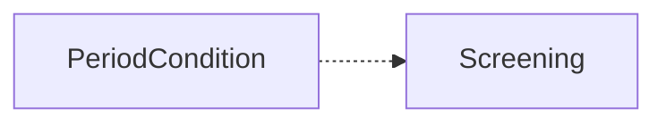
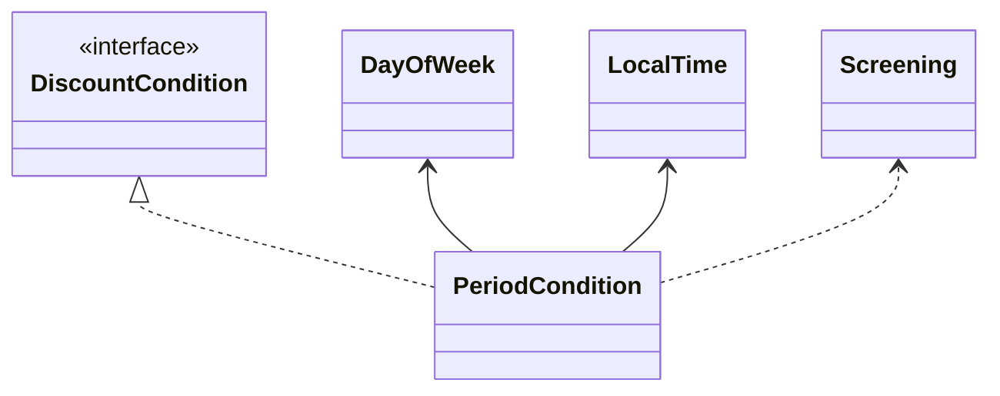
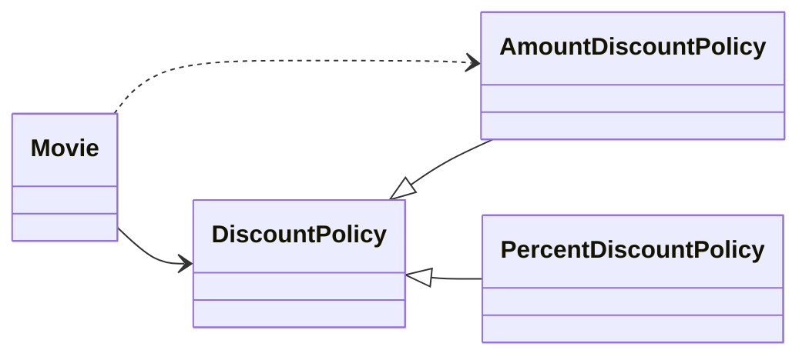

# 의존성 관리하기

**잘 설계된 OOP**: 작고 응집도 높은 객체들로 구성

**작고 응집도 높은 객체**: 책임의 초점이 명확하고 한 가지 일만 잘 함

작은 객체는 단독으로 할 수 있는 일이 거의 없어 다른 객체의 도움이 필요하다.

객체지향 설계의 핵심은 협력을 위해 필요한 의존성은 유지하면서도 변경을 방해하는 의존성은 제거하는데 있다.

## 의존성 이해하기

### 변경과 의존성

어떤 객체가 협력하기 위해 다른 객체를 필요로 할 때 두 객체 사이에 의존성이 존재하게 된다. 

- **실행 시점의 의존성**: 의존하는 객체가 정상적으로 동작하기 위해서는 실행 시에 의존 대상 객체가 반드시 존재해야 한다.
- **구현 시점의 의존성**: 의존 대상 객체가 변경될 경우 의존하는 객체도 함께 변경된다.

 

```java
public class PeriodCondition implements DiscountCondition {
	private DayOfWeek dayOfWeek;
	private LocalTime startTime;
	private LocalTime endTime;
	
	...
	
	public boolean isSatisfiedBy(Screening screening) {
		return screening.getStartTime().getDayOfWeek().equals(dayOfWeek) &&
			startTime.compareTo(screening.getStartTime().toLocalTime()) <= 0 &&
			endTime.compareTo(screening.getStartTime().toLocalTime()) >= 0;
	}
}
```

의존 대상

- DayOfWeek (인스턴스 변수)
- LocalTime (인스턴스 변수)
- Screening (메서드 인자)
- DiscountCondition (인터페이스 구현)

방향성: `PeriodCondition` → `Screening`



- 의존성은 항상 단방향
- Screening이 변경될 때 PeriodCondition이 영향을 받게 되지만 그 역은 성립하지 않는다.

변경의 전파

- 의존되는 요소가 변경되면 의존하는 요소도 함께 변경될 수 있다.
- 의존성은 변경에 의한 영향의 전파 가능성을 의미한다.

만약 DayOfWeek의 클래스 이름을 변경한다면 ❓

DiscountCondition 인터페이스의 이름이 변경된다면 ❓

DiscountCondition에 선언된 isSatisfiedBy 오퍼레이션의 시그니처가 변경된다면❓

⇒ `PeriodCondition`도 함께 변경될 수 있다



### 의존성 전이

의존성: 의존하고 있는 대상의 변경에 영향을 받을 수 있는 가능성이다.

의존성은 전이될 수 있다. 

- 의존성 전이:  A가 B에 의존하고 B가 C에 의존하면, A는 C에도 간접적으로 의존하게 된다.
    
    ```mermaid
    flowchart LR
    		A["PeriodCondition "] -.-> B["Screening"]
    		B -.-> C["Movie"]
    
      
    
    ```
    
    - PeriodCondition → Screening → Movie/LocalDateTime/Customer
    - PeriodCondition이 Screening에 의존할 경우 PeriodCondition은 Screening이 의존하는 대상에 대해서도 자동적으로 의존하게 된다.
    - Screening이 가지고 있는 의존성이 Screening에 의존하고 있는 PeriodCondition으로도 전파된다

모든 경우에 의존성이 전이되는 것은 아니다.

- 전이될지 여부는 변경의 방향과 캡슐화의 정도에 따라 달라진다.
- 캡슐화가 잘 되어 있으면 Screening의 내부 구현 변경이 PeriodCondition까지 전파되지 않을 수 있다.
- 중요한 건 변경에 의한 영향이 널리 전파될 수 있다는 것.

#### 직접 의존성 vs 간접 의존성

- 직접 의존성 (Direct Dependency)
    - 한 요소가 다른 요소에 직접 의존하는 경우
    - 코드에 명시적으로 드러남
    - 예: PeriodCondition → Screening
- 간접 의존성 (Indirect Dependency)
    - 직접적 관계는 없지만 의존성 전이로 영향을 받는 경우
    - 코드에 명시적으로 드러나지 않음
    - 예: PeriodCondition → Movie (Screening을 통해)

### 런타임 의존성과 컴파일타임 의존성

**런타임 (Runtime)**

- 애플리케이션이 실행되는 시점
- 주인공: 객체
- 다루는 주제: 객체 사이의 의존성

**컴파일타임 (Compile-time)**

- 코드를 작성하는 시점 (코드 구조 자체)
- 주인공: 클래스
- 다루는 주제: 클래스 사이의 의존성
- 동적 타입 언어에서는 실제 컴파일 시점이 없음

#### 런타임 의존성과 컴파일타임 의존성은 다를 수 있다

유연하고 재사용 가능한 코드를 위해서는 두 종류의 의존성을 서로 다르게 만들어야 한다.

예시: Movie는 가격을 계산하기 위해 비율 할인 정책과 금액 할인 정책 모두를 적용할 수 있어야 한다. 

- 컴파일타임 구조
    
    ```mermaid
    classDiagram 
    	direction BT
    		Movie--> DiscountPolicy
    		AmountDiscountPolicy --|> DiscountPolicy
    		PercentDiscountPolicy --|> DiscountPolicy
    		
    	    
      
    
    ```
    
    - Movie는 오직 DiscountPolicy(추상 클래스)에만 의존한다.
    
    ```java
    public class Movie {
    	...
    	
    	private DiscountPolicy discountPolicy;
    
    	public Movie(String title, Duration runningTime, Money fee, DiscountPolicy discountPolicy) {
    		...
    		
    		this.discountPolicy = discountPolicy;
    	}
    	
    	public Money calculateMovieFee(Screening screening) {
    		return fee.minus(discountPolicy.calculateDiscountAmount(screening));
    	}
    }
    ```
    
    - AmountDiscountPolicy, PercentDiscountPolicy에 대해 전혀 모른다.
- 런타임 구조
    
    ```mermaid
    flowchart LR
    		A[":Movie"] --- B[":AmountDiscountPolicy"]
    		C[":Movie"] --- D[":PercentDiscountPolicy"]
    
      
    
    ```
    
    - 실행 시점에는 Movie 인스턴스가 AmountDiscountPolicy 또는 PercentDiscountPolicy 인스턴스와 협력해야 한다.
    - 구체적인 할인 정책 객체와 실제로 상호작용할 수 있어야 한다.

만약 Movie가 AmountDiscountPolicy와 PercentDiscountPolicy 모두에 직접 의존한다면 결합도가 증가하고 새로운 할인 정책을 추가하기 어렵다.

#### 올바른 접근

- Movie는 구체 클래스를 모르고 추상 클래스에만 의존한다.
- 컴파일타임 의존성을 런타임에 구체적인 인스턴스로 대체한다.
- 유연하고 재사용 가능한 설계를 창조하기 위해서는 동일한 소스코드 구조를 가지고 다양한 실행 구조를 만들 수 있어야 한다.

### 컨텍스트 독립성

#### 구체 클래스 의존의 문제

- 구체 클래스를 알면 알수록 특정 문맥에 강하게 결합됨
    - Movie가 PercentDiscountPolicy에 의존 → 비율 할인 정책 문맥에만 사용 가능

#### 추상화를 통한 독립성

- 어떤 할인 정책을 사용할지는 런타임 의존성으로 결정
    - Movie가 DiscountPolicy(추상 클래스)에 의존 → 구체적인 정책은 미결정

#### 컨텍스트 독립성

- 클래스가 사용될 특정 문맥에 대해 최소한의 가정만으로 이뤄진 상태
- 각 객체가 실행하는 시스템에 관해 아무것도 알지 못한다.
- 최소한의 가정만으로 이뤄져 있다면 다른 문맥에서 재사용하기가 더 수월해진다.
- 효과
    - 재사용성 향상: 다양한 컨텍스트에서 재사용 가능
    - 유연성 증가: 설계가 유연해지고 변경에 탄력적으로 대응
    - 응집력 있는 객체: 객체 구성 방법을 재설정해서 변경 가능한 시스템 구축

### 의존성 해결하기

컴파일타임 의존성은 구체적인 런타임 의존성으로 대체돼야 한다.

- Movie 클래스(DiscountPolicy 의존, 컴파일타임 의존성) → Movie 인스턴스(구체적인 정책 인스턴스 의존, PercentDiscountPolicy / AmountDiscountPolicy)

컴파일타임 의존성을 실행 컨텍스트에 맞는 적절한 런타임 의존성으로 교체하는 것을 의존성 해결이라고 부른다.

#### 의존성 해결 방법 3가지

1. 객체를 생성하는 시점에 생성자를 통해 의존성 해결
    
    ```java
    public class Movie {
    	public Movie(String title, Duration runningTime, Money fee, DiscountPolicy discountPolicy) {
    		...
    		this.discountPolicy = discountPolicy;
    	}
    }
    ```
    
    Moive 클래스는 PercentDiscountPolicy 인스턴스와 AmountDiscountPolicy 인스턴스 모두를 선
    택적으로 전달받을 수 있도록 DiscountPolicy 타입의 인자를 받는 생성자를 정의한다.
    
    ```java
    // 금액 할인 정책
    Movie avatar = new Movie("아바타",
    	Duration.ofMinutes(120),
    	Money.wons(10000),
    	new AmountDiscountPolicy( ... ));
    
    // 비율 할인 정책
    Movie starWars = new Movie("스타워즈",
    	Duration.ofMinutes(180),
    	Money.wons(11000),
    	new PercentDiscountPolicy( ... ));
    ```
    
    - 객체 생성 시점에 의존성 해결
    - 객체가 완전한 상태로 생성됨
2. 객체 생성 후 setter 메서드를 통해 의존성 해결
    
    ```java
    public class Movie {
    	public void setDiscountPolicy (DiscountPolicy discountPolicy) {
    		this.discountPolicy = discountPolicy;
    	}
    }
    ```
    
    Movie 인스턴스는 DiscountPolicy를 설정할 수 있는 setter 메서드를 제공한다.
    
    ```java
    Movie avatar = new Movie( ... ));
    avatar.setDiscountPolicy(new AmountDiscountPolicy( ... ));
    ...
    avatar.setDiscountPolicy(new PercentDiscountPolicy( ... ));
    ```
    
    **장점**
    
    - 실행 시점에 의존 대상 변경 가능하다.
    - 설계를 더 유연하게 만든다.
    
    **단점**
    
    - 객체 생성 후 의존성 설정 전까지 상태가 불완전하다.
    - NullPointerException가 발생할 수 있다.
    - 시스템 상태가 불안정해질 수 있다.
3. 메서드 실행 시 인자를 이용해 의존성 해결
    
    객체를 생성할 때 의존성을 해결해서 완전한 상태의 객체를 생성한 후, 필요에 따라 setter 메서드를 이용해 의존 대상을 변경할 수 있게 할 수 있다.
    
    ```java
    Movie avatar = new Movie( ... , new PercentDiscountPolicy( ... )));
    ...
    avatar.setDiscountPolicy(new AmountDiscountPolicy( ... ));
    ```
    
    ```java
    public class Movie {
    	public Money calculateMovieFee(Screening screening, DiscountPolicy discountPolicy) {
    		return fee.minus(discountPolicy.calculateDiscountAmount(screening));
    	}
    }
    ```
    
    **장점**
    
    - 시스템 상태를 안정적으로 유지
    - 유연성도 향상
    - 가장 선호되는 방법
    
    **적합한 경우**
    
    - 협력 대상에 대해 지속적인 의존 관계가 필요 없을 때
    - 메서드 실행 동안만 일시적으로 의존 관계가 존재해도 될 때
    - 메서드 실행마다 의존 대상이 달라져야 할 때
    
    **주의사항**
    
    - 매번 동일한 객체를 인자로 전달한다면 생성자나 setter 방식으로 변경 권장

## 유연한 설계

### 의존성과 결합도

#### 의존성은 필요하다

- 객체지향의 근간은 협력
- 협력을 위해서는 서로의 존재와 책임을 알아야 함
- 의존성은 협력을 가능하게 만드는 매개체

모든 의존성이 나쁜 것은 아니다. 객체들의 협력을 가능하게 만드는 매개체라는 관점에서는 바람직하다.

문제는 의존성의 존재가 아니라 의존성의 정도이다.

하지만 의존성이 과하면 문제가 될 수 있다. Movie가 비율 할인 정책을 구현하는 PercentDiscountPolicy에 직접 의존한다고 가정해보자.

#### 나쁜 의존성

```java
public class Movie {
	...
	private PercentDiscountPolicy percentDiscountPolicy;
	
	public Movie(String title, Duration runningTime, Money fee,
		PercentDiscountPolicy percentDiscountPolicy) {
		...
		this.percentDiscountPolicy = percentDiscountPolicy;
	}
	public Money calculateMovieFee(Screening screening) {
		return fee.minus(percentDiscountPolicy.calculateDiscountAmount(screening));
	}
}
```

- Movie가 PercentDiscountPolicy라는 구체 클래스에 의존한다.
    - 다른 할인 정책이 필요한 문맥에서 Movie를 재사용 할 수 없다.
    - AmountDiscountPolicy와 협력하려면 코드 수정 필요하다.

#### Movie의 입장에서 협력의 대상은 반드시 PercentDiscountPolicy의 인스턴스일 필요는 없다.

- calculateDiscountAmount 메시지를 이해
- 할인된 요금을 계산

#### 바람직하지 못한 의존성 (**Movie → PercentDiscountPolicy)

- PercentDiscountPolicy에 대한 의존성
- 특정 컨텍스트에 강하게 결합
- 다른 환경에서 재사용하려면 내부 구현 변경 필요
- 강한 결합도

#### 바람직한 의존성 (**Movie → DiscountPolicy)

- DiscountPolicy(추상 클래스)에 대한 의존성
- 컨텍스트에 독립적
- 다양한 환경에서 재사용 가능
    - DiscountPolicy 클래스에 대한 컴파일타임 의존성을 AmountDiscountPolicy / PercentDiscountPolicy 인스턴스에 대한 런타임 의존성으로 대체
- 느슨한 결합도

바람직한 의존성은 재사용성과 관련이 있다. 

어떤 의존성이 다양한 환경에서 재사용할 수 있다면 그 의존성은 바람직한 것이다. 

컨텍스트에 독립적인 의존성은 바람직한 의존성이고 특정한 컨텍스트에 강하게 결합된 의존성은 바람직하지 않은 의존성이다.

### 지식이 결합을 낳는다

####  서로에 대해 알고 있는 지식의 양이 결합도를 결정한다. 

- 한 요소가 다른 요소에 대해 더 많이 알수록
    - 강하게 결합
    - 더 많이 안다 = 더 적은 컨텍스트에서만 재사용 가능
    - 기존 지식에 맞지 않는 컨텍스트에서 재사용하려면 클래스 수정 필요
- 한 요소가 다른 요소에 대해 더 적게 알수록
    - 약하게 결합
    - 협력하는 대상에 대해 더 적게 알아야 함
    - 필요한 정보 외에는 최대한 감춰야 함

####  **Movie → PercentDiscountPolicy (강한 결합)**

- Movie가 알아야 하는 것: "비율 할인 정책에 따라 할인 요금을 계산"
- 구체적인 계산 방법까지 알고 있음

####  **Movie → DiscountPolicy (느슨한 결합)**

- Movie가 알아야 하는 것: "할인 요금을 계산한다"
- 구체적인 계산 방법은 모름
- 지식의 양이 적음

####  👉 **느슨한 결합도를 위한 방법: 추상화**

### 추상화에 의존하라

####  **추상화란**

- 특정 절차나 물체를 의도적으로 생략하거나 감춤으로써 복잡도를 극복하는 방법
- 불필요한 정보를 감춤
- 대상에 대해 알아야 하는 지식의 양을 줄임
    - 결합도를 느슨하게 유지

####  DiscountPolicy는 PercentDiscountPolicy의 추상화

- "비율 할인 정책에 따라 계산"이라는 구체적 사실을 숨김
- Movie가 알아야 하는 지식의 양 감소 → 결합도 감소

####  의존 대상의 추상화 수준

의존하는 대상이 더 추상적일수록 결합도는 더 낮아진다

1. 구체 클래스 의존성 (Concrete Class Dependency)
    - 가장 높은 결합도
2. 추상 클래스 의존성 (Abstract Class Dependency)
    - 메서드의 내부 구현 숨김
    - 클라이언트에게 자식 클래스의 종류 숨김
        - 단, 클라이언트는 상속 계층을 알아야 함
3. 인터페이스 의존성 (Interface Dependency)
    - 가장 낮은 결합도
    - 상속 계층을 몰라도 협력 가능
    - 어떤 메시지를 수신할 수 있는지에 대한 지식만 필요
    - 다양한 클래스 상속 계층에 속한 객체들이 동일한 메시지 수신 가능

### 명시적인 의존성

```java
public class Movie {
	...
	private DiscountPolicy discountPolicy;
	
	public Movie(String title, Duration runningTime, Money fee) {
		...
		this.discountPolicy = new AmountDiscountPolicy( ... );
	}
}
```

문제점

- 인스턴스 변수는 DiscountPolicy(추상 클래스) 타입이지만 생성자에서 AmountDiscountPolicy(구체 클래스) 직접 생성한다.
    - 결과: Movie는 DiscountPolicy와 AmountDiscountPolicy 모두에 의존한다.
    - 겉으로는 유연해 보이지만 실제로는 강하게 결합된다.



결합도를 느슨하게 만들기 위해서는 클래스 안에서 구체 클래스에 대한 모든 의존성을 제거해야만 한다.

- 인스턴스 변수 타입: 추상 클래스 또는 인터페이스
- 생성자 / setter / 메서드 인자: 구체 클래스 인스턴스를 전달받음
- 생성자 인자도 추상 타입으로 선언

```java
public class Movie {
	...
	private DiscountPolicy discountPolicy;

	public Movie(String title, Duration runningTime, Money fee, DiscountPolicy discountPolicy) {
		...
		this.discountPolicy = discountPolicy;
	}
}
```

 인스턴스 변수의 타입과 생성자의 인자 타입 모두 추상 클래스인 DiscountPolicy로 선언돼 있다.

- Movie 인스턴스는 생성자의 인자로 전달된 인스턴스에 의존한다.
    - 런타임에 AmountDiscountPolicy 또는 PercentDiscountPolicy 선택적 전달 가능
- 퍼블릭 인터페이스를 통해 할인 정책 설정 가능

#### 명시적 의존성 (Explicit Dependency)

- 의존성이 퍼블릭 인터페이스에 드러난다.
- 생성자, setter, 메서드 인자를 통해 표현한다.
- 의존성 파악이 쉽다
- 다른 컨텍스트에서 재사용 용이하다.

#### 숨겨진 의존성 (Hidden Dependency)

- 의존성이 퍼블릭 인터페이스에 표현되지 않는다.
- 클래스 내부에서 직접 인스턴스 생성한다.
- 의존성 파악을 위해 내부 구현을 직접 살펴봐야 한다.
- 다른 컨텍스트에서 재사용하려면 내부 구현을 직접 수정해야 한다.
- 문제
    - 의존성을 파악하기 어렵다.
        - 커다란 클래스의 긴 메서드 내부에서 인스턴스 생성 코드를 찾기 어려움
    - 클래스를 다른 컨텍스트에서 재사용하기 위해 내부 구현을 직접 변경해야 한다.
        - 코드 수정은 잠재적 버그 발생 가능성 내포
    - 실행 컨텍스트에 적절한 의존성을 선택할 수 없다.

#### 의존성은 명시적으로 표현돼야 한다

- 의존성을 구현 내부에 숨기지 말 것
- 퍼블릭 인터페이스를 통해 의존성을 명시적으로 드러낼 것
- 명시적인 의존성만이 컴파일타임 의존성을 적절한 런타임 의존성으로 교체 가능

#### 클래스가 다른 클래스에 의존하는 것은 부끄러운 일이 아니다.

- 의존성은 협력을 가능하게 하는 바람직한 것
- 경계해야 할 것은 의존성 자체가 아니라 의존성을 감추는 것
- 숨겨진 의존성을 밝은 곳으로 드러내면 설계가 유연하고 재사용 가능해짐

### new는 해롭다

new를 잘못 사용하면 클래스 사이의 결합도가 극단적으로 높아진다. 

#### 결합도 측면에서 new가 해로운 이유

- new 연산자를 사용하기 위해서는 구체 클래스의 이름을 직접 기술해야 한다. 따라서 new를 사용하는 클라이언트는 추상화가 아닌 구체 클래스에 의존할 수밖에 없기 때문에 결합도가 높아진다.
- new 연산자는 생성하려는 구체 클래스뿐만 아니라 어떤 인자를 이용해 클래스의 생성자를 호출해야 하는지도 알아야 한다. 따라서 new를 사용하면 클라이언트가 알아야 하는 지식의 양이 늘어나기 때문에 결합도가 높아진다.

```java
public class Movie {
	...
	private DiscountPolicy discountPolicy;
	
	public Movie(String title, Duration runningTime, Money fee) {
		...
		this.discountPolicy = new AmountDiscountPolicy(Money.wons(800),
															new SequenceCondition(1),
															new SequenceCondition(10),
															new PeriodCondition(DayOfWeek.MONDAY,
																			LocalTime.of(10, 0), LocalTime.of(11, 59)),
															new PeriodCondition(DayOfWeek.THURSDAY,
																			LocalTime.of(10, 0), LocalTime.of(20, 59))));
	}
}
```

- Movie가 AmountDiscountPolicy 생성자의 인자 목록과 순서를 알아야 한다.
    - AmountDiscountPolicy의 생성자 인자 목록이나 순서 변경 시 Movie도 변경
- Movie가 SequenceCondition과 PeriodCondition에도 의존한다.
    - SequenceCondition, PeriodCondition 변경 시에도 Movie 변경
- Movie가 더 많은 것에 의존하면 의존할수록 점점 더 변경에 취약해진다.
    
    ```mermaid
    classDiagram 
    		Movie --> DiscountPolicy
    		DiscountPolicy <|-- AmountDiscountPolicy 
    		DiscountPolicy <|-- PercentDiscountPolicy 
    		
    		DiscountPolicy --> DiscountCondition
    		DiscountCondition <|-- SequenceCondition
    		DiscountCondition <|-- PeriodCondition
    		
    		Movie ..> AmountDiscountPolicy 
    		Movie ..> SequenceCondition
    		Movie ..> PeriodCondition
    	    
      
    
    ```
    
- Movie가 DiscountPolicy에 의존하는 유일한 이유: `calculateDiscountAmount` 메시지 전송
    - 메시지 의존성 외의 모든 다른 의존성은 불필요하다.
    - new는 이런 불필요한 결합도를 급격하게 높인다.

#### 해결 방법: 사용과 생성의 책임 분리

- 인스턴스를 생성하는 로직과 사용하는 로직을 분리한다.
- 사용하는 객체는 인스턴스를 생성하지 않고 전달받기만 함
    
    ```java
    // 생성자를 통해 외부의 인스턴스를 전달받아 의존성을 해결
    public class Movie {
    	...
    	private DiscountPolicy discountPolicy;
    	
    	public Movie(String title, Duration runningTime, Money fee, DiscountPolicy discountPolicy) {
    		...
    		this.discountPolicy = discountPolicy;
    	}
    }
    ```
    
- 클라이언트가 생성 책임 수행한다.
    
    ```java
    Movie avatar = new Movie("아바타",
    							Duration.ofMinutes(120),
    							Money.wons(10000),
    							new AmountDiscountPolicy(Money.wons(800),
    							new SequenceCondition(1),
    							new SequenceCondition(10),
    							new PeriodCondition(DayOfWeek.MONDAY,
    							LocalTime.of(10, 0), LocalTime.of(11, 59)),
    							new PeriodCondition(DayOfWeek.THURSDAY,
    							LocalTime.of(10, 0), LocalTime.of(20, 59))));
    ```
    
    - Movie는 AmountDiscountPolicy의 인스턴스를 사용하는 책임만 남는다.
- 효과
    - **책임 분리**
        - 생성 책임: 클라이언트
        - 사용 책임: Movie
    - **유연성 증가**
        - Movie 생성자가 추상 클래스 DiscountPolicy를 인자로 받음
        - DiscountPolicy의 모든 자식 클래스와 협력 가능
    - **결합도 감소**
        - Movie는 메시지 전송 책임만 수행
        - 구체 클래스 생성 정보를 알 필요 없음

### 가끔은 생성해도 무방하다

#### 기본 객체 설정이 필요한 경우

대부분 AmountDiscountPolicy와 협력하고 가끔씩만 PercentDiscountPolicy와 협력한다고 할 때, 모든 경우에 클라이언트가 생성하면 중복 코드가 발생하고 Movie의 사용성이 저하된다.

#### 해결 방법: 생성자 체이닝

기본 객체를 생성하는 생성자를 추가하고 이 생성자에서 DiscountPolicy의 인스턴스를 인자로 받는 생성자를 체이닝한다[Kerievsky04]. 

```java
public class Movie {
	private DiscountPolicy discountPolicy;
	
	// 기본 객체를 생성하는 생성자
	public Movie(String title, Duration runningTime, Money fee) {
		this(title, runningTime, fee, new AmountDiscountPolicy( ... ));
	}
	
	// 인스턴스를 인자로 받는 생성자
	public Movie(String title, Duration runningTime, Money fee, DiscountPolicy discountPolicy) {
		...
		this.discountPolicy = discountPolicy;
	}
}
```

- 첫 번째 생성자가 두 번째 생성자를 호출한다. (체인 연결)
    - 클라이언트는 대부분 간략한 생성자를 사용해서 AmountDiscountPolicy의 인스턴스와 협력하게 한다.
    - 필요시 적절한 DiscountPolicy 인스턴스로 의존성 교체할 수 있다.
- 메서드를 오버로딩하는 경우에도 사용할 수 있다.
    
    ```java
    public class Movie {
    
    	// 기본값을 사용하는 메서드
    	public Money calculateMovieFee(Screening screening) {
    		return calculateMovieFee(screening, new AmountDiscountPolicy( ... )));
    	}
    	
    	// 인스턴스를 인자로 받는 메서드
    	public Money calculateMovieFee(Screening screening, DiscountPolicy discountPolicy) {
    		return fee.minus(discountPolicy.calculateDiscountAmount(screening));
    	}
    }
    ```
    
    - 클래스의 사용성을 향상
    - 다양한 컨텍스트에서 유연하게 사용될 수 있다.

#### 설계의 트레이드오프

**결합도 vs 사용성**

- 구체 클래스에 의존하면 결합도 증가
- 하지만 클래스 사용성이 더 중요하다면 결합도를 높이는 방향도 선택 가능

### 표준 클래스에 대한 의존은 해롭지 않다

의존성이 불편한 이유는 그것이 항상 변경에 대한 영향을 암시하기 때문이다. 

- 변경될 확률이 거의 없는 클래스라면 의존성이 문제 없다.
    - JDK 표준 클래스 (ArrayList 등)
    - 구체 클래스에 의존하거나 직접 인스턴스 생성해도 무방

의존성에 의한 영향이 적은 경우에도 추상화에 의존하고 의존성을 명시적으로 드러내는 것이 좋다.

```java
public abstract class DiscountPolicy {
	private List<DiscountCondition> conditions = new ArrayList<>();
	
	public void switchConditions(List<DiscountCondition> conditions) {
		this.conditions = conditions;
	}
}
```

- 변수 타입을 인터페이스(List)로 선언
- 다양한 List 타입의 객체로 대체 가능
- 설계 유연성 향상

### 컨텍스트 확장하기

1. **예제: 할인 혜택을 제공하지 않는 영화**
    
    생성자 체이닝 기법을 이용해 기본값으로 null을 할당
    
    ```java
    public class Movie {
    	public Movie(String title, Duration runningTime, Money fee) {
    		this(title, runningTime, fee, null);
    	}
    	
    	public Movie(String title, Duration runningTime, Money fee, DiscountPolicy discountPolicy) {
    		...
    		this.discountPolicy = discountPolicy;
    	}
    	
    	public Money calculateMovieFee(Screening screening) {
    		if (discountPolicy == null) { // 예외 케이스
    			return fee;
    		}
    		return fee.minus(discountPolicy.calculateDiscountAmount(screening));
    	}
    }
    ```
    
    - 메서드 내부에서 discountPolicy의 값이 null인지 여부를 체크
    - Movie와 DiscountPolicy 협력 방식에 어긋나는 예외 케이스
    - Movie 내부 코드를 직접 수정해야 함
        - 버그 발생 가능성 증가
    
    **해결: NoneDiscountPolicy**
    
    Movie와 DiscountPolicy가 협력하던 방식을 따르도록 만든다.
    
    ```java
    public class NoneDiscountPolicy extends DiscountPolicy {
    	@Override
    	protected Money getDiscountAmount(Screening Screening) {
    		return Money.ZERO;
    	}
    }
    ```
    
    할인 정책이 존재하지 않는다는 사실을 할인 정책의 한 종류로 간주한다.
    
    ```java
    Movie avatar = new Movie("아바타",
    							Duration.ofMinutes(120),
    							Money.wons(10000),
    							new NoneDiscountPolicy());
    ```
    
    Movie에 특별한 if 문 추가 불필요하다.
    
2. **예제: 중복 할인 정책**
    
    중복 할인
    
    - 금액 할인 정책과 비율 할인 정책을 혼합해서 적용할 수 있는 할인 정책.
    - Movie가 하나 이상의 DiscountPolicy와 협력할 수 있어야 한다.
    
    나쁜(간단한) 방법: List로 관리
    
    - Movie가 DiscountPolicy 인스턴스들의 List 보유
    - 기존 협력 방식과 다른 예외 케이스 추가
    
    **해결: OverlappedDiscountPolicy**
    
    중복 할인 정책을 할인 정책의 한 가지로 간주한다.
    
    ```java
    public class OverlappedDiscountPolicy extends DiscountPolicy {
    	private List<DiscountPolicy> discountPolicies = new ArrayList<>();
    	
    	public OverlappedDiscountPolicy(DiscountPolicy ... discountPolicies) {
    		this.discountPolicies = Arrays.asList(discountPolicies);
    
    	@Override
    	protected Money getDiscountAmount(Screening screening) {
    		Money result = Money.ZERO;
    		for(DiscountPolicy each : discountPolicies) {
    			result =result.plus(each.calculateDiscountAmount(screening));
    		}
    		return result;
    	}
    }
    ```
    
    ```java
    Movie avatar = new Movie("아바타",
    							Duration.ofMinutes(120),
    							Money.wons(10000),
    							new OverlappedDiscountPolicy(
    							new AmountDiscountPolicy( ... ),
    							new PercentDiscountPolicy( ... )));
    ```
    
    - 중복 할인을 할인 정책의 한 종류로 간주
    - Movie 수정 없이 새로운 기능 추가
    - 기존 협력 방식 유지

#### 설계를 유연하게 만들 수 있었던 이유

1. Movie가 DiscountPolicy라는 추상화에 의존
2. 생성자를 통해 DiscountPolicy에 대한 의존성을 명시적으로 드러냄
3. new와 같이 구체 클래스를 직접적으로 다뤄야 하는 책임을 Movie 외부에 둠
4. DiscountPolicy 클래스에 자식 클래스를 추가함으로써 간단하게 Movie가 사용될 컨텍스트를 확장

### 조합 가능한 행동

다양한 종류의 할인 정책이 필요한 컨텍스트에서 Movie를 재사용할 수 있었던 이유는 코드를 직접 수정
하지 않고도 협력 대상인 DiscountPolicy 인스턴스를 교체할 수 있었기 때문이다. 

- 비율 할인: PercentDiscountPolicy 연결
- 금액 할인: AmountDiscountPolicy 연결
- 중복 할인: OverlappedDiscountPolicy 조합
- 할인 없음: NoneDiscountPolicy 전달

**특징**

- 어떤 객체와 협력하느냐에 따라 행동이 달라짐
- 유연하고 재사용 가능한 설계의 특징
    - 응집도 높은 책임들을 가진 작은 객체들을 다양한 방식으로 연결함으로써 애플리케이션의 기능을 쉽게 확장할 수 있다.

유연하고 재사용 가능한 설계는 객체가 어떻게(how) 하는지를 장황하게 나열하지 않고도 객체들의 조합을 통해 무엇(what)을 하는지를 표현하는 클래스들로 구성된다. 

코드에 드러난 로직을 해석할 필요 없이 객체가 어떤 객체와 연결됐는지를 보는 것만으로도 객체의 행동을 쉽게 예상하고 이해할 수 있다.

```java
new Movie("아바타",
		Duration.ofMinutes(120),
		Money.wons(10080),
		new AmountDiscountPolicy(Money.wons(800),
				new SequenceCondition(1),
				new SequenceCondition(10),
				new PeriodCondition(DayOfWeek.MONDAY, LocalTime.of(10, 0), LocalTime.of(12, 0)),
				new PeriodCondition(DayOfWeek.THURSDAY, LocalTime.of(10, 0), LocalTime.of(21, 0)));
```

- 800원 할인
    - 첫 번째, 10번째 상영 시 할인
    - 월요일 10-12시, 목요일 10-21시 상영 시 할인

> **훌륭한 객체지향 설계란**
객체가 어떻게 하는지를 표현하는 것이 아님
객체들의 조합을 선언적으로 표현함으로써 객체들이 무엇을 하는지를 표현하는 설계

**훌륭한 설계의 핵심은 의존성을 관리하는 것!**
>
