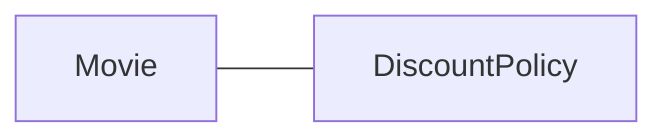
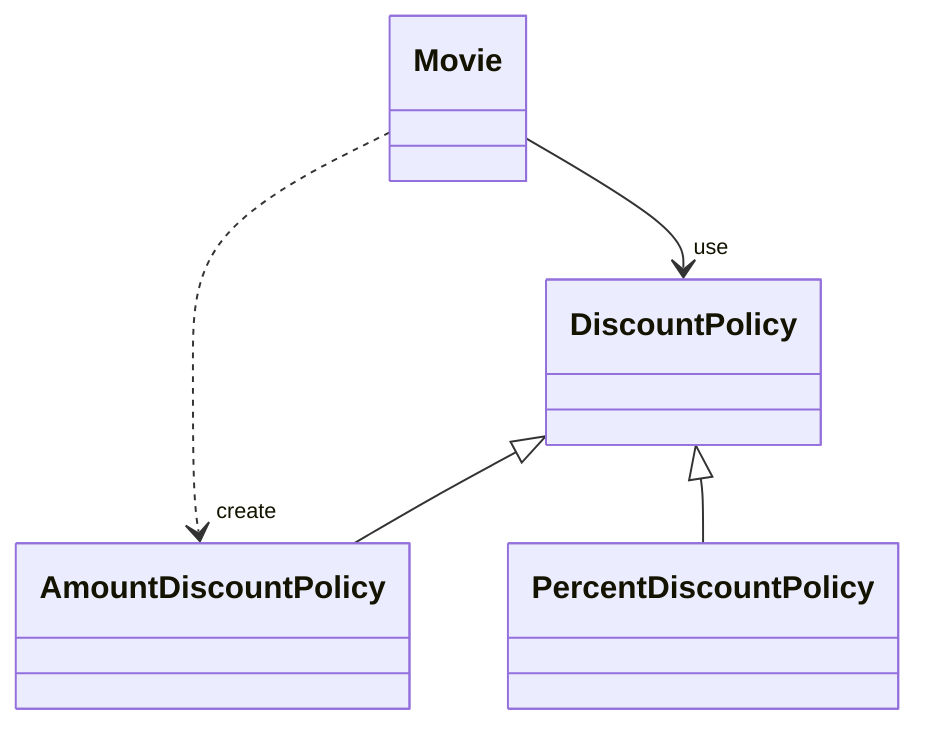
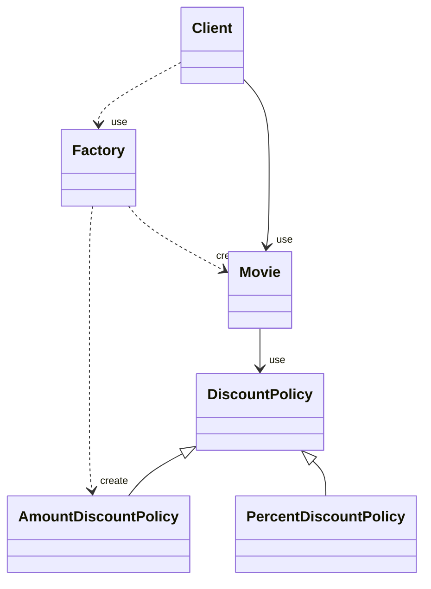
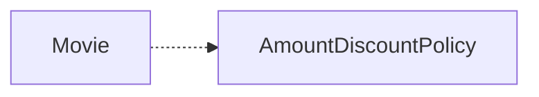
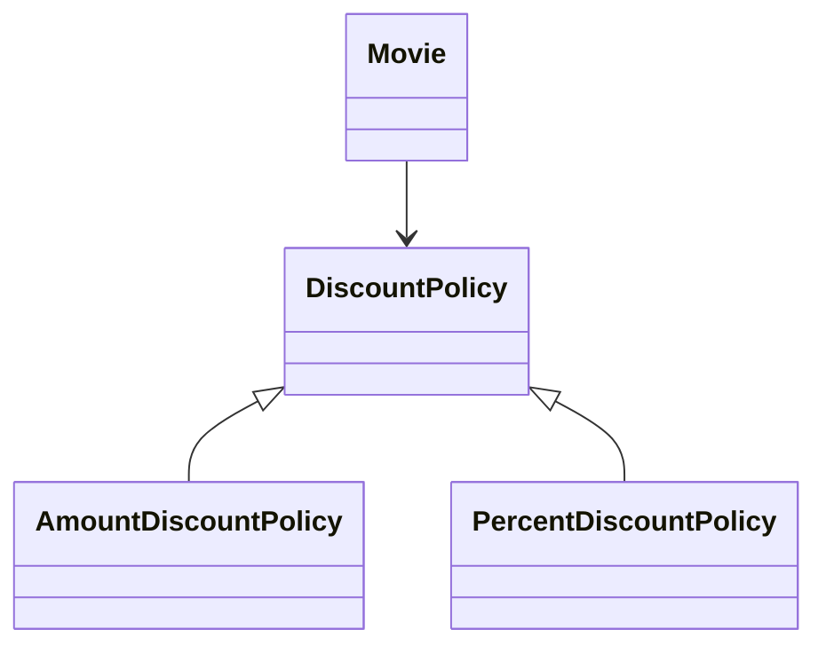
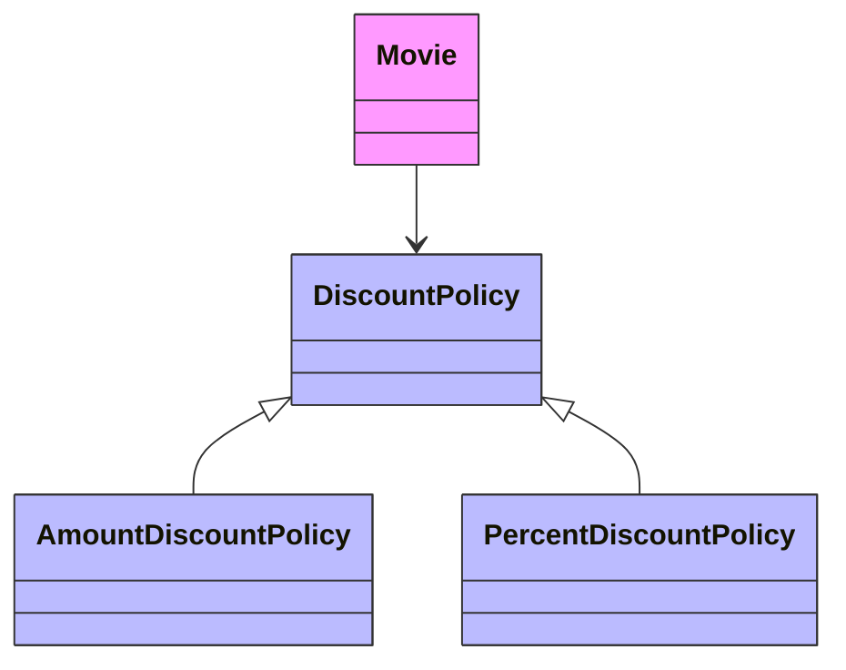
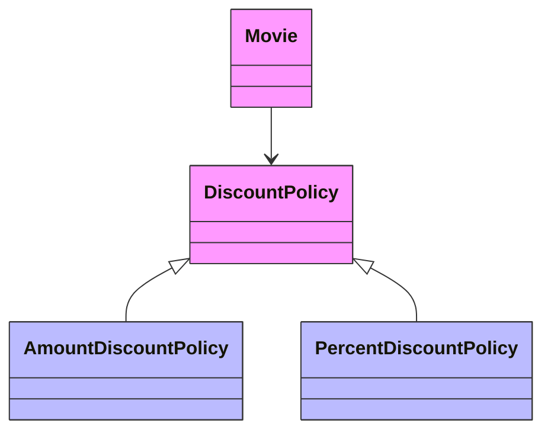
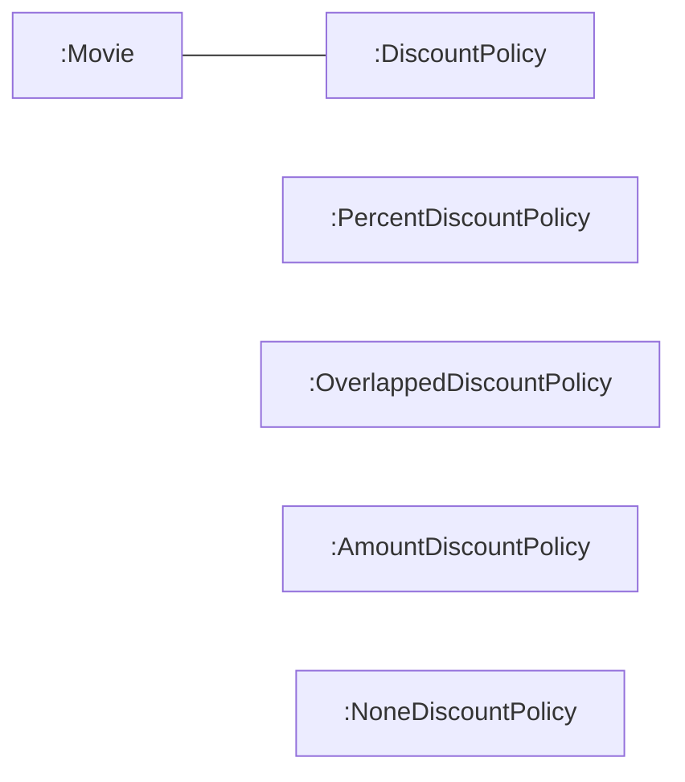

# 유연한 설계

의존성 관리 기법들을 원칙이라는 관점에서 정리한다. 

## 개방-폐쇄 원칙

> 소프트웨어 개체(클래스, 모듈, 함수 등등)는 **확장**에 대해 열려 있어야 하고, **수정**에 대해서는 닫혀 있어야 한다.
> 

⇒ 기존의 코드를 수정하지 않고도 애플리케이션의 동작을 확장할 수 있는 설계

⇒ 코드를 수정하지 않고 새로운 동작을 추가하는 것이 가능

#### 확장에 대해 열려 있다

- 애플리케이션의 요구사항이 변경될 때 이 변경에 맞게 새로운 '동작'을 추가해서 애플리케이션의 기능을 확장할 수 있다.

#### 수정에 대해 닫혀 있다

- 기존의 '코드'를 수정하지 않고도 애플리케이션의 동작을 추가하거나 변경할 수 있다.

### 컴파일타임 의존성을 고정시키고 런타임 의존성을 변경하라

개방-폐쇄 원칙은 런타임 의존성과 컴파일타임 의존성에 관한 이야기다. 

- 런타임 의존성: 실행시에 협력에 참여하는 객체들 사이의 관계
- 컴파일타임 의존성: 코드에서 드러나는 클래스들 사이의 관계

유연한 설계에서는 두 의존성의 구조가 다르다.

#### 영화 예매 시스템

- 컴파일타임 의존성
    
    ```mermaid
    classDiagram 
    	direction LR
    		Movie --> DiscountPolicy
    		DiscountPolicy <|-- AmountDiscountPolicy 
    		DiscountPolicy <|-- PercentDiscountPolicy 
    
    	    
      
    
    ```
    
    - Movie 클래스 → DiscountPolicy(추상 클래스)에 의존
    - 코드에서 드러나는 관계
- 런타임 의존성
    
    ```mermaid
    flowchart LR
    		A[":Movie"] --- B[":AmountDiscountPolicy"]
    		D[":Movie"] --- C[":PercentDiscountPolicy"]
    
      
    
    ```
    
    - Movie 인스턴스 → AmountDiscountPolicy 또는 PercentDiscountPolicy 인스턴스에 의존
    - 실행 시 협력에 참여하는 객체들 사이의 관계
- **NoneDiscountPolicy  / OverlappedDiscountPolicy 추가**
    - 기존 코드 수정 없음 (Movie, DiscountPolicy, AmountDiscountPolicy, PercentDiscountPolicy)
    - 단순히 DiscountPolicy의 자식 클래스로 OverlappedDiscountPolicy 추가
    - 새로운 클래스 추가만으로 동작 확장
    - 컴파일타임 의존성
        
        ```mermaid
        classDiagram 
        	direction LR
        		Movie --> DiscountPolicy
        		DiscountPolicy <|-- OverlappedtDiscountPolicy 
        		DiscountPolicy <|-- NoneDiscountPolicy
        		DiscountPolicy <|-- AmountDiscountPolicy 
        		DiscountPolicy <|-- PercentDiscountPolicy 
        
        	    
          
        
        ```
        
    - 런타임 의존성
        
        ```mermaid
        flowchart LR
        		A[":Movie"] --- B[":AmountDiscountPolicy"]
        		E[":Movie"] --- F[":OverlappedDiscountPolicy"]
        		H[":Movie"] --- R[":NoneDiscountPolicy"]
        		D[":Movie"] --- C[":PercentDiscountPolicy"]
        		
        
        ```
        
        **확장에 대해 열려 있다:** 새로운 할인 정책을 추가해서 기능 확장 가능
        
        **수정에 대해 닫혀 있다:** 기존 코드 수정 없이 새로운 클래스 추가만으로 확장
        

#### 의존성 관점에서의 개방-폐쇄 원칙

**컴파일타임 의존성**

- Movie → DiscountPolicy (변경 없음)
- OverlappedDiscountPolicy 추가해도 유지

**런타임 의존성**

- Movie 인스턴스 → OverlappedDiscountPolicy 인스턴스 (협력 가능)
- 런타임 의존성의 가능성 확장

**의존성 관점에서 개방-폐쇄 원칙을 따르는 설계**

- 컴파일타임 의존성은 유지하면서 런타임 의존성의 가능성을 확장하고 수정할 수 있는 구조

### 추상화가 핵심이다

#### 개방-폐쇄 원칙의 핵심은 추상화에 의존하는 것이다. 

- '추상화'와 '의존' 모두 중요

#### 추상화란

- 핵심적인 부분만 남기고 불필요한 부분은 생략함으로써 복잡성을 극복하는 기법
- 추상화 과정을 거치면 문맥이 바뀌더라도 변하지 않는 부분만 남게 되고 문맥에 따라 변하는 부분은 생략된다.
    - 남겨진 부분
        - 다양한 상황에서의 공통점을 반영한 결과물
        - 문맥이 바뀌더라도 변하지 않아야 한다. (수정 ❌)
- 생략된 부분을 문맥에 적합한 내용으로 채워넣음으로써 각 문맥에 적합하게 기능을 구체화하고 확장할 수 있다.

추상화 부분은 수정에 대해 닫혀 있고 추상화를 통해 생략된 부분은 확장의 여지를 남긴다. 

⇒ 개방-폐쇄 원칙

#### DiscountPolicy 예시

```java
public abstract class DiscountPolicy {
	private List<DiscountCondition> conditions = new ArrayList<>();
	
	public DiscountPolicy(DiscountCondition ... conditions) {
		this.conditions = Arrays.asList(conditions);
	}
	
	// 할인 여부를 판단
	public Money calculateDiscountAmount(Screening screening) {
		for (DiscountCondition each : conditions) {
			//  조건을 만족 여부
			if (each.isSatisfiedBy(screening)) {
				return getDiscountAmount(screening);
			}
		}
	
		return screening.getMovieFee();
	}
	abstract protected Money getDiscountAmount(Screening Screening);
}
```

**변하지 않는 부분 (공통점)**

- 할인 여부를 판단하는 로직
- 수정에 대해 닫혀 있음

**변하는 부분 (생략된 부분)**

- 할인된 요금을 계산하는 방법
- 상속을 통해 구체화하여 할인 정책을 확장

변하지 않는 부분을 고정하고 변하는 부분을 생략하는 추상화 메커니즘이 개방-폐쇄 원칙의 기반이 된다.

#### 개방-폐쇄 원칙에서 폐쇄를 가능하게 하는 것은 의존성의 방향이다.

수정에 대한 영향을 최소화하기 위해서는 모든 요소가 추상화에 의존해야 한다.

```java
public class Movie {
	...
	private DiscountPolicy discountPolicy;
	
	public Movie(String title, Duration runningTime, Money fee, DiscountPolicy discountPolicy) {
		...
		this.discountPolicy = discountPolicy;
	}
	
	public Money calculateMovieFee(Screening screening) {
		return fee.minus(discountPolicy.calculateDiscountAmount(screening));
	}
}
```

- 추상화인 DiscountPolicy에만 의존
- DiscountPolicy는 변하지 않는 안정된 추상화
- 할인 정책 추가 시에도 영향받지 않음

⇒ Movie와 DiscountPolicy는 수정에 대해 닫혀 있음



> 컴파일타임 의존성을 런타임 의존성으로 대체함으로써 개방-폐쇄 원칙을 따르는 코드를 작성할 수 있지만 여기서 핵심은 추상화다.
올바른 추상화를 설계하고 추상화에 대해서만 의존하도록 관계를 제한함으로써 설계를 유연하게 확장할 수 있다.

추상화를 했다고 해서 모든 수정에 대해 설계가 폐쇄되는 것은 아니다.
변경에 의한 파급효과를 최대한 피하기 위해서는 변하는 것과 변하지 않는 것이 무엇인지를 이해하고 이를 추상화의 목적으로 삼아야만 한다. 
추상화가 수정에 대해 닫혀 있을 수 있는 이유는 변경되지 않을 부분을 신중하게 결정하고 올바른 추상화를 주의 깊게 선택했기 때문이다.
> 

## 생성 사용 분리

```java
public class Movie {
	...
	private DiscountPolicy discountPolicy;
	
	public Movie(String title, Duration runningTime, Money fee) {
		...
		this.discountPolicy = new AmountDiscountPolicy( ... );
	}
	
	public Money calculateMovieFee(Screening screening) {
		return fee.minus(discountPolicy.calculateDiscountAmount(screening));
	}
}
```

#### 문제점

- Movie가 DiscountPolicy(추상화)에 의존하지만 내부에서 AmountDiscountPolicy(구체 클래스) 생성
- 할인 정책 변경을 위해서는 코드를 직접 수정해야 함
- 개방-폐쇄 원칙 위반

결합도가 높아질수록 개방-폐쇄 원칙을 따르는 구조를 설계하기가 어려워진다. 

#### 알아야 하는 지식이 많으면 결합도도 높아진다. 

- 객체 생성에 대한 지식

#### 객체 생성에 대한 지식이 과도한 결합도를 높인다.

- 객체의 타입에 대한 지식
- 생성자 인자에 대한 지식
    - 객체의 타입과 생성자에 전달해야 하는 인자에 대한 과도한 지식은 코드를 특정한 컨텍스트에 강하게 결합시킨다.
    - 컨텍스트를 바꾸기 위한 유일한 방법은 코드 안에 명시돼 있는 컨텍스트에 대한 정보를 직접 수정하는 것뿐이다.

물론 어딘가에서는 반드시 객체를 생성해야 한다. 문제는 부적절한 곳에서 객체를 생성한다는 것

#### Movie의 진짜 문제는  동일한 클래스 안에서 두 가지 이질적인 목적의 코드가 공존하는 것

- 생성자에서 객체 생성
- calculateMovieFee 메서드에 메시지 전송

해결 원칙: 생성과 사용의 분리 (Separating Use from Creation)

#### 해결: 생성과 사용의 분리

> 소프트웨어 시스템은 (응용 프로그램 객체를 제작하고 의존성을 서로 "연결"하는) 시작 단계와 (시작 단계 이후에 이어지는) 실행 단계를 분리해야 한다. [Martin08].
> 

해결 방법 1: 클라이언트에게 생성 책임 이동



Movie의 클라이언트가 적절한 DiscountPolicy 인스턴스를 생성해서 Movie에게 전달한다.

- Movie의 클라이언트 금액/비율 할인 정책 중 어느 것을 적용할지 알고 있다.
    - 현재 컨텍스트에 관한 결정권을 가진 것은 클라이언트
    - 컨텍스트 지식을 클라이언트로 옮김으로써 Movie는 특정 클라이언트에 결합되지 않고 독립적이다.
        
        ```java
        public class Client {
        	public Money getAvatarFee() {
        		Movie avatar = new Movie("아바타",
        															Duration.ofMinutes(120),
        															Money.wons(10080),
        															new AmountDiscountPolicy( ... ));
        		return avatar.getFee();
        	}
        }
        ```
        
        ```mermaid
        classDiagram 
        	direction TB
        		Client -->"use/create" Movie 
        		Movie -->"use" DiscountPolicy
        		DiscountPolicy <|-- AmountDiscountPolicy 
        		DiscountPolicy <|-- PercentDiscountPolicy 
        		
        		Client ..>"create" AmountDiscountPolicy
        
        	    
          
        
        ```
        
    - Movie는 AmountDiscountPolicy에 대한 의존성 제거
    - 구체적인 컨텍스트 정보는 Client로 이동
    - Movie는 DiscountPolicy 인스턴스를 사용하는 데만 집중
    - 확장에 열려있고 수정에 닫힌 코드

### FACTORY 추가하기

생성 책임을 Client로 옮긴 배경에는 Movie는 특정 컨텍스트에 묶여서는 안 되지만 Client는 묶여도 상관이 없다는 전제가 깔려 있다.

#### 추가 상황

- Client도 특정 컨텍스트에 묶이지 않기를 원함
- Client도 생성과 사용 책임을 함께 지니고 있음
    - Movie의 인스턴스를 생성
    - getFee 메시지도 함께 전송

가장 간단한 해결법은 Movie를 생성하는 책임을 Client의 클라이언트로 옮기는 것이다. 

하지만 객체 생성과 관련된 지식이 Client와 협력하는 클라이언트가 아는 것을 원하지 않는다면❓

#### 해결: FACTORY 패턴

FACTORY

- 생성과 사용을 분리하기 위해 객체 생성에 특화된 객체
- 객체 생성과 관련된 책임만 전담한다.

```java
public class Factory {
	public Movie createAvatarMovie() {
		return new Movie("아바타",
											Duration.ofMinutes(120),
											Money.wons(10000),
											new AmountDiscountPolicy( ... ));
	}
}
```

```java
public class Client {
	private Factory factory;
	
	public Client(Factory factory) {
		this.factory = factory;
	}
	
	public Money getAvatarFee() {
		Movie avatar = factory.createAvatarMovie();
		return avatar.getFee();
	}
}
```

- Movie와 AmountDiscountPolicy 생성 책임 모두 Factory로 이동
- Client는 사용과 관련된 책임만 보유
    - Factory를 통해 Movie 객체 얻기
    - Movie를 통해 가격 계산하기



Client → Movie (사용)

Client → Factory (사용)

Factory → Movie (생성)

Factory → AmountDiscountPolicy (생성)

### 순수한 가공물에게 책임 할당하기

#### 시스템을 객체로 분해하는 두 가지 방식

1. **표현적 분해 (Representational Decomposition)**
    - 도메인에 존재하는 사물 또는 개념을 표현하는 객체들을 이용해 시스템을 분해하는 것
    - 도메인 모델의 개념과 관계를 따르며 도메인과 소프트웨어 사이의 표현적 차이 최소화
    - 객체지향 설계의 가장 기본적인 접근법
        - 도메인 개념을 표현하는 객체에게 책임을 할당하는 것만으로는 부족한 경우가 있다.
        - 모든 책임을 도메인 객체에게 할당하면 낮은 응집도, 높은 결합도, 재사용성 저하와 같은 문제점이 발생할 수 있다.
2. **행위적 분해 (Behavioral Decomposition)**
    - 도메인 개념을 초월하는 기계적인 개념들
    - 설계자가 편의를 위해 임의로 만든 가공의 객체

#### PURE FABRICATION (순수한 가공물)

책임을 할당하기 위해 창조되는 도메인과 무관한 인공적인 객체.

도메인 개념을 표현하지 않고 설계의 품질을 높이기 위해 설계자가 추가한 상상 속의 가공물.

- **사용 시기**
    - 도메인 개념에 책임 할당 시 문제 발생
        - 낮은 응집도
        - 높은 결합도
        - 재사용성 저하
    - 마땅한 도메인 개념이 존재하지 않을 때
- **특징**
    - 어떤 행동을 추가하려고 하는데 이 행동을 책임질 마땅한 도메인 개념이 존재하지 않는다면 PURE FABRICATION을 추가하고 이 객체에게 책임을 할당하라.
    - 특정한 행동을 표현하는 것이 일반적이다.
    - 표현적 분해보다는 행위적 분해로 생성되는 것이 일반적이다.
    - INFORMATION EXPERT 패턴의 대안
        - 도메인 모델은 INFORMATION EXPERT를 찾기 위해 참조할 수 있는 일차적인 재료
        - 어떤 책임을 할당하고 싶다면 제일 먼저 도메인 모델 안의 개념 중에서 적절한 후보가 존재하는지 찾아봐야 한다.

#### FACTORY는 PURE FABRICATION

- 도메인 모델에 속하지 않는다.
- 순수하게 기술적인 결정이다.
- 객체 생성 책임을 할당할 도메인 객체가 없을 때 선택
- 결합도를 낮추고 재사용성을 높이기 위한 가공의 객체

#### 객체지향은 실세계의 모방이 아니다

- 도메인 개념뿐만 아니라 인공적인 추상화들도 포함한다.
- 인공적으로 창조한 객체가 도메인 객체보다 더 많은 비중 차지한다.
- 현대 도시가 자연물보다 인공물로 가득한 것과 유사하다.
- 설계자의 역할
    - 도메인 추상화 기반으로 애플리케이션 로직 설계
    - 품질 측면에서 균형을 맞추는 데 필요한 객체들 창조
    - 도메인 객체와 가공 객체가 조화롭게 협력하는 애플리케이션 설계
- 설계 접근법
    1. 도메인의 본질적인 개념을 표현하는 추상화로 시작
    2. 도메인 개념이 만족스럽지 못하면 인공적인 객체 창조
    3. 실세계 모방이라는 헛된 주장에 현혹되지 말 것
    4. 애플리케이션을 구축하는 목적은 사용자가 원하는 기능 제공하는 것 (실세계 시뮬레이션 X)

## 의존성 주입

- 사용하는 객체가 아닌 외부의 독립적인 객체가 인스턴스를 생성한 후 전달해서 의존성을 해결하는 방법
- 외부에서 의존성의 대상을 해결한 후 사용하는 객체 쪽으로 '주입'
- 의존성 해결 방법과 관련이 깊다.
    - 의존성 해결: 컴파일타임 의존성과 런타임 의존성의 차이점을 해소하기 위한 메커니즘
    - 의존성 주입: 의존성을 퍼블릭 인터페이스에 명시적으로 드러내서 외부에서 필요한 런타임 의존성을 전달할 수 있도록 만드는 방법

#### 의존성 주입의 세 가지 방법

1. 생성자 주입(constructor injection) : 객체를 생성하는 시점에 생성자를 통한 의존성 해결
    
    ```java
    Movie avatar = new Movie("아바타",
    										Duration.ofMinutes(120),
    										Money.wons(10000),
    										new AmountDiscountPolicy( ... ));
    										// Movie 생성자의 인자로 AmountDiscountPolicy의 인스턴스를 전달
    										// DiscountPolicy 클래스에 대한 컴파일타임 의존성을 런타임 의존성으로 대체
    ```
    
    - 객체가 올바르게 생성되는 데 필요한 의존성을 명확하게 표현
    - 주입된 의존성이 객체의 생명주기 전체에 걸쳐 관계 유지
2. setter 주입(setter injection): 객체 생성 후 setter 메서드를 통한 의존성 해결
    
    ```java
    avatar.setDiscountPolicy(new AmountDiscountPolicy( ... ));
    ```
    
    **장점**
    
    - 의존성의 대상을 런타임에 변경 가능
    - 언제라도 의존 대상을 교체할 수 있음
    
    **단점**
    
    - 객체가 올바로 생성되기 위해 어떤 의존성이 필수적인지 명시적으로 표현 불가
    - setter 메서드는 객체가 생성된 후에 호출돼야 하기 때문에 setter 메서드 호출을 누락하면 객체가 비정상적인 상태로 생성됨
3. 메서드 주입(method injection): 메서드 실행 시 인자를 이용한 의존성 해결
    
    ```java
    avatar.calculateDiscountAmount(screening, new AmountDiscountPolicy( ... ));
    ```
    
    **사용 시기**
    
    - 메서드가 의존성을 필요로 하는 유일한 경우
    - 주입된 의존성이 한두 개의 메서드에서만 사용될 때 각 메서드의 인자로 전달하는 것이 더 나은 방법일 수 있다.

### 숨겨진 의존성은 나쁘다

####  SERVICE LOCATOR 패턴

- 의존성을 해결할 객체들을 보관하는 일종의 저장소
- 객체가 직접 SERVICE LOCATOR에게 의존성 해결을 요청

> SERVICE LOCATOR 패턴은 서비스를 사용하는 코드로부터 서비스가 누구인지(서비스를 구현한 구체 클래스의 타입이 무엇인지), 어디에 있는지(클래스 인스턴스를 어떻게 얻을지)를 몰라도 되게 해준다[Nystrom14].
> 

예를 들어 ServiceLocator라는 클래스가 SERVICE LOCATOR의 역할을 수행한다고 가정하자. SERVICE
LOCATOR 버전의 Movie는 직접 Servicelocator의 메서드를 호출해서 DiscountPolicy에 대한 의존성을
해결한다.

#### ServiceLocator라는 클래스 예시

```java
public class ServiceLocator {
	private static ServiceLocator soleInstance = new ServiceLocator();
	private DiscountPolicy discountPolicy;
	
	public static DiscountPolicy discountPolicy() {
		return soleInstance.discountPolicy;
	}
	
	// DiscountPolicy의 인스턴스를 등록하고 반환하는 메서드
	public static void provide(DiscountPolicy discountPolicy) {
		soleInstance.discountPolicy = discountPolicy;
	}
	
	private ServiceLocator() {}
}
```

```java
public class Movie {
	...
	private DiscountPolicy discountPolicy;
	
	public Movie(String title, Duration runningTime, Money fee) {
		this.title = title;
		this.runningTime = runningTime;
		this.fee = fee;
		this.discountPolicy = ServiceLocator.discountPolicy(); // 직접 요청
	}
}
```

❓ Movie의 인스턴스가 AmountDiscountPolicy의 인스턴스에 의존하기를 원한다면❓ 

```java
ServiceLocator.provide(new AmountDiscountPolicy( ... ));
Movie avatar = new Movie("아바타",
													Duration.ofMinutes(120),
													Money.wons(10009));
```

```java
ServiceLocator.provide(new PercentDiscountPolicy( ... ));
Movie avatar = new Movie("아바타",
												Duration.ofMinutes(120),
												Money.wons(10009));
```

⇒ Servicelocator에 인스턴스를 등록한 후 Movie를 생성한다.

#### SERVICE LOCATOR의 문제점

1. 의존성을 감춘다
    - Movie는 DiscountPolicy에 의존하지만 퍼블릭 인터페이스에 표시되지 않다.
    - 의존성이 암시적이며 코드 깊숙한 곳에 숨겨져 있다.
    - 개발자는 모든 인자를 전달했다고 생각하지만 실제로는 ServiceLocator 설정 누락될 수 있다.
        
        ```java
        // NullPointerException
        Movie avatar =new Movie("아바타",
        											Duration.ofMinutes(120),
        											Money.wons(10000));
        ```
        
2. 런타임에 문제가 발견된다.
    - 의존성 관련 문제가 컴파일타임이 아닌 런타임에 발견된다.
    - 문제 발견 시점을 코드 작성 시점에서 실행 시점으로 미룬다.
    - 숨겨진 의존성이 이해하기 이유는 문제점을 발견할 수 있는 시점을 코드 작성 시점이 아니라 실행 시점으로 미루기 때문이다.
3. 단위 테스트 작성도 어렵다.
    - ServiceLocator는 내부적으로 정적 변수를 사용해 객체들을 관리한다.
        - 모든 단위 테스트 케이스에 걸쳐 Servicelocator의 상태를 공유하게 된다.
        - 각 단위 테스트는 서로 고립돼야 한다는 기본 원칙 위반
        - 모든 테스트 케이스마다 ServiceLocator에 인스턴스 추가/제거 필요
4. 캡슐화를 위반한다. 
    - 캡슐화는 단순히 인스턴스 변수를 private으로 선언하는 것이 아니다.
    - 코드를 읽고 이해하는 행위와 관련되어 있다.
        - 클래스의 퍼블릭 인터페이스만으로 사용 방법을 이해할 수 있어야 함
    - 의존성을 구현 내부로 감추도록 강요하는 SERVICE LOCATOR는 의존성을 이해하기 위해 코드 내부 구현을 이해할 것을 강요한다.
5. 의존성의 대상을 설정하는 시점과 의존성이 해결되는 시점을 분리한다. 
    
    ServiceLocator.provide() 실행 코드와 Movie 인스턴스 실행 코드가 멀리 떨어져 있다고 할 때 예상과 다른 할인 정책이 연결되면 원인 찾기 어렵다. 
    

#### 의존성 주입의 장점

1. 명시적 의존성
    - 필요한 의존성이 클래스의 퍼블릭 인터페이스에 명시적으로 드러난다.
    - 의존성 이해를 위해 코드 내부를 읽을 필요가 없다.
    
    ⇒ 캡슐화 보호
    
2. 컴파일타임 오류 검출
    - 의존성 관련 문제를 최대한 컴파일타임에 발견할 수 있다.
        - 필요한 의존성을 인자에 추가하지 않으면 컴파일 에러
3. 단위 테스트 용이
    - ServiceLocator에 객체 추가/제거가 불필요하다.
    - 필요한 인자를 전달해서 객체 생성만 하면 된다.

**❌ 의존성 주입 vs SERVICE LOCATOR ❌**

**⭕ 명시적 의존성 vs 숨겨진 의존성 ⭕**

가급적 의존성을 객체의 퍼블릭 인터페이스에 노출하라. 의존성을 구현 내부에 숨기면 코드 이해와 수정이 어려워진다.

#### SERVICE LOCATOR 사용이 허용되는 경우

- 의존성 주입을 지원하는 프레임워크를 사용하지 못하는 경우
- 깊은 호출 계층에 걸쳐 동일한 객체를 계속 전달해야 하는 고통을 견디기 어려운 경우

그래도 가능하다면 의존성을 명시적으로 표현할 수 있는 기법 사용하자.

## 의존성 역전 원칙

### 추상화와 의존성 역전

```java
// 결합도 증가, 재사용성과 유연성 저해
public class Movie {
	private AmountDiscountPolicy discountPolicy;
}
```

요금을 계산하는 상위 정책이 요금을 계산하는 데 필요한 구체적인 방법에 의존하기 때문이다.

**상위 수준 클래스 (Movie)**

- 가격 계산이라는 정책이라는 더 높은 수준의 개념 구현
- 협력의 본질 ⭕
    - 영화의 가격을 계산하는 것
    - 중요한 정책, 의사결정, 비즈니스의 본질

**하위 수준 클래스 (AmountDiscountPolicy)**

- 특정 금액만큼 할인하는 더 구체적인 수준의 메커니즘
- 협력의 본질 ❌

#### 상위 수준의 클래스가 하위 수준의 클래스에 의존한다면 ❓



의존성은 변경의 전파와 관련된 것이기 때문에 설계는 변경의 영향을 최소화하도록 의존성을 관리해야 한다.

1. 하위 수준의 변경에 의해 상위 수준 클래스가 영향을 받는다.
    - 상위 수준의 Movie의 변경으로 인해 하위 수준의 AmountDiscountPolicy가 영향을 받아야 함
2. 상위 수준이 하위 수준에 의존하면 재사용이 어렵다.
    - Movie를 재사용하려면 AmountDiscountPolicy도 함께 재사용해야 함
    - 재사용하려는 대상은 대부분 상위 수준 클래스
    - 상위 수준이 하위 수준에 의존하면 재사용 어려움

상위 수준의 변경에 의해 하위 수준이 변경되는 것은 납득할 수 있지만 하위 수준의 변경으로 인해 상위 수준이 변경돼서는 곤란하다. 

#### 해결책: 추상화



- Movie → DiscountPolicy (추상화)
- AmountDiscountPolicy → DiscountPolicy (추상화)
- 상위 수준과 하위 수준 모두 추상화에 의존
    - 하위 수준 클래스의 변경으로 상위 수준 클래스가 영향받는 것 방지
    - 상위 수준 재사용 시 하위 수준 클래스에 얽매이지 않음
    - 다양한 컨텍스트에서 재사용 가능
    

---

1. 상위 수준의 모듈은 하위 수준의 모듈에 의존해서는 안 된다. 둘 모두 추상화에 의존해야 한다.
2. 추상화는 구체적인 사항에 의존해서는 안 된다. 구체적인 사항은 추상화에 의존해야 한다.

⇒ 의존성 역전 원칙

> **역전의 의미**
>
>수년 동안, 많은 사람들이 왜 필자가 이 원칙의 이름에 '역전'이란 단어를 사용했는지 질문해 왔다. 이것은 구조적 분석 설계와 같은 좀 더 전통적인 소프 트웨어 개발 방법에서는 소프트웨어 구조에서 상위 수준의 모들이 하위 수준의 모들에 의존하는, 그리고 정책이 구체적인 것에 의존하는 경향이 있었기 때문이다. 실제로 이런 방법의 목표 중 하나는 상위 수준의 모들이 하위 수준의 모듈을 호출하는 방법을 묘사하는 서브 프 로그램의 계층 구조를 정의하는 것이었다. …잘 설계된 객체지향 프로그램의 의존성 구조는 전통적인 절차적 방법에 의해 일반적으로 만들어진 의존성 구조에 대해 '역전된 것이다[Martin02].
> 

유연하고 재사용 가능한 설계를 원한다면 모든 의존성의 방향이 추상 클래스나 인터페이스와 같은 추상화를 따라야 한다. 구체 클래스는 의존성의 시작점이어야 한다. 의존성의 목적지가 돼서는 안 된다.

### 의존성 역전 원칙과 패키지

역전은 의존성의 방향뿐만 아니라 인터페이스의 소유권에도 적용된다. 

객체지향 프로그래밍 언어에서 어떤 구성 요소의 소유권을 결정하는 것은 모듈이다. 자바는 패키지를 이용해 모듈을 구현하고, C#이나 C++는 네임스페이스를 이용해 모듈을 구현한다.



**[Movie 패키지]**

- Movie

**[DiscountPolicy 패키지]**

- DiscountPolicy (추상)
- AmountDiscountPolicy
- PercentDiscountPolicy

**문제점**

- Movie가 DiscountPolicy에 의존 → 컴파일을 위해 DiscountPolicy 필요(컴파일타임 의존성)
- DiscountPolicy 패키지에는 AmountDiscountPolicy, PercentDiscountPolicy도 포함된다.
- Movie를 다양한 컨텍스트에서 재사용하기 위해서는 불필요한 클래스들이 Movie와 함께 배포돼야만 한다.
    - 같은 패키지 안의 어떤 클래스가 수정되면 패키지 전체 재배포
    - 패키지에 의존하는 Movie 패키지도 재컴파일
    - 의존성 그래프를 타고 애플리케이션 전체로 확산
    - 빌드 시간 급증

의존성의 정의에 따라 Movie는 DiscountPolicy를 수정하지 않을 경우에는 영향을 받지 말아야 한다.

---

#### 해결: SEPARATED INTERFACE 패턴

추상화를 별도의 독립적인 패키지가 아니라 클라이언트가 속한 패키지에 포함시킨다. 

함께 재사용될 필요가 없는 클래스들은 별도의 독립적인 패키지에 모은다.



**[Movie 패키지]**

- Movie
- DiscountPolicy (추상)

**[DiscountPolicy 구현 패키지]**

- AmountDiscountPolicy
- PercentDiscountPolicy

**효과**

- Movie를 특정한 컨텍스트로부터 완벽하게 독립시킨다.
    - Movie 재사용 시 Movie와 DiscountPolicy 패키지만 필요
- 새로운 할인 정책 추가 시
    - 새로운 패키지 추가
    - DiscountPolicy 자식 클래스 구현
    - 상위 수준 협력 관계 재사용 가능
- 불필요한 클래스 배포 불필요

의존성 역전 원칙에 따라 상위 수준의 협력 흐름을 재사용하기 위해서는 추상화가 제공하는 인터페이스의 소유권 역시 역전시켜야 한다. 

1. 의존성의 방향 역전
    - 전통적: 상위 → 하위
    - 객체지향: 상위 → 추상화 ← 하위
2. 인터페이스 소유권 역전
    - 전통적: 인터페이스가 하위 수준 모듈에 속함
    - 객체지향: 인터페이스가 상위 수준 모듈에 속함

## 유연성에 대한 조언

### 유연한 설계는 유연성이 필요할 때만 옳다

유연하고 재사용 가능한 설계

: 런타임 의존성과 컴파일타임 의존성의 차이를 인식하고 동일한 컴파일타임 의존성으로부터 다양한 런타임 의존성을 만들 수 있는 코드 구조를 가지는 설계

#### 설계의 미덕: 단순함과 명확함

- 읽기 쉬움
- 이해하기 편함

#### 유연한 설계

- 변경하기 쉽고 확장하기 쉬운 구조
- 단순함과 명확함의 미덕을 버릴 가능성 높음

#### 유연함 = 복잡함

유연한 설계에는 복잡한 설계라는 의미가 숨어 있다.

유연한 설계의 이런 양면성은 객관적으로 설계를 판단하기 어렵게 만든다. 

- 이 설계가 복잡한 이유는 무엇인가?
- 어떤 변경에 대비하기 위해 설계를 복잡하게 만들었는가?
- 정말 유연성이 필요한가?

#### 변경은 예상이 아니라 현실이어야 한다

- 미래에 변경이 일어날지도 모른다는 막연한 불안감 → 불필요하게 복잡한 설계
- 아직 일어나지 않은 변경은 변경이 아니다.

#### 유연성은 항상 복잡성을 수반한다. 

유연하지 않은 설계: 단순하고 명확

유연한 설계: 복잡하고 암시적

- 정적 구조 vs 동적 구조의 괴리
    - 절차적 프로그래밍: 코드의 정적 구조 = 실행 시점의 동적 구조
    - 객체지향 코드: 클래스 구조는 발생 가능한 모든 객체 구조를 담는 틀일 뿐
    - 특정 시점의 객체 구조 파악: 클라이언트 코드에서 객체 생성/변경 부분을 직접 살펴봐야 함

설계가 유연할수록 클래스 구조와 객체 구조 사이의 거리가 멀어진다.

단순성과 명확성의 희생 위에서 유연함이 자라난다.

#### 유연한 설계를 단순하고 명확하게 만드는 유일한 방법

⇒ 사람들 간의 긴밀한 커뮤니케이션

- 복잡성이 필요한 이유 제시
- 합리적인 근거 제시
- 이것 없이는 누구도 설계를 만족스러운 해법으로 받아들이지 않음

불필요한 유연성은 불필요한 복잡성을 낳는다. 

단순하고 명확한 해법이 그런대로 만족스럽다면 유연성을 제거하라. 

유연성은 코드를 읽는 사람들이 복잡함을 수용할 수 있을 때만 가치가 있다. 

### 협력과 책임이 중요하다

설계를 유연하게 만들기 위해서는 협력에 참여하는 객체가 다른 객체에게 어떤 메시지를 전송하는지가 중요하다.

#### Movie가 다양한 할인 정책과 협력할 수 있는 이유

- 모든 할인 정책이 `calculateDiscountAmount` 메시지를 이해할 수 있기 때문
- 요금 계산 협력에 참여하면서 할인 요금 계산 책임을 수행
- Movie 입장에서 동일한 역할 수행



#### 설계를 유연하게 만드는 순서

1. 역할, 책임, 협력에 초점
    
    **먼저 집중해야 할 것**
    
    - 역할, 책임, 협력
    - 다양한 컨텍스트에서 협력을 재사용할 필요성
        - 협력을 재사용할 필요가 없다면 설계를 유연하게 만들 당위성도 사라진다.
    - 객체들이 동일한 책임을 수행하는지 판단
    - 공통의 추상화 도출
    - 동일한 역할을 통한 대체 가능성
2. 객체 생성은 마지막에
    
    **초보자의 실수**
    
    - 객체의 역할과 책임이 자리 잡기 전에 너무 성급하게 객체 생성에 집중
    - 객체 생성과 관련된 불필요한 세부사항에 객체를 결합
    
    **올바른 순서**
    
    1. 중요한 비즈니스 로직을 처리하기 위한 책임 할당
    2. 협력의 균형 맞추기
    3. 객체 생성에 관한 책임 할당 (마지막 단계)
    
    **객체 생성 책임 할당 시점**
    
    - 책임 할당의 마지막 단계로 미뤄야 함
    - 모든 책임이 자리를 잡은 후 가장 마지막 시점에 결정
    
    **너무 이른 시기에 객체 생성을 고민하면**
    
    - 책임의 불균형 심화
    - 설계가 하부의 특정 메커니즘에 종속적
    - 불필요한 SINGLETON 패턴 도입 경향
    
    객체를 생성하는 방법에 대한 결정은 모든 책임이 자리를 잡은 후 가장 마지막 시점에 내리는 것이 적절하다
    

---

**왜 의존성을 관리해야 하는가❓**

⇒ 역할, 책임, 협력의 관점에서 설계가 유연하고 재사용 가능해야 하기 때문 

역할, 책임, 협력에 먼저 집중하라. 

역할, 책임, 협력이 선명하게 그려지지 않는 상태에서 의존성 관리 기법 적용한다면 의존성을 관리하는 데 들이는 모든 노력이 물거품이 될 수도 있다.